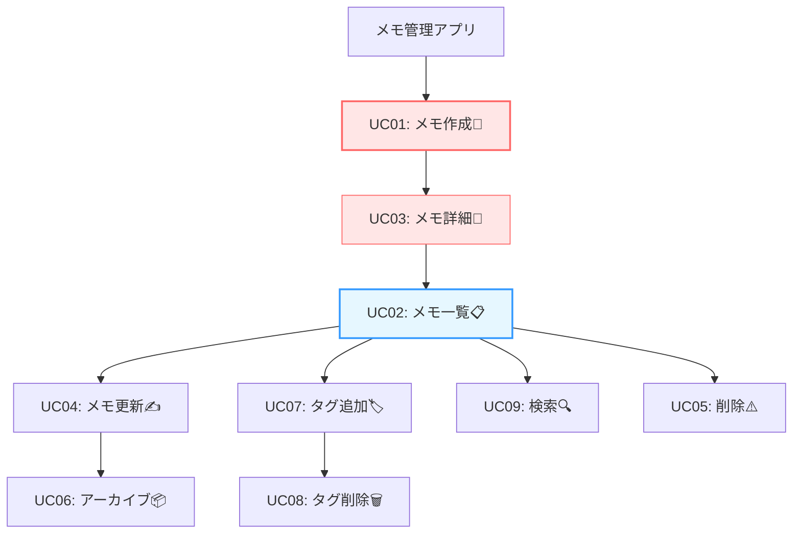

# 第07章：題材を決めて“クリーンに作る宣言”📣

この章は「何を作るか」を**ちゃんと決めて、迷子にならずに45章を完走するための固定具**を作る回だよ〜！🧷💖
（いまの最新の土台は **.NET 10（LTS）**／**C# 14**／**Visual Studio 2026**あたりが中心になってるよ〜🆕✨） ([Microsoft][1])

---

## 0) 今日のゴール（この章の成果物）🎯📦

この章で、最低限これを作るよ！

* ✅ **題材（アプリのテーマ）を1つ決定**
* ✅ **ユースケース一覧（8〜10個）**＋優先順位
* ✅ **やらないこと（Out of scope）**を決める✂️
* ✅ **用語集（ドメイン用語）**を作る📘
* ✅ **境界（Boundary）候補を3つ宣言**🚪（UI / DB / 外部サービス みたいなやつ）
* ✅ 次章以降に渡す「Entity/VO候補」「ルール候補」メモ📝

これがあると、後の章で「作るものが増殖する事故」💥が激減するよ〜！

---

## 1) 題材選びって、なんでそんなに大事？😳💡


クリーンアーキの学習は、**題材が重すぎる**とほぼ確実に詰むの…🥺💦

* 機能が増える → 層がぐちゃる → “クリーンっぽい何か”になる😵‍💫
* 途中で仕様が変わる → 依存が混ざる → 学びポイントが消える🫠

だからこの章は、**「学ぶための題材」に寄せて、やることを固定**しちゃう回だよ📌✨
（依存関係は内側へ、っていう大原則を守るには、まず“範囲”が大事！） ([blog.cleancoder.com][2])

---

## 2) “良い題材”の条件（これだけ守れば勝てる）🏆✨


次の条件を満たす題材が、学習にちょうどいいよ〜😊

### ✅ 条件A：8〜10ユースケースに収まる

増えたら負け！✋😆（増やしたくなったら Out of scope に逃がす）

### ✅ 条件B：CRUDだけじゃなく「ルール」が少しある

例：

* タイトル空はダメ🙅‍♀️
* タグは重複禁止🙅‍♀️
* アーカイブ済みは編集不可🙅‍♀️
  こういうのが **Entity/VO の練習**に最高💎

### ✅ 条件C：外部サービス無しでも成立する

外部APIは“後で追加できる”くらいが安全🌱

### ✅ 条件D：ユーザー認証はナシ（最初は）

ログインはだいたい地獄の入口😇🔥

### ✅ 条件E：画面を凝らなくていい

UIを頑張るほど、学びが薄まる🫥

---

## 3) おすすめ題材（3つ）🎁✨

迷ったらこのどれかにすると安定だよ〜！

### ① メモ管理（いちばんおすすめ）📝💖

* ルール入れやすい
* 検索・タグ・アーカイブで “ちょい設計” ができる
* 8〜10ユースケースに収めやすい

### ② ちょいリッチToDo ✅🗓️

* 期限／優先度／完了など状態がある
* 状態遷移の練習にもなる

### ③ 蔵書管理（本・ゲーム・映画コレクション）📚🎮

* ID管理が自然
* 貸し出し等を入れると途端に重くなるので注意⚠️

この章の例は、いちばん安定の **「メモ管理」**で進めるね！📝✨

---

## 4) “クリーンに作る宣言”の作り方📣🧼

ここからが本題！
**仕様を決めるんじゃなくて、学習に必要な最小の仕様を固定する**よ〜😆

### 4-1) スコープ宣言（In scope / Out of scope）を作る✍️✨


まず「やること」と「やらないこと」を紙に書いてロック🔒

**In scope（やる）例：**


* メモ作成
* メモ一覧
* メモ詳細
* メモ更新
* メモ削除 or アーカイブ
* タグ付け
* タグで検索
* キーワード検索（タイトルのみ など）

**Out of scope（やらない）例：**

* ユーザー認証・権限
* 画像添付
* 共有・リアルタイム同期
* リマインド通知
* 複雑な全文検索
* 監査ログ・履歴管理

**ポイント：**
「面白そう🥳」は大体 Out of scope に置いて、完走してから拡張で遊ぶのが勝ちだよ〜🎮✨

---

## 5) ユースケース一覧（8〜10個）を作ろう🗂️✨

### 5-1) ユースケースのテンプレ（これで統一）📐

次の型で全部そろえると、後の章で超ラク！💖

* **名前（動詞＋目的語）**：CreateMemo / UpdateMemo みたいに
* **入力**：ユーザーが渡すもの
* **成功条件**：何が起きたら成功？
* **失敗条件**：どういうとき失敗？
* **ドメインルール**：ここが学びの宝庫💎
* **出力**：表示用の形じゃなく、アプリとして返す情報

---

### 5-2) メモ管理のユースケース例（9個）📝✨

| ID   | ユースケース   | ざっくり説明      | ルール例💎             |
| ---- | -------- | ----------- | ------------------ |
| UC01 | メモ作成     | 新規メモを作る     | タイトル必須、最大文字数       |
| UC02 | メモ一覧取得   | 一覧を表示       | アーカイブ除外の既定         |
| UC03 | メモ詳細取得   | 1件見る        | 存在しないIDはエラー        |
| UC04 | メモ更新     | タイトル/本文変更   | アーカイブ済みは更新不可       |
| UC05 | メモ削除     | 物理削除（または論理） | 削除方針は固定            |
| UC06 | メモをアーカイブ | “非表示”にする    | 2回目アーカイブは無視 or エラー |
| UC07 | タグ追加     | メモにタグ付け     | タグ重複禁止、タグ名規則       |
| UC08 | タグ削除     | タグを外す       | 存在しないタグは無視 or エラー  |
| UC09 | 検索       | タイトル検索/タグ検索 | 検索文字の最小長など         |



ここまでで「9個」👏✨ いい感じ！

---

## 6) 優先順位を付ける（完走しやすい順）🏃‍♀️💨


学習は「縦に1本通す（Walking Skeleton）」が最強だよ〜🦴✨

おすすめ順（安全）👇

1. UC01 メモ作成
2. UC03 メモ詳細取得
3. UC02 メモ一覧取得
4. UC04 メモ更新
5. UC06 アーカイブ
6. UC07 タグ追加
7. UC08 タグ削除
8. UC09 検索
9. UC05 削除（最後でOK。仕様が割れやすいから）⚠️

---

## 7) 用語集（ドメイン用語）を作る📘✨


ここ、地味だけど超効く！😳
**名前が揺れると設計が壊れる**からね…！

### 用語集の例📝

* **Memo**：メモ本体
* **MemoId**：メモの同一性（Entityの核）🪪
* **Title**：タイトル（VO候補💎：空禁止・長さ制限）
* **Body**：本文（VO候補でもOK）
* **TagName**：タグ名（VO候補💎：正規化、最小/最大長）
* **ArchivedAt**：アーカイブ日時（null 許容の扱い方を後で決める）

**コツ：**
用語集は「後で変えてOK」だけど、**章7でいったん固定**すると進みやすいよ〜📌💖

---

## 8) 境界（Boundary）候補を3つ宣言する🚪✨

この宣言があると、次章以降で「どこに置く？」がブレなくなるよ！

* 🚪 **UI境界**：HTTP/API（Controller/Minimal API）側
* 🚪 **DB境界**：永続化（Repository/Gateway）側
* 🚪 **外部サービス境界**：将来の通知や外部API（いまはダミーでもOK）

クリーンアーキは「内側は外側を知らない」が憲法だよ〜📜✨ ([blog.cleancoder.com][2])

---

## 9) 次章に渡す「設計の種」メモ🌱💎

章7の最後に、次の章で使う“材料”をメモしておこう！

### Entity候補🪪

* Memo（同一性：MemoId）

### Value Object候補💎

* Title（空禁止、最大長）
* TagName（空禁止、正規化、最大長）
* （必要なら）MemoContent / Body

### ルール候補🚧

* タイトル空は禁止
* タイトル最大長（例：100）
* タグ重複禁止
* アーカイブ済みは更新不可
* 存在しない MemoId は “NotFound” 扱い

このへんがあると、8章〜がスムーズに作れるよ〜✨

---

## 10) ミニ課題（この章の宿題）🧸📝


### 課題1：ユースケース9個を、ID付きで書く

UC01〜UC09みたいに固定！

### 課題2：各ユースケースに「失敗条件」を最低1個つける⚠️

例：タイトル空、IDがない、アーカイブ済み…など

### 課題3：Out of scope を10個書く✂️😆

やりたい欲を紙に封印する儀式！

---

## 11) AIの使い方（この章でのおすすめ）🤖✨

AIはこの章だと「整理」と「漏れ出し」に最強だよ〜！

### 11-1) ユースケース洗い出し（増えすぎ防止）🧯

```text
メモ管理アプリを学習用に作ります。
クリーンアーキ学習が目的なので、ユースケースは9個以内に絞りたいです。
必須にすべきユースケース案を、重くならない範囲で提案して。
それぞれに「ドメインルール候補」も1つ添えて。
```

→ 出てきた案を「増やす」んじゃなくて、**削るため**に使うのがコツ✂️💖

### 11-2) 失敗条件の漏れチェック🔎

```text
以下のユースケース一覧について、初心者が見落としやすい失敗条件を列挙して。
ただし「認証」や「共有」などスコープ外は提案しないで。
```

### 11-3) 用語集のブレ検出📘

```text
この用語集で、名前が曖昧/揺れそうな単語を指摘して、より良い命名案を出して。
```

（命名が揺れると、依存ルール以前に設計が崩れるよ〜🥺）

---

## 12) よくある事故あるある（先に潰す）💥🩹

* ❌ **「あと1機能だけ…」が無限に増える**
  → ✅ Out of scope に追放✂️
* ❌ **CRUDだけで終わって、Entity/VOの学びが薄い**
  → ✅ “ルール”を最低3つ入れる💎
* ❌ **検索や一覧が重すぎる（UI/DB最適化祭りになる）**
  → ✅ 検索は「タイトル前方一致」くらいからでOK🌱
* ❌ **削除方式で揉めて止まる**
  → ✅ 章7で「削除＝物理 or 論理（アーカイブ）」を固定📌

---

## 13) 完成チェックリスト✅🎀

* [ ] ユースケースは **8〜10個**に収まってる
* [ ] 各ユースケースに **失敗条件**が最低1つある
* [ ] **Out of scope** が明文化されてる
* [ ] 用語集があり、主要語が固定されてる
* [ ] 境界（UI/DB/外部）が宣言されてる
* [ ] 次章のための Entity/VO/ルール候補がメモされてる

ここまでできたら、章7クリア〜！🎉💖
次は、いよいよ **Entity（8章）** を“データ箱じゃない形”で作っていくよ〜🪪✨

---

必要なら、いま決めた「ユースケース9個」をもとに、**章8で使う Memo Entity / Title(TagName) VO の設計案（不変条件・例外設計込み）**まで一気に下書きも作るよ〜😊💎

[1]: https://dotnet.microsoft.com/en-us/platform/support/policy/dotnet-core?utm_source=chatgpt.com "NET and .NET Core official support policy"
[2]: https://blog.cleancoder.com/uncle-bob/2012/08/13/the-clean-architecture.html?utm_source=chatgpt.com "The Clean Architecture by Uncle Bob - Clean Coder Blog"
