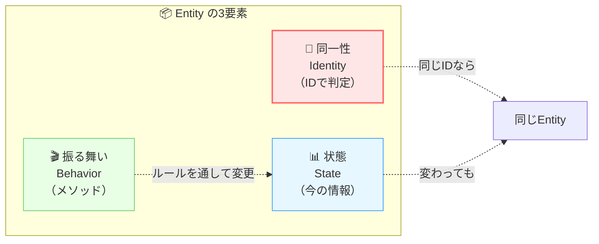

# 第08章：Entityとは？（同一性＋振る舞い）🪪

〜「ただのデータ箱」から卒業して、“生きてるモデル”を作ろう〜🌱💕

---

## この章でできるようになること 🎯

読み終わったら、こんな状態を目指すよ〜！😊

* Entityを「同一性（ID）＋振る舞い（メソッド）」で説明できる 🪪➡️🎬
* Entityを **setterだらけのデータ箱** にせずに書ける 🧯
* 「Memo」を題材に、**Rename / Archive** みたいな振る舞いを持つEntityを実装できる ✍️📦

> Clean Architectureの定義だと、Entitiesは「Enterprise wide business rules（最も一般で高レベルなルール）」をカプセル化する層だよ、って説明されてるよ。([blog.cleancoder.com][1])
> そしてDependency Rule的にも「内側は外側を知らない」ので、EntityはUIやDB都合を持ち込まないのが大事🧼([blog.cleancoder.com][1])

---

## 1. Entityってなに？いちばん短い答え 💡


**Entity =「同じモノであり続ける」もの**だよ〜🪪✨
中身（名前とか状態とか）が変わっても、「それでも同じ人だよね？」みたいなやつ！




* ✅ **同一性（Identity）**：IDで“同じ”を判定する
* ✅ **状態（State）**：今のタイトル、本文、アーカイブ状態…
* ✅ **振る舞い（Behavior）**：Renameする、Archiveする、などの操作🎬

Uncle Bobも「Entityはメソッドを持つオブジェクトでもいいし、データ＋関数でもいい」と言ってるけど、要は **ルールを中心に守れる形** にするのがポイントだよ〜！([blog.cleancoder.com][1])

---

## 2. 「データ箱Entity」になりがちな危険パターン ⚠️😵‍💫


たとえば、こういうの…つい作りがち！

* public setter だらけで、どこからでも状態が変えられる 🫠
* ルールがControllerやUseCaseに散らばる 🧩
* 結果：**仕様変更のたびに事故る**💥

### 今日の合言葉📣

**「更新は setter じゃなくて、メソッドで！」**
（= “振る舞い”として変更を表現する🎬）

---

## 3. 今回の題材：Memo Entity 📝✨


この教材の題材はメモアプリだったよね！
第8章では、まず **Entityの芯** を作るよ〜🌟

### Memoが持ちそうなもの（例）

* MemoId（同一性）🪪
* Title（状態）📝
* IsArchived（状態）📦
* Rename（振る舞い）✍️
* Archive（振る舞い）🗃️

---

## 4. 実装：Memo Entity を「生き物」として作る 🐣➡️🐓

### 設計の方針（今日のルール）📏✨

* IDは外から変えられない（読み取り専用）🔒
* 状態も基本は外から勝手に変えさせない（private set / private field）🔒
* 変更したいときは **Rename() / Archive()** を呼ぶ🎬
* 例外やエラー表現は、いったんシンプルに（本格対応は後の章でやるよ）🧪

---

### 4-1. Memo Entity（シンプル版）📦✨

```csharp
using System;

namespace MemoApp.Core.Entities;

public sealed class Memo
{
    // ✅ 同一性（Identity）
    public Guid Id { get; }

    // ✅ 状態（State）: 外から勝手に変えられないようにする
    public string Title { get; private set; }
    public bool IsArchived { get; private set; }

    // 例：いつ作られたか（状態）
    public DateTimeOffset CreatedAt { get; }

    // ✅ 作るときに“最低限の正しさ”を保証する
    public Memo(Guid id, string title, DateTimeOffset createdAt)
    {
        if (id == Guid.Empty) throw new ArgumentException("Id must not be empty.", nameof(id));
        Title = NormalizeTitle(title);
        Id = id;
        CreatedAt = createdAt;
        IsArchived = false;
    }

    // ✅ 振る舞い（Behavior）
    public void Rename(string newTitle)
    {
        if (IsArchived)
            throw new InvalidOperationException("Archived memo cannot be renamed.");

        Title = NormalizeTitle(newTitle);
    }

    public void Archive()
    {
        IsArchived = true;
    }

    public void Restore()
    {
        IsArchived = false;
    }

    private static string NormalizeTitle(string title)
    {
        if (title is null) throw new ArgumentNullException(nameof(title));

        var t = title.Trim();
        if (t.Length == 0) throw new ArgumentException("Title must not be empty.", nameof(title));
        if (t.Length > 50) throw new ArgumentException("Title must be 50 characters or less.", nameof(title));

        return t;
    }
}
```

#### ここが「Entityっぽい」ポイントだよ〜！🥰

* `Id` が **同一性**（これで“同じメモ”）🪪
* `Rename()` や `Archive()` が **振る舞い**🎬
* `Title` を勝手に `memo.Title = "..."` できない（ルールを通して変更）🔒

---

## 5. なんで Guid を使ったの？🪪💡

Entityの同一性は「安定していて」「衝突しにくい」ほうが扱いやすいよ〜！

* Guidは扱いやすい（生成も簡単）✨
* あとでDBに保存しても相性がいい🗄️

※ もちろん「intの連番」でもいいけど、連番はDB都合になりがちだから、学習中は Guid がラクだよ〜😊

---

## 6. Entityの“等価性”ってどう考える？⚖️✨


Entityはふつう、こう考えるよ〜！

* **同じEntityか？ → Idが同じか？**🪪
* Titleが同じでも、別メモなら別Entity（Idが違うから）🙅‍♀️

この感覚は超重要！
次のValue Object（第9章）で「値が同じなら同じ」って世界と対比するよ💎✨

---

## 7. よくある質問（つまずきポイント）🧸💬

### Q1. `record` でEntity作っちゃダメ？


**ダメじゃないけど、初心者にはおすすめしにくい**かも！🥺
recordは「値が同じなら同じ」になりやすくて、Entityの「IDで同一性」思想とぶつかりやすいの。

→ **Entityはclass、VOはrecord** が学習上わかりやすいよ〜✨

### Q2. EF Core の `[Key]` とか属性つけたくなる…

気持ちはわかる！😂
でもClean Architectureでは、Entityは **外側（DB）の都合を知らない**ほうが強い💪
（この“内側は外側を知らない”がDependency Ruleのコアだよ🧼([blog.cleancoder.com][1])）

---

## 8. ミニ課題 🎮✨（手を動かすよ〜！）

### 課題A：振る舞いを追加しよう ✍️


Memoに次を追加してみて！

* `ChangeCreatedAt(...)` は作っちゃダメ🙅‍♀️（作成日時は変えない想定）
* 代わりに `Touch()` を追加して「更新日時」を更新するのはOK🙆‍♀️（`UpdatedAt` を追加してね）

### 課題B：ルールを増やそう 🚧

`Rename()` にルール追加！

* タイトルに改行が入ってたらダメ🙅‍♀️
* 連続スペースは1個にまとめたい（できたら）✨

---

## 9. AI（Copilot/Codex）に手伝ってもらうコツ 🤖💖

AIは“丸投げ”じゃなくて、**設計の意図を守らせる**のがコツだよ〜！

### そのまま使えるプロンプト例 ✨

* 「このEntityを public setter なしにリファクタして。変更はメソッド経由にしてね」
* 「Rename/Archive/Restore のテストケースを Given-When-Then で10個出して」
* 「EntityがDB都合を持ち込んでないかレビューして、怪しい点を指摘して」

---

## 10. Chapter 8 の完成チェック ✅🎉

最後にこのチェックが全部YESならOK〜！🥳

* ✅ Entityに **Id（同一性）** がある
* ✅ 状態は外から勝手に変えられない（setter地獄じゃない）
* ✅ 変更は **Rename/Archive** みたいな“動詞メソッド”で表現できてる
* ✅ UI/DB/HTTP/EF Core の型・属性が入ってない（中心はピュアC#）🧼([blog.cleancoder.com][1])

---

## おまけ：2026年時点のC# / .NETの“いま”🧁✨

この教材は最新前提なので、いまの整理も一応置いとくね😊

* .NET は **.NET 10.0 が最新（LTS）**、最新リリースは **10.0.2（2026-01-13）** と案内されてるよ ([Microsoft][2])
* **C# 14 は .NET 10 以上でサポート**、.NET 10.x の既定言語バージョンは C# 14 ([Microsoft Learn][3])
* Visual Studio も **Visual Studio 2026** のリリースノートが公開されてるよ ([Microsoft Learn][4])

---

次の第9章は **Value Object（不変＋等価）💎** で、string地獄から抜け出す回だよ〜！
第8章のMemo Entity、もし「あなたの題材（メモ以外）」に差し替えた版でも作りたいなら、題材だけ投げてくれたら同じ型で書き直すね😊🎁

[1]: https://blog.cleancoder.com/uncle-bob/2012/08/13/the-clean-architecture.html "Clean Coder Blog"
[2]: https://dotnet.microsoft.com/en-us/download/dotnet "Browse all .NET versions to download | .NET"
[3]: https://learn.microsoft.com/en-us/dotnet/csharp/language-reference/language-versioning "Language versioning - C# reference | Microsoft Learn"
[4]: https://learn.microsoft.com/en-us/visualstudio/releases/2026/release-notes "Visual Studio 2026 Release Notes | Microsoft Learn"
