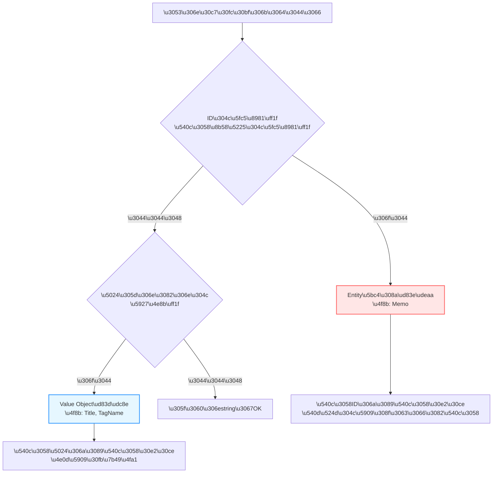

# 第09章：Value Objectとは？（不変＋等価）💎

（＝ string地獄から脱出する章だよ〜！🧹💖）

---

## この章のゴール🎯

読み終わったら、こうなってほしい！👇✨

* 「Value Object（VO）」を自分の言葉で説明できる🗣️💎
* **“不変（immutable）”** と **“等価（value equality）”** をコードで作れる🧊⚖️
* `string` をそのまま渡しまくる設計（string地獄）を避けられる🚫🧵
* Entities層（ドメイン）に **“言葉（用語）”** と **“ルール”** を閉じ込められる🔒📦

※ いまどきのC#は **record** が強い味方だよ🦸‍♀️✨
「recordは値の等価性（value equality）や不変なモデルに向いてる」って公式も言ってる📝
([Microsoft Learn][1])

---

## Value Objectってなに？💎（超ざっくり）

**VO = “値そのもの”に意味があるもの**だよ✨
そして大事なのはこの2つ👇


### ① 不変（Immutable）🧊

いったん作ったら **中身が変わらない**
→ 途中で勝手に壊れない💪✨

### ② 等価（Value Equality）⚖️

「同じ値なら同じもの」として扱う
→ `Title("買い物")` と `Title("買い物")` は同じ💞
（参照が同じかどうかじゃなくて、**値**で比べる）

recordがまさにこれをやりやすくしてくれるよ〜！([Microsoft Learn][1])

---

## なぜVOが必要？😵‍💫➡️😌

### string地獄の例🧵🔥

`Title` も `TagName` も `Email` も `UserName` も全部 `string` だと…

* 間違って入れ替えてもコンパイルが通る😇
* ルール（空文字禁止・最大長など）が散らばる🌀
* どこで正規化（trimや小文字化）したか分からなくなる🫥

**VOにすると**👇

* 型が違うから入れ替えミスが減る🧱✨
* ルールをVOの中に閉じ込められる🔒
* 作れた時点で「正しい値」が保証される✅

---

## VOの“3つのルール”🌟（ここ超重要！）

VOは基本この3点セットで覚えると強い💪💖

1. **意味のある名前**を持つ（ドメイン用語）🏷️
2. **不変**（作ったら変えない）🧊
3. **等価**（値が同じなら同じ）⚖️

---

## EntityとVOの違い⚖️（迷いポイント潰すよ〜！）

* **Entity**：同一性（ID）で区別する🪪

  * 例：Memo（IDが同じなら同じメモ）
* **Value Object**：値で区別する💎

  * 例：Title（値が同じなら同じタイトル）

判断のコツ🧠✨



* 「それ、**IDが必要？**」→ 必要ならEntity寄り
* 「それ、**値そのものが大事？**」→ VO寄り

---

## C#でVOを作るなら何がいい？🛠️✨

### まずは record class が一番ラク💖

recordは **値の等価性** を標準で持つし、書く量が少ない✨
公式も「値の等価性がほしい・不変がほしいならrecordが向いてる」って言ってるよ📝
([Microsoft Learn][1])

### `record struct` は上級者寄り（注意点あり⚠️）

`struct` には **default（未初期化）** が存在しちゃうから、
「作れた時点で必ず正しい」が崩れやすいの💥
最初は **record class** をおすすめ😊💗

---

# ハンズオン：VOを3つ作ろう！💎💎💎

題材（例：メモ管理）でよく使うやつ👇

* `Title`（メモのタイトル）📝
* `TagName`（タグ）🏷️
* `DateRange`（日付の範囲）📅

---

## 1) ドメイン例外を用意⚠️

VOの中でルール違反を弾くための例外だよ〜

```csharp
namespace MyApp.Domain;

public sealed class DomainException(string message) : Exception(message);
```

---

## 2) Title：空禁止・長さ制限・trim📝✨

「作れたなら正しい」を作るよ✅

```csharp
namespace MyApp.Domain;

public sealed record Title
{
    public const int MaxLength = 100;

    public string Value { get; }

    public Title(string value)
    {
        value = (value ?? "").Trim();

        if (value.Length == 0)
            throw new DomainException("タイトルは空にできません🥲");

        if (value.Length > MaxLength)
            throw new DomainException($"タイトルは{MaxLength}文字以内にしてね🥺");

        Value = value;
    }

    public override string ToString() => Value;
}
```

ポイント🎀

* `set` を持たない → 不変🧊
* コンストラクタで検証 → 入口で守る🚧
* `record` → 等価性が値ベース⚖️

---

## 3) TagName：小文字化・禁止文字チェック🏷️✨

タグって、だいたい表記揺れするのよね…😇
`"CSharp"` と `"csharp"` を同一扱いにしたいなら、VOで正規化しちゃう💖

```csharp
using System.Text.RegularExpressions;

namespace MyApp.Domain;

public sealed partial record TagName
{
    public string Value { get; }

    // 例：英数字 + ハイフンだけOK（必要に応じてルール変えてね）
    private static readonly Regex Allowed = AllowedRegex();

    public TagName(string value)
    {
        value = (value ?? "").Trim().ToLowerInvariant();

        if (value.Length == 0)
            throw new DomainException("タグ名は空にできません🥲");

        if (value.Length > 30)
            throw new DomainException("タグ名は30文字以内にしてね🥺");

        if (!Allowed.IsMatch(value))
            throw new DomainException("タグ名は英数字とハイフンだけにしてね〜🧸");

        Value = value;
    }

    public override string ToString() => Value;

    [GeneratedRegex("^[a-z0-9-]+$")]
    private static partial Regex AllowedRegex();
}
```

✨ここ好きポイント

* 正規化（trim + 小文字化）を **VOに集約**できる！🔒
* 以降、システム内では **常に整ったタグ** だけが流れる🌊✨

---

## 4) DateRange：開始 <= 終了 の不変条件📅✅

「日付の範囲」はVOの王道！💎

```csharp
namespace MyApp.Domain;

public sealed record DateRange
{
    public DateOnly Start { get; }
    public DateOnly End { get; }

    public DateRange(DateOnly start, DateOnly end)
    {
        if (end < start)
            throw new DomainException("日付範囲が逆だよ〜！開始 <= 終了にしてね🥺📅");

        Start = start;
        End = end;
    }

    public int DaysInclusive => End.DayNumber - Start.DayNumber + 1;
}
```

---

# 等価性（Value Equality）を体で理解しよ！⚖️💖

recordは「値が同じなら同じ」になりやすい✨
公式も record の例で value equality を説明してるよ📝
([Microsoft Learn][2])

```csharp
var a = new Title("  買い物  ");
var b = new Title("買い物");

Console.WriteLine(a == b); // True になる（trimしてるから）✨
```

---

# “VO候補”の見つけ方🔎💎

迷ったら、このチェックで探すと早いよ〜！✨

* 画面やAPIから **入力される値**（検証が必要）⌨️
* ドメイン用語として **名前が付いているもの**（Title / Email / Money）🏷️
* **表記揺れ**が起きるもの（trim / 小文字化 / 正規化したい）🧽
* 2つ以上の値の組（DateRange / Money+Currency）🧩

---

# UseCaseやControllerにどうつなぐ？🔌✨

外側（API DTOとか）では `string` で受けて、
内側に入るときにVOに変換するのがキレイ💖

イメージ👇
**DTO(string)** → **RequestModel(string)** → **VO(Title/TagName)**

「VOはEntities層の言葉」だから、外の形のまま持ち込まないのがコツだよ🧼✨

---

# ミニ課題🎮💖（手を動かそ！）

## 課題A：VOを2つ追加しよう💎

題材に合わせて、どれか作ってみて👇

* `MemoId`（GUIDを包むとか）🪪
* `Email`（形式チェック）📧
* `ColorCode`（#RRGGBB）🎨

## 課題B：VO候補を10個リストアップ📝

あなたの題材（メモ管理）で「stringで持ってるけど意味があるやつ」を10個書き出す✨
→ そのうち2個をVOにする💎💎

---

# AI（Copilot / Codex）に手伝ってもらうプロンプト例🤖✨

“丸投げ”じゃなくて、**候補出しと抜け漏れ潰し**に使うと強いよ💪💖

* 「メモアプリのドメインでValue Object候補を20個挙げて。検証ルール案もセットで」
* 「Title/TagName/DateRangeの境界値テスト観点を箇条書きで」
* 「VOの正規化（trim/小文字化）でありがちな事故を列挙して」

---

# よくある失敗あるある🐣💥（先に潰す！）

* `public set;` を生やして不変が崩れる😇🧊💥
* 検証をUseCase側に書いて散らかる🌀
* 正規化（trim等）が場所によって違う🫥
* `record struct` にして default が入り、ルールが破れる⚠️
* 「VOなのにIDを持ち始める」→ それEntityかも🪪💭

---

# 仕上げチェックリスト✅💎

VOを作ったら最後にこれ見て〜！✨

* [ ] `set` がない（外から書き換え不可）🧊
* [ ] コンストラクタ（またはFactory）で検証してる🚧
* [ ] 正規化（trim等）がVOの中にある🧽
* [ ] “同じ値なら同じ” で扱いたいものになってる⚖️
* [ ] ドメイン用語の名前になってる🏷️

---

## まとめ💖

Value Objectは、ドメインの「言葉」と「ルール」を閉じ込める宝石箱💎📦
recordを使うと **不変＋等価** が作りやすいから、まずは **Title/TagName/DateRange** みたいな分かりやすいところから始めるのが最強だよ〜！🦸‍♀️✨

次に進むときは、「VOで守ったルールを、UseCaseの流れの中でどう使うか」がもっと気持ちよくなるよ😌🎮

[1]: https://learn.microsoft.com/en-us/dotnet/csharp/fundamentals/types/records?utm_source=chatgpt.com "Record types - C#"
[2]: https://learn.microsoft.com/en-us/dotnet/csharp/tutorials/records?utm_source=chatgpt.com "Use record types tutorial - C#"
