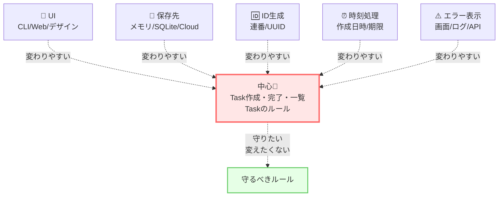

# 第01章：なぜクリーンアーキ？（ゴールを固定）🎯

この章でやることは、たった1つ！
**「この講座で“何を守りたい設計”なのか」を先に決め切る**ことだよ😊📝✨
ここがブレると、途中で「で、結局なにが嬉しいの？🤔」って迷子になりがち…！

---

## 0. 2026-01-22 時点の“最新メモ”🆕🗓️（リサーチ結果）

* TypeScript の stable は **npm上だと 5.9.3** が “Latest” として公開されてるよ（最終公開は 2025-09-30 表記）。([NPM][1])
* TypeScript 7（ネイティブ移植）の **Preview が npm と VS Code 拡張で提供**されてる（`@typescript/native-preview` と “TypeScript (Native Preview)” 拡張）。([Microsoft for Developers][2])
* GitHub Copilot は VS Code で **Agent mode / Plan（計画）** みたいな “自律寄り” 機能の説明が公式ドキュメントにあるよ。([Visual Studio Code][3])
* OpenAI 側も **Codex の IDE 拡張（VS Code）** を案内してる（IDEで並走・委任ができる）。([OpenAI Developer][4])

（※この講座自体は、特定バージョン依存のテクを押すより「設計の考え方」を中心にするから、TSが 6/7 に進んでも芯はそのまま通用するよ☺️）

---

## 1. 今日の到達目標（ここまでできたら勝ち🎉）

この章のゴールはこれ👇

* ✅ **「クリーンアーキで得たい成果」を3つ**、自分の言葉で書ける
* ✅ **“やらないこと”**（過剰設計の予防線）も書ける
* ✅ これから45章進んでも迷子にならない **“設計ゴール1枚メモ”** ができる📝✨


---

## 2. そもそも、なぜクリーンアーキ？🤔💭


作り始めは、だいたいこうなるよね👇

* 最初：タスク追加できた！🎉
* 1週間後：完了機能つけよ〜✅
* さらに：一覧、絞り込み、並び替え…📌
* さらに：保存したい（最初はメモリ→次はDB）💾
* さらに：画面を変えたい（CLI→Web、React…）🖥️🌐
* さらに：テスト書きたい（でも書きにくい…😇）🧪

この「あとから増える現実」に強くなりたい、がクリーンアーキの出番だよ🏛️✨

---

## 3. クリーンアーキの核心は「依存の向き」⬅️💘


クリーンアーキで一番大事なのは、層の名前を暗記することじゃないよ🙅‍♀️
**“内側が外側を知らない”** っていうルール（Dependency Rule）が核！🔥

* 内側（アプリの目的・ルール）が、
  外側（UI、DB、フレームワーク、外部API）に引っ張られない
* だから、外側を差し替えても、中心が壊れにくい✨

この考え方は、提唱者のUncle Bob（Robert C. Martin）も「依存は内向きだけ」って形で説明してるよ。([blog.cleancoder.com][5])

---

## 4. でも！第1章でやるのは「層分け」じゃない🙅‍♀️🧩


いきなりフォルダを4層に分け始めると、だいたい失敗する😇
理由はシンプル👇

> **「勝ち条件（ゴール）が決まってないのに、手段（層）を作る」**
> → なんとなく分けただけの“儀式アーキ”になりがち💀

だからこの章は、**先にゴールを固定**するよ🎯✨
層は次章以降でちゃんとやるから安心してね😊

---

## 5. この講座（ミニTaskアプリ）の“未来の変化”を先に想像しよ🔮🗒️


クリーンアーキの価値って、だいたい「変更が来たとき」に出るのね💡
だから、最初から“ありそうな変更”を並べちゃうのがコツ！

例👇（この講座の題材だと特に起きがち）

* UIが変わる（CLIっぽい→Web UI、デザイン変更）🎨
* 保存先が変わる（メモリ→SQLite→クラウドDB）💾➡️☁️
* IDの作り方が変わる（連番→UUID）🆔
* 時刻が絡む（作成日時、期限、ソート）⏰
* エラーの見せ方が変わる（画面表示・ログ・APIレスポンス）⚠️

この「変わりそうな場所」を **中心から遠ざける** のが基本戦略だよ🏹✨



---

## 6. “設計ゴール1枚メモ”を作ろう📝✨（テンプレ付き）


ここから手を動かすよ〜！✋😊
まず `docs/architecture-goals.md` みたいなファイルを作って、下をコピペして埋めていこ💨

```md
## 設計ゴール1枚メモ（Clean Architecture / Mini Task）

## 🎯 1) このアプリで「絶対に守りたいもの」（中心）
- （例）Taskを作る/完了する/一覧する、という目的
- （例）Taskのルール（タイトル空はダメ、など）
- （例）UseCaseは「やりたいこと」を表現する

## 🔁 2) 「変わってOK」なもの（外側）
- （例）UIの見た目・フレームワーク
- （例）保存方法（メモリ/DB）
- （例）ログ出力や設定ファイル

## ✅ 3) “良い状態”の判定方法（測り方）
- （例）DBを差し替えてもUseCaseのコードは変更ゼロ
- （例）UseCaseはテストで数秒で検証できる
- （例）中心にHTTP/SQLの言葉が入ってこない

## 🧯 4) 今は「やらないこと」（過剰設計ストッパー）
- （例）最初からDIコンテナ導入しない
- （例）Repositoryを巨大にしない
- （例）将来のために抽象を増やしすぎない

## 🤖 5) AIに手伝ってもらうポイント
- （例）ゴールの文章を短く整える
- （例）変わりそうな場所の洗い出し
- （例）“抽象すぎる表現”の指摘
```

（このテンプレ、あとで章が進んでも「迷ったら戻る場所」になるよ📍✨）

---

## 7. サンプル：この講座の“ゴール例”💡（参考）

あなたのメモを書くときのヒントとして、例を置いとくね😊

* 🎯 守りたい中心

  * Taskの作成・完了・一覧という目的（UseCase）
  * Taskのルール（例：タイトルは空NG、完了の二重操作NG…）
* 🔁 変わってOK

  * UI（WebでもCLIでもどっちでもいい）
  * 保存（メモリ→SQLiteへいつか変える）
* ✅ 測り方

  * 保存を差し替えても、UseCaseのテストがそのまま通る🧪✨
  * 中心のコードに SQL 文や HTTP ステータスが出てこない
* 🧯 やらないこと

  * いきなり難しい設計パターンを盛らない（まず最小！）

---

## 8. AI相棒の使い方（この章での“勝ちムーブ”🤖✨）

この章はコード生成より、**言語化サポート**が強いよ💪📝

### 8.1 ゴールを「3行」に圧縮してもらう🪄


（Copilot Chat / Codex / どれでもOK）

```text
このメモを、初心者にも伝わるように「3行」で要約して。
抽象的すぎる言葉（例：いい感じ、保守性）を具体化して。
```

※“抽象ワードを具体にする”が超重要！✨

### 8.2 変化シナリオを追加で出してもらう🔮

```text
このTaskアプリに「あとから起こりがちな仕様変更」を10個出して。
そして、それぞれが「中心を壊しやすいか」を3段階で評価して。
```

（これで“守るべき場所”がクッキリするよ👀）

### 8.3 計画モードで「次章までの道筋」を作る🗺️

VS Code の Copilot には、タスクを進めるための **計画（Plan）** の考え方が公式ドキュメントにあるよ。([Visual Studio Code][3])
「次に何する？」が不安なときに便利☺️

---

## 9. よくある失敗と回避法（先に潰す💣➡️🧯）

### 失敗①：「変更に強い」だけ書いて終わる😇

**回避**：何が変わるかを最低3つ書く（UI/保存/エラー…みたいに）🔁

### 失敗②：「4層に分ける」がゴールになる🙃


**回避**：「層は手段」ってメモに書いとく📝✨

### 失敗③：将来が怖くて抽象を増やしすぎる🌀

**回避**：「今はやらないこと」を必ず書く🧯
（“増やさない勇気”が勝つ✌️）

---

## 10. 理解チェック（1問）✅🧠

**Q. クリーンアーキの“勝ち”って、結局なに？**（1つ選んでね）

A) フォルダが4層に分かれてる
B) 依存の向きが内側に揃ってて、外側を差し替えやすい
C) DIコンテナが入ってる

→ 正解：**B** ✅
（AとCは“手段”であって、勝ち条件じゃないよ☺️）

---

## 11. この章の提出物📦✨

* ✅ `docs/architecture-goals.md`（あなたの言葉でOK！）

  * 「守りたい中心」3つ
  * 「変わってOK」3つ
  * 「測り方」3つ
  * 「やらないこと」3つ

これができたら第1章クリア🎉✨

---

## 12. 次章予告👀✨

次は **「4つの円（4層）の役割」** を、短い言葉で迷わず言えるようにするよ🟡🟠🔵⚫
今日作った“ゴールメモ”が、次章でめちゃ効いてくるからね😊💕

---

* [theverge.com](https://www.theverge.com/news/808032/github-ai-agent-hq-coding-openai-anthropic?utm_source=chatgpt.com)
* [theverge.com](https://www.theverge.com/news/669339/github-ai-coding-agent-fix-bugs?utm_source=chatgpt.com)

[1]: https://www.npmjs.com/package/typescript?utm_source=chatgpt.com "TypeScript"
[2]: https://devblogs.microsoft.com/typescript/announcing-typescript-native-previews/?utm_source=chatgpt.com "Announcing TypeScript Native Previews"
[3]: https://code.visualstudio.com/docs/copilot/chat/chat-planning?utm_source=chatgpt.com "Planning in VS Code chat"
[4]: https://developers.openai.com/codex/ide/?utm_source=chatgpt.com "Codex IDE extension"
[5]: https://blog.cleancoder.com/uncle-bob/2012/08/13/the-clean-architecture.html?utm_source=chatgpt.com "Clean Architecture by Uncle Bob - The Clean Code Blog"