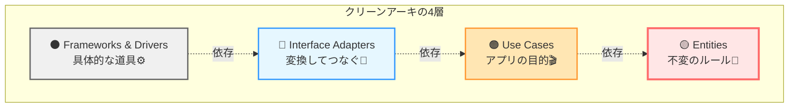

# 第02章：4つの円（4層）の役割を短文で言えるようにする🟡🟠🔵⚫

## 今日のゴール🎯💖

クリーンアーキの4層を、**それぞれ1文で説明**できるようになること😊
さらに、ファイルを作るときに「これ、どの層？」って迷わない判断軸を手に入れるよ🧭✨

---

## まずは“4層を1枚で覚える”🧠🪄

クリーンアーキは、同心円のイメージだよ🌀
**内側ほど“変わりにくい大事なルール”**、外側ほど**“変わりやすい道具（技術）”**って感じ🎮🧰
そして、データの変換やつなぎ役は「中間で受け止める」って考えるのがポイント✨
（この4層の説明はUncle Bobの整理が有名だよ📚） ([blog.cleancoder.com][1])

---

## 4層を“1文”で言うとこう！🗣️✨（暗記用）


### 🟡 Entities（中心のルール❤️）


**「アプリが変わっても残る“本質のルール”を持つ層」**
例：Taskの「完了にしていい条件」「タイトルの制約」みたいなやつ😊

### 🟠 Use Cases（アプリの目的🎬）


**「“何をしたいか”を実現する手順（流れ）を組み立てる層」**
例：Create / Complete / List を“どう進めるか”を決める✨

### 🔵 Interface Adapters（変換してつなぐ🔁）


**「内側と外側の“言葉の違い”を変換してつなぐ層」**
例：HTTPの入力 → UseCase入力へ変換、UseCase結果 → 画面用に整形、みたいな変換係🧼
（ここがPresenter/Controller/ViewModelの居場所になりやすいよ） ([blog.cleancoder.com][1])

### ⚫ Frameworks & Drivers（道具箱⚙️🌍）


**「DB・Webフレームワーク・外部APIなど"具体的な道具"の層」**
例：Express/Fastify/Next、SQLite、外部通知サービス…などなど📦
（外側は"差し替えられる前提"で置くのが気持ちいい✨） ([blog.cleancoder.com][1])



---

## “置くもの／置かないもの”超はっきり版📌✨

### 🟡 Entities

**置くもの✅**

* Entity（例：Task）と、その中のルール（例：タイトル空はNG）❤️
* 値オブジェクト（必要なら）🎁
* ドメインエラー（例：InvalidTitle）⚠️

**置かないもの❌**

* DBの型、SQL、HTTP、JSON、ライブラリ依存
* 「保存する」「通信する」みたいな外側都合の処理

---

### 🟠 Use Cases

**置くもの✅**

* CreateTask / CompleteTask / ListTasks の“手順書”🎬
* Port（インターフェース）に依頼して保存・取得する流れ🔌
* 入出力モデル（Request/Response）📦

**置かないもの❌**

* ExpressのRequest/Response、ルーティング、SQL、ORM
* 画面表示に最適化した形（それはAdaptersへ）

---

### 🔵 Interface Adapters

**置くもの✅**

* Controller（入力を受け取ってUseCaseへ渡す）🚪
* Presenter（UseCase結果→表示用へ変換）🎨
* ViewModel（画面に都合のいい形）📺
* Mapper（DBレコード↔Entityの変換など）🔄

**置かないもの❌**

* 本質ルール（それはEntities）
* “アプリの目的の手順”（それはUse Cases）

---

### ⚫ Frameworks & Drivers

**置くもの✅**

* Webサーバ起動、ルーティング、ミドルウェア🌐
* DBドライバ、接続、ORM、SQL実装🗄️
* 外部APIクライアント（通知・決済など）📣

**置かないもの❌**

* ドメインルール
* ユースケースの手順そのもの

---

## Taskアプリで“具体的にどこに何置く？”🗂️✨


たとえば、こんな配置だと迷いが減るよ😊

```txt
src/
  entities/
    task/
      Task.ts
      TaskErrors.ts

  usecases/
    createTask/
      CreateTask.ts
      CreateTaskModels.ts
    completeTask/
      CompleteTask.ts
      CompleteTaskModels.ts
    listTasks/
      ListTasks.ts
      ListTasksModels.ts

  interfaceAdapters/
    controllers/
      TaskController.ts
    presenters/
      TaskPresenter.ts
    viewModels/
      TaskViewModel.ts
    mappers/
      TaskMapper.ts

  frameworks/
    web/
      server.ts
      routes.ts
    db/
      sqlite/
        TaskRepositorySqlite.ts
```

「うわぁ難しそう…😵」って思ったら大丈夫！
この章は **“置き場所のルール作り”** が目的だよ🫶✨（実装は次の章で育つ🌱）

---

## 迷ったときの“3秒判定”🧭⚡


次の質問にYESなら、その層！って覚えるとラク😊

1. **それは“業務ルール”？（アプリが変わっても残る？）** → 🟡Entities
2. **それは“目的の手順”？（Create/Complete/Listの流れ？）** → 🟠Use Cases
3. **それは“変換係”？（HTTP↔内側、DB↔内側、表示↔内側）** → 🔵Adapters
4. **それは“道具そのもの”？（Web/DB/外部API/フレームワーク）** → ⚫Frameworks

---

## ミニ演習✍️💞（ちゃんと身につくやつ）

### 演習1：仕分けゲーム🎲


次の“モノ”はどの層？（直感でOK！）

* A. `Task.complete()`（完了にするルールが入ってる）
* B. `CreateTaskInteractor`（保存してレスポンス返す流れ）
* C. Expressのルート定義
* D. `TaskPresenter`（Response→画面用に整形）
* E. SQLiteの接続文字列
* F. `TaskRecordMapper`（DB行↔Entity）

**答え🎉**

* A → 🟡 Entities
* B → 🟠 Use Cases
* C → ⚫ Frameworks & Drivers
* D → 🔵 Interface Adapters
* E → ⚫ Frameworks & Drivers
* F → 🔵 Interface Adapters

---

### 演習2：あなた専用「置くもの／置かないもの」メモを作る📝✨

各層について、あなたの言葉で1行ずつ書くよ💖
（この1枚が“迷子防止のお守り”になる🧸）

---

## AI相棒🤖✨（コピペで使えるプロンプト集）

### 1) 仕分けを一瞬で添削してもらう👀

* 「次のクラス一覧を4層に分類して。理由も1行ずつ：…」

### 2) “置くもの／置かないもの”を具体例で増やす📌

* 「Entitiesに置くものをTaskアプリ例で3つ、置かないものも3つ」

### 3) あなたの設計が混ざってないか監査🧼

* 「このフォルダ構成で責務が混ざってる場所を指摘して、移動案も出して：…」

### 4) 4層を“短文暗記”にしてもらう📚

* 「4層の役割を、女子大生向けに“各1文”で、覚えやすい言い方にして」

---

## ちょいコラム：2026のTypeScript事情と、クリーンアーキの相性💡✨

最近のTypeScriptは、**コンパイラや開発体験の高速化**が大きな話題になってて、ネイティブ実装プレビュー（高速化）も進んでるよ⚡([Microsoft Developer][2])
一方で、現時点の安定版（npmのlatest）は **5.9.3** と案内されてるよ📦([npm][3])

だからこそね👇
**「外側の道具（フレームワークやDB）が変わっても、中心が無傷」**っていうクリーンアーキの価値が、今後さらに効いてくる感じなの🫶✨（道具は進化しても、中心ルールは守れる💖）

---

## この章の提出物（成果物）🎁✨

* ✅ **4層を各1文で説明したメモ**（あなたの言葉で！）
* ✅ **層ごとの「置くもの／置かないもの」リスト**（各3つ）
* ✅ Taskアプリの**フォルダ案（上の例をベースでOK）**

---

次の第3章では、ここで作った“置き場所のルール”を使って、**依存の向き（Dependency Rule）**を体に入れていくよ⬅️💘
「このファイル名リスト、どの層に置く？」みたいな“仕分け問題”をもっと作ってほしければ、いくらでも出すね🥳🩷

[1]: https://blog.cleancoder.com/uncle-bob/2012/08/13/the-clean-architecture.html?utm_source=chatgpt.com "Clean Architecture by Uncle Bob - The Clean Code Blog"
[2]: https://developer.microsoft.com/blog/typescript-7-native-preview-in-visual-studio-2026?utm_source=chatgpt.com "TypeScript 7 native preview in Visual Studio 2026"
[3]: https://www.npmjs.com/package/typescript?utm_source=chatgpt.com "TypeScript"