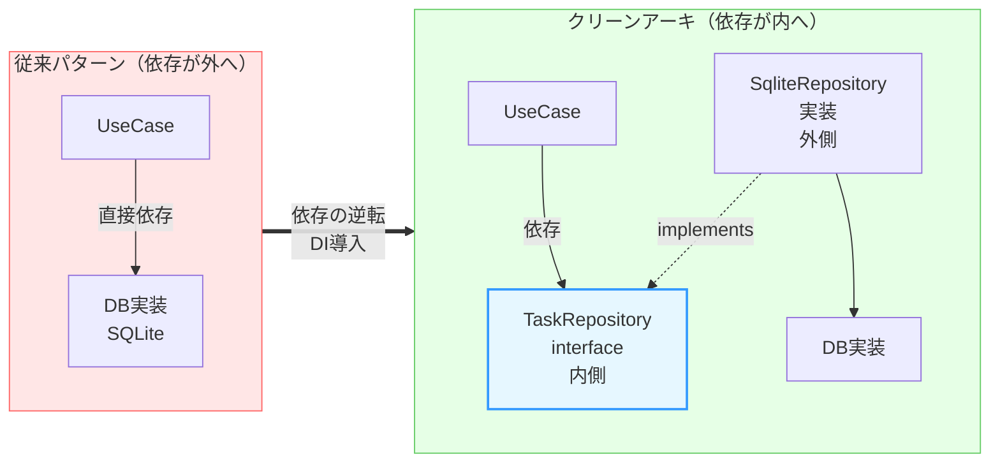

# 第03章：Dependency Rule（依存の向き）が全て⬅️💘

今日の主役はコレ👇
**「import の矢印は、内側に向かうだけ」**✨
つまり **中心（Entities/UseCases）が、外側（DB/HTTP/フレームワーク）を知らない** ってことだよ〜😊💕

> Clean Architecture の “The Dependency Rule” は **「ソースコードの依存は内向きにしか向けない」** というルールだよ、って Uncle Bob がはっきり言ってるよ📌 ([blog.cleancoder.com][1])

---

### 🎯 到達目標（この章が終わったらできること）

* どの import が **OK✅ / NG❌** か、迷わず判断できる😼✨
* NG が出ても、**Port（interface）** を作って内向きに直せる🔧💖
* 「動いてるのに設計が死んでる…😇」を **早めに発見できる**👀

---

## 1) そもそも「依存」ってなに？🤔📦

ここで言う依存は、ざっくり言うと👇

* `import ... from "..."` してる
* 型として参照してる（`type`, `interface`, `implements` など）
* `new Xxx()` してる / `extends` してる
* 何かの名前を「知ってしまってる」📛

ポイントはここ👇
**TypeScript の “型だけ import” でも、設計の依存としては依存だよ**（ソースコード依存だからね）🧠✨ ([blog.cleancoder.com][1])

---

## 2) Dependency Rule を「一言で」🌟

**内側は外側を知らない。外側が内側に合わせる。**⬅️💘


よくある4層で描くと、こんな矢印になるよ👇

* Frameworks & Drivers（外側）➡️ Adapters ➡️ UseCases ➡️ Entities（中心）
* **逆向き（内側 ➡️ 外側）は禁止**❌🚫

---

## 3) いちばん多い崩壊パターン3つ💥😵‍💫

### ❌ パターンA：UseCase が DB ライブラリを直接 import 🗃️

「早く作りたい！」でやりがち😭

```ts
// usecases/createTask.ts（NG例）
import { db } from "../frameworks/db"; // ❌ 外側を知ってる！

export async function createTask(title: string) {
  await db.task.insert({ title }); // ❌ DB都合が中心に侵入
}
```

**これが何を壊すか**👇

* DB変更（SQLite→別DB）で UseCase が壊れる😇
* テストが重くなる（DB必要）🧪💦
* 「中心」が “技術の都合” に支配される🫠

---

### ❌ パターンB：UseCase が HTTP の型を知ってる🌐

```ts
// usecases/completeTask.ts（NG例）
import type { Request } from "express"; // ❌ フレームワーク依存！

export async function completeTask(req: Request) {
  const id = req.params.id; // ❌ HTTP都合
}
```

---

### ❌ パターンC：Entity が外側の便利関数に寄りかかる🧪⚙️

「つい lodash…」「つい dayjs…」で中心が汚れるやつ🥲

---

## 4) 直し方は1つだけ（超重要）🔧✨

### ✅「内側に interface（Port）を置く」→ 外側が実装する

UseCase が欲しいのは「DBそのもの」じゃなくて、**能力**だよね？👀
例：

* 「Task を保存したい」
* 「Task を取得したい」

だから内側にこう置く👇

```ts
// usecases/ports/TaskRepository.ts（OK✅：内側）
import type { Task } from "../../entities/Task";

export interface TaskRepository {
  save(task: Task): Promise<void>;
  findById(id: string): Promise<Task | null>;
}
```

そして UseCase は **Port だけ**を見て書く👇

```ts
// usecases/CreateTask.ts（OK✅）
import type { TaskRepository } from "./ports/TaskRepository";
import { Task } from "../entities/Task";

export class CreateTask {
  constructor(private readonly repo: TaskRepository) {}

  async execute(title: string) {
    const task = Task.create(title);
    await this.repo.save(task);
    return task;
  }
}
```

外側（DB側）が **Port を実装**する👇

```ts
// adapters/SqliteTaskRepository.ts（OK✅：外側が内側に依存）
import type { TaskRepository } from "../usecases/ports/TaskRepository";
import type { Task } from "../entities/Task";
import { db } from "../frameworks/sqliteClient"; // 外側は外側を知ってOK

export class SqliteTaskRepository implements TaskRepository {
  async save(task: Task): Promise<void> {
    await db.task.insert({ id: task.id, title: task.title, completed: task.completed });
  }
  async findById(id: string): Promise<Task | null> {
    const row = await db.task.findById(id);
    return row ? Task.rebuild(row.id, row.title, row.completed) : null;
  }
}
```

最後に「組み立て」で注入（依存をつなぐ）🏗️💉
（ここが Composition Root の入口になる！）

```ts
// main.ts（つなぐだけ）
const repo = new SqliteTaskRepository();
const createTask = new CreateTask(repo);
```

---

## 5) “呼び出し方向” と “依存方向” は別モノだよ🌀💡

「え、でも UseCase から repo.save() 呼んでるじゃん？外向きじゃないの？😳」
ってなるんだけど…

* **呼び出し（実行時）**：UseCase → repo.save()（外側の実体が動く）
* **依存（ソースコード）**：UseCase → `TaskRepository`（内側のinterfaceだけ知ってる）

この “ズラし” が **依存逆転（DIPの使いどころ）** だよ〜🫶✨
（クリーンアーキ文脈の「依存逆転」は、このテクが中心！） ([blog.cleancoder.com][1])



---

## 6) OK✅ / NG❌ 依存 判定表（コピペ用）📋✨

### ✅ 基本ルール

* **外側 → 内側**：OK✅
* **内側 → 外側**：NG❌

### ✅ よくある判定

* Entities が UseCases を import → ❌（中心が外を知る）
* UseCases が Entities を import → ✅
* UseCases が Adapters/Framework を import → ❌
* Adapters が UseCases を import → ✅
* Frameworks が Adapters/UseCases/Entities を import → ✅

### ✅ “名前が出たら負け”チェック😇

* UseCases に `express`, `sqlite`, `prisma`, `fetch`, `React` などの名前が出た
  → **だいたい境界違反**の合図🚨

---

## 7) 仕組みで守る（人はミスる😇）🛡️✨

「気をつけます！」は、3日で負ける😂
だから **ESLint で止める**のが強いよ💪💕

### ✅ 代表選手

* `no-restricted-imports`（禁止 import を明示できる） ([eslint.org][2])
* `eslint-plugin-boundaries`（レイヤー境界をルール化しやすい） ([npm][3])
* Nx を使うなら `@nx/enforce-module-boundaries`（大規模でも強い） ([Nx][4])

「UseCases から frameworks/ を import したらエラー」みたいに、**ゲームのルール化**しちゃおう🎮🚫✨

---

## 8) 今日のミニ演習🧠📝

### 🧩 演習1：違反を見つけよう👀

次の import、OK/NGどっち？（理由も！）

1. `adapters/Controller.ts` → `usecases/CreateTask.ts`
2. `usecases/CreateTask.ts` → `frameworks/sqliteClient.ts`
3. `frameworks/server.ts` → `adapters/Controller.ts`

（答え：1✅ 2❌ 3✅）

---

### 🛠️ 演習2：直してみよう（王道ルート）🔧

NGな UseCase があったら、次の順で直す✨

1. UseCase が欲しい “能力” を言語化（保存？取得？通知？）🗣️
2. 内側に `interface`（Port）を置く🧩
3. UseCase は Port だけを見る👀
4. 外側で実装（Adapter）して満たす🧰
5. 組み立てで注入（DI）💉

---

## 🤖 AI相棒プロンプト（コピペOK）✨

### 依存違反チェック

```text
次のTypeScriptコードのimport依存を確認して、Clean ArchitectureのDependency Rule違反（内側→外側）を列挙して。
違反ごとに「どうPort(interface)を切れば直るか」も提案して、修正後のファイル構成案も出して。
```

### 修正案を “差分” で

```text
このUseCaseがframeworksをimportしてしまっている。Port(interface)導入でDependency Ruleを守る形に直したい。
修正案をgit diff形式で出して（新規ファイル作成もOK）。UseCaseのpublic APIはなるべく変えないで。
```

---

## ✅ 理解チェック問題（1問）🧪

**質問：**
UseCase から DB 実装クラスを import せずに `repo.save()` を呼べるのは、なぜ？🤔

**答えのキーワード：**
「依存は interface（Port）へ」「実体は外側」「組み立てで注入」💉✨

---

## 📦 提出物（成果物）🎁

* **OK/NG依存の判定表**（この章の表を自分のプロジェクト構成に合わせて調整）📋
* “NGなUseCase” を1つ選んで、**Port導入で修正**したPR（または差分）🛠️

---

## 🔎 2026/01/22 時点の「最新」メモ（軽く）🧷✨

TypeScript の安定版は npm 上で **5.9.3** が latest として表示されてるよ📦 ([npm][5])
それとは別に、TypeScript のコンパイラ/ツールをネイティブ化する大きい動き（TypeScript 7 “native” preview など）も進捗が出てるよ🚀 ([Microsoft Developer][6])

---

## まとめ🎀✨

* **Dependency Rule = import の矢印は内側へ**⬅️💘
* 内側が外側を知った瞬間、変更とテストが地獄になる😇
* 直し方は **Port（interface）を内側に置く** だけ🧩✨
* ESLint で “ルール化” すると強い🛡️ ([eslint.org][2])

次の章（第4章：Boundary🚧）に進むと、「じゃあ境界で何を変換するの？」がスルスル分かるようになるよ〜😊💞

[1]: https://blog.cleancoder.com/uncle-bob/2012/08/13/the-clean-architecture.html?utm_source=chatgpt.com "Clean Architecture by Uncle Bob - The Clean Code Blog"
[2]: https://eslint.org/docs/latest/rules/no-restricted-imports?utm_source=chatgpt.com "no-restricted-imports - ESLint - Pluggable JavaScript Linter"
[3]: https://www.npmjs.com/package/eslint-plugin-boundaries?utm_source=chatgpt.com "eslint-plugin-boundaries"
[4]: https://nx.dev/docs/technologies/eslint/eslint-plugin/guides/enforce-module-boundaries?utm_source=chatgpt.com "Enforce Module Boundaries ESLint Rule"
[5]: https://www.npmjs.com/package/typescript?activeTab=versions&utm_source=chatgpt.com "typescript"
[6]: https://developer.microsoft.com/blog/typescript-7-native-preview-in-visual-studio-2026?utm_source=chatgpt.com "TypeScript 7 native preview in Visual Studio 2026"
