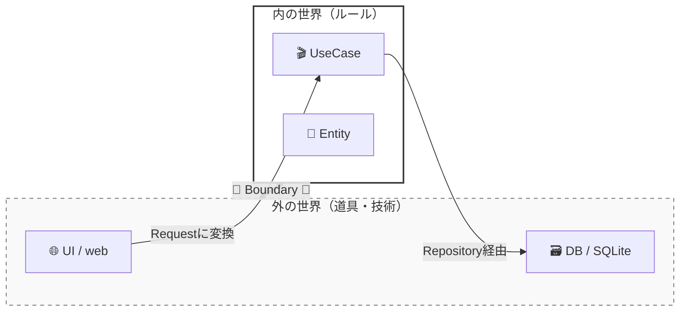

# 第04章：Boundary（境界）ってなに？🚧

この章はひとことで言うと、**「混ぜない線を引く練習」**だよ😊💖
クリーンアーキって、難しい理論よりもまず **“混ぜない” を守れるか** が勝負なの🧼✨

---

## 1) Boundary（境界）＝「責務の切れ目」だよ✂️🚧

境界っていうのは、

* **役割が変わるところ**
* **変換が起きるところ**
* **“ここから先は別の世界” になるところ**

…のことだよ😊🌏





たとえば👇

* UI（画面/HTTP）で来た入力を、**UseCaseが扱いやすい形に整える**📥➡️📦
* UseCaseの結果を、UIが表示しやすい形に**整形して返す**📦➡️🎨
* DBの行（Row）を、アプリの中心で使う形に**変換する**🗃️➡️❤️

こういう “変換ポイント” が境界になりやすいの✨

---

## 2) なんで境界が大事なの？🧸💡

境界を引かないと、こうなるよ👇😵‍💫

* UIの都合（HTTP、画面表示）が中心に入り込む
* DBの都合（SQL、カラム名）が中心に入り込む
* ちょっと変更しただけで、全部が連鎖して壊れる🔁💥
* テストがしにくい（外部が絡みすぎ）🧪💦

境界を引くとこうなる👇😍

* UIを変えても中心（UseCase/Entity）がほぼ無傷✨
* DBを差し替えても中心が無傷✨
* 変換が “ここだけ” に閉じ込められて安心🧼
* テストが速い＆ラク🧪🏃‍♀️

---

## 3) このミニTaskアプリだと、境界はどこ？🗺️🗒️

今回の題材（Create / Complete / List）なら、最低でもここに境界があるよ👇🚧

### ✅ 境界A：UI ↔ UseCase（入口の境界）🚪

* UIの入力（HTTP body とか）をそのままUseCaseに渡さない🙅‍♀️
* **UseCase用のRequest**に変換して渡す📦

### ✅ 境界B：UseCase ↔ DB（出口の境界）🔌

* UseCaseはSQLを直に触らない🙅‍♀️
* **Repository Port（インターフェース）**越しに話す📞

### ✅ 境界C：UseCase ↔ UI（出力の境界）🎁

* UseCaseの結果は “中心の言葉” で返す
* UIで表示用に整形（ViewModel化など）🎨

イメージ図（超ざっくり）👇✨

```
UI(HTTP/画面)  ->  [境界A:入力変換]  ->  UseCase  ->  [境界B:Port]  ->  DB
UI(表示)       <-  [境界C:出力変換]  <-  UseCase  <-  [境界B:Port]  <-  DB
```

---

## 4) 境界がないとどう壊れる？😇💥（あるある例）

### ❌ 悪い例：UseCaseの中にHTTPとSQLが混ざる😵‍💫

```ts
// これは「境界なし地獄」サンプル（やらないでね😭）
async function createTask(req: any, res: any, db: any) {
  const title = req.body.title;              // ← HTTPの都合が中心に侵入
  if (!title || title.length > 50) {
    return res.status(400).json({ error: "invalid" }); // ← 表示/HTTPの都合も侵入
  }

  await db.exec("INSERT INTO tasks(title) VALUES(?)", [title]); // ← SQL直触り
  return res.json({ ok: true });           // ← 出力もHTTP都合
}
```

これだと UI/DB を変えるたびに中心が壊れるよね…🥲

---

## 5) 境界ありの考え方（最小形）🌱✨

ポイントはこれ👇

* UseCaseは **Request/Response** で会話する📦
* 外の世界（HTTP/DB）は **Adapter** が受け持つ🔁
* UseCaseは **Port（interface）** にだけ依存する🔌

### ✅ 入口の境界：HTTP → Request 変換📥➡️📦

```ts
// UseCaseが欲しい入力（HTTPを含めない！）
export type CreateTaskRequest = {
  title: string;
};
```

### ✅ 出口の境界：UseCase → Repository Port🔌

```ts
export interface TaskRepository {
  save(task: { id: string; title: string; completed: boolean }): Promise<void>;
}
```

### ✅ UseCaseは「中心の言葉」で返す📤❤️

```ts
export type CreateTaskResponse = {
  taskId: string;
};

export type DomainError =
  | { type: "InvalidTitle"; message: string }
  | { type: "Unexpected"; message: string };
```

> ここで大事なのは、**HTTPステータス**とか **SQL** とかの単語が、UseCase側に一切出てこないことだよ😊🧼

---

## 6) 第4章のゴール🎯✨（できたら勝ち！）

この章を終えたら、最低これができればOKだよ👇✅

1. **「境界＝責務の切れ目＋変換ポイント」**を自分の言葉で言える🗣️✨
2. ミニTaskアプリの境界（UI↔UseCase↔DB）を **3つ** 指させる👉🚧
3. “境界宣言” として、**どこで何を変換するか** を書ける📝✨

---

## 7) ワーク：今回の境界を「宣言」しよう📍📝💖

以下をそのまま埋めるだけでOK（テンプレ）👇✨
（ノートでもMarkdownでもどっちでもOKだよ😊）

### 🧾 境界宣言テンプレ

* **境界A（UI→UseCase）**

  * ✅ ここでやる：入力の形を `Request` に整える（trim、型合わせ、必須チェック）
  * ❌ ここでやらない：DBアクセス、ビジネスルール確定、保存処理
* **境界B（UseCase→DB）**

  * ✅ ここでやる：Port越しに保存/取得を依頼する
  * ❌ ここでやらない：SQLをUseCaseに書く、DBの行をそのまま中心に流す
* **境界C（UseCase→UI）**

  * ✅ ここでやる：Response/DomainError を UI用に変換（表示文言、HTTPコードなど）
  * ❌ ここでやらない：UseCaseから直接 `res.json()` しない

---

## 8) 「境界っぽい匂い」チェックリスト👃🧠✨

境界を見つけるコツは “匂い” だよ😊（超大事！）

### 🚨 この単語が出たら「境界の外」になりがち

* `req`, `res`, `headers`, `statusCode`（HTTP）🌐
* `SQL`, `SELECT`, `INSERT`, `Row`, `Column`（DB）🗃️
* `React`, `DOM`, `onClick`（UI）🖱️
* `env`, `process.env`（環境）⚙️

これらが **UseCase/Entitiesに出てきたら** だいたい境界崩壊アラートだよ🚨😭

---

## 9) AI相棒の使い方（Copilot / Codex）🤖✨

AIに頼むときは、**「境界を守る条件」**を先に言うのがコツだよ😊💖

### 🧠 そのままコピペ用プロンプト例

* 🤖「次のコードから“境界違反”を指摘して。UseCaseからHTTP(req/res)とDB(SQL)を追い出すリファクタ案も出して」
* 🤖「CreateTaskの境界A用に、HTTP入力→CreateTaskRequestへ変換する関数を書いて。UseCase側にHTTP型が漏れないように」
* 🤖「DomainErrorをUI向け（例：HTTPコード＋メッセージ）に変換するマッピング表を作って」

OpenAIのCodex系も「IDEで使う/委任する」形が増えてきてるので、**“境界を守れ” を条件に入れる**のがすごく効くよ🤖✨ ([Visual Studio Marketplace][1])

---

## 10) 理解チェック（ミニ問題）📝💯✨

1. UseCaseの中に `req.body.title` が出てきた。これ、境界的にOK？NG？🙅‍♀️
2. UseCaseが `INSERT INTO ...` を直接呼んでる。どの境界が壊れてる？🗃️💥
3. `CreateTaskRequest` にHTTPの `Headers` を入れていい？なぜ？🌐
4. 「変換が起きる場所」が境界になりやすいのはなぜ？🔄
5. UIの都合（表示形式）をUseCaseに入れると何が起きる？😵‍💫

---

## 11) 今回の“最新前提”メモ（2026/01/22時点）📅✨

* TypeScriptは **5.9系** が最新安定版として広く参照されてるよ（公式リリースノート＆発表あり） ([typescriptlang.org][2])
* Node.jsは **v24がActive LTS**、v25がCurrent という整理になってるよ（安定運用はLTSが基本） ([nodejs.org][3])
* テスト環境は Vitest 4系が現行の大きな流れの1つ（アップデート情報も継続） ([vitest.dev][4])

> ※この章はツール選定が主役じゃないけど、「境界を守る」ために **中心を外部から切り離してテストしやすくする**流れに繋がるよ🧪✨

---

## 12) 提出物（この章の成果物）🎁✨

* ✅ **境界宣言（A/B/C）** を自分の言葉で書いたメモ📝
* ✅ 「UseCaseに入れていい言葉 / ダメな言葉」ミニリスト📌
* ✅（できれば）`CreateTaskRequest/Response` と `TaskRepository` の型だけ作る📦🔌

---

次の第5章は、この境界の上で **「データの流れ」** をもっとはっきり描いていくよ📦➡️➡️➡️✨
続けて作るなら、今の“境界宣言”を貼ってくれたら、それをベースに第5章へ自然につなげるね😊💖

[1]: https://marketplace.visualstudio.com/items?itemName=openai.chatgpt&utm_source=chatgpt.com "Codex – OpenAI's coding agent"
[2]: https://www.typescriptlang.org/docs/handbook/release-notes/typescript-5-9.html?utm_source=chatgpt.com "Documentation - TypeScript 5.9"
[3]: https://nodejs.org/en/about/previous-releases?utm_source=chatgpt.com "Node.js Releases"
[4]: https://vitest.dev/blog/vitest-4?utm_source=chatgpt.com "Vitest 4.0 is out!"
