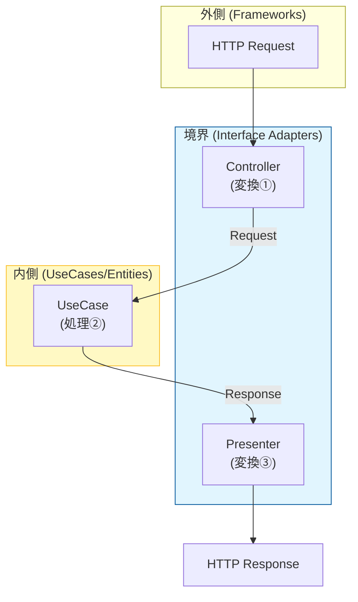

# 第05章：“データの流れ”でクリーンアーキを理解する📦

## この章でできるようになること🎯

* 「依存の向き」だけじゃなくて、「データがどう旅するか🚶‍♀️」で設計を説明できるようになる😊
* 境界（Boundary）で **データの形が変わるポイント** を自分で言語化できる✍️
* `CreateTask` の **入出力（Request/Response）** を“内側を守る形”で書けるようになる🛡️

---

## まず超重要：依存の向き と データの向き は別モノ⬅️➡️💞

クリーンアーキって、よく「依存は内向き！」って言うよね🌀
でも、実際の処理って **データは外→内→外** に流れるの✨

* **依存（import）**：内側に向かう⬅️（内側は外側を知らない）
* **データ（値）**：外から入って、外へ返る➡️（境界で変換される）

ここを分けて考えると、一気に霧が晴れるよ☀️

---

## 境界で起きる“3つの変換”🔁🧼





境界って「混ぜない線🚧」だったよね。
その線の近くで、だいたいこの3つが起きるよ👇

1. **入力の変換**：外側の入力（HTTP/フォーム/CLI）→ 内側の入力（Request）📥➡️📦
2. **内側処理**：Requestをもとにルール実行（UseCase/Entity）⚙️❤️
3. **出力の変換**：内側の結果（Response）→ 外側の都合の表示（ViewModel/HTTPレスポンス）📦➡️🎨

この「変換ポイント」を固定できると、変更に強くなる💪✨

---

## CreateTask：データの旅（文章＋矢印）🗺️🗒️

今回はミニTaskアプリの `CreateTask` を例にするね😊

**データの流れ（ざっくり版）**👇


* ユーザーが入力する🧑‍💻
  ↓
* UI / Controller が受け取る（例：`{ title: "牛乳買う" }`）🧾
  ↓（境界で変換①）
* `CreateTaskRequest` に整形する📦
  ↓
* `CreateTaskUseCase` が受け取って処理する🎬
  ↓（必要ならEntity生成）🧱
* `TaskRepository`（Port）に「保存してね」ってお願いする🔌
  ↓（外側の実装が保存）🗄️
* UseCaseが `CreateTaskResponse` を返す📤
  ↓（境界で変換②）
* Presenter が ViewModel / HTTPレスポンスに整形する🎨
  ↓
* 画面に表示する📱✨

ポイントはこれ👇
**UseCaseの中に “HTTPっぽさ” や “DBっぽさ” を持ち込まない** 😤🧼

---

## Request/Response設計のコツ（初心者でも失敗しない版）🧸✨

### ✅ Requestは「内側が欲しい情報だけ」

* HTTPの `req` とか `headers` とか入れない🙅‍♀️
* “目的に必要な最小”だけにする🧠✨

例：CreateTaskなら

* `title` だけで足りるならそれだけ🎯

### ✅ Responseは「内側の結果」だけ（表示都合は後で）

* `statusCode` とか `toast表示用メッセージ` を入れない🙅‍♀️
* 「作れたよ」「IDはこれだよ」みたいな結果を返す📦

### ✅ “データの形”を境界で止める🛑

* DBの行（Row）をそのまま返さない🙅‍♀️
* UIの表示用に盛りすぎない🙅‍♀️（Presenterの仕事が消える）

---

## 具体例：CreateTaskの入出力（TypeScript）🧁🪄

```ts
// ✅ 内側に渡す「入力」：Request
export type CreateTaskRequest = {
  title: string;
};

// ✅ 内側から返す「結果」：Response
export type CreateTaskResponse = {
  taskId: string;
  title: string;
  completed: boolean;
};
```

ここ、めちゃ大事✨
**Responseは “画面の都合” じゃなく “処理結果”** に寄せるよ😊

---

## もう一歩：UseCaseの形（入力→出力を固定）🎬📦

```ts
export interface CreateTaskUseCase {
  execute(request: CreateTaskRequest): Promise<CreateTaskResponse>;
}
```

この形にしておくと、あとでUIがWebでもCLIでも差し替えやすい😍
（UIは“外側”だからね）

---

## 変換はどこでやるの？（Controller / Presenterの役目）🚪🎨

### Controller（入口）は “受け取って整えるだけ” 🧾➡️📦

```ts
// 例：HTTPやフォーム入力を受け取る場所のイメージ
function toCreateTaskRequest(input: any): CreateTaskRequest {
  return { title: String(input.title ?? "") };
}
```

### Presenter（出口）は “内側結果を表示用に整える” 📦➡️🎨

```ts
export type TaskViewModel = {
  id: string;
  label: string;
  isDone: boolean;
};

export function toTaskViewModel(res: CreateTaskResponse): TaskViewModel {
  return {
    id: res.taskId,
    label: res.title,
    isDone: res.completed,
  };
}
```

ね？✨
**UseCaseは表示を知らない**、でも **Presenterが知ってる** 👍

---

## よくあるNG（境界が溶けるやつ）🫠⚠️

### ❌ UseCaseがHTTPを知っちゃう

```ts
// これはNG例：req/resが内側に入ってる🙅‍♀️
async function execute(req: any, res: any) { /* ... */ }
```

### ❌ ResponseにHTTPステータスが混ざる

```ts
// これもNG寄り：HTTPの都合が内側に侵入😵
type CreateTaskResponse = { statusCode: number; body: any };
```

これやると、あとで「CLIにもしたい」「別UIにしたい」で地獄になる🔥

---

## ミニ演習（5分）⏱️🐣

### お題：`CreateTask` のデータの流れを、自分の言葉＋矢印で書いてみよう✍️➡️

* 入力はどこで `Request` になる？
* `Response` はどこで `ViewModel` になる？

**テンプレ**👇

* UI（　　）→ Controller（　　）→ Request（　　）→ UseCase（　　）→ Response（　　）→ Presenter（　　）→ ViewModel（　　）→ UI表示（　　）

---

## AI相棒🤖✨（コピペ用プロンプト）

### 1) Request/Responseの整理

「CreateTaskの入出力を、境界（Request/Response/Presenter）を意識して整理して。
HTTPやDBの都合が内側に入っていたら指摘して、直した案も出して。」

### 2) データフローのレビュー

「このデータフロー（矢印メモ）をレビューして。
“境界で変換する場所”が曖昧なところを具体的に直して。」

---

## ちなみに最新事情ちょいメモ📌✨（安心材料）

* TypeScriptは npm 上の `typescript` パッケージで **最新安定版が確認できる**よ（現時点で 5.9.3 表記）。([npm][1])
* TypeScriptは **ネイティブ移植（高速化）** も進んでて、ビルド体験がどんどん良くなる流れ🌪️✨([Microsoft for Developers][2])
* Node.js は **v24 が Active LTS** として案内されていて、セキュリティリリースも継続的に出てるよ🔒([nodejs.org][3])
* テスト周り（後の章で使うかも）だと Vitest は v4系への移行ガイドも整ってる🧪([Vitest][4])

---

次の章（第6章）は、この「内側の言葉／外側の言葉」を**命名**でガチガチに固めて、さらに迷子にならなくするやつだよ📖✨

[1]: https://www.npmjs.com/package/typescript?activeTab=versions&utm_source=chatgpt.com "typescript"
[2]: https://devblogs.microsoft.com/typescript/typescript-native-port/?utm_source=chatgpt.com "A 10x Faster TypeScript"
[3]: https://nodejs.org/en/about/previous-releases?utm_source=chatgpt.com "Node.js Releases"
[4]: https://vitest.dev/guide/migration.html?utm_source=chatgpt.com "Migration Guide"
