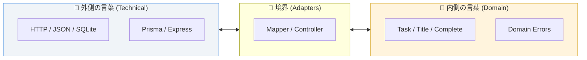

# 第06章：内側の言葉／外側の言葉を分ける📖

この章はね、「クリーンアーキが崩れる一番ありがちな原因」を先に潰す回だよ〜！😆💥
それが **“言葉（用語）”の混入**です🌀

---

## 🎯 到達目標（1文）

**HTTP/DB/フレームワークの言葉を、Entities・UseCasesに持ち込まない命名と設計ができる**ようになる！🛡️✨

---

## 1) なんで“言葉”を分けるの？🤔💭


クリーンアーキの超大事ルールに「依存は内側へ」ってあるよね⬅️💘
つまり **内側（Entities / UseCases）が、外側（HTTP/DB/フレームワーク）を知らない**のが理想。
そして **“外側の名前（用語）を内側で言っちゃう”だけで、依存が始まる**んだよ…！😱
（例：UseCaseの型に `Request` じゃなくて `Express.Request` が出てきた瞬間アウト🙅‍♀️）
この考え方は、Clean ArchitectureのDependency Ruleでも強調されてるよ。([blog.cleancoder.com][1])

---

## 2) 「内側の言葉」「外側の言葉」ってなに？📚✨

### ✅ 内側の言葉（ドメイン語彙）💎

アプリの目的・業務の世界観の言葉（技術が変わっても残る）

* Task / タスク
* Title / タイトル
* Complete / 完了する
* List / 一覧
* DueDate / 期限（今回入れなくてもOK）
* InvalidTitle / タイトル不正 など

### ✅ 外側の言葉（技術語彙）🧰

技術の都合の言葉（変わりやすい）

* HTTP / status code / route / controller
* Express / Fastify / Hono
* JSON / query / header
* SQLite / SQL / Prisma / Drizzle / Row / Record
* transaction / connection string など





---

## 3) ありがち事故あるある🚑💥（これ、超よく起きる）

### ❌ 事故A：UseCaseがHTTPの言葉で話し始める🌐

* `CreateTaskUseCase(req: Request, res: Response)` みたいになる😇
  → 内側が外側（Express等）を知っちゃう

### ❌ 事故B：EntityにDBの都合が混ざる🗃️

* `TaskRow` とか `task_table_id` とかがEntity側に出てくる😇
  → DB変更がドメインに波及する

### ❌ 事故C：成功/失敗がHTTPステータスになる🚦

* UseCaseが `return 404` とか言い出す😇
  → それは外側（Presenter/Controller）の仕事！

---

## 4) 今日のメイン武器：命名ルール6つ🔪✨（これでだいぶ勝てる）


### ルール①：内側に「HTTP / DB / Framework名」を入れない🙅‍♀️

内側のファイル名・型名・関数名にこれが出たら危険信号⚠️

* Http, Request, Response, Controller
* Sql, Db, Row, Record
* Express, Prisma, SQLite, Drizzle … etc

※「Request/Response」という単語自体は **“境界の入出力モデル”として内側寄りで使うのはOK**だよ👍
ただし **ExpressのRequest/Responseみたいな“具体物”はNG**ね！

### ルール②：UseCaseの入出力は「目的の言葉」にする🎬

* `CreateTaskRequest` / `CreateTaskResponse` ✅
* `CreateTaskHttpRequest` ❌（HTTPは外側の都合）

### ルール③：Repositoryは“能力”で命名する🗄️✨

* `TaskRepository` ✅（タスクを保存/取得する能力）
* `SQLiteTaskRepository` ✅（これは外側の実装名としてOK！）

### ルール④：DBの1行は “Row/Record” で外側に隔離する🧼


* `TaskRecord` / `TaskRow` は **Adapters/DB側**に置く✨
* Entityは `Task` のまま❤️

### ルール⑤：失敗（エラー）も内側の言葉にする⚠️

* `TaskNotFound` / `InvalidTitle` / `AlreadyCompleted` ✅
* `NotFoundError(404)` ❌（HTTP混ざってる〜！）

### ルール⑥：変換は“境界”でやる（ここ超大事）🚧🔄

* HTTP → `CreateTaskRequest` は Controller/Inbound Adapter
* DB Row → `Task` は Outbound Adapter/Mapper
* UseCaseは **変換後の世界**だけを見る👀✨

---

## 5) ミニ辞書（内側語彙）を作ろう📝💕（提出物その1）


このミニTaskアプリなら、まずはこれで十分！🌱✨

* **Task**：やること（id / title / completed を持つ）
* **CreateTask**：タスクを作る
* **CompleteTask**：タスクを完了にする
* **ListTasks**：タスクを一覧で返す
* **TaskId**：タスク識別子（文字列でOK）
* **Domain Errors**：

  * `InvalidTitle`（空文字・長すぎ等）
  * `TaskNotFound`（対象がない）
  * `AlreadyCompleted`（すでに完了）

ポイントは「UIでどう見せるか」とか「DBでどう保存するか」は書かないこと！🙅‍♀️
それは外側の言葉だからね🧊✨

---

## 6) 例で体に入れる：悪い例→良い例（TypeScript）🧠✨

### ❌ 悪い例：UseCaseにExpressが侵入😇


```ts
// usecases/CreateTaskUseCase.ts（これはダメな例）
import type { Request, Response } from "express";

export async function createTask(req: Request, res: Response) {
  const title = req.body.title;
  // ...省略
  return res.status(201).json({ ok: true });
}
```

**どこがNG？**

* UseCaseが `express` をimportしてる＝内側が外側依存💥
* 成功/失敗がHTTPステータスで表現されてる🚦

---

### ✅ 良い例：内側は“内側の言葉”だけで完結😍


```ts
// usecases/create-task/CreateTaskModels.ts
export type CreateTaskRequest = {
  title: string;
};

export type CreateTaskResponse =
  | { ok: true; taskId: string }
  | { ok: false; error: "InvalidTitle" };
```

```ts
// usecases/create-task/CreateTaskInteractor.ts
import type { TaskRepository } from "../ports/TaskRepository";
import { Task } from "../../entities/Task";

export class CreateTaskInteractor {
  constructor(private readonly repo: TaskRepository) {}

  async execute(req: { title: string }) {
    const taskOrError = Task.create(req.title);
    if (!taskOrError.ok) return { ok: false, error: "InvalidTitle" } as const;

    await this.repo.save(taskOrError.task);
    return { ok: true, taskId: taskOrError.task.id } as const;
  }
}
```

ここ、最高ポイント🌟

* UseCaseはHTTPもDBも知らない🙈✨
* “CreateTask” の目的の言葉だけで成立🎬💘

---

## 7) 境界で変換するイメージ（超ざっくり図）🗺️✨


* Controller（外側）🌐

  * HTTPのbody/query/headerを読む
  * `CreateTaskRequest` を作る
  * UseCase呼ぶ
  * 結果をHTTPに変換する（status/message）

* UseCase（内側）🎬

  * `CreateTaskRequest` を受け取る
  * Entityルール適用
  * Port（Repository）で保存
  * `CreateTaskResponse` を返す

* Repository実装（外側）🗃️

  * SQLite/ORM/ファイル等、好きにやる
  * 内側に“漏らさない”のが仕事🧼

---

## 8) 今日のハンズオン課題🛠️💕

### ✅ Step 1：名前の仕分けゲーム🎮✨


次の単語を「内側」「外側」に分類してみて〜！🥳

* `Task` / `CompleteTask` / `InvalidTitle` / `SQLite` / `Express` / `statusCode` / `TaskRepository` / `TaskRow`

（答えは章末のチェックで！）

### ✅ Step 2：既存コードがある想定で“リネーム案”を作る✍️✨

もし見つけたら、こう直す！って案を出そう💡

* `TaskController`（内側にいたら） → 外側へ移動🚚
* `TaskRow`（Entity層にいたら） → Adapter/Mapperへ移動🚚
* `NotFoundError404`（UseCaseにいたら） → `TaskNotFound` に変更🎭

---

## 9) AI相棒🤖✨（コピペで使えるプロンプト集）

### ① 命名チェック（内側/外側）

「以下の名前は“内側向き”ですか“外側向き”ですか？理由と改善案を3つ出して：
`<ここに型名/関数名/ファイル名>`」🤖📝

### ② 内側語彙の辞書を作る

「ミニTaskアプリの“内側語彙（ユビキタス言語）辞書”を10語で作って。技術用語は禁止。」📚✨

### ③ 変換場所の指摘

「この処理は Controller / UseCase / Repository のどこに置くべき？理由も。
処理：`<ここに処理内容>`」🚧🔍

（Copilot ChatでもCodex系でも、そのまま投げてOKだよ〜！😆✨）([Visual Studio Code][2])

---

## 10) 理解チェック問題✅🧠✨（1問だけ！）

次のうち、**UseCase層に置いてOKなもの**はどれ？（複数可）🥺🙏

1. `Express.Request`
2. `CreateTaskRequest`
3. `SQLiteTaskRepository`
4. `TaskNotFound`
5. `res.status(201)`

---

## 11) 提出物（成果物）📦✨

* ✅ **内側語彙ミニ辞書（10語くらい）**📝
* ✅ **NGワードリスト（内側に入れない単語5〜10個）**🚫
* ✅ **あなたの命名ルール（3行でOK）**💡

---

## 12) おまけ：この章が“最新前提”としてズレないための一言🧷✨

TypeScriptは公式で **5.9のリリースノートが更新（2026年1月時点）**されていて、TS/Node周りの変化が早いのは本当に事実だよ〜！😵‍💫💨
だからこそ「技術の言葉を内側に入れない」は、年が変わっても効く最強ルール🛡️✨ ([typescriptlang.org][3])

---

## ✅ 仕分けゲームの答え（さっきのやつ）🎮✨

* **内側**：`Task`, `CompleteTask`, `InvalidTitle`, `TaskRepository`
* **外側**：`SQLite`, `Express`, `statusCode`, `TaskRow`（Row/Recordは外側で隔離しよ〜🧼）

---

次の第7章は「ユースケース一覧を確定（アプリの中心）🎬」だよ〜！🥳✨
この第6章の“言葉の境界”を守ったまま、Create/Complete/List を1行仕様に固定していこうね💘😆

[1]: https://blog.cleancoder.com/uncle-bob/2012/08/13/the-clean-architecture.html?utm_source=chatgpt.com "Clean Architecture by Uncle Bob - The Clean Code Blog"
[2]: https://code.visualstudio.com/docs/copilot/overview?utm_source=chatgpt.com "GitHub Copilot in VS Code"
[3]: https://www.typescriptlang.org/docs/handbook/release-notes/typescript-5-9.html?utm_source=chatgpt.com "Documentation - TypeScript 5.9"