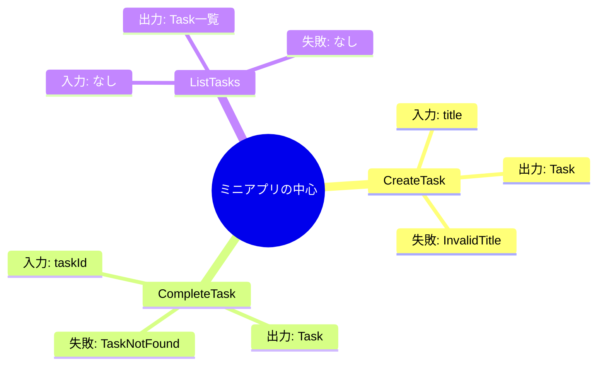

# 第07章：ユースケース一覧を確定（アプリの中心）🎬

この章のゴールはひとつだけだよ👇
**「このアプリが“何をできるようにするか”を、迷わない言葉で3つに固定する」**🧷💖
（ここがフワッとすると、後ろの章でず〜っと迷子になるよ〜😵‍💫💦）

---

## 1) ユースケースってなに？（超ざっくり）🧠💡

ユースケース＝**ユーザーが達成したい“目的”**だよ🎯

* 画面じゃない🙅‍♀️
* APIエンドポイントじゃない🙅‍♀️
* DB操作のことでもない🙅‍♀️

たとえば「タスクを追加する」は目的✅
「POST /tasks」は手段（外側の話）✅
「INSERTする」はもっと外側（DBの話）✅

---

## 2) まず“粒度”を揃えるコツ🍀📏


ユースケースの粒度がバラバラだと、あとで壊れる😇
そこで、**粒度チェック**を3つだけ覚えてね👇

### ✅ 粒度チェック3点セット

1. **動詞が1個**（Create + Complete + List みたいに）🧩
2. **1回で完結**（「作って通知して同期して…」は分割）✂️
3. **テストで判定できる**（成功/失敗が決められる）🧪✨

---

## 3) 今回のミニアプリの“中心ユースケース”を確定しよう🗒️✅

ここで、アプリの中心は **3つに固定**するよ👇

* **Create**（作る）➕
* **Complete**（完了にする）✅
* **List**（一覧で見る）👀





> 「Edit」「Delete」「Search」などは今回は**入れない**（入れたくなっても…いったん我慢！😤🍬）

---

## 4) 1行仕様（超ミニ）を作る ✍️💕


**1ユースケース＝1行仕様**に落とすと、迷子にならないよ🧭✨
テンプレはこれ👇

**「（誰が）〜したい → （何が）どうなる」**

---

### ✅ Use Case 1：CreateTask ➕🗒️


**1行仕様**：
**ユーザーがタイトルを渡すと、未完了のタスクが1件追加される**➕✨

**受け取るもの（入力）**📥

* title（文字）✍️

**返すもの（出力）**📤

* 作成されたTask（id/title/completed）🧱

**失敗（内側の失敗）**⚠️

* タイトルが空（InvalidTitle）😵
* 長すぎ（TitleTooLong）📏💦

---

### ✅ Use Case 2：CompleteTask ✅🔁

**1行仕様**：
**ユーザーがタスクIDを指定すると、そのタスクが完了状態になる**✅✨

**入力**📥

* taskId（文字/ID）🆔

**出力**📤

* 更新後のTask（completed=true）✅

**失敗**⚠️

* 該当タスクなし（TaskNotFound）🔍💦
* すでに完了（AlreadyCompleted）😮‍💨（※扱いは方針次第：成功扱いにしてもOK）

---

### ✅ Use Case 3：ListTasks 👀📃

**1行仕様**：
**ユーザーが要求すると、タスクの一覧が返る**📃✨

**入力**📥

* なし（まずは）🙆‍♀️
  （後で「未完了だけ」など増やしたくなったら増やす🌱）

**出力**📤

* Taskの配列（id/title/completed）📦

**失敗**⚠️

* 基本なし（0件でも成功）🫶✨

---

## 5) 「スコープ外リスト」を作る（これ超大事）🚫🧾✨


ここ、地味に最重要😇💥
**“やらないこと”を決めると、設計が安定する**よ🧱

例👇

* Edit（タイトル変更）✏️🚫
* Delete（削除）🗑️🚫
* Search / Filter 🔎🚫
* ユーザー管理 👤🚫
* 同期 / クラウド ☁️🚫

---

## 6) 成果物：ユースケースカタログ（コピペ用）📄✨

この章の提出物はこれ1枚でOKだよ🎉
（ファイル名は例：`docs/use-cases.md`）

```md
## Use Case Catalog（ミニTaskアプリ）

## 目的（このアプリで達成したいこと）
- タスクを追加できる
- タスクを完了にできる
- タスクの一覧を見れる

---

## UC-01 CreateTask
### 1行仕様
ユーザーがタイトルを渡すと、未完了のタスクが1件追加される。

### 入力
- title: string

### 出力
- task: { id, title, completed }

### 失敗（内側の失敗）
- InvalidTitle（空/空白）
- TitleTooLong（長すぎ）

---

## UC-02 CompleteTask
### 1行仕様
ユーザーがタスクIDを指定すると、そのタスクが完了状態になる。

### 入力
- taskId: string

### 出力
- task: { id, title, completed=true }

### 失敗（内側の失敗）
- TaskNotFound
- AlreadyCompleted（扱いは後で決める）

---

## UC-03 ListTasks
### 1行仕様
ユーザーが要求すると、タスクの一覧が返る。

### 入力
- なし

### 出力
- tasks: Array<{ id, title, completed }>

### 失敗（内側の失敗）
- 基本なし（0件でも成功）

---

## スコープ外（今回やらない）
- Edit（タイトル変更）
- Delete（削除）
- Search/Filter
- ユーザー管理
- クラウド同期
```

---

## 7) よくある落とし穴（ここ踏む人多い）🕳️😂


* 「画面」ベースで決めちゃう（例：一覧画面、登録画面…）🖥️➡️🙅‍♀️
* CRUDで脳死する（Create/Read/Update/Deleteを全部作る）🧟‍♀️🙅‍♀️
* “手段”が混ざる（例：DBに保存する、HTTPで返す）🛠️🙅‍♀️
* 1ユースケースが巨大化（通知・同期・集計まで全部）🧨🙅‍♀️

---

## 8) AI相棒（Copilot/Codex等）に頼むコツ🤖✨

AIには「判定」をさせるのが強いよ💪✨
（提案だけだと増やしがちだからね😂）

### コピペ用プロンプト🎁

* **粒度チェック**
  「次の3ユースケースは粒度が揃ってる？揃ってないなら、理由と修正案を出して：CreateTask / CompleteTask / ListTasks」

* **境界ワード混入チェック**
  「このユースケース定義に、HTTP/DBなど“外側の言葉”が混ざってたら指摘して。内側の言葉に直して」

* **スコープ外の妥当性**
  「この章では Edit/Delete をスコープ外にしたい。設計学習として妥当？入れるなら何が崩れる？」

---

## 9) 理解チェック（サクッと）📝💕

1. ユースケースは「画面の名前」でもOK？🙆‍♀️❌
2. 「POST /tasks」はユースケース？それとも外側？🧱
3. CreateTask の失敗は、HTTP 400 って書けばOK？（内側として）🙅‍♀️❌
4. ListTasks が0件のときは失敗？成功？👀
5. なぜスコープ外を決めると設計が安定するの？🧷

---

## 10) ちょい最新メモ（今どき前提の足場）🧊✨

* TypeScript は **5.9** が現行の安定版として公開されていて、リリースノートも 5.9 が最新ラインだよ📌 ([Microsoft for Developers][1])
* さらに先の動きとして、TypeScript の **ネイティブ移植（TypeScript 7 / Project Corsa）**の進捗も公式に共有されてるよ🚀 ([Microsoft for Developers][2])
* テスト周りは Vitest も **4.0** が出ていて、移行ガイドも整ってる🧪✨ ([Vitest][3])
* Node.js は 2026年1月時点で **24系がActive LTS**、セキュリティリリースも出てるので、更新意識は大事だよ🔐 ([nodejs.org][4])

---

次の章（第8章）からは、いよいよ **Entity（Task）**を最小で作り始めるよ❤️🧱
この第7章の「Use Case Catalog」が、後ろ40章分の“地図”になるから、ここだけは丁寧にね🥰🗺️✨

[1]: https://devblogs.microsoft.com/typescript/announcing-typescript-5-9/?utm_source=chatgpt.com "Announcing TypeScript 5.9"
[2]: https://devblogs.microsoft.com/typescript/progress-on-typescript-7-december-2025/?utm_source=chatgpt.com "Progress on TypeScript 7 - December 2025"
[3]: https://vitest.dev/blog/vitest-4?utm_source=chatgpt.com "Vitest 4.0 is out!"
[4]: https://nodejs.org/en/about/previous-releases?utm_source=chatgpt.com "Node.js Releases"
