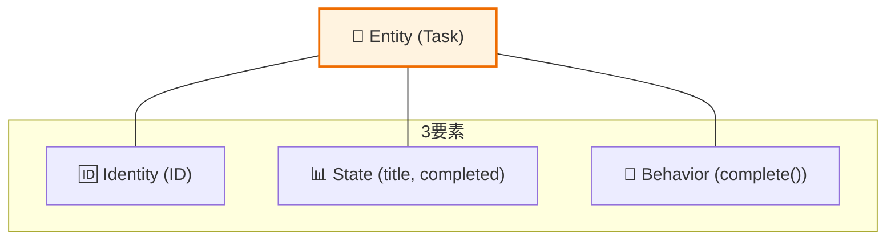

# 第08章：Entities層の作り方（最小から）🌱

この章は「アプリの中心（コア）」を **ちっちゃく・きれいに** 作る回だよ〜😊✨
題材はもちろん **Task（やること）** 🗒️

ちなみに本日時点だと、安定版 TypeScript は npm の `typescript` で **5.9.3** が最新扱いだよ（TS 7 のネイティブ版プレビューは別枠で進行中）🤖⚡ ([npm][1])
Node は **v24 が Active LTS**（安定運用のど真ん中）なので、動作確認もしやすい👍 ([nodejs.org][2])

---

## 8.1 Entities層って、何を置く場所？🧠💡

Entities は一言でいうと👇

* **「アプリの中心のルール」と「状態」を持つ場所** ❤️
* 外側（DB/HTTP/フレームワーク/ライブラリ）を **知らない** 🙅‍♀️
* ここがキレイだと、差し替え・テストが超ラクになる🧪✨

### ✅ Entitiesに置いてOK

* Task という “概念” の状態（例：`id`, `title`, `completed`）🧱
* 「タイトル空はダメ」みたいな **ルール** 🚫
* 状態を変える **最小の操作**（例：`complete()`）🔁





### ❌ Entitiesに置いちゃダメ（混ざると地獄🥺）

* `fetch` / `axios` / `express` / `sqlite` など外部技術🌐🗃️
* HTTP の `req/res` とかステータスコード🧾
* DBのテーブル名・カラム名・SQL文🧱🧨
* UI都合の表示用フィールド（`labelColor` とか）🎨

---

## 8.2 まず「最小」を決める：Taskに必要な属性はこれだけ🗒️✨

今回の超ミニ Task アプリ（Create / Complete / List）に必要な “中心の情報” は👇

* `id`: 一意に区別するため🆔
* `title`: 何をするか✍️
* `completed`: 完了した？✅

※「作成日時」や「並び順」みたいなのは、必要になってから追加でOKだよ😊（作り込みすぎ注意⚠️）

---

## 8.3 実装：Task Entity を “最小の形” で作る🧱✨

フォルダ例（好きに変えてOK）📁

* `src/entities/task/Task.ts`

### ✅ Task.ts（最小Entity）

```ts
// src/entities/task/Task.ts

export type TaskId = string;

export class Task {
  // # は “本当に外から触れない” private（ランタイム強制）だよ🔒
  // JS自体の仕様で守られるタイプ✨ :contentReference[oaicite:2]{index=2}
  #id: TaskId;
  #title: string;
  #completed: boolean;

  private constructor(params: { id: TaskId; title: string; completed: boolean }) {
    this.#id = params.id;
    this.#title = params.title;
    this.#completed = params.completed;
  }

  // ✅ 新規作成は create に寄せる（“入口”を1つにする）🚪✨
  static create(params: { id: TaskId; title: string }): Task {
    const title = params.title.trim();

    // ルール：空タイトルは禁止🚫（最小ルール）
    if (title.length === 0) {
      throw new Error("Task title must not be empty.");
      // 👉 第10章で「ドメインエラー」に進化させる予定だよ🧬✨
    }

    return new Task({
      id: params.id,
      title,
      completed: false,
    });
  }

  // ✅ DB等から復元する入口（rehydrate）も用意すると後で楽🧊
  // ここでは「保存されてた値をそのまま載せる」だけ（最小）でOK
  static rehydrate(params: { id: TaskId; title: string; completed: boolean }): Task {
    return new Task({
      id: params.id,
      title: params.title,
      completed: params.completed,
    });
  }

  // --- 読み取り（外側が欲しいのは基本これ）👀 ---
  get id(): TaskId {
    return this.#id;
  }

  get title(): string {
    return this.#title;
  }

  get completed(): boolean {
    return this.#completed;
  }

  // --- 変更（状態を変える操作はメソッド経由）🔁 ---
  complete(): void {
    // 連打されても壊れない（とりあえず idempotent に）✅✅
    this.#completed = true;
  }
}
```

### ここ、めっちゃ大事ポイント💘

* `new Task(...)` を **外から禁止**（`private constructor`）🚫
* 入口を `create()` / `rehydrate()` にまとめて、ルールを **閉じ込める** 🧯
* フィールドを `#` で隠して、外側から雑に壊されないようにする🔒 ([MDNウェブドキュメント][3])

---

## 8.4 「最小で作る」の判断基準（迷子防止）🧭✨

迷ったらこの3つだけ見てね👇😊

1. **ユースケースに必要？**（Create/Complete/List に必要な情報だけ）🎬
2. **これは “業務の言葉”？**（Task/完了/タイトル…）📖
3. **外側の都合じゃない？**（SQL/HTTP/画面都合なら外側へ）🌍

---

## 8.5 よくある事故💥（先に潰そ🛡️）

### ❌ 事故1：EntityがDBの形に引っ張られる

* `task_table_name` とか `sqliteRow` とか入れちゃうやつ🥺
  → **DBの形は外側**！ Entity は “概念” の形だけ❤️

### ❌ 事故2：ControllerみたいなことをEntityがやり出す

* `Task.createFromHttpRequest(req)` とか…😇
  → HTTPの言葉を内側に入れないで〜🚧

### ❌ 事故3：外から `task.completed = true` で壊せる

→ **#private + getter + メソッド** の形にすると安全🔒✨

---

## 8.6 動作チェック（超ミニ）🧪✨

テストは第13章で本格的にやるけど、今は “手で触って安心する” だけでもOK😊

例えば `src/playground.ts` を作って👇

```ts
import { Task } from "./entities/task/Task.js";

const task = Task.create({ id: "t-001", title: "レポート提出" });
console.log(task.id, task.title, task.completed); // false

task.complete();
console.log(task.completed); // true
```

---

## 8.7 Copilot / Codex に投げる用プロンプト（コピペOK）🤖📌

### ✅ 最小属性を提案してもらう

```txt
Taskアプリ（Create/Complete/List）のEntities層で、Taskエンティティに必要な属性を「最小」で提案して。
UIやDB都合の項目は入れないで。理由も短く。
```

### ✅ Entityの“やりすぎ”チェックをしてもらう

```txt
このTask Entity設計が、Entities層の責務を超えてないかレビューして。
「内側に置くべき/外側に逃がすべき」を指摘して、改善案も。
```

---

## 8.8 理解チェック（1問）✅📝

**Q.** 次のうち Entities に置くのが適切なのはどれ？（複数OK）🤔

1. `Task.complete()`
2. `SqliteTaskRepository`
3. `task_table` というテーブル名
4. `title が空なら作れない` というルール

👉答え：**1 と 4** ✅（2と3は外側だよ🌍）

---

## 8.9 この章の提出物（成果物）📦✨

* `src/entities/task/Task.ts` に **最小の Task Entity** ができている🧱
* `create()` が **空タイトルを防げる** 🚫
* 外側からフィールドを直接いじれない（`#` + getter）🔒

---

次の **第9章** では、この Entity を「外側から壊されない “公開API”」としてもう一段キレイにするよ🔒✨
（`complete()` の戻り値どうする？とか、公開する情報どうする？とかね😊）

[1]: https://www.npmjs.com/package/typescript?utm_source=chatgpt.com "TypeScript"
[2]: https://nodejs.org/en/about/previous-releases?utm_source=chatgpt.com "Node.js Releases"
[3]: https://developer.mozilla.org/en-US/docs/Web/JavaScript/Reference/Classes/Private_elements?utm_source=chatgpt.com "Private elements - JavaScript - MDN Web Docs"
