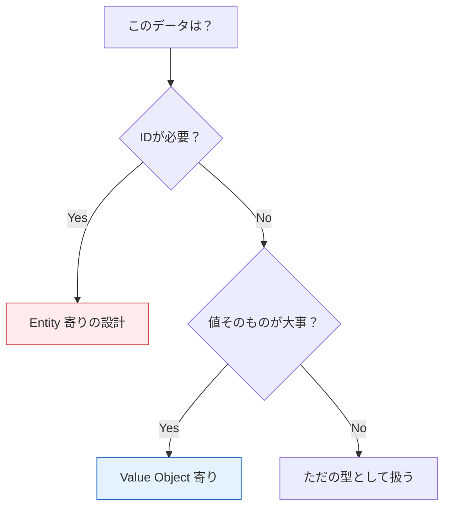

# 第09章：Entityの公開API設計（壊されない入口）🔒

### この章でやりたいこと 🎯

Entity（今回は `Task`）を、外側（UIやDBやテストコード）から **雑に壊されない** ように設計するよ〜！💪😊
「直接書き換え禁止🙅‍♀️」「ルールはメソッド経由で守る🛡️」がテーマ！

ちなみに、本日時点の安定版TypeScriptは **5.9.3**（npm表記）だよ📌 ([npm][1])
（6.0/7.0の動きもあるけど、まだ移行期の話が中心なので、教材は安定版のやり方で固めるのが安全だよ〜）🚧✨ ([Microsoft for Developers][2])

---

## 1) 「壊されるEntity」ってどんな状態？😱

たとえば、こんな `Task` があるとするね👇

```ts
// ❌ダメ例：外側から何でもできちゃう
export class Task {
  constructor(
    public id: string,
    public title: string,
    public completed: boolean,
  ) {}
}
```

これ、UI側でこう書けちゃう：

```ts
task.completed = true;
task.title = "";           // 空タイトルも入る😇
task.id = "hacked";        // IDすら変えられる😇
```

つまり **Entityが守るべきルール（不変条件）を、外側が踏み荒らせる** のが問題なの🥲💥

---

## 2) 壊れないEntityの「公開API」3原則 🛡️✨

ここからが本題だよ〜！💖

### 原則A：状態は外に見せすぎない 👀❌

* フィールドは `private` / `#private` にして、外から代入できないようにする🔒
* 外に出すなら **getter（読み取り専用）** を基本にする📤

### 原則B：変更はメソッド経由だけ ✅

* `complete()` とか `rename()` みたいな **意図が分かる動詞API** を用意する📝✨
* その中で「やっていい？ダメ？」を判定する（＝ルールを守る）⚖️

### 原則C：生成も “入口” を絞る 🚪🔒

* `new Task(...)` を外に開放しない（constructorを `private` にする）
* `Task.create(...)` みたいな **factory（生成メソッド）** を入口にする🌱





---

## 3) 今回のTaskで「公開API」を決めよう 🧩✨

ミニTaskアプリだと、外側が欲しい情報はだいたいこれ：

* `id`（識別子）🆔
* `title`（表示名）📝
* `isCompleted`（完了かどうか）✅
* `complete()`（完了にする）🔁✅

そして守りたいルールはこれ：

* タイトルは空白ダメ🙅‍♀️
* タイトル長すぎダメ（例：100文字まで）📏
* もう完了してるのに `complete()` はダメ🙅‍♀️✅

---

## 4) 実装してみよう（Result型で “失敗” も丁寧に返す）⚠️➡️🎁

第10章で「ルール違反の表現」を本格化するけど、今章でも最低限 “壊れない入口” のために、`Result` で返す形にしちゃうね😊✨
（throwでも作れるけど、初心者は `Result` の方が追いやすいこと多い！）

### 4-1) Result型（成功/失敗）を用意 🎁

```ts
export type Ok<T> = { ok: true; value: T };
export type Err<E> = { ok: false; error: E };
export type Result<T, E> = Ok<T> | Err<E>;

export const ok = <T>(value: T): Ok<T> => ({ ok: true, value });
export const err = <E>(error: E): Err<E> => ({ ok: false, error });
```

### 4-2) ドメインエラー（今は最小）⚠️

```ts
export type TaskDomainError =
  | { type: "InvalidTitle"; message: string }
  | { type: "AlreadyCompleted"; message: string };
```

### 4-3) Task Entity本体（公開APIを絞る！）🔒

```ts
import { Result, ok, err } from "../shared/result";
import { TaskDomainError } from "./taskDomainError";

type TaskId = string;

type CreateTaskParams = {
  id: TaskId;
  title: string;
};

type RehydrateTaskParams = {
  id: TaskId;
  title: string;
  completedAt: Date | null;
};

export class Task {
  // ✅外側から代入不可にする（本当に隠すなら # を使うのが強いよ）
  #id: TaskId;
  #title: string;
  #completedAt: Date | null;

  // ✅外側から new を禁止（生成口は factory に統一）
  private constructor(params: RehydrateTaskParams) {
    this.#id = params.id;
    this.#title = params.title;
    this.#completedAt = params.completedAt;
  }

  // ✅読み取り専用の公開API（getter）
  get id(): TaskId {
    return this.#id;
  }
  get title(): string {
    return this.#title;
  }
  get isCompleted(): boolean {
    return this.#completedAt !== null;
  }
  get completedAt(): Date | null {
    return this.#completedAt;
  }

  // ✅作成専用の入口
  static create(params: CreateTaskParams): Result<Task, TaskDomainError> {
    const normalizedTitle = params.title.trim();

    if (normalizedTitle.length === 0) {
      return err({ type: "InvalidTitle", message: "タイトルが空だよ🥲" });
    }
    if (normalizedTitle.length > 100) {
      return err({ type: "InvalidTitle", message: "タイトルが長すぎるよ🥲（100文字まで）" });
    }

    const task = new Task({
      id: params.id,
      title: normalizedTitle,
      completedAt: null,
    });

    return ok(task);
  }

  // ✅DBなどから復元する入口（外側都合の“復元”も入口を分ける）
  static rehydrate(params: RehydrateTaskParams): Task {
    // ここは「DBが正しい前提」で軽く復元するだけ、という割り切りが多いよ。
    // （必要ならここでも検証してOK）
    return new Task(params);
  }

  // ✅状態遷移はメソッド経由
  complete(at: Date): Result<void, TaskDomainError> {
    if (this.#completedAt !== null) {
      return err({ type: "AlreadyCompleted", message: "もう完了してるよ〜😇" });
    }
    this.#completedAt = at;
    return ok(undefined);
  }
}
```

ポイントだよ〜👇😊✨

* 外側は `task.title = "..."` ができない（壊しにくい！）🔒
* `complete()` の中で「二重完了禁止」を守れる🛡️
* `create()` にルールが集まるので、どこから作っても安全✨
* `rehydrate()` を用意すると「DB復元」と「新規作成」の意図が混ざらない👍

---

## 5) 使う側（UseCase側）のイメージ 🎬

「外側（UseCase）がEntityを正しく扱う」感じはこう👇

```ts
const created = Task.create({ id: "t-001", title: userInputTitle });

if (!created.ok) {
  // ここは Presenter/Controller 側で外側表現に変換していく（後の章でやるよ）
  console.log(created.error.message);
  return;
}

const task = created.value;

const completed = task.complete(new Date());
if (!completed.ok) {
  console.log(completed.error.message);
  return;
}

// task を repository.save(task) みたいに渡す（次の章以降で育てる🌱）
```

---

## 6) よくある設計ミスあるある（先に潰す）🧯😆

### ❌「setterを生やす」

```ts
set title(v: string) { this.#title = v; }
```

これやると結局外側が好き勝手できる入口になるよ〜🙅‍♀️💥
“変える” は必ず `rename(newTitle)` みたいな動詞にして、その中で検証しよ！

### ❌「constructorをpublicにする」

`new Task(...)` が解放されると、`create()` の検証を素通りされがち🥲
入口は絞るのが正義✨

### ❌「EntityがUI/DBの型を持つ」

`TaskEntity { httpStatus: 200 }` みたいなのは境界崩壊〜！🚧💥
Entityは業務の言葉だけにするよ😊

---

## 7) ミニ課題（5分）📝✨

`rename(newTitle)` を追加してみてね！💖
条件：

* 空白タイトル禁止
* 100文字まで
* 成功したら `#title` を更新

（できたら “元のタイトルと同じなら何もしない” とかも入れると可愛い👏😊）

---

## 8) 理解チェック（1問）✅

Q. `Task.create()` と `Task.rehydrate()` を分けるメリットを、1行で言うと？🧠✨
（答え例：**「新規作成のルール検証と、DB復元の都合を混ぜないため」**）

---

## 9) AI相棒🤖✨（コピペ用プロンプト）

用途別にどうぞ〜！

* 設計相談：
  「Task Entityの公開APIを、外から壊されないように設計して。`create`/`rehydrate`/`complete` を想定して、ルール（空タイトル禁止、二重完了禁止）を守る形にして」

* 実装補助：
  「TypeScriptで `Result` 型（ok/err）を使って、`Task.create()` と `task.complete()` を実装して。`private constructor` と `#private fields` を使って」

* レビュー：
  「このEntity設計、外側からルールを破れる抜け道がないかチェックして。改善案も出して」

---

次の第10章では、この章でちらっと出た **“ルール違反（ドメインエラー）をどう表現するか”** を、もっと気持ちよく整理していくよ〜！⚠️➡️✨

[1]: https://www.npmjs.com/package/typescript?activeTab=versions&utm_source=chatgpt.com "typescript"
[2]: https://devblogs.microsoft.com/typescript/progress-on-typescript-7-december-2025/?utm_source=chatgpt.com "Progress on TypeScript 7 - December 2025"
