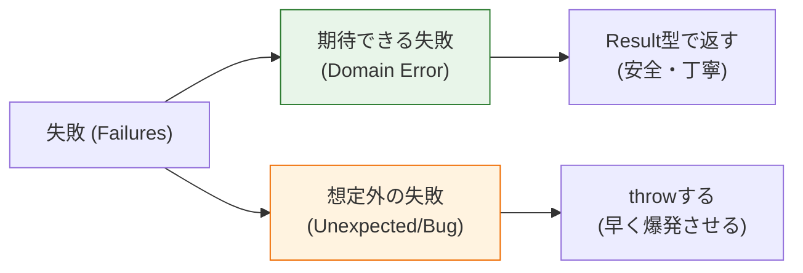

# 第10章：ルール違反の表現（内側の失敗）⚠️

この章はね、「失敗（エラー）」を **内側の言葉でキレイに表現できるようにする** 回だよ〜😊✨
クリーンアーキって、成功パスより **失敗パスが汚れると一気に崩れる** から、ここ超大事っ…！🧼💎

（ちなみに今のTypeScriptの安定版は npm だと 5.9.3 が latest だよ〜📦✨） ([npm][1])
（TS 6.0 は “橋渡しリリース” として言及されてるけど、少なくとも 2025年12月の公式記事では「これから」扱いだよ🛤️） ([Microsoft for Developers][2])

---

## 🎯 今日のゴール（できるようになること）

* ✅ 「業務ルール違反」を **ドメインエラー** として型で表現できる
* ✅ Entity のメソッドが **成功/失敗を安全に返せる**（Result型）
* ✅ 外側（HTTP/DB/UI）っぽい言葉を **Entity に絶対持ち込まない** 🚫🌐

---

## 🤔 “失敗”には2種類あるよ！⚠️🧯

### 1) 期待できる失敗（＝ユーザーや入力が原因）🙂

例：

* タスク名が空
* タスク名が長すぎ
* すでに完了してるのに、もう一回完了しようとした

👉 **これは仕様として起きうる** ので、型で返すのがキレイ✨

### 2) 想定外の失敗（＝バグ/環境/壊れた状態）😱

例：

* null が来た（本来来ない）
* 変換処理が壊れてる
* 「ありえない状態」になった

👉 これは **throw してOK**（むしろ早く爆発して気づいた方が良い💥）





---

## ✅ この教材で採用する方針（超おすすめ💖）

* 🌸 **期待できる失敗 → Result型で返す**
* 🧨 **想定外の失敗 → throw**

TypeScriptは「判別可能なユニオン（discriminated union）」が得意だから、Result型めっちゃ相性いいよ〜✨ ([typescriptlang.org][3])

---

## 🧱 まずは “Result型” を作ろう（依存ゼロ）🔒

```ts
// Result: 成功(ok) か 失敗(err) のどっちかを必ず返す型 ✨
export type Result<T, E> =
  | { ok: true; value: T }
  | { ok: false; error: E };

export const ok = <T>(value: T): Result<T, never> => ({ ok: true, value });
export const err = <E>(error: E): Result<never, E> => ({ ok: false, error });
```

📌 ポイント

* 「例外が飛ぶかも…」じゃなくて、**戻り値に成功/失敗が入ってる** から安心😊
* Entity を使う側（UseCaseなど）が、**失敗を取りこぼせない**✨

---

## 🧾 次に “ドメインエラー” を定義しよう（内側の言葉だけ）📖✨

今回のミニTaskなら、まずこのへんが自然かな😊

```ts
// Entity(内側)で扱う「ルール違反」を、型として列挙するよ🧠✨
export type TaskError =
  | { kind: "InvalidTitle"; reason: "Empty" }
  | { kind: "InvalidTitle"; reason: "TooLong"; max: number }
  | { kind: "AlreadyCompleted" };
```

📌 ここでのコツ

* 「400 Bad Request」とか「SQL」とか、**外側の単語は禁止**🙅‍♀️
* kind は “内側の分類”、reason は “内側の理由” って感じ✨
* UI向けの文章（日本語メッセージ）は **ここで作らない**（それは外側の仕事🎨）

---

## 🧩 Task Entity に “失敗を返すAPI” を生やす🌱

ここでは、Entityが **ルールを守る門番** になるよ🛡️✨

```ts
import { Result, ok, err } from "./result";
import { TaskError } from "./taskError";

export class Task {
  private constructor(
    public readonly id: string,
    public readonly title: string,
    public readonly completed: boolean,
  ) {}

  static create(input: { id: string; title: string }, maxTitleLen = 60): Result<Task, TaskError> {
    const title = input.title.trim();

    if (title.length === 0) {
      return err({ kind: "InvalidTitle", reason: "Empty" });
    }
    if (title.length > maxTitleLen) {
      return err({ kind: "InvalidTitle", reason: "TooLong", max: maxTitleLen });
    }

    return ok(new Task(input.id, title, false));
  }

  complete(): Result<Task, TaskError> {
    if (this.completed) {
      return err({ kind: "AlreadyCompleted" });
    }
    return ok(new Task(this.id, this.title, true));
  }
}
```

💡 ここ、地味に強いポイント💪✨

* Entityの「不変条件（守るべきルール）」が **全部ここに集まる**
* UseCaseが雑でも、Entityが防波堤になってくれる🌊🧱

---

## 🧠 “漏れ”を防ぐ！網羅チェック（assertNever）🧷✨

「エラー種類が増えたのに、変換処理を直し忘れた😇」を防ぐやつ！

```ts
export const assertNever = (x: never): never => {
  throw new Error("Unexpected case", { cause: x });
};
```

※ Error の cause は今のJSで広く使えるよ〜（原因をぶら下げられて便利🧵） ([MDN Web Docs][4])

---

## 🎨 エラーを表示用に変換するのは “外側” の仕事（でも例だけ見せるね）🖼️✨

Presenter / Controller 側で、こういう変換をする感じ！（第34章で本格的にやるやつだよ😊）

```ts
import { TaskError } from "./taskError";
import { assertNever } from "./assertNever";

export const taskErrorToMessage = (e: TaskError): string => {
  switch (e.kind) {
    case "InvalidTitle":
      if (e.reason === "Empty") return "タイトルを入れてね😊";
      if (e.reason === "TooLong") return `タイトルは${e.max}文字以内にしてね🙏`;
      return assertNever(e.reason);
    case "AlreadyCompleted":
      return "もう完了済みだよ〜✅";
    default:
      return assertNever(e);
  }
};
```

🌟 TypeScriptの判別ユニオンで「switchが安全」になるのが気持ちいいやつ！ ([typescriptlang.org][3])

---

## 🧯 例外（throw）を使っていい場面も決めよう💥

「仕様として起きうる失敗」には使わないけど、
「ありえない状態」には使ってOK👌

さらに catch を安全にするなら、catch 変数は unknown 扱いが推奨だよ（TS 4.4 からのオプション）🧤✨ ([typescriptlang.org][5])

---

## 🧪 動かし方イメージ（UseCase側の気持ち）🎬✨

```ts
const created = Task.create({ id: "t1", title: "  " });

if (!created.ok) {
  // 失敗が取りこぼせないのが良いところ😊
  console.log(created.error); // { kind: "InvalidTitle", reason: "Empty" }
} else {
  const task = created.value;
  const completed = task.complete();

  if (!completed.ok) console.log(completed.error);
}
```

---

## ✅ ミニ演習（この章の提出物）📦✨

1. TaskError に以下を追加してみてね🙂

* 「タイトルに絵文字だけは禁止」みたいなルール（例：記号だけNG）🚫😆

2. Task.create のバリデーションを増やして、Resultで返す💡
3. taskErrorToMessage で表示文も増やす（網羅チェックが効くのを体感✨）

---

## 🤖 AI相棒プロンプト（コピペ用）🪄✨

```text
TaskアプリのTask Entityに入れるべき「ドメインエラー」を列挙して。
制約:
- HTTP/DB/UIの用語は禁止（内側の言葉だけ）
- discriminated union で表現できる形にする
- kind と reason の粒度も提案して
```

```text
以下の TaskError union に新しいバリアントを追加したい。
追加後に switch が漏れなく網羅されるように assertNever を使った変換関数も提案して。
(コードは TypeScript で)
```

---

## ✅ 理解チェック（1分クイズ）⏱️💡

* Q1：Entityのエラー型に「400」や「NotFound」を入れたくなるのはなぜ危険？😵
* Q2：Result型にすると “取りこぼし” が減るのはなぜ？🧠
* Q3：assertNever は何を守ってくれる？🛡️

---

次の第11章は「Entityのライフサイクル（作る→変える）🔁」だね😊
ここで作った **ドメインエラー** を使って、「完了できる条件」をもっとキレイに固めていくよ〜✅✨

[1]: https://www.npmjs.com/package/typescript?utm_source=chatgpt.com "TypeScript"
[2]: https://devblogs.microsoft.com/typescript/progress-on-typescript-7-december-2025/?utm_source=chatgpt.com "Progress on TypeScript 7 - December 2025"
[3]: https://www.typescriptlang.org/docs/handbook/unions-and-intersections.html?utm_source=chatgpt.com "Handbook - Unions and Intersection Types"
[4]: https://developer.mozilla.org/en-US/docs/Web/JavaScript/Reference/Global_Objects/Error/cause?utm_source=chatgpt.com "Error: cause - JavaScript - MDN Web Docs"
[5]: https://www.typescriptlang.org/docs/handbook/release-notes/typescript-4-4.html?utm_source=chatgpt.com "Documentation - TypeScript 4.4"
