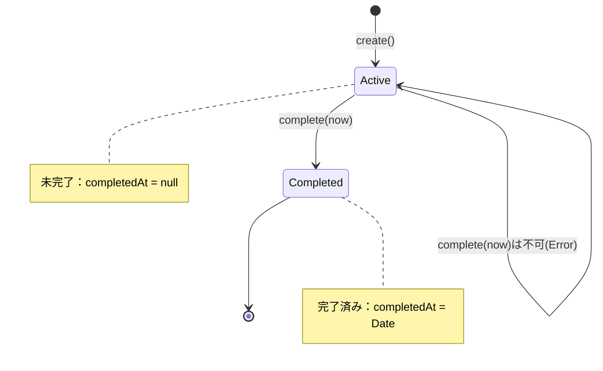
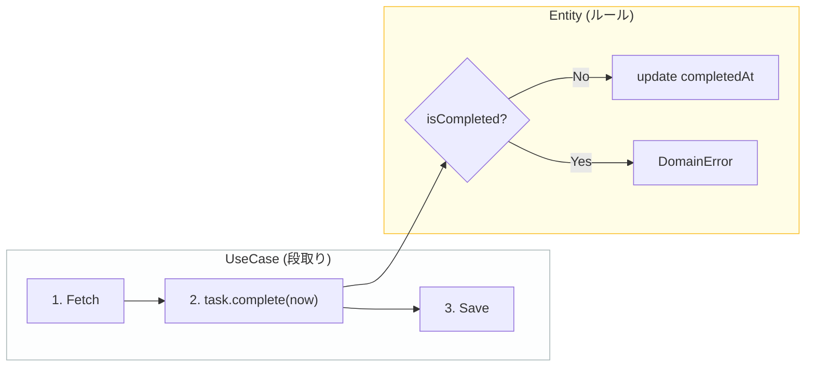

# 第11章：Entityのライフサイクル（作る→変える）🔁

〜「完了（complete）」のルールを “どこに置く？” をスッキリ決める回だよ〜😊🧠

---

## 0. この章でできるようになること 🎯💖

* 「Taskを完了にする」処理の**責務の置き場**を迷わなくなる✨
* **Entityが守るべき更新ルール（不変条件）**を、コードに閉じ込められる🔒
* 「UseCaseがやること／Entityがやること」を、**線引き**できるようになる✍️
* **“禁止条件” の漏れ**をテストで止められる🧪✅

---

## 1. まず超大事：Entityのライフサイクルってなに？🧬

Entityって「ただのデータ箱」じゃなくて、
**作られて → 状態が変わって → ずっとルールを守り続ける存在**だよ💡✨

今回のTaskなら、ざっくりこんな流れ👇

* 作る（Create）🆕
* 完了にする（Complete）✅
* 一覧で見る（List）👀

この章では特に **「完了にする（Complete）」の状態変化**を扱うよ🔁

---

## 2. いちばん迷うポイント：completeは誰の責務？🤔⚖️

ここがクリーンアーキの気持ちいい所〜！✨
結論から言うと👇

### ✅ Entityが担当すること（ルール・状態遷移）🛡️

* 「完了にしていい条件」
* 「完了したらこういう状態になる」
* 「二重完了は禁止」みたいな**ドメインルール**

### ✅ UseCaseが担当すること（手続き・段取り）🧭

* どのTaskを完了するか探す（Repositoryで取得）
* Entityに「完了して！」ってお願いする（メソッド呼ぶ）
* 保存する（Repositoryで保存）
* 返す（Response作る）

つまり✨
**UseCaseは段取り係**、**Entityはルール番人**👮‍♀️💖

---

## 3. 状態遷移を “絵” にする（めっちゃ効く）🧠🖊️

まずは脳内を整理するために、こういう矢印を作ろ〜👇

* `Active`（未完了）➡️ `Completed`（完了済み）





禁止も書いちゃう👇

* `Completed` ➡️ `Completed` は ❌（二重完了禁止）

文章でルールを書くなら例えば👇

* 未完了のTaskだけが完了できる
* 完了したら `completedAt` が入る
* すでに完了してたらドメインエラー

---

## 4. 実装方針：Entityの「更新」はメソッドに閉じ込める🔒✨

やりたいのはこれ👇

* 外側から `task.completed = true` とか**直接いじれない**ようにする😤
* 必ず `task.complete()` を通るようにする✅
* そこでルールチェックして、ダメならエラーを返す⚠️

---

## 5. Entity実装例（Taskのライフサイクル）🧱✅

### 5-1. ドメインエラー（例）⚠️

（前章で作った流れを引き継ぐイメージだよ〜）

```ts
// src/entities/errors.ts
export type DomainError =
  | { type: "TaskAlreadyCompleted" }
  | { type: "InvalidTitle"; reason: string };
```

### 5-2. Task Entity（completeのルールをEntityに集約）🛡️

```ts
// src/entities/task.ts
import type { DomainError } from "./errors";

export type TaskId = string;

export type Result<T> =
  | { ok: true; value: T }
  | { ok: false; error: DomainError };

export class Task {
  // 外から直接書き換えさせない✨
  private constructor(
    private readonly _id: TaskId,
    private _title: string,
    private _completedAt: Date | null,
  ) {}

  // 読み取り専用の出口だけ用意する😊
  get id(): TaskId {
    return this._id;
  }
  get title(): string {
    return this._title;
  }
  get completed(): boolean {
    return this._completedAt !== null;
  }
  get completedAt(): Date | null {
    return this._completedAt;
  }

  // 作るときのルール（例：タイトル必須）
  static create(params: { id: TaskId; title: string }): Result<Task> {
    const title = params.title.trim();
    if (title.length === 0) {
      return { ok: false, error: { type: "InvalidTitle", reason: "タイトルが空だよ🥲" } };
    }
    return { ok: true, value: new Task(params.id, title, null) };
  }

  // 状態遷移：Active -> Completed ✅
  complete(now: Date): Result<void> {
    if (this._completedAt !== null) {
      return { ok: false, error: { type: "TaskAlreadyCompleted" } };
    }
    this._completedAt = now;
    return { ok: true, value: undefined };
  }
}
```

ポイントはこれだよ👇✨

* `completedAt` が `null` かどうかで状態が決まる（シンプル！）
* `complete(now)` を通らないと完了できない
* 二重完了はドメインエラーで止める🚫

---

## 6. 「UseCaseはどう呼ぶの？」の絵（責務の分離）🧩✨





UseCase側はこんな気持ち👇

1. RepositoryからTaskを取ってくる📦
2. `task.complete(now)` を呼ぶ✅
3. 保存する💾
4. Response作って返す📤

ここで **“completeできる条件” をUseCaseに書き始めると**
だんだん「中心のルールが散らばって」事故りやすくなるよ😵‍💫💦
（例：A画面ではチェックしたのに、B画面では忘れた…とか）

---

## 7. ルールは増える。だから “禁止条件リスト” を作る📝🚫

今はミニアプリでも、ルールって増えるのが普通だよ〜😆

### ✅ completeの禁止条件（例）

* すでに完了している（`completedAt !== null`）
* （将来）削除済みは完了できない
* （将来）期限切れは完了できない
* （将来）権限がない人は完了できない（これはUseCase寄り）

この章のゴールは、**“Entityが守る禁止条件” を漏れなくメソッド内に置く**ことだよ🛡️✨

---

## 8. テストで「禁止条件の漏れ」を潰す🧪💖

Vitestは最近も更新が続いてて、移行ガイドも整備されてるよ〜（Vitest 4系）🧪✨ ([vitest.dev][1])
なので Entityテストは Vitest でサクッといこう😊

```ts
// src/entities/task.test.ts
import { describe, it, expect } from "vitest";
import { Task } from "./task";

describe("Task Entity lifecycle", () => {
  it("未完了のTaskは完了できる✅", () => {
    const created = Task.create({ id: "t1", title: "レポート出す" });
    if (!created.ok) throw new Error("create failed");

    const task = created.value;
    const r = task.complete(new Date("2026-01-22T10:00:00Z"));

    expect(r.ok).toBe(true);
    expect(task.completed).toBe(true);
    expect(task.completedAt).not.toBeNull();
  });

  it("完了済みは二重完了できない🚫", () => {
    const created = Task.create({ id: "t1", title: "洗濯する" });
    if (!created.ok) throw new Error("create failed");

    const task = created.value;

    const r1 = task.complete(new Date());
    expect(r1.ok).toBe(true);

    const r2 = task.complete(new Date());
    expect(r2.ok).toBe(false);
    if (!r2.ok) {
      expect(r2.error.type).toBe("TaskAlreadyCompleted");
    }
  });

  it("空タイトルは作れない🥲", () => {
    const created = Task.create({ id: "t1", title: "   " });
    expect(created.ok).toBe(false);
    if (!created.ok) {
      expect(created.error.type).toBe("InvalidTitle");
    }
  });
});
```

テストの気持ちはこれ👇

* **作れること**
* **変えられること**
* **変えちゃダメな時に止まること** ←超大事💥

---

## 9. ありがちな落とし穴（ここでハマりやすい）🕳️😵

### ❌ UseCase側で `if (task.completed) return ...` を毎回書く

→ 書き忘れが起きる（画面が増えるほど事故る）💥

### ❌ Entityを `interface Task { ... }` のただの型にしちゃう

→ ルールが散らばりやすい💦
（Entityは “ふるまい” が主役だよ〜）

### ❌ `completed: boolean` だけで済ませる

→ 後から「いつ完了した？」が欲しくなって壊しがち😇
`completedAt: Date | null` は地味に便利✨

---

## 10. この章の提出物（成果物）📦🎁

* `Task` Entityに `complete(now)` がある✅
* 二重完了をDomainErrorで止めている🚫
* `Task.create()` で最低限の生成ルールが入ってる🆕
* Entityのテストが3本以上🧪✨

---

## 11. 理解チェック（1問）📝💡

**Q. 「完了済みTaskは完了できない」チェックは、UseCaseとEntityのどっちに書く？理由も！**
（答え：Entity。理由：ルールが中心に集約され、呼び出し元が増えても漏れないから💖）

---

## 12. AI相棒プロンプト（コピペ用）🤖✨

### 禁止条件の洗い出し🔍

```text
Taskのcomplete処理について、「Entity側で守るべき禁止条件」を漏れなく列挙して。
将来増えそうなルールも候補として出して、Entity向き/UseCase向きに分類して。
```

### テスト観点づくり🧪

```text
Task Entityのライフサイクル（create -> complete）に対して、
最低限必要なテストケースを5つ、理由付きで提案して。
```

### 実装レビュー💅

```text
このTask Entity実装をレビューして、外側から状態が壊れないか、責務が散ってないか指摘して。
改善案があれば具体的なコード方針も出して。
```

---

## 13. ちょい最新メモ（2026年1月時点）📌✨

* TypeScriptの公式リリースノートは **5.9** が公開されていて、ページ更新も2026年1月に入ってるよ🧷 ([typescriptlang.org][2])
* Node.jsは **v24系がActive LTS** として扱われていて、2026-01-13に **24.13.0** のセキュリティリリースも出てる🛡️ ([nodejs.org][3])

（この章の結論はツールが変わっても揺れないけど、テストや実行環境の更新は定期的に追うと安心だよ〜😊✨）

---

次の章（第12章）では、今作ったEntityが **外側に依存してないか監査**するよ👀🛡️
「Entities層のimportがゼロで綺麗✨」って状態を作っていこ〜！🎉

[1]: https://vitest.dev/guide/migration.html?utm_source=chatgpt.com "Migration Guide"
[2]: https://www.typescriptlang.org/docs/handbook/release-notes/typescript-5-9.html?utm_source=chatgpt.com "Documentation - TypeScript 5.9"
[3]: https://nodejs.org/en/about/previous-releases?utm_source=chatgpt.com "Node.js Releases"
