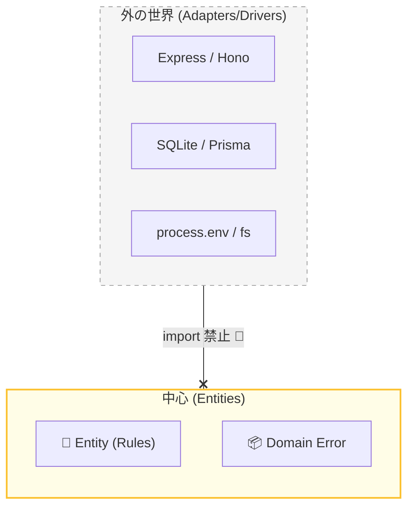

# 第12章：Entities層の“依存ゼロ”監査👀

## 今日のゴール🎯✨

Entities（中心のルール）を、**外側の都合（Web/DB/ライブラリ）から完全に切り離した状態**にするよ〜！💪💕
ここが守れると、クリーンアーキが一気に “強い設計” になるの🥳

---

## 1) なんで「依存ゼロ」がそんなに大事なの？🤔💡


Entitiesはアプリの**心臓❤️**だよ。
心臓が「Express」「SQLite」「環境変数」「ログ」「UUIDライブラリ」みたいな外側に寄りかかると…

* 外側が変わるたびに心臓も痛む…😵‍💫
* テストが重くなる・遅くなる…🐢
* “中心ルール” がどこにあるか迷子…🌀

逆に、Entitiesがピュアだと：

* どんなUIでも、どんなDBでも差し替えできる🔁✨
* テストが爆速で、安心が増える🧪⚡
* ルールが「ここにある！」って全員が分かる📌

---

## 2) Entities層「OK依存✅ / NG依存❌」早見表📋✨


### ✅ Entitiesが依存してOKなもの

* 自分自身（Entities内の他ファイル）🧩
* TypeScriptの型・言語機能（`type`, `interface`, `readonly` など）🧠
* “純粋な” 標準機能（例：`Math`, `Date` ※ただし「今の時刻を取る」のは注意！）⏰
* ドメインの表現（Value Object / Domain Error / Domain Eventなど）📦

### ❌ Entitiesが依存しちゃダメなもの（代表例）

* Webフレームワーク：`express`, `hono`, `next` など🌐❌
* DB/ORM：`sqlite`, `prisma`, `drizzle` など🗄️❌
* NodeのI/O系：`fs`, `path`, `process.env` など📁❌
* ロガー：`pino`, `winston` など🪵❌
* HTTPの概念：`Request`, `Response`, `statusCode` など📡❌
* バリデーションライブラリ：`zod` など（※Entitiesに入れると外側寄りになりがち）⚠️❌

> ちなみにTypeScript 5.9系では `--module node20` のような安定オプションも増えてて、ビルド設定がより整理しやすくなってるよ〜🧰✨ ([typescriptlang.org][1])

---

## 3) まずは「監査のやり方」を決めよう🔍✨（ルール＝仕組みにする）

### 監査は2段階が最強だよ🛡️

1. **目視チェック（人間の目）**👀
2. **自動チェック（ツールで強制）**🤖✅

---

## 4) 目視監査👀：Entitiesのimportを全部チェックする

Entitiesフォルダで、見るのはこれだけ👇

* `import ... from "..."` が何を指してる？
* “外側っぽい匂い” が1つでもあったらアウト❌





#### 典型的にアウトな匂い💥


* `adapters/` や `frameworks/` をimportしてる
* `express` / `sqlite` / `fs` が見える
* `process.env` が出てくる
* “画面都合の型” が混ざってる（例：`TaskViewModel`）

---

## 5) 自動監査🤖✅：ESLintで「Entitiesから外側import禁止」を固定する


ESLintは今ちょうど **v10のRC** も出てて、メジャー更新の流れが来てるよ🧹✨（2026年1月時点） ([ESLint][2])
なので **“Flat Config” 前提**で、Entitiesの境界ルールをガチガチにするのがオススメ🧷💕

### 例：Entitiesから「外側」をimportしたら即エラーにする🧨

```js
// eslint.config.js（例）
export default [
  {
    files: ["src/entities/**/*.ts"],
    rules: {
      // 外側フォルダの参照を禁止（プロジェクト構成に合わせて調整してね）
      "no-restricted-imports": [
        "error",
        {
          patterns: [
            "../usecases/*",          // Entities -> UseCases も基本は禁止寄り（方針次第）
            "../adapters/*",
            "../frameworks/*",
            "**/adapters/**",
            "**/frameworks/**",
            "express",
            "sqlite*",
            "prisma*",
            "drizzle*",
            "fs",
            "path",
          ],
        },
      ],
    },
  },
];
```

> ポイント：**「EntitiesはEntitiesだけ見てて！」**って機械に言わせるのが勝ち🏆✨

---

## 6) “依存ゼロ” を壊しやすいNG例と、直し方🔧💕

### NG例❌：Entitiesで「今の時刻」を取ってしまう


「完了日時を入れたいから `new Date()` しちゃえ〜」ってやりがち🥺

* `new Date()` 自体は標準機能だけど、**“いつ” という環境依存**が入りやすい⚠️
* テストが不安定になりがち（時刻で落ちるやつ）😵

✅直し方：**時刻はUseCase側で作って、Entityには値として渡す**💌
（Clock PortはUseCase側で使う想定だよ🔌）

---

### NG例❌：Entitiesにバリデーションライブラリを直入れ

例：`zod` をEntitiesに置くと
「ライブラリ都合」が中心に入りやすい🌀

✅直し方：

* Entitiesは **最低限のルールを自前で表現**（文字数、空チェックなど）✍️
* もしくは「入力チェック」は境界側でやって、Entitiesはルールに集中🎯

---

## 7) Entities層の“importルール表”を作ろう✅📌（提出物）

あなたのプロジェクト用に、これを1枚作ればOK〜！📝✨

* ✅ Entitiesがimportしてよいもの

  * `src/entities/**`
  * TypeScript標準機能（型、`Error`、`Math`など）
* ❌ Entitiesがimportしないもの

  * `src/usecases/**`（※方針で例外あり）
  * `src/adapters/**`
  * `src/frameworks/**`
  * フレームワーク/DB/Node I/O/環境変数/ログ

これを作っておくと、迷いが減るよ〜🥰🧭

---

## 8) 小テスト（理解チェック）🧠✅

次のうち、Entitiesに置いてOKなのはどれ？（複数OK）💡

A. `Task`（Entity）
B. `TaskViewModel`（画面表示用）
C. `express.Request`
D. `InvalidTitleError`（ドメインエラー）
E. `sqlite` の接続コード

👉答え：**A と D** 🎉✨
B/C/E は外側都合が強すぎるよ〜❌

---

## 9) ミニ演習（手を動かす）🧩🔥

1. `src/entities` の全ファイルを開いて、importを全部メモ📝
2. “外側っぽい” import を1個でも見つけたら、次のどれかで退避する

   * UseCaseに移す🎬
   * Portを定義してUseCaseに寄せる🔌
   * 値として外から渡す💌
3. ESLintルールを入れて、Entitiesが破れないように固定🤖✅

---

## 10) AI相棒に投げるプロンプト集🤖✨（コピペOK）

* 「この `src/entities` のimport一覧を見て、NG依存があれば理由つきで指摘して🙏」
* 「Entitiesに `Date.now()` が入ってるけど、テストしやすい形にリファクタ案ちょうだい💡」
* 「`no-restricted-imports` を使って Entities→Adapters を禁止する設定、私の構成に合わせて最適化して✨」
* 「“Entitiesが守るべき依存ルール表” を、1枚のチェックリストにして✅」

---

## おまけ：いまの“最新感”の一言メモ🧷✨

* Nodeは v24 が **Active LTS** として運用が安定ゾーンだよ🟩 ([nodejs.org][3])
* ESLintは v10 のRCが出てて、移行が話題になりやすい時期だよ〜🧹 ([ESLint][2])

---

次の第13章は「Entitiesの最小テスト🧪」だから、今日の“依存ゼロ”が効いてきて、**テストが気持ちよく軽い**のを体験できるよ〜🥳💕

[1]: https://www.typescriptlang.org/docs/handbook/release-notes/typescript-5-9.html?utm_source=chatgpt.com "Documentation - TypeScript 5.9"
[2]: https://eslint.org/blog/2026/01/eslint-v10.0.0-rc.0-released/?utm_source=chatgpt.com "ESLint v10.0.0-rc.0 released"
[3]: https://nodejs.org/en/about/previous-releases?utm_source=chatgpt.com "Node.js Releases"
