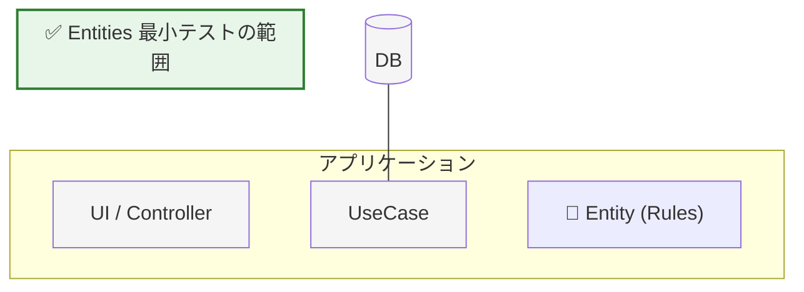

# 第13章：Entitiesの最小テスト（中心の安心感）🧪

この章はね、「アプリの中心（Entities）が壊れてない」って安心できる“最小の保険”を作る回だよ〜🥹🛡️✨
DBもHTTPもUIも関係なし！**純粋に“ルールだけ”**をテストして、サクッと速く回すのがコツ🏎️💨

---

## 1) この章でできるようになること🎯✨


* Entities（例：Task）が守るべき**ルール**を、テストで固定できる✅
* **最小のテスト本数**で「壊れたらすぐ気づく」状態にできる🔔
* テストが**遅くならない**＆**外側に引っ張られない**書き方がわかる🧼✨

---

## 2) “最小テスト”ってなに？🤏🧪


最小テスト＝**中心ルールの「壊れやすいところ」だけ押さえる**ことだよ😊

### ✅ テストするもの（Entitiesが責任を持つ）

* 不正な状態を作れない（例：空タイトル禁止）🚫
* 状態遷移のルール（例：二重完了は禁止）🔁🚫
* 自分の整形/正規化（例：trimして保存）✂️✨

### ❌ テストしないもの（外側の責任）

* DB保存できた？（Repositoryの責務）🗄️❌
* HTTP 400返る？（Controller/Presenterの責務）🌐❌
* UIの見た目（ViewModelの責務）🖼️❌





---

## 3) テスト基盤はどうする？（2026の選び方）⚙️🧩


### いま主流の候補✨

* **Vitest 4**：TypeScriptと相性よくて速い⚡（Vite >= 6 / Node >= 20 が条件）([vitest.dev][1])
* **Node組み込みテスト**：Node 20でテストランナーが安定版になって、依存ゼロでいける🧡（`node --test`）([nodejs.org][2])

この教材では、**書き心地が軽くて学習コスト低め**な **Vitest 4** で例を出すね🫶✨（Jest派ならJest 30でも考え方は同じだよ）([jestjs.io][3])

---

## 4) Entities（Task）の“テストしやすい形”に整える🧱✨


ポイントはこれ👇
**時間やランダムをEntityの中で勝手に作らない**こと！
→ テストが不安定になりがちだから、**引数で受け取る**のが気持ちいいよ⏰🧊

### 例：Task Entity（最小・依存ゼロ）🧠✅

```ts
// src/entities/taskErrors.ts
export class InvalidTitleError extends Error {
  override name = "InvalidTitleError";
}

export class AlreadyCompletedError extends Error {
  override name = "AlreadyCompletedError";
}
```

```ts
// src/entities/task.ts
import { AlreadyCompletedError, InvalidTitleError } from "./taskErrors";

type TaskProps = {
  id: string;
  title: string;
  completedAt: Date | null;
};

export class Task {
  readonly id: string;
  readonly title: string;
  readonly completedAt: Date | null;

  private constructor(props: TaskProps) {
    this.id = props.id;
    this.title = props.title;
    this.completedAt = props.completedAt;
  }

  static create(id: string, title: string): Task {
    const normalized = title.trim();

    if (normalized.length === 0) {
      throw new InvalidTitleError("title must not be empty");
    }
    if (normalized.length > 100) {
      throw new InvalidTitleError("title must be <= 100 chars");
    }

    return new Task({ id, title: normalized, completedAt: null });
  }

  get isCompleted(): boolean {
    return this.completedAt !== null;
  }

  complete(now: Date): Task {
    if (this.completedAt) {
      throw new AlreadyCompletedError("task already completed");
    }
    return new Task({ id: this.id, title: this.title, completedAt: now });
  }
}
```

---

## 5) Vitest 4で最小セットアップ（超短）⚡🧪

```bash
npm i -D vitest
```

`package.json` にテストコマンド追加👇

```json
{
  "scripts": {
    "test": "vitest",
    "test:watch": "vitest --watch"
  }
}
```

---

## 6) “最小テスト3本”でまず勝つ🥇🧪✨


**最初は3本でOK！** これだけで「中心が壊れたらすぐ気づく」状態になるよ😊🔔

### ✅ (1) 正常系：作れる＆正規化される

* `trim`されて保存されるか？✂️✨

### ✅ (2) 異常系：不正な作成は弾く

* 空タイトルは禁止🚫

### ✅ (3) 状態遷移：完了できる＆二重完了は弾く

* `complete` で `completedAt` が入る⏰
* 2回目は失敗する🔁🚫

```ts
// test/task.spec.ts
import { describe, it, expect } from "vitest";
import { Task } from "../src/entities/task";
import { AlreadyCompletedError, InvalidTitleError } from "../src/entities/taskErrors";

describe("Task Entity", () => {
  it("create: trims title and creates incomplete task ✂️", () => {
    const task = Task.create("t1", "  buy milk  ");

    expect(task.id).toBe("t1");
    expect(task.title).toBe("buy milk");
    expect(task.isCompleted).toBe(false);
    expect(task.completedAt).toBeNull();
  });

  it("create: rejects empty title 🚫", () => {
    expect(() => Task.create("t1", "   ")).toThrow(InvalidTitleError);
  });

  it("complete: sets completedAt, and rejects double complete ✅🔁🚫", () => {
    const task = Task.create("t1", "write tests");
    const fixedNow = new Date("2026-01-22T00:00:00.000Z");

    const completed = task.complete(fixedNow);

    expect(completed.isCompleted).toBe(true);
    expect(completed.completedAt?.toISOString()).toBe(fixedNow.toISOString());

    expect(() => completed.complete(fixedNow)).toThrow(AlreadyCompletedError);
  });
});
```

---

## 7) もうちょい強くしたい時の“追加観点5つ”🧠🧪✨

必要になったら、ここから足していけばOKだよ〜😊🌱

1. **境界値**：タイトル100文字OK / 101文字NG✍️📏
2. **不変条件**：完了しても `id` と `title` は変わらない🧷
3. **正規化ルール**：連続スペースはどうする？（仕様で決める）🧼
4. **例外メッセージ**：変換表（HTTP等）で使うなら固定🧾
5. **戻り値の方針**：ミューテートせず新インスタンスを返す（今回の形）🔁✨

---

## 8) よくある事故🚑💥（回避策つき）

* **Entity内で `new Date()` しちゃう** → テストがフワつく🥲
  👉 今回みたいに `complete(now)` にするのが安定💎
* **Entityが外部ライブラリをimport** → 依存ゼロ監査でアウト👀❌
  👉 Entitiesは“標準だけ”で生きるのが勝ち✨
* **細かい内部実装に依存したテスト** → リファクタでテストが壊れる🧨
  👉 **外から見える振る舞い**だけ見るのが正義😎✅

---

## 9) AI相棒🤖✨ コピペ用プロンプト集📋

### テスト観点を増やしたい時

```text
Task Entityのルール（create/complete）に対して、
壊れやすい観点を優先して、追加テストケースを10個提案して。
境界値・異常系・状態遷移をバランスよく。
```

### 仕様を詰めたい時（正規化）

```text
titleの正規化ルールを決めたい。
trim以外に「連続スペース」「全角空白」「改行」などはどう扱うべき？
初心者向けに、決め方とおすすめ案を出して。
```

### 失敗型（エラー）を整えたい時

```text
InvalidTitleError / AlreadyCompletedError を
外側で変換しやすい形（コード/種別/メッセージ）にしたい。
初心者向けに、型（union）案とErrorクラス案を比較して提案して。
```

---

## 10) 理解チェック✅💖（1問だけ！）

**Q：Entitiesのテストで“やっちゃダメ”なのはどれ？**😆
A. タイトル空を弾くテスト
B. 二重完了を弾くテスト
C. SQLiteに保存できるテスト
D. trimされるテスト

👉 正解：**C**（それは外側の責務〜！🗄️❌）

---

## 11) 提出物（成果物）📦✨

* `Task` Entity（create/complete）🧱
* テスト3本（上の3本）🧪
* 追加で1本：**100文字OK/101文字NG**の境界値テスト📏✨

---

次の章（第14章）に進むと、Use Case Interactor側で「このEntityをどう呼ぶか」って流れが気持ちよく繋がるよ〜🎬✨
「境界値テストも一緒に書いた版」まで完成させたら、めっちゃ強い中心になる🥹🛡️💖

[1]: https://vitest.dev/guide/?utm_source=chatgpt.com "Getting Started | Guide"
[2]: https://nodejs.org/pt-br/blog/announcements/v20-release-announce?utm_source=chatgpt.com "Node.js 20 is now available!"
[3]: https://jestjs.io/versions?utm_source=chatgpt.com "Jest Versions"
