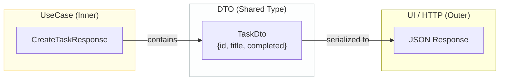

# 第16章：Output Boundary：Response設計📤

この章、めちゃ大事だよ〜！😊
ここで **「UseCaseが外側（UI/HTTP）に引っ張られない」** のを守れるようになる✨

---

## この章のゴール🎯💖

* UseCaseの戻り値（Response）を **“内側基準”** で設計できるようになる📦✨
* **HTTPの都合**（status code / JSON整形 / 表示文言）を、UseCaseから追い出せる🚪💨
* 後でUIが変わっても、UseCaseが壊れない状態を作れる🔁🛡️

---

## まず結論：Responseって何？🤔📦


**Response = UseCaseの“処理結果のレポート”** だよ📝✨
ポイントはこれ👇

* ✅ **UseCaseが「何を成し遂げたか」** を表す
* ✅ **表示に必要な“素材”** は返す（でも表示の仕方は返さない）
* ❌ 「ボタン文言」や「日付フォーマット済み文字列」みたいな **UI都合は入れない**
* ❌ `req` / `res` みたいな **HTTPのオブジェクトは絶対入れない**

---

## “やっちゃダメResponse”あるある😇💥


### ❶ HTTPレスポンスそのものを返しちゃう

* ❌ `return { status: 201, json: {...} }`
* → UseCaseがWebに縛られる🌐⛓️

### ❷ DBレコードそのまま返す

* ❌ `return rows`（SQLの列名そのまま）
* → DBの列変更でUseCase壊れる🧨

### ❸ 画面専用の形（ViewModel）を返す

* ❌ `displayTitle: "✅ " + title`
* → UI変更でUseCase巻き込まれる🎨💥

---

## “良いResponse”の条件✅✨（これだけ覚えよ🧠💗）

Responseはだいたいこう作ると勝ち✌️

1. **UseCaseの目的が1行で説明できる** 形になってる🎯
2. **シリアライズ可能な“素朴なデータ”** になってる（object / array / string / number / boolean）📦
3. **readonly（不変っぽく）** にする（外側が勝手に書き換えない）🔒
4. **内側の言葉**（Task / Completed など）で表す📖
5. **フォーマットしない**（表示用の加工は後で）🧼





---

## 今回のミニTaskアプリで、Responseはこうする🗒️✨

扱うUseCaseはこの3つだよね👇

* Create / Complete / List 🧩

Response設計のコツは **「UIが欲しい最小の素材」** を返すこと😊
でも **UI都合の加工はしない**！

---

## Response用のDTO（出力用データ）を作ろう📦✨


「EntityのTask」をそのまま返すより、**Response専用の薄いDTO** を作ると安全だよ🛡️
（外側に “Entityのメソッド” とか “内部構造” を漏らしにくい）

### まずは一覧にも使える `TaskDto` を定義🧱

```ts
// usecases/dto/TaskDto.ts
export type TaskDto = Readonly<{
  id: string;
  title: string;
  completed: boolean;
}>;
```

> ✨ `Readonly<...>` にしておくと「外側が雑に書き換える事故」を減らせるよ🔒

---

## CreateTaskResponse 設計例➕📝


UseCaseがやったことは「タスクを作った」だよね😊
だから Response はこう👇

```ts
// usecases/create-task/CreateTaskResponse.ts
import type { TaskDto } from "../dto/TaskDto";

export type CreateTaskResponse = Readonly<{
  task: TaskDto;
}>;
```

### ここでの感覚💡

* ✅ `task.id` はUIでも必要（次の操作に使う）🆔
* ✅ `completed` は初期状態なので返してOK（でもUI用の文言は作らない）👌
* ❌ `message: "作成しました！"` みたいなのは入れない（表示側の仕事）🙅‍♀️

---

## CompleteTaskResponse 設計例✅🔁

「完了にした結果、どうなった？」が伝わればOK😊

```ts
// usecases/complete-task/CompleteTaskResponse.ts
import type { TaskDto } from "../dto/TaskDto";

export type CompleteTaskResponse = Readonly<{
  task: TaskDto;
}>;
```

> 「完了できたよ」だけなら `ok: true` でもいいけど、UIは更新対象が欲しいこと多いから `task` を返すのが扱いやすいよ✨

---

## ListTasksResponse 設計例👀📚

一覧は「並べる材料」が必要だね😊

```ts
// usecases/list-tasks/ListTasksResponse.ts
import type { TaskDto } from "../dto/TaskDto";

export type ListTasksResponse = Readonly<{
  items: readonly TaskDto[];
  total: number;
}>;
```

### `total` を入れる理由🧠✨

* ページングしたくなったり📄
* “件数表示”したくなったり🔢
* 後で拡張しやすい🌱

---

## UseCase実装側は「Responseを組み立てるだけ」🍳📦


例：CreateTaskInteractor（ざっくりイメージ）

```ts
// usecases/create-task/CreateTaskInteractor.ts
import type { CreateTaskRequest } from "./CreateTaskRequest";
import type { CreateTaskResponse } from "./CreateTaskResponse";
import type { TaskRepositoryPort } from "../ports/TaskRepositoryPort";
import { Task } from "../../entities/Task";

export class CreateTaskInteractor {
  constructor(private readonly repo: TaskRepositoryPort) {}

  async execute(req: CreateTaskRequest): Promise<CreateTaskResponse> {
    const task = Task.create(req.id, req.title); // ※Entityの作り方は前の章の想定
    await this.repo.save(task);

    return {
      task: {
        id: task.id.value,
        title: task.title.value,
        completed: task.completed,
      },
    };
  }
}
```

この形がめっちゃ大事で👇
UseCaseは **「表示どうする？」を考えない** のが勝ち！🎉😌

---

## Response設計の“境界”チェックリスト🧼🛡️


Response作ったら、これでセルフ監査してね👀✅

* [ ] `req` / `res` / `Request` / `Response`（HTTPのやつ）が混ざってない？🌐❌
* [ ] SQLの列名・DB用語（row/column/table）が混ざってない？🗃️❌
* [ ] 画面専用の加工（表示文言、日付整形、絵文字入りタイトル）が混ざってない？🎨❌
* [ ] 返すデータが **UseCaseの目的** を説明できてる？🎯✅
* [ ] 外側が勝手に書き換えたくなる構造になってない？（できればreadonly）🔒✅

---

## ちょい最新トピック（開発体験の前提）🆕✨

この教材のTypeScriptは **現行の最新版（5.9）** を基準に考えるよ🧠✨（インストール手順ページでも最新版が 5.9 と案内されてる）([typescriptlang.org][1])
Node.js も LTS 系が更新されていて、**24系LTSのセキュリティリリース（24.13.0）が 2026-01-13 に出てる** ので、日々の更新は意識しておくと安心だよ🔐✨ ([nodejs.org][2])
テストは軽量派なら Vitest が 4.0 を出していて、TypeScriptとの相性も良いよ🧪⚡ ([vitest.dev][3])

---

## 理解チェック問題🎓💡（1問だけ！）

次のうち、**Responseに入れてOK**なのはどれ？（複数可）😊

A. `httpStatus: 201`
B. `taskId: string`
C. `displayTitle: "✅ " + title`
D. `total: number`

---

## 提出物（成果物）📦✨

* `TaskDto`
* `CreateTaskResponse`
* `CompleteTaskResponse`
* `ListTasksResponse`

この4つを作れたら、この章は合格〜〜〜！🎉🎀

---

## AI相棒プロンプト（コピペ用）🤖✨

```text
UseCaseのResponseモデルを設計して。
条件：
- UI都合の加工（表示文言、日付文字列化など）は入れない
- HTTP/DBの型や用語は入れない
- “UseCaseが成し遂げたこと”が分かる最小のデータにする
対象：
- CreateTask / CompleteTask / ListTasks
```

---

次の第17章は「UseCaseが依存するのはPortだけ🔌」で、さらに“外側断ち”が進むよ〜😊✨

[1]: https://www.typescriptlang.org/download/?utm_source=chatgpt.com "How to set up TypeScript"
[2]: https://nodejs.org/en/blog/release/v24.13.0?utm_source=chatgpt.com "Node.js 24.13.0 (LTS)"
[3]: https://vitest.dev/blog/vitest-4?utm_source=chatgpt.com "Vitest 4.0 is out!"
