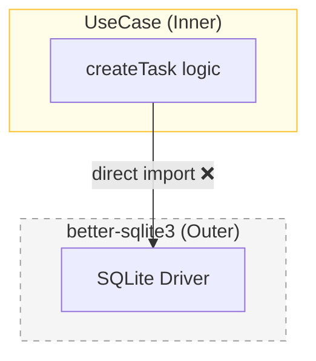
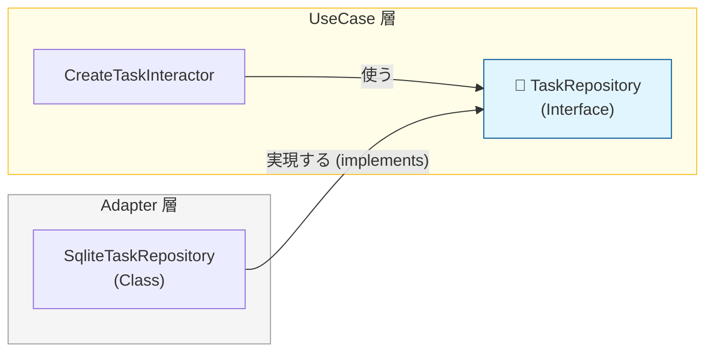

# 第17章：UseCaseが依存するのはPortだけ🔌

この章はね、「UseCaseがDBやHTTPに“直で触らない”」を体に入れる回だよ〜😊
これができると、クリーンアーキの強さ（差し替え・テスト・変更耐性）が一気に出てくる💪✨

ちなみに、現時点のTypeScriptは npm の最新版が **5.9.3** だよ🧡 ([npm][1])

---

## この章のゴール🎯

* UseCaseが **具体物（DB/HTTP/外部SDK）をimportしない** で書ける✨
* UseCaseが依存するのは **Port（インターフェース）だけ** にできる✨
* 「何がPortで、何がAdapterか」を言葉にできる😊

---

## 2) “事故る例”を見よう💥（やりがち）





UseCase内でDBドライバを直接触ると、設計が一気に崩れる😇

```ts
// ❌ 悪い例：UseCaseがDBドライバを直接importしてる
import Database from "better-sqlite3";

export async function createTask(title: string) {
  const db = new Database("app.db");
  db.prepare("insert into tasks(title) values (?)").run(title);
  return { ok: true };
}
```

これ、何がツラいかっていうと…👇

* UseCaseのテストが「DB必須」になって遅い＆面倒😵‍💫
* DB変更（SQLite→別DB）で UseCase のコードが書き換わる😢
* 依存の向きが壊れて、中心が外側に引っ張られる🌀

---

## Portってなに？🔌（UseCaseが欲しい“能力”）

Portは「UseCaseがやりたいことのために必要な能力」を **型（interface）で表したもの**だよ😊

例：CreateTaskなら…

* タスクを保存したい → `TaskRepository`
* IDが欲しい → `IdGenerator`
* 作成日時が欲しい → `Clock`





ポイントはこれ👇
✅ **UseCaseがほしい言葉でPortを作る**（DB都合の言葉にしない）
✅ **UseCaseはPortにだけ依存する**（実装は外側に逃がす）

---

## Taskアプリで「必要なPort」を洗い出す📝✨

この章（17）では、まず「UseCaseに必要なPort」を確定するよ😊

### Create / Complete / List の3つで考える🗒️


* Create：保存（save）＋ID＋現在時刻
* Complete：取得（find）＋保存（save）
* List：一覧取得（list）

→ つまり、だいたいこんなPortが必要になる👇

---

## Port定義を書こう✍️（UseCaseから見たインターフェース）

### 1) TaskRepository Port🗄️


```ts
// src/ports/taskRepository.ts
import type { Task } from "../entities/task";
import type { TaskId } from "../entities/taskId";

export interface TaskRepository {
  save(task: Task): Promise<void>;
  findById(id: TaskId): Promise<Task | null>;
  list(): Promise<Task[]>;
}
```

### 2) IdGenerator Port🆔

```ts
// src/ports/idGenerator.ts
import type { TaskId } from "../entities/taskId";

export interface IdGenerator {
  newTaskId(): TaskId;
}
```

### 3) Clock Port⏰


```ts
// src/ports/clock.ts
export interface Clock {
  now(): Date;
}
```

> ここでは `Date` をそのまま使ってOK🙆‍♀️（後で「ドメイン的な時間」にしたくなったら育てればOK🌱）

---

## UseCaseは「Portだけ」使って書く✅✨

### CreateTaskInteractor（Port注入バージョン）

```ts
// src/usecases/createTask/createTaskInteractor.ts
import type { TaskRepository } from "../../ports/taskRepository";
import type { IdGenerator } from "../../ports/idGenerator";
import type { Clock } from "../../ports/clock";

import { Task } from "../../entities/task";
import type { CreateTaskRequest } from "./createTaskRequest";
import type { CreateTaskResponse } from "./createTaskResponse";

export class CreateTaskInteractor {
  constructor(
    private readonly repo: TaskRepository,
    private readonly ids: IdGenerator,
    private readonly clock: Clock,
  ) {}

  async execute(req: CreateTaskRequest): Promise<CreateTaskResponse> {
    const id = this.ids.newTaskId();
    const now = this.clock.now();

    const task = Task.create({ id, title: req.title, createdAt: now });

    await this.repo.save(task);

    return { taskId: task.id };
  }
}
```

ここが最高に大事🥰👇
✅ UseCaseは **DBもHTTPも知らない**
✅ 依存してるのは **Port（型）だけ**
✅ だから外側を差し替えても中心が無傷🎉

---

## 「でもTypeScriptのinterfaceって実体ないよね？」🤔➡️OK！


そう！`interface` は実行時には消えるよ😊
でもDI（注入）は「実体（class/obj）を渡す」だけでOK✨

```ts
// 例：Composition Root（後の章で本格的にやるやつ）
const repo: TaskRepository = new InMemoryTaskRepository();
const ids: IdGenerator = new RandomIdGenerator();
const clock: Clock = new SystemClock();

const usecase = new CreateTaskInteractor(repo, ids, clock);
```

---

## 依存が守れてるか？チェックリスト✅🧼


UseCases層のファイルを開いて、これが守れてたら勝ち🎉

* ✅ `src/usecases/**` に **DBライブラリのimportが無い**
* ✅ `src/usecases/**` に **Webフレームワークのimportが無い**
* ✅ `src/usecases/**` に **env直読み（process.env等）が無い**
* ✅ UseCaseのコンストラクタ引数が **Portだけ** になってる
* ✅ 「保存したい/取得したい」は **Portで表現** できてる

---

## tsconfigの小ネタ（今どき）🧩✨

TypeScript 5.8/5.9 では、Node向けの安定した設定として `--module node18` / `--module node20` が用意されてるよ🙂
`node20` は「nodenextみたいに挙動がふらつきにくい安定ポイント」って位置づけ🌟 ([Microsoft for Developers][2])

---

## ミニ演習（手を動かすと理解が爆速）🏃‍♀️💨

### 演習1：悪い例をPort化して救出🧯


* UseCaseからDB import を消す
* `TaskRepository` を作って注入する
* DBアクセス部分は Adapter 側へ移動（この章は“移動する”だけでOK）

### 演習2：「時間」を直参照しない⏰

* `new Date()` をUseCaseから消す
* `Clock` に置き換える

---

## AI相棒🤖✨（コピペで使える）

### Port洗い出し

* **「CreateTask/CompleteTask/ListTasksに必要なPortを列挙して。命名は“業務寄り”で。各Portの最小メソッドも提案して」**

### UseCaseの依存監査

* **「このUseCaseのimport一覧を見て、クリーンアーキ的にNGな依存があれば指摘して。代わりにPortにする案も出して」**

### Portのスリム化

* **「このRepository interface、肥大化しそう。最小メソッドに削る提案をして。削る理由も」**

---

## 次の章につながるよ📌😊

この章（17）で「UseCaseはPortだけ」を固めたら、次（18）で **CreateTaskを“ちゃんと実装して動かす”** とこに入れる✨
ここまでできると、クリーンアーキが一気に“気持ちよく”なるよ〜〜🥳🎉

[1]: https://www.npmjs.com/package/typescript?utm_source=chatgpt.com "TypeScript"
[2]: https://devblogs.microsoft.com/typescript/announcing-typescript-5-9/?utm_source=chatgpt.com "Announcing TypeScript 5.9"
