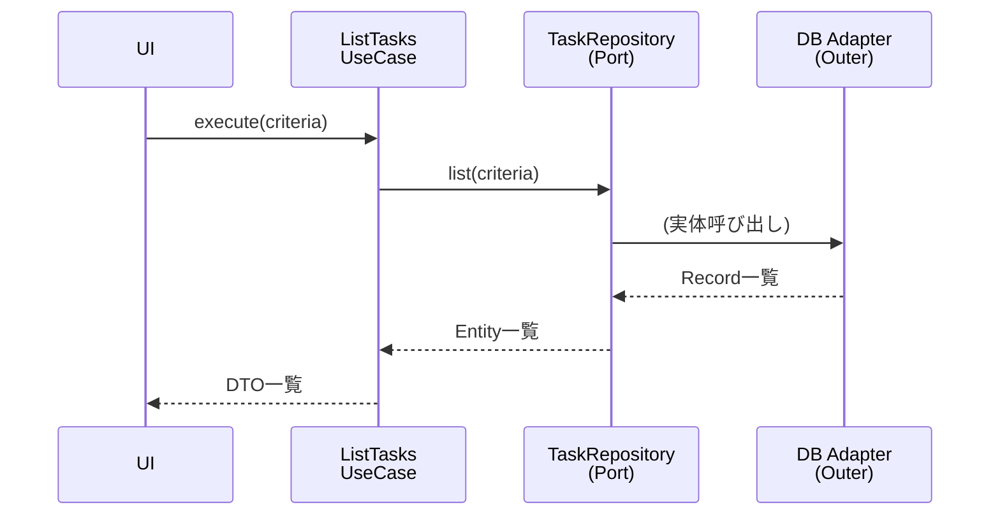

# 第20章：ListTasksを実装（参照系の基本形）👀✅

この章では「一覧を返す」っていう **Query（参照）系ユースケース**の基本形を、クリーンアーキの型どおりに作るよ〜🧁✨
Create/Completeみたいな **Command（更新）系**と違って、Listは「読むだけ」なのがポイントだよ👓💕

---

## 0) いまどきツール事情メモ🧰✨（超さらっと）

* TypeScript の安定版は **5.9.3** が `latest` だよ🧡 ([npm][1])
* Node は **v24 系が Active LTS**で、2026-01 のセキュリティ更新も出てるよ🔐 ([Node.js][2])
* テスト章では Vitest 4 系が主流ラインになってる感じ（4.0告知あり）🧪 ([vitest.dev][3])

---

## 1) List（参照系）ユースケースの“守るべき型”🧠✨

ListTasks は **データを読むだけ**だから、次の方針を守るとキレイだよ😊

* ✅ **副作用ゼロ**（保存しない・更新しない・ログも最小に）🫧
* ✅ **外側の都合を返さない**（SQL行/HTTPレスポンスを返さない）🙅‍♀️
* ✅ **UseCaseはPortだけを見る**（DBのことは知らない）🔌
* ✅ **並び替えやフィルタは“要件として”扱う**（なんとなく sort しない）📌





---

## 2) まず仕様を1行で決める📝✨

今回はミニアプリだから、最小でOKだよ🙆‍♀️

* **「タスクを条件（任意）で絞って一覧を返す」**📋

条件は最初はなくてもいいけど、教材としては `status` くらいあると学びが増えるよ〜🍓

* `status: "all" | "active" | "completed"`（省略時 `"all"`）✅

---

## 3) Request / Response を作る（境界の箱）📦✨

### 3.1 Request（入力）📥


「UIでどう入力されたか」は気にしないで、**内側に都合のいい形**にするよ😊

```ts
// usecases/listTasks/ListTasksRequest.ts
export type TaskStatusFilter = "all" | "active" | "completed";

export type ListTasksRequest = Readonly<{
  status?: TaskStatusFilter; // 省略OK（= all）
}>;
```

### 3.2 Response（出力）📤


ここで悩みがちポイント👇
Entity（Task）をそのまま返してもいいけど、**一覧はDTOで返す**ほうが後で困りにくいよ🧁
（UIが Entity を勝手にいじる事故も防げる✨）

```ts
// usecases/listTasks/ListTasksResponse.ts
export type TaskListItemDto = Readonly<{
  id: string;
  title: string;
  completed: boolean;
}>;

export type ListTasksResponse = Readonly<{
  tasks: ReadonlyArray<TaskListItemDto>;
  total: number;
}>;
```

---

## 4) Port（TaskRepository）に “list能力” を足す🔌✨


UseCaseが欲しいのは「保存」じゃなくて「一覧を取る能力」だよ〜📋

```ts
// usecases/ports/TaskRepository.ts
import { Task } from "../../entities/Task";
import { TaskStatusFilter } from "../listTasks/ListTasksRequest";

export type ListTasksCriteria = Readonly<{
  status: TaskStatusFilter; // all / active / completed
}>;

export interface TaskRepository {
  // すでにある想定：save / findById など…

  list(criteria: ListTasksCriteria): Promise<ReadonlyArray<Task>>;
}
```

### 💡ポイント

* `listAll()` でもOKだけど、あとから条件が増えたときに破綻しやすいから `criteria` 方式がきれい🧼✨
* `ReadonlyArray` にして「UseCase側で並べ替えの破壊的操作」をしにくくするのも地味に効くよ🛡️

---

## 5) ListTasksInteractor を実装する🎬✨（本体）


やることは超シンプルだよ〜😊
**repo.list → DTOに変換 → Responseで返す** だけ！

```ts
// usecases/listTasks/ListTasksInteractor.ts
import { TaskRepository } from "../ports/TaskRepository";
import { ListTasksRequest } from "./ListTasksRequest";
import { ListTasksResponse, TaskListItemDto } from "./ListTasksResponse";
import { Task } from "../../entities/Task";

export class ListTasksInteractor {
  constructor(private readonly repo: TaskRepository) {}

  async execute(request: ListTasksRequest): Promise<ListTasksResponse> {
    const status = request.status ?? "all";

    const tasks = await this.repo.list({ status });

    // Entity -> DTO（一覧用の形）
    const items: TaskListItemDto[] = tasks.map(toListItemDto);

    return {
      tasks: items,
      total: items.length,
    };
  }
}

function toListItemDto(task: Task): TaskListItemDto {
  return {
    id: task.id,
    title: task.title,
    completed: task.completed,
  };
}
```

### ✅ここが「クリーン」な理由🌼

* UseCaseは **DB/HTTP/UIのことを一切知らない**🙅‍♀️
* 返す形は **内側基準**（DTO）で固定📦
* 依存は `TaskRepository`（Port）だけ🔌

---

## 6) よくある落とし穴 🕳️😵‍💫（先に潰そ！）

### ❌ 1) UseCaseで sort() してしまう

`Array.prototype.sort()` は **破壊的**だよ⚠️
もし並び替えが要件なら、どこでやるかを決めよう👇

* 「常に作成順で返す」が要件 → **Repositoryが保証**（listがその順で返す）
* UI都合で並び替えたい → **Presenter/ViewModel側**でやる

### ❌ 2) DB行（record）をそのまま返す

「外側の形」が内側に入ると、変更で一気に崩れるよ〜🥲
Repositoryの中で **Record→Entity** にしてから返そう（MapperはAdapter側）🧼

### ❌ 3) “ついでに” 完了期限チェックして更新する


Listは「読むだけ」！
参照のついで更新は、あとで地獄を見るやつ😇（キャッシュや整合性が壊れる）

---

## 7) ちょい拡張（できたら強い）💪✨


次の章に進む前に、Listを “現実寄り” にしておくと楽しいよ🍰

* 🔎 `keyword?: string`（タイトル部分一致）
* 📄 `limit/offset`（ページング）
* 🧭 `sort: "createdAtDesc" | "createdAtAsc"`（ただし要件として！）

全部いきなり入れなくてOK🙆‍♀️
まずは `status` だけで十分えらい👏💕

---

## 8) 提出物（この章のゴール）🎁✨

* `ListTasksRequest / Response` がある
* `TaskRepository.list(criteria)` がある
* `ListTasksInteractor.execute()` が DTO を返す
* UseCase層に **SQL/HTTP/フレームワークのimportが無い**✅

---

## 9) 理解チェック（1問）🧠💡

**Q. ListTasksInteractor が “TaskEntityそのもの” を返すのはダメ？**
→ ダメじゃないけど、**UIがEntityに依存して壊しやすい**から、一覧はDTOが安全寄りだよ🍀
（どっちでも“方針を決めて統一”が大事！）

---

## 10) AI相棒プロンプト（コピペ用）🤖✨

### Port設計を点検してもらう🔌

```text
TaskRepository に list(criteria) を追加したいです。
クリーンアーキ視点で、criteria設計（status/filter/sort/paging）の最小構成案を3パターン提案して。
それぞれのメリット/デメリットも短く。
```

### ListTasksのDTO設計を作ってもらう📦

```text
ListTasksResponse のDTOを設計したいです。
UIに依存しすぎない範囲で、一覧に必要な項目を提案して。
「最小」「現実的」「拡張前提」の3案で。
```

---

次の章（21章）で「失敗（エラー）を境界で扱う」をやると、ListTasksもさらに強くなるよ〜⚠️➡️🚧✨

[1]: https://www.npmjs.com/package/typescript?utm_source=chatgpt.com "TypeScript"
[2]: https://nodejs.org/en/about/previous-releases?utm_source=chatgpt.com "Node.js Releases"
[3]: https://vitest.dev/blog/vitest-4?utm_source=chatgpt.com "Vitest 4.0 is out!"
