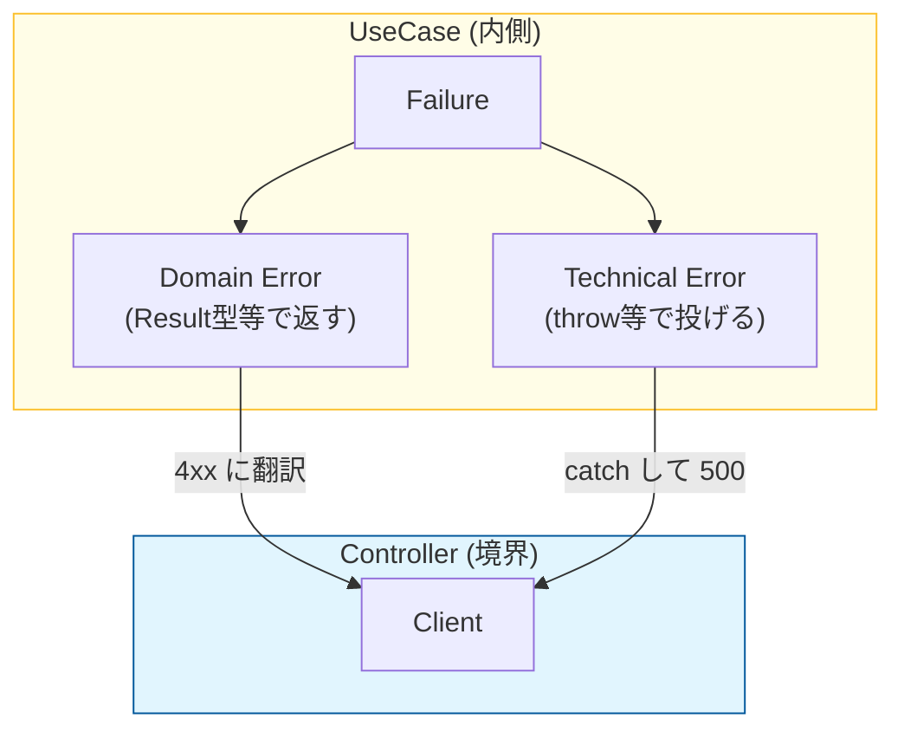

# 第21章：UseCaseの失敗を“境界で扱う”設計にする⚠️➡️🚧

この章はね、**「失敗の扱いがキレイだと、クリーンアーキが急に“ラク”になる」**って体験を作る回だよ〜🥳✨
（最近のTypeScriptは **5.9系**が安定版として出ていて、さらに先ではツール周りの大きな高速化（ネイティブ化）も進んでる流れだから、**型で失敗を扱う**のはますます効いてくるよ🤖⚡） ([Microsoft for Developers][1])

---

## 1) 今日のゴール🎯✨

* UseCaseが返す「成功/失敗」の形を **統一**できる👍
* 失敗の理由を **型で表せる**（switchが網羅できる）🧠🔍
* HTTPやUIの都合（ステータスコード/文言）を **UseCaseに混ぜない**🚫🌐

---

## 2) なんで「境界で扱う」の？🤔🚧

### ❌ よくある事故

UseCaseがこういうのを返し始める👇

* `return { status: 400, message: "タイトル短すぎ" }`
* `throw new Error("DB接続できない")` をそのまま上に投げる

これ、**UseCaseが外側（HTTP/UI/DB）の都合**に引っ張られて、あとで変更が来た時に崩れやすいの🥲💥
なので…

### ✅ ルール

* UseCaseは **「内側の言葉」で成功/失敗を返す**📦✨
* **変換（HTTPステータス/画面メッセージ）**は境界（Controller/Presenter）でやる🎨🚪

---

## 3) 失敗は2種類に分けるのがコツ✌️⚠️





### ① ドメイン失敗（業務ルールの失敗）📕

例：

* `InvalidTitle`（タイトルが空/短すぎ）
* `TaskNotFound`
* `AlreadyCompleted`

👉 これは **仕様として起こり得る**失敗。**型で表してOK**😺✅

### ② 技術失敗（インフラ・例外）⚙️

例：

* DBが落ちてる
* ファイル壊れてる
* ネットワーク不調

👉 これは **仕様じゃない**（起きてほしくない）ので、
UseCase内では **握りつぶさず**、境界でログ・リトライ・500化などを決めたい💪🔥

---

## 4) おすすめの形：Result型（判別可能ユニオン）🧩✨

TypeScriptは **ユニオン型**と**絞り込み（narrowing）**が強いから、`Result`にするとめっちゃ気持ちいいよ🫶
（判別可能ユニオンは「タグ付き」で安全に分岐できるやつだよ〜） ([TypeScript][2])

### Resultの最小形（これがテンプレになるよ）🧰✨

```ts
// usecases/shared/result.ts
export type Ok<T> = { ok: true; value: T };
export type Err<E> = { ok: false; error: E };
export type Result<T, E> = Ok<T> | Err<E>;

export const ok = <T>(value: T): Ok<T> => ({ ok: true, value });
export const err = <E>(error: E): Err<E> => ({ ok: false, error });

// switch網羅に使う（地味に超便利🥹✨）
export const assertNever = (x: never): never => {
  throw new Error(`Unexpected object: ${String(x)}`);
};
```

---

## 5) Taskアプリに当てはめる：UseCaseエラー設計💡🗒️

### ✅ エラーは “タグ付き” にする（判別が楽！）🏷️

```ts
// usecases/errors/taskUseCaseError.ts
export type CreateTaskError =
  | { type: "InvalidTitle"; reason: "empty" | "too_short" }
  | { type: "DuplicateTitle" }; // 例：同名禁止ルールがある場合

export type CompleteTaskError =
  | { type: "TaskNotFound"; taskId: string }
  | { type: "AlreadyCompleted"; taskId: string };
```

ポイントはこれ👇✨

* `type` が “しるし” になるから、switchで安全に分岐できる👍
* HTTPステータスとか文言は **まだ入れない**🙅‍♀️（それは境界の仕事！）

---

## 6) CreateTask UseCaseの例（成功/失敗をResultで統一）✅⚠️

```ts
// usecases/createTask/createTask.ts
import { Result, ok, err } from "../shared/result";
import { CreateTaskError } from "../errors/taskUseCaseError";

export type CreateTaskRequest = { title: string };
export type CreateTaskResponse = { taskId: string };

export interface TaskRepositoryPort {
  existsByTitle(title: string): Promise<boolean>;
  save(task: { id: string; title: string; completed: boolean }): Promise<void>;
}

export interface IdGeneratorPort {
  newId(): string;
}

export class CreateTaskInteractor {
  constructor(
    private readonly repo: TaskRepositoryPort,
    private readonly idGen: IdGeneratorPort
  ) {}

  async execute(req: CreateTaskRequest): Promise<Result<CreateTaskResponse, CreateTaskError>> {
    const title = req.title.trim();

    if (title.length === 0) {
      return err({ type: "InvalidTitle", reason: "empty" });
    }
    if (title.length < 3) {
      return err({ type: "InvalidTitle", reason: "too_short" });
    }

    // ドメインルール（例：同名禁止）
    if (await this.repo.existsByTitle(title)) {
      return err({ type: "DuplicateTitle" });
    }

    const id = this.idGen.newId();
    await this.repo.save({ id, title, completed: false });

    return ok({ taskId: id });
  }
}
```

### ここが大事〜〜〜🥹💖

* **仕様として起こる失敗**（InvalidTitle/DuplicateTitle）は `err(...)` で返す
* DBが落ちた、みたいな **技術失敗**は `await repo.save()` が例外を投げるかもしれない

  * それは **境界でcatchして500にする**、みたいに扱う（UseCaseにHTTPの話を混ぜない）🚧🌐

---

## 7) 境界（Controller/Presenter）で “外側表現” に変換する🎨🚪

「第34章：エラー変換」で本格的にやるんだけど、**この章のミニ版**を見せるね😉✨

```ts
// adapters/http/mapError.ts
import { CreateTaskError } from "../../usecases/errors/taskUseCaseError";
import { assertNever } from "../../usecases/shared/result";

export const mapCreateTaskErrorToHttp = (e: CreateTaskError) => {
  switch (e.type) {
    case "InvalidTitle":
      return { status: 400, body: { message: e.reason === "empty" ? "タイトルを入れてね😊" : "タイトルは3文字以上だよ😊" } };
    case "DuplicateTitle":
      return { status: 409, body: { message: "同じタイトルは使えないよ〜😵‍💫" } };
    default:
      return assertNever(e);
  }
};
```

✅ UseCaseは **内側の言葉**だけ
✅ HTTPの都合（400/409、表示文言）は **外側の責務**
この分離ができると、UIがReactでもCLIでも、APIでも、同じUseCaseを使い回せるよ〜〜〜🎉✨

---

## 8) テストが超ラクになる🧪🎀（境界を作らずに検証OK）

```ts
// usecases/createTask/createTask.test.ts（例：Vitest想定の雰囲気）
import { CreateTaskInteractor } from "./createTask";
import { ok, err } from "../shared/result";

test("titleが空ならInvalidTitle", async () => {
  const repo = {
    existsByTitle: async () => false,
    save: async () => {},
  };
  const idGen = { newId: () => "id-1" };

  const uc = new CreateTaskInteractor(repo, idGen);
  const result = await uc.execute({ title: "   " });

  expect(result.ok).toBe(false);
  if (!result.ok) {
    expect(result.error.type).toBe("InvalidTitle");
  }
});
```

* 画面もHTTPも起動しない
* Port差し替えだけでOK
  これ、**クリーンアーキの快感ポイント**だよ😇💕

---

## 9) この章のチェックリスト✅📝

* [ ] UseCaseが `statusCode` や `HTTP` という単語を知らない
* [ ] UseCaseの戻り値が **成功/失敗で統一**されている（Resultなど）
* [ ] ドメイン失敗は **タグ付き**（`type: "..."`）でswitch網羅できる
* [ ] 外側表現（文言/コード/ログ方針）は境界で決めている

---

## 10) ミニ課題（提出物）📦✨

### 課題A🎯

`CompleteTaskInteractor` も同じ方針で作ってみよう💪✅

* 失敗：`TaskNotFound` / `AlreadyCompleted` を `Result` で返す

### 提出物📦

* `usecases/shared/result.ts`
* `usecases/errors/taskUseCaseError.ts`
* `usecases/createTask/createTask.ts`
* `adapters/http/mapError.ts`（ミニ版でOK）

---

## 11) 🤖AI相棒プロンプト（コピペ用）✨

* 「TypeScriptで `Result<T,E>` を判別可能ユニオンで定義して。`assertNever` も付けて」
* 「CreateTaskの仕様：空はNG、3文字未満NG、同名NG。UseCaseはHTTPを知らない設計で `Result` を返して」
* 「CreateTaskError を `type` タグ付きユニオンで設計して。switchで網羅できる形にして」
* 「Controller側で CreateTaskError → HTTP (400/409) に変換する関数を作って。UseCaseにHTTPを持ち込まないで」

---

必要なら次は、第21章の内容をベースにして、**CompleteTask版**も同じ粒度で一緒に作るよ〜🥰✅✨

[1]: https://devblogs.microsoft.com/typescript/announcing-typescript-5-9/ "Announcing TypeScript 5.9 - TypeScript"
[2]: https://www.typescriptlang.org/docs/handbook/unions-and-intersections.html?utm_source=chatgpt.com "Handbook - Unions and Intersection Types"
