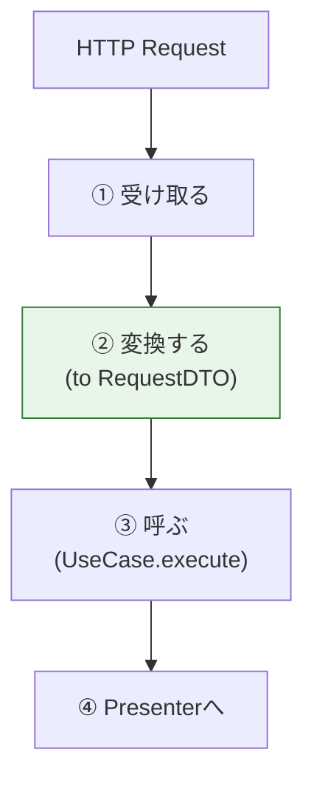

# 第30章：Inbound Adapter（Controller）は責務3つだけ🧻

この章では「Controller（入口のAdapter）」を、**薄く・安全に・増やしやすく**作るコツを身につけるよ〜！🥳🎀
（次章で入力変換、さらに次でPresenterをしっかり作るから、今日は“骨格”を完成させる感じ🦴✨）

---

## 0. いまどき周辺事情を1分だけ⏱️🧠

* TypeScriptは **5.9 系**が安定版として参照されていて、公式の5.9リリースノートも更新され続けてるよ📘✨ ([TypeScript][1])
* Node.jsは **v24 が Active LTS**として運用の軸になってる（2026-01時点の更新も出てる）🟩([Node.js][2])
* Expressは **v5 が正式リリース済み**で、5.x の更新も継続中だよ🚂 ([expressjs.com][3])

この章の設計はフレームワークに依存しないけど、**“現役の前提”で安心して進められる**ってことね😊💕

---

## 1. Controllerって何する人？👀💡

Controllerは、クリーンアーキの「Interface Adapters」側にある **“入口の変換係”**だよ🚪🔁

外側（HTTPとかUIとか）から来たものを、内側（UseCase）が食べられる形にして渡す🥪✨
内側の結果を、外側が欲しい形にして返す（これは次のPresenterが主役🎨）

---

## 2. Controllerの責務は「3つだけ」✅✅✅





Controllerがやっていいのは、基本これだけ！🧻✨

1. **受け取る**（外側入力の取り出し）📥
2. **変換する**（UseCase用のRequestへ）📦
3. **呼ぶ**（UseCaseを実行して結果を渡す）☎️

> 合言葉：**薄く！短く！判断しない！**😆🧼

---

## 3. Controllerが「やっちゃダメ」なこと一覧🙅‍♀️🔥

ここが混ざると、あとで泣く😭（マジで）

* DBを触る（Repositoryを直呼び）🗄️❌
* ドメインルールの判断（「タイトルが空ならダメ」とかを“方針として”決める）⚖️❌

  * ※「空文字なのでRequestにできない」みたいな**構文レベル**はOK寄り（次章で整理するよ）
* Entityを勝手に組み立ててルール適用する🧱❌
* 画面都合の整形を始める（ViewModel作り込み）🖼️❌（Presenterの仕事🎨）
* あちこちで例外握りつぶす🧯❌（方針は統一したい）

---

## 4. “薄いController”にするための型を決めよう📐✨

ここではフレームワーク（Express等）の型をControllerに入れないために、**自前の最小HTTP型**を用意するよ🧼
（ルーティングは外側、Controllerは内側寄りに保つ作戦💪）

### 4.1 最小の HttpRequest / HttpResponse を作る📮

```ts
// src/interface-adapters/http/http-types.ts
export type HttpRequest = {
  method: "GET" | "POST" | "PUT" | "PATCH" | "DELETE";
  path: string;
  params: Record<string, string | undefined>;
  query: Record<string, string | undefined>;
  headers: Record<string, string | undefined>;
  body: unknown;
};

export type HttpResponse = {
  statusCode: number;
  headers?: Record<string, string>;
  body?: unknown;
};
```

### 4.2 Controllerインターフェース（超薄）🧻

```ts
// src/interface-adapters/controllers/controller.ts
import type { HttpRequest, HttpResponse } from "../http/http-types";

export interface Controller {
  handle(req: HttpRequest): Promise<HttpResponse>;
}
```

---

## 5. 3ユースケース分のController骨格を作るよ🚪🚪🚪✨

ここからが本題！
「受け取る→変換→呼ぶ」だけにして、**中身スカスカ**を目指す😆🧻

> 前章までの前提：UseCaseは `execute(request)` みたいに呼べる形ができてる想定🎬
> 失敗の扱い（Result型など）は第21章で統一してる想定⚠️➡️🚧

### 5.1 CreateTaskController（追加）🆕🗒️

```ts
// src/interface-adapters/controllers/create-task.controller.ts
import type { Controller } from "./controller";
import type { HttpRequest, HttpResponse } from "../http/http-types";

type CreateTaskRequest = { title: string };

// UseCase側（UseCases層）のインターフェースだけ知ってる想定
export interface CreateTaskUseCase {
  execute(req: CreateTaskRequest): Promise<unknown>; // Response型は後でちゃんと付けるよ
}

// Presenter（次章以降で本格実装）。いまは「結果をHttpResponseにする係」くらいでOK
export interface CreateTaskPresenter {
  present(result: unknown): HttpResponse;
}

export class CreateTaskController implements Controller {
  constructor(
    private readonly useCase: CreateTaskUseCase,
    private readonly presenter: CreateTaskPresenter
  ) {}

  async handle(req: HttpRequest): Promise<HttpResponse> {
    // 1) 受け取る（外側入力を取り出す）
    const body = req.body as { title?: unknown } | undefined;

    // 2) 変換する（UseCase用のRequestへ）
    // ※ ここは次章で「どこまでControllerがやる？」を整理するけど、今日は最低限の形だけ
    const title = typeof body?.title === "string" ? body.title : "";

    // 3) 呼ぶ（UseCase実行）
    const result = await this.useCase.execute({ title });

    // 4) 返す（Presenterに丸投げ）
    return this.presenter.present(result);
  }
}
```

ポイント🎀

* Controllerは **useCaseとpresenterを呼ぶだけ**📞🎨
* **業務ルールはここに置かない**（タイトル妥当性の“方針”はUseCase/Entityへ）🛡️
* 今は `title` が不正でも空文字で渡しちゃってOK（不正扱いは内側で決める）👍

  * 「HTTP 400を返すか」みたいな外側表現は、PresenterやError変換（34章）で統一すると気持ちいい✨

---

### 5.2 CompleteTaskController（更新）✅🔁

```ts
// src/interface-adapters/controllers/complete-task.controller.ts
import type { Controller } from "./controller";
import type { HttpRequest, HttpResponse } from "../http/http-types";

type CompleteTaskRequest = { id: string };

export interface CompleteTaskUseCase {
  execute(req: CompleteTaskRequest): Promise<unknown>;
}

export interface CompleteTaskPresenter {
  present(result: unknown): HttpResponse;
}

export class CompleteTaskController implements Controller {
  constructor(
    private readonly useCase: CompleteTaskUseCase,
    private readonly presenter: CompleteTaskPresenter
  ) {}

  async handle(req: HttpRequest): Promise<HttpResponse> {
    // 1) 受け取る
    const id = req.params["id"] ?? "";

    // 2) 変換する
    const useCaseReq: CompleteTaskRequest = { id };

    // 3) 呼ぶ
    const result = await this.useCase.execute(useCaseReq);

    // 4) 返す
    return this.presenter.present(result);
  }
}
```

---

### 5.3 ListTasksController（参照）👀📋

```ts
// src/interface-adapters/controllers/list-tasks.controller.ts
import type { Controller } from "./controller";
import type { HttpRequest, HttpResponse } from "../http/http-types";

type ListTasksRequest = { includeCompleted: boolean };

export interface ListTasksUseCase {
  execute(req: ListTasksRequest): Promise<unknown>;
}

export interface ListTasksPresenter {
  present(result: unknown): HttpResponse;
}

export class ListTasksController implements Controller {
  constructor(
    private readonly useCase: ListTasksUseCase,
    private readonly presenter: ListTasksPresenter
  ) {}

  async handle(req: HttpRequest): Promise<HttpResponse> {
    // 1) 受け取る
    const raw = req.query["includeCompleted"];

    // 2) 変換する（超軽いパースだけ）
    const includeCompleted = raw === "true";

    // 3) 呼ぶ
    const result = await this.useCase.execute({ includeCompleted });

    // 4) 返す
    return this.presenter.present(result);
  }
}
```

---

## 6. Controllerが薄いかチェックする「5秒ルール」⏱️🧼

Controllerのファイルを見て、これが満たせたら勝ち🎉

* `new` が少ない（基本DIで注入）💉
* if/else が少ない（分岐が増えたら臭い）👃
* “業務っぽい単語”があんまり出てこない（期限、権限、状態遷移…）⚖️
* DB/HTTPライブラリの匂いがしない（ExpressのRequest型すら出さないのが理想）🧼
* テストが「入力→UseCase呼ぶ→Presenter返す」だけで終わる🧪✨

---

## 7. 入口（ルーティング）からControllerを呼ぶ例（イメージだけ）🧩

ここは本格的には後半（外側）でやるけど、雰囲気だけ🎈
※Controllerは自前型なので、外側が変換して渡すだけ〜

```ts
// （外側）Frameworks & Drivers 側のイメージ
import type { HttpRequest } from "../interface-adapters/http/http-types";

function toHttpRequest(req: any): HttpRequest {
  return {
    method: req.method,
    path: req.path,
    params: req.params ?? {},
    query: req.query ?? {},
    headers: req.headers ?? {},
    body: req.body,
  };
}
```

---

## 8. ありがち事故と直し方🚑💦

### 事故1：Controllerにバリデーションが増殖🌱➡️🌳

**症状**：正規表現、細かい条件、エラーメッセージが増える
**対処**：

* “構文”だけ（型・必須・パース）をController
* “方針”はUseCase/Entity
* “見せ方”はPresenter/エラー変換へ
  って線引きに戻す🧼✨

### 事故2：ControllerがRepositoryを呼び始める🗄️💥

**対処**：UseCaseに「必要な能力（Port）」を足して、UseCase経由に戻す🔌🎬

### 事故3：ControllerがViewModelを作り込む🎨💥

**対処**：Presenterに移す（32章）🖌️✨

---

## 9. 理解チェック（1問）📝💖

Q. 「タスク完了は、すでに完了済みならエラーにしたい」
この判定はどこに置くのが基本？🤔

* A) Controller
* B) UseCase or Entity（内側）
* C) DB（SQL）

👉おすすめは **B** ✅
理由：これは“業務ルール（方針）”だから内側に置くと差し替えに強いよ🛡️✨

---

## 10. 提出物（成果物）📦✨

* `HttpRequest / HttpResponse` の最小型
* `Controller` インターフェース
* `CreateTaskController / CompleteTaskController / ListTasksController` の骨格3つ
* それぞれが **「受け取る→変換→呼ぶ」だけ**になってること🧻💕

---

## 11. AI相棒プロンプト（コピペOK）🤖🪄

* Controllerを薄くしたい：
  「このControllerの責務が肥大化してないか、クリーンアーキ観点で指摘して。業務ルール・DB・表示整形が混ざってたら移動先も提案して」

* 自前HttpRequest型の設計：
  「Express/Fastifyどちらにも依存しない最小のHttpRequest/HttpResponse型を提案して。Controllerが薄くなる形で」

* 3ユースケース分のController骨格：
  「Create/Complete/Listの3Controllerを“受け取る→Requestに変換→UseCase呼ぶ→Presenterに渡す”だけの形で生成して。分岐や業務判断は禁止で」

---

次章（第31章）で、いよいよ **入力変換（HTTP→Request）を“きれいに閉じ込める”**をやるよ〜📥➡️📦✨
ここまでのControllerが薄いほど、次がめちゃラクになる😆🎀

[1]: https://www.typescriptlang.org/docs/handbook/release-notes/typescript-5-9.html?utm_source=chatgpt.com "Documentation - TypeScript 5.9"
[2]: https://nodejs.org/en/about/previous-releases?utm_source=chatgpt.com "Node.js Releases"
[3]: https://expressjs.com/2024/10/15/v5-release.html?utm_source=chatgpt.com "Introducing Express v5: A New Era for the Node. ..."
