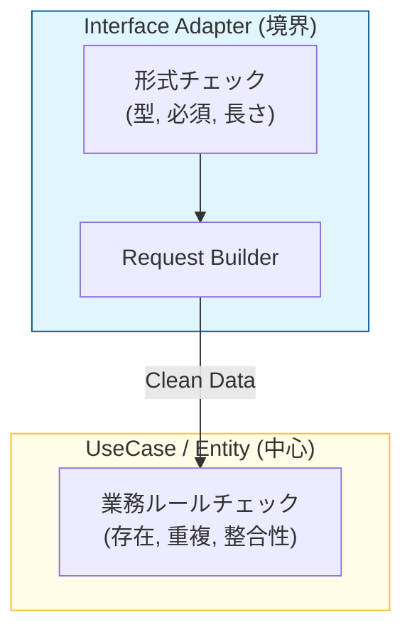

# 第31章：入力変換（HTTP→Request）を閉じ込める📥➡️📦

この章はね、**「HTTPのクセ（文字列・null・変な型・足りない項目…）を“境界で止める”」**がテーマだよ〜😊💖
UseCaseに入るころには、データは**きれいで型が決まってて、意味が通る形**になってるのが理想！🌸

---

### 1) まず結論：UseCaseに“生のHTTP”を渡しちゃダメ🙅‍♀️🌩️

HTTP入力って、だいたいこういう地雷があるの👇💥

* `req.body.title` が **undefined** とか **number** とか **空文字** とか😵
* `req.params.id` が **変な文字列**（“../..”みたいな）😱
* `req.query.completed` が `"true"`（文字列）で飛んでくる問題🤯
* JSONが壊れてる、型が崩れてる、余計なキーが混ざる…などなど🌀

だからやることは超シンプル👇✨

✅ **HTTP →（変換＆検証＆正規化）→ UseCaseのRequest**
この「変換＆検証＆正規化」を **Interface Adapters（入口側）に閉じ込める**よ〜🚪🧼

---

### 2) “入力変換”の置き場：Request Builder（または Request Mapper）🏗️💗

Controller（第30章）は「薄くする」方針だったよね？🧻✨
なので、Controllerの外にこういう子を作るのが超おすすめ！

* `CreateTaskRequestBuilder`
* `CompleteTaskRequestBuilder`
* `ListTasksRequestBuilder`

役割はこの4つだけ👇🌟

1. **抽出**：HTTPから必要な値を拾う（body/params/query）🧲
2. **検証**：型・必須・長さ・フォーマットなど（境界の検証）🔍
3. **正規化**：trimする、booleanに直す、空白まとめる等🧽
4. **Request生成**：UseCaseのRequest型を作って返す📦

---

### 3) バリデーションの役割分担（ここ超大事）🧠💡





**境界（この章）でやること** ✅

* ある？（必須チェック）
* 型あってる？（string/booleanなど）
* 形式あってる？（UUIDっぽい、長さ、trim後空じゃない等）
* “HTTPあるある”の正規化（`"true"`→`true`、`"  a "`→`"a"`）

**Entity / UseCaseでやること** ✅

* 業務ルール（例：タスク名の禁止語、同名禁止、完了済みは完了できない等）
* 永続化や存在チェック（例：IDのタスクが存在するか）

ここ混ぜると、境界が溶けて地獄になるよ〜🫠🔥

---

### 4) 2026の実務感：スキーマバリデーションを使うのが楽🥰📚

「自前if地獄」より、**スキーマライブラリ**がめちゃ楽！✨
最近の定番だとこんな感じ👇

* **Zod v4**：v4が安定化して、型と実行時検証をまとめやすいよ〜🧩✨ ([Zod][1])
* **Valibot**：軽量・モジュール志向で、変換（coercion）も強い方向に進化中🪶✨ ([valibot.dev][2])
* **TypeBox + Ajv**：JSON Schema系の流れで揃えたい時に強い💪📜 ([npmjs.com][3])

この章では例として **Zod** でいくね😊💕

---

## 5) ハンズオン：CreateTask の入力変換を作ろう🛠️🗒️✨

### 5-1. UseCase側のRequest（第15章で作った想定）📦

例：こんな感じの型がUseCasesにあるよね、って前提👇

```ts
// src/usecases/createTask/CreateTaskRequest.ts
export type CreateTaskRequest = Readonly<{
  title: string;
}>;
```

---

### 5-2. HTTP入力用のスキーマ（Zod）🧪✨

**ポイント**：UseCaseのRequestを直接parseするんじゃなくて、
まず “HTTP入力っぽい形” を受け止めてから、最後にRequestへ整形すると事故が減るよ〜😊

```ts
// src/interface-adapters/web/schemas/createTaskHttpSchema.ts
import { z } from "zod";

export const createTaskHttpSchema = z.object({
  title: z
    .string()
    .transform((s) => s.trim())
    .refine((s) => s.length > 0, "title is required")
    .refine((s) => s.length <= 100, "title must be <= 100 chars"),
});
```

Zod v4は安定版としてリリースノートがまとまってるよ📌 ([Zod][1])

---

### 5-3. Request Builder（HTTP → Request）を作る🏗️📥➡️📦

「失敗したらどう返すの？」問題があるから、まずは小さなResult型を作っちゃうのが楽だよ💕

```ts
// src/interface-adapters/web/requestBuilders/result.ts
export type Ok<T> = { ok: true; value: T };
export type Err<E> = { ok: false; error: E };
export type Result<T, E> = Ok<T> | Err<E>;

export const ok = <T>(value: T): Ok<T> => ({ ok: true, value });
export const err = <E>(error: E): Err<E> => ({ ok: false, error });
```

次に、Builder本体👇✨

```ts
// src/interface-adapters/web/requestBuilders/createTaskRequestBuilder.ts
import type { CreateTaskRequest } from "../../usecases/createTask/CreateTaskRequest";
import { createTaskHttpSchema } from "../schemas/createTaskHttpSchema";
import type { Result } from "./result";
import { ok, err } from "./result";

export type BadRequest = Readonly<{
  kind: "BadRequest";
  message: string;
  details?: unknown;
}>;

export function buildCreateTaskRequest(input: unknown): Result<CreateTaskRequest, BadRequest> {
  const parsed = createTaskHttpSchema.safeParse(input);

  if (!parsed.success) {
    return err({
      kind: "BadRequest",
      message: "Invalid request body",
      details: parsed.error.flatten(),
    });
  }

  // ここで「UseCase Request」に確定させる✨
  return ok({ title: parsed.data.title });
}
```

✨これでControllerは「Builder呼ぶだけ」で薄くできる〜！🧻💖

---

### 5-4. Controller側（薄く！薄く！🧻✨）

```ts
// src/interface-adapters/web/controllers/createTaskController.ts
import type { Request, Response } from "express";
import { buildCreateTaskRequest } from "../requestBuilders/createTaskRequestBuilder";
import type { CreateTaskInteractor } from "../../usecases/createTask/CreateTaskInteractor"; // 例

export function createTaskController(deps: { createTask: CreateTaskInteractor }) {
  return async (req: Request, res: Response) => {
    const r = buildCreateTaskRequest(req.body);

    if (!r.ok) {
      // ここは「入力エラー」なので 400 が自然だよね😊
      return res.status(400).json({ error: r.error.message, details: r.error.details });
    }

    const result = await deps.createTask.execute(r.value);

    // ここから先の「ドメイン失敗→HTTP変換」は第34章でがっつりやる想定🌈
    return res.status(201).json(result);
  };
}
```

Express v5系の情報は公式でも更新されてるよ📌 ([expressjs.com][4])

---

## 6) よくあるミス集（ここ踏みがち！）😵‍💫🧨

* **Controller内で if地獄**：入力の検証・整形が散らばる🌀
  → ✅ Builderへ隔離🏠✨
* **UseCase RequestにHTTP語彙が混入**：`userAgent` とか `header` とか入れちゃう😱
  → ✅ UseCaseは“目的”だけを見る🎯
* **境界で業務ルールまでやる**：「同名禁止」みたいなのをHTTP側で判定し始める😇
  → ✅ それEntity/UseCaseの仕事💖

---

## 7) 演習（やると定着するよ〜💪💕）

### 演習A：CompleteTask（params.id）を変換してみよ🆔✅

* `req.params.id` を受け取る
* 空ならNG
* 長さが変ならNG（例：1〜64とか自分で決めてOK）
* `CompleteTaskRequest` を返す

### 演習B：ListTasks（query.completed）を正規化してみよ👀🔎

* `?completed=true` / `false` を boolean に
* 未指定なら `undefined`（フィルタしない）にする

---

## 8) 理解チェック（1問）✅📝

**Q.** 「titleが空文字なら400」はどこで判定するのが一番きれい？
A. **Request Builder（境界）**で判定して、UseCaseには通さないのがスッキリだよ😊✨

---

## 9) この章の提出物📦✨

* `createTaskHttpSchema.ts`
* `buildCreateTaskRequest()`（Result型つき）
* Controllerが薄くなってること（Builderに寄せてる）🧻💖

---

## 10) AIプロンプト（コピペOK）🤖🪄✨

* 「Expressの`req.body`を受けて、Zodで検証→UseCaseの`CreateTaskRequest`を返す`buildCreateTaskRequest()`を書いて。失敗時は`{ok:false,error}`形式で返して」
* 「Controllerが太いから、入力検証をRequest Builderに移して薄くリファクタして」
* 「このZodスキーマ、過不足ある？“境界でやるべき検証”の観点でレビューして」

---

必要なら次は、第31章の続きとして **「CompleteTask / ListTasks のBuilder実装をフルで」**一緒に書いちゃおう😊💖✨

[1]: https://zod.dev/v4?utm_source=chatgpt.com "Release notes"
[2]: https://valibot.dev/?utm_source=chatgpt.com "Valibot: The modular and type safe schema library"
[3]: https://www.npmjs.com/package/%40sinclair/typebox?utm_source=chatgpt.com "sinclair/typebox"
[4]: https://expressjs.com/2024/10/15/v5-release.html?utm_source=chatgpt.com "Introducing Express v5: A New Era for the Node. ..."
