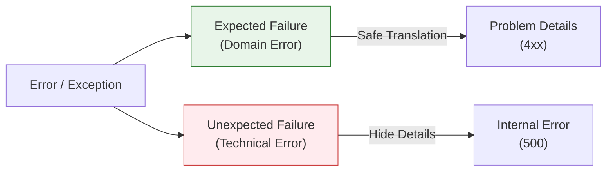

# 第34章：エラー変換（内側→外側の表現）⚠️➡️🌐

この章はね、「ドメイン（内側）の失敗」を **HTTP（外側）の失敗** に“翻訳”して、**いつも同じ形で返せる**ようにする回だよ😊✨
クリーンアーキでめちゃ大事な「境界で変換する」を、エラーで体に入れよう〜！💪💖

---

## 1) まず最重要：失敗は“2種類”に分ける🧠✨





同じエラーでも、意味が違うから分けるよ〜！

### A. 期待される失敗（ドメイン失敗）📌

* 例：タイトルが空、すでに完了済み、存在しないTaskを完了しようとした…など
* **仕様として起こり得る**から、ちゃんと「内側の言葉」で表現してOK👌

### B. 期待されない失敗（技術失敗・想定外）💥

* 例：DB落ちた、ネットワーク壊れた、コードのバグで例外…など
* **外側では安全な情報だけ返す**（詳細はログへ）🔒

HTTPのステータスコード自体の意味は、HTTP仕様（RFC 9110）で整理されてるよ〜📚([RFCエディタ][1])

---

## 2) 外側の“標準の形”を決める：Problem Details（RFC 9457）🧾✨

ここで最新寄りの鉄板が **RFC 9457 “Problem Details for HTTP APIs”** だよ！
これ、昔よく使われたRFC 7807を置き換える（obsoletes）仕様ね📌([RFCエディタ][2])

返すJSONの基本フィールドはこんな感じ（代表）👇

* `type`：問題タイプ（URI推奨）
* `title`：短い人間向け説明
* `status`：HTTPステータス
* `detail`：もう少し詳しく
* `instance`：この発生事例の識別子（トレースIDなどに使いやすい）

メディアタイプは `application/problem+json` を使うのがポイントだよ🧾✨([Swagger][3])

---

## 3) 変換テーブルを作ろう（これが“境界の翻訳辞書”）📚➡️🌐

ミニTaskアプリなら、内側のエラーは例えばこんな想定になるよね😊

* `InvalidTitle`（空・長すぎ等）
* `TaskNotFound`
* `AlreadyCompleted`

これをHTTPに翻訳する例👇（方針の例だよ〜）

* `InvalidTitle` → **400** or **422**（入力は正しいけど意味がダメなら422寄り…ただ運用は統一が大事！）
* `TaskNotFound` → **404**
* `AlreadyCompleted` → **409**（状態の衝突＝Conflict）

HTTPステータスの一覧や意味はMDNが最新更新されてて見やすいよ📚✨([MDNウェブドキュメント][4])

---

## 4) 実装：内側のエラー（DomainError）を“判別しやすい形”で持つ🧩

ここ、TypeScriptの得意技🔥
**判別可能なUnion（discriminated union）**で作ると、翻訳が超ラクになるよ😊✨

```ts
// entities or usecases 側（内側の言葉）
export type DomainError =
  | { type: "InvalidTitle"; reason: "empty" | "tooLong"; max?: number }
  | { type: "TaskNotFound"; id: string }
  | { type: "AlreadyCompleted"; id: string };
```

ポイント💡

* `type` を固定文字列にしておくと `switch` が気持ちよく書ける🫶
* `reason` みたいな補助情報は **内側の事情**として持ってOK（外側に出すかは後で決める）✨

---

## 5) 実装：Problem Detailsの型（外側の標準形）🧾

```ts
export type ProblemDetails = {
  type: string;
  title: string;
  status: number;
  detail?: string;
  instance?: string;

  // RFC 9457 は拡張メンバーOK（必要なら足してよい）
  [key: string]: unknown;
};
```

拡張メンバー（例えば `errors` とか `code`）を足せるのが便利〜！🧁
RFC 9457 は「新しい独自フォーマット乱立」を避けたい思想があるよ📌([RFCエディタ][2])

---

## 6) 実装：翻訳関数（DomainError → HTTP + ProblemDetails）🔁✨

ここがこの章の“主役”！🎬

```ts
import { DomainError } from "../usecases/DomainError";
import { ProblemDetails } from "./ProblemDetails";

export function toProblemDetails(
  err: DomainError,
  instance?: string
): { status: number; body: ProblemDetails } {
  switch (err.type) {
    case "InvalidTitle": {
      // ここは方針で 400/422 どちらでも。チームで統一が大事😊
      const status = 400;
      return {
        status,
        body: {
          type: "https://example.com/problems/invalid-title",
          title: "Invalid title",
          status,
          detail:
            err.reason === "empty"
              ? "title must not be empty"
              : `title is too long${err.max ? ` (max ${err.max})` : ""}`,
          instance,
          code: "INVALID_TITLE", // 拡張メンバー例
        },
      };
    }

    case "TaskNotFound": {
      const status = 404;
      return {
        status,
        body: {
          type: "https://example.com/problems/task-not-found",
          title: "Task not found",
          status,
          detail: `task id=${err.id} was not found`,
          instance,
          code: "TASK_NOT_FOUND",
        },
      };
    }

    case "AlreadyCompleted": {
      const status = 409;
      return {
        status,
        body: {
          type: "https://example.com/problems/already-completed",
          title: "Already completed",
          status,
          detail: `task id=${err.id} is already completed`,
          instance,
          code: "ALREADY_COMPLETED",
        },
      };
    }
  }
}
```

ここでのコツ💡

* `type` は **“変更しにくい識別子”** にする（クライアントが分岐に使える）🧠✨
* `detail` は **ユーザーに見せても安全な範囲**に限定🔒
* `instance` はログのトレースIDと繋げると最強🧵✨

---

## 7) Controller（Inbound Adapter）で使う：境界で変換する🚪➡️🧾

UseCaseが `Result` 形式で返してくる想定（throwでもいいけど、この形は学習しやすい😊）

```ts
type Ok<T> = { ok: true; value: T };
type Err<E> = { ok: false; error: E };
type Result<T, E> = Ok<T> | Err<E>;
```

そしてController側👇

```ts
import { toProblemDetails } from "../adapters/toProblemDetails";
import { DomainError } from "../usecases/DomainError";

export async function createTaskController(req: any, res: any) {
  const instance = crypto.randomUUID(); // 例：トレースID

  const result: Result<{ id: string }, DomainError> = await req.usecase.execute({
    title: req.body?.title,
  });

  if (result.ok) {
    return res.status(201).json(result.value);
  }

  const pd = toProblemDetails(result.error, instance);
  return res
    .status(pd.status)
    .type("application/problem+json")
    .json(pd.body);
}
```

これで「内側の言葉」を、外側の標準に“翻訳”できた〜！🎉💕

---

## 8) 想定外エラー（技術失敗）はどう返す？🧯💥

基本はこう👇

* クライアントには **500**（または一時障害なら503）
* **detailにスタックトレースとか出さない**（セキュリティ😇🔒）
* 代わりに `instance` を返して「お問い合わせ時にこれ教えてね」方式にする

HTTPのステータスコードの意味を守るのが大事だよ〜📚([RFCエディタ][1])

---

## 9) エラーの“原因”を残す：`Error.cause` が便利🧠🧵

境界をまたぐ時、原因を握りつぶすとデバッグ地獄😇
JS/TSの `Error.cause` が超使えるよ！（MDNで仕様＆サポート状況まとまってる）📚✨([MDNウェブドキュメント][5])

```ts
try {
  await repo.save(task);
} catch (e) {
  throw new Error("failed to save task", { cause: e });
}
```

ログ側で `cause` を辿れると、原因調査がめっちゃ楽になるよ〜🕵️‍♀️✨([MDNウェブドキュメント][5])

---

## 10) テスト：翻訳関数は“超ユニットテスト向き”🧪💖

```ts
import { toProblemDetails } from "./toProblemDetails";

test("TaskNotFound -> 404 problem+json", () => {
  const r = toProblemDetails({ type: "TaskNotFound", id: "t1" }, "trace-1");
  expect(r.status).toBe(404);
  expect(r.body.status).toBe(404);
  expect(r.body.type).toContain("task-not-found");
  expect(r.body.instance).toBe("trace-1");
});
```

ここが通ると「仕様としての翻訳」が壊れないから安心〜！🥰🧪

---

## 11) よくある落とし穴（ここ注意！）⚠️😵‍💫

* **DomainErrorなのに500で返してしまう**
  → クライアント側が「直せるエラー」か判断できない🥲
* **type/title/detail が毎回バラバラ**
  → UIがつらい、ドキュメントも死ぬ📚💀
* **detailに内部情報（SQLやスタック）を入れる**
  → セキュリティ事故の元😇🔒
* **400/422/409 の使い分けが人によって違う**
  → “チーム方針として固定”が正義💪✨

---

## 12) この章の提出物（成果物）📦✨

* ✅ `DomainError`（判別可能Union）
* ✅ `ProblemDetails` 型
* ✅ `toProblemDetails()` 変換関数
* ✅ Controllerで `application/problem+json` を返す処理
* ✅ 変換テスト1〜3本🧪

---

## 13) 理解チェック問題（1問）📝🤔

「`AlreadyCompleted` を 400 で返しているAPIがあったとして、なぜ 409 の方が“自然”になりやすいの？（理由を1つ）」💡

---

## 14) AI相棒プロンプト（コピペ用）🤖✨

```text
DomainError（typeで判別できるunion）を前提に、
RFC 9457 Problem Details (application/problem+json) 形式へ変換する
toProblemDetails関数をTypeScriptで書いて。
- InvalidTitle / TaskNotFound / AlreadyCompleted を扱う
- status, type, title, detail, instance を含める
- detailは内部情報を含めない
- 変換テーブルも先に提案して
```

---

必要なら次で、**「400/422をどう統一するか」**の“教材向けの決め方テンプレ”も作るよ😊✨（迷いがちな所だから、そこを型にしちゃおう！🧁💖）

[1]: https://www.rfc-editor.org/rfc/rfc9110.html?utm_source=chatgpt.com "RFC 9110: HTTP Semantics"
[2]: https://www.rfc-editor.org/rfc/rfc9457.html?utm_source=chatgpt.com "RFC 9457: Problem Details for HTTP APIs"
[3]: https://swagger.io/blog/problem-details-rfc9457-api-error-handling/?utm_source=chatgpt.com "Problem Details (RFC 9457): Getting Hands-On with API ..."
[4]: https://developer.mozilla.org/en-US/docs/Web/HTTP/Reference/Status?utm_source=chatgpt.com "HTTP response status codes - MDN Web Docs - Mozilla"
[5]: https://developer.mozilla.org/en-US/docs/Web/JavaScript/Reference/Global_Objects/Error/cause?utm_source=chatgpt.com "Error: cause - JavaScript - MDN Web Docs"
