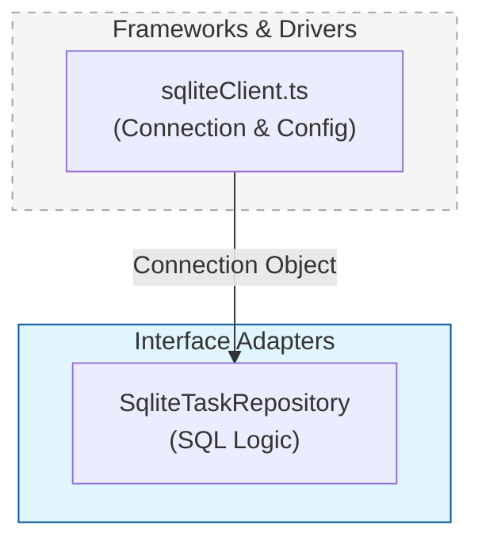

# 第40章：DBドライバ／接続設定は外側に隔離🗄️➡️🌍

「SQLiteに繋ぐ処理」って、つい便利だから Repository の中に書きがちなんだけど…
それやると、**中心（UseCase/Entity）が“DBの都合”に引っ張られやすくなる**んだよね🥲💦

この章では、**DBドライバ生成・接続設定・初期化（PRAGMAやマイグレーション）を“外側の専用モジュール”に押し出す**よ💪😺

---

## まず結論🎯（ここだけ覚えればOK！）

* ✅ Repository（Adapter）は **「DBに接続する」** をしない
* ✅ Repository（Adapter）は **「もう接続済みのDBオブジェクト」を受け取って使うだけ**
* ✅ 接続文字列（ファイルパス/URL）、認証、PRAGMA、接続オプションは **Frameworks & Drivers 側**に置く
* ✅ これで **DB差し替えが超ラク**になる🔁✨

---

## “やりがちな事故”例💥（アンチパターン）





Repositoryの中で、環境変数読んで、DB開いて、PRAGMA設定して…みたいなの👇

```ts
// ❌ これはやりがちだけど「外側の都合」が混ざりやすい例
import { DatabaseSync } from "node:sqlite";

export class SqliteTaskRepository {
  private db = new DatabaseSync(process.env.DB_FILE ?? "app.db"); // ←設定が中に入ってる💦

  constructor() {
    this.db.exec("PRAGMA journal_mode = WAL;"); // ←初期化も中💦
  }

  // ... find/save など
}
```

こうなると…

* DBファイル名変えたいだけで Repository 変更😵
* テストで `:memory:` にしたいのに Repository が環境依存😵
* SQLite以外へ移行したい時に “中心”へ波及しやすい😵

---

## 今どきのSQLite事情🆕✨（2026年1月時点）

* Node.js には **標準の SQLite モジュール `node:sqlite`** が用意されてるよ（ドキュメントもある）📚✨ ([nodejs.org][1])
* ただし `node:sqlite` は、環境や版によって **experimental 扱いでフラグが必要なケース**もある（例：`--experimental-sqlite`）⚠️ ([GitHub][2])
* そして “安定＆高速な定番” としては **better-sqlite3** が今も強い💪🔥（最新版も継続更新されてる） ([GitHub][3])

この章のポイントは「どのドライバでも通用する隔離の型」なので、**node:sqliteでもbetter-sqlite3でも同じ考え方でOK**だよ😊🧡

---

## 正しい分離の形🏗️✨（登場人物を整理）

### 置き場所のイメージ📁

* `frameworks/db/`：**DBを“作る”場所**（接続・設定・初期化）
* `adapters/outbound/`：**Repository実装**（SQLを投げる・結果を変換する）
* `main`（Composition Root）：**全部を組み立てる場所**（注入💉）

---

## ステップ1：外側に「DBを作るだけ」の工房を作る🛠️🗄️

ここは **Frameworks & Drivers 側**の責務ね😊

```ts
// frameworks/db/sqliteClient.ts
import { DatabaseSync } from "node:sqlite";
import path from "node:path";

export type SqliteDb = DatabaseSync;

export function createSqliteDb(options?: { file?: string }): SqliteDb {
  const file = options?.file ?? path.join(process.cwd(), "data", "app.db");
  const db = new DatabaseSync(file);

  // 初期化（外側に寄せる✨）
  db.exec("PRAGMA foreign_keys = ON;");
  db.exec("PRAGMA journal_mode = WAL;");

  return db;
}
```

※ `node:sqlite` の使い方自体は Node.js のAPI例にも載ってるよ📚 ([nodejs.org][1])
※ もし環境によって experimental フラグが必要なら、起動コマンド側で対応する感じになるよ⚠️ ([GitHub][2])

---

## ステップ2：Repositoryは「接続済みDB」を受け取るだけにする🎁✨

```ts
// adapters/outbound/SqliteTaskRepository.ts
import type { SqliteDb } from "../../frameworks/db/sqliteClient";

export class SqliteTaskRepository {
  constructor(private readonly db: SqliteDb) {}

  findById(id: string) {
    const stmt = this.db.prepare("SELECT id, title, completed FROM tasks WHERE id = ?");
    const row = stmt.get(id) as { id: string; title: string; completed: 0 | 1 } | undefined;
    if (!row) return null;

    return {
      id: row.id,
      title: row.title,
      completed: row.completed === 1,
    };
  }

  save(task: { id: string; title: string; completed: boolean }) {
    const stmt = this.db.prepare(
      "INSERT INTO tasks(id, title, completed) VALUES(?, ?, ?) " +
      "ON CONFLICT(id) DO UPDATE SET title=excluded.title, completed=excluded.completed"
    );
    stmt.run(task.id, task.title, task.completed ? 1 : 0);
  }
}
```

ここで超大事なのは👇

* Repositoryは **DBファイル名も環境変数も知らない**🙈
* Repositoryは **接続やPRAGMAをしない**🙅‍♀️
* ただ **SQLを実行して、結果を内側に渡しやすい形に変換する**だけ🔄✨

---

## ステップ3：Composition Root で組み立てる💉🧩

```ts
// main.ts（Composition Root）
import { createSqliteDb } from "./frameworks/db/sqliteClient";
import { SqliteTaskRepository } from "./adapters/outbound/SqliteTaskRepository";

const db = createSqliteDb({ file: "data/app.db" });
const taskRepo = new SqliteTaskRepository(db);

// ここから先で UseCase に taskRepo を注入していくイメージ✨
```

これで、DB設定を変えたい時は **createSqliteDb だけ**見ればOKになるよ😺👍

---

## テストが気持ちよくなる例🧪✨（`:memory:` 最高！）

```ts
import { createSqliteDb } from "../src/frameworks/db/sqliteClient";
import { SqliteTaskRepository } from "../src/adapters/outbound/SqliteTaskRepository";

test("save -> findById", () => {
  const db = createSqliteDb({ file: ":memory:" }); // ←差し替え一発😺
  db.exec("CREATE TABLE tasks(id TEXT PRIMARY KEY, title TEXT, completed INTEGER);");

  const repo = new SqliteTaskRepository(db);
  repo.save({ id: "1", title: "milk", completed: false });

  expect(repo.findById("1")?.title).toBe("milk");
});
```

この “差し替え一発感” が、クリーンアーキのご褒美だよ〜〜🎉💖

---

## ありがちな落とし穴チェック✅😵‍💫

* 😵 Repositoryのコンストラクタで `new Database...` してない？（→外側へ）
* 😵 `process.env` を Repository が読んでない？（→外側へ）
* 😵 PRAGMA/初期化/マイグレーションが Repository に混ざってない？（→外側へ）
* 😵 “接続失敗”をドメインエラーっぽく扱ってない？（→技術エラーは外側寄りでOK）

---

## AI相棒🤖✨（コピペで使えるプロンプト）

* 🤖「Repository から process.env と new Database を消して、DB生成を別モジュールに分離して。差し替え可能な構成にして」
* 🤖「PRAGMA とスキーマ初期化を frameworks/db 側へ寄せた設計に直して」
* 🤖「テストで :memory: を使えるように依存注入に変えて。変更点の差分も説明して」

---

## ミニ理解チェック🎓💡（1問だけ！）

**Q.** Repository が “DBファイルパス” を知っている設計は、何が困る？（2つ答えてね）
👀ヒント：差し替え・テスト・環境依存…

---

次の章（41章）で、この流れを **Config（設定）の境界**まで広げて「どこで読み、どこへ渡す？」をさらにキレイにするよ🧾✨

[1]: https://nodejs.org/api/sqlite.html?utm_source=chatgpt.com "SQLite | Node.js v25.4.0 Documentation"
[2]: https://github.com/nodejs/node/issues/53906?utm_source=chatgpt.com "experimental-sqlite` flag · Issue #53906 · nodejs/node"
[3]: https://github.com/WiseLibs/better-sqlite3?utm_source=chatgpt.com "WiseLibs/better-sqlite3: The fastest and simplest library for ..."
