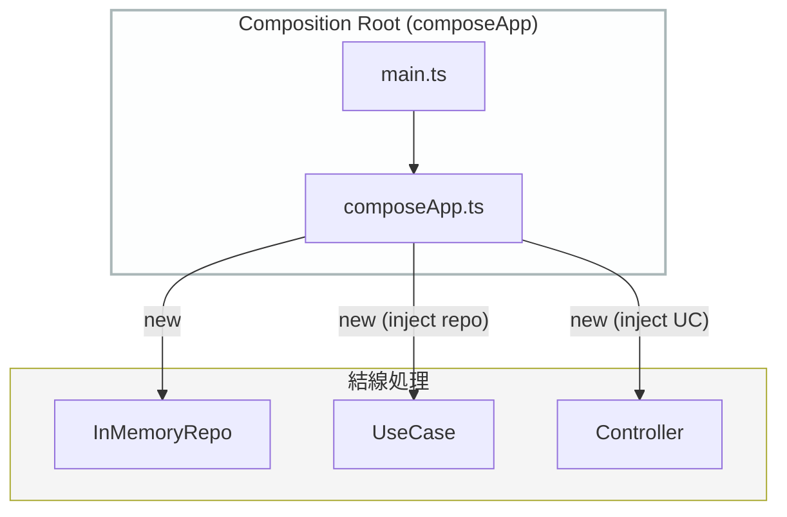

# 第44章：手動DIで組み立て（まずはコンテナ無し）💉✨

この章は「**依存関係（Repository / Clock / Id など）を、起動コードでぜんぶ結線して、ちゃんと動かす**」回だよ〜！🎀
ポイントは **“中心（UseCase/Entity）は一切 new しない” じゃなくて、“中心では new しない”** って感覚😉✨
（new するのは **外側＝Composition Root だけ**！）

---

## 1) 今日のゴール🎯✨

* ✅ UseCase が必要とする依存（Port実装）を **全部外側で用意**できる
* ✅ `main.ts`（起動）を見れば「どれがどれにつながるか」が **一目で分かる**👀
* ✅ 後の章（第45章）で **InMemory ↔ SQLite を差し替える準備**が完了🎉

---

## 2) “手動DI”ってなに？💉

DI（Dependency Injection）は超ざっくり言うと、

* ❌ UseCase の中で `new SQLiteTaskRepository()` とか作らない
* ✅ 外側で作ったものを、UseCase に **引数で渡す**（注入する）

ってことだよ😊✨

**手動DI**は「DIコンテナ（自動で注入する仕組み）」を使わず、
**自分で new して渡していく**スタイル！🧩

---

## 3) まず “組み立て対象” を整理しよ🧠📝

今回のミニTaskアプリだと、だいたいこうなるよ👇

### 内側（作る側ではない）

* 🧡 Entities：`Task`
* 🎬 UseCases：`CreateTask` / `CompleteTask` / `ListTasks`
* 🔌 Ports：`TaskRepository` / `Clock` / `IdGenerator`（など）

### 外側（作って注入する側）

* 🧺 Outbound Adapters：`InMemoryTaskRepository`、`SystemClock`、`RandomIdGenerator`
* 🚪 Inbound Adapters：Controller（HTTP入力→Requestに変換→UseCase呼ぶ）
* 🎨 Presenter：Response→ViewModel（or JSON）変換
* ⚙️ Driver：HTTPサーバ（Expressでもnode:httpでもOK）

---

## 4) きれいに保つための “鉄の掟” 3つ🛡️✨

### 掟①：UseCaseの中で「外側の実装」を作らない❌

`new InMemoryTaskRepository()` を UseCase がやった瞬間にアウト🙅‍♀️
**差し替え不能**になるよ💥

### 掟②：注入は「constructor」か「関数引数」だけでOK👍

複雑な魔法はいらないよ🪄
**見えるDI**がいちばん強い💪✨

### 掟③：組み立ては “1ファイル（or 1フォルダ）” に集約📍

おすすめは：

* `src/composition/composeApp.ts` ← ここに結線を全部置く
* `src/main.ts` ← ここから `composeApp()` 呼ぶだけ

---

## 5) 最新ツール事情ちょいメモ（2026-01時点）🆕✨

* npm の `typescript` は `latest` が **5.9.3**（2026年1月時点）だよ📌 ([npmjs.com][1])
* Node.js は LTS 系が動いてて、例として **24.13.0 (LTS)** や **22.22.0 (LTS)** のセキュリティリリースが 2026-01-13 に出てるよ🔒 ([Node.js][2])
* 開発中に TS をサクッと動かすなら `tsx` も定番。**ただし tsx は型チェックしない**ので、`tsc` で型チェックは別でやろうね🧪 ([Node.js][3])

---

## 6) フォルダ構成（例）📁✨

「どこに何があるか」が迷子にならない形👇

```text
src/
  entities/
    Task.ts
  usecases/
    createTask/CreateTaskInteractor.ts
    completeTask/CompleteTaskInteractor.ts
    listTasks/ListTasksInteractor.ts
  ports/
    TaskRepository.ts
    Clock.ts
    IdGenerator.ts
  interface-adapters/
    inbound/
      TaskController.ts
    outbound/
      InMemoryTaskRepository.ts
      SystemClock.ts
      RandomIdGenerator.ts
    presenter/
      TaskPresenter.ts
  frameworks/
    http/
      server.ts
  composition/
    composeApp.ts
  main.ts
```

---

## 7) コア：composeApp（結線だけをする場所）🏗️✨





### (A) `src/composition/composeApp.ts` 💉

ここが “結線の本丸” だよ〜！🎯
**new していいのはここだけ**の気持ちでいこ😉

```ts
// src/composition/composeApp.ts
import { createHttpServer } from "../frameworks/http/server";

import { InMemoryTaskRepository } from "../interface-adapters/outbound/InMemoryTaskRepository";
import { SystemClock } from "../interface-adapters/outbound/SystemClock";
import { RandomIdGenerator } from "../interface-adapters/outbound/RandomIdGenerator";

import { CreateTaskInteractor } from "../usecases/createTask/CreateTaskInteractor";
import { CompleteTaskInteractor } from "../usecases/completeTask/CompleteTaskInteractor";
import { ListTasksInteractor } from "../usecases/listTasks/ListTasksInteractor";

import { TaskPresenter } from "../interface-adapters/presenter/TaskPresenter";
import { TaskController } from "../interface-adapters/inbound/TaskController";

export function composeApp() {
  // 1) Outbound adapters（Port実装）を作る🧺
  const taskRepo = new InMemoryTaskRepository();
  const clock = new SystemClock();
  const idGen = new RandomIdGenerator();

  // 2) UseCases を作る（Portだけ受け取る）🎬
  const createTask = new CreateTaskInteractor(taskRepo, idGen, clock);
  const completeTask = new CompleteTaskInteractor(taskRepo, clock);
  const listTasks = new ListTasksInteractor(taskRepo);

  // 3) Presenter（出力整形）🎨
  const presenter = new TaskPresenter();

  // 4) Controller（入力→UseCase呼ぶ→Presenter）🚪
  const controller = new TaskController({
    createTask,
    completeTask,
    listTasks,
    presenter,
  });

  // 5) Driver（HTTPサーバ）を作って、controller を渡す⚙️
  const server = createHttpServer(controller);

  return { server };
}
```

### ✅ ここが最高にえらいポイント💮

* UseCase は `InMemoryTaskRepository` を知らない🙆‍♀️
* どの実装を使うかは **composeApp が決める**👑
* 差し替えは **1行の new を変えるだけ**になる（第45章でやるやつ🎉）

---

## 8) `src/main.ts` は “起動するだけ” にする🚀✨

```ts
// src/main.ts
import { composeApp } from "./composition/composeApp";

const { server } = composeApp();

server.listen(3000, () => {
  console.log("Server running on http://localhost:3000");
});
```

main は薄いほど正義🥰✨

---

## 9) 手動DIで “やりがち事故” あるある⚠️😂

### 事故①：Controller が Repository を new しちゃう

Controller は薄く！🚪
**UseCase 以外を勝手に作らない**でね🙅‍♀️

### 事故②：どこでも使えるように singleton（グローバル）にする

一見便利だけど、依存が見えなくなってテストが死ぬ😇
**注入で渡す**のが勝ち！

### 事故③：Config を巨大オブジェクトで全部渡す

「なんでも入ってる箱」を渡すと、結局 Service Locator 化しがち📦💥
必要なものだけ、**小分けに渡す**のがかわいくて強い🧁✨

---

## 10) AI相棒に頼むときの “神プロンプト” 🤖✨

### ① 結線が漏れてないかチェック

* 「composeApp.ts を見て、依存の注入漏れ・循環参照リスク・責務漏れを指摘して。改善案も」

### ② “UseCaseが外側importしてないか” 監査

* 「usecases/ 配下の import を全部チェックして、frameworks/ や interface-adapters/ を参照してたらNGとして一覧化して」

### ③ 「差し替えやすさ」診断

* 「InMemory を SQLite に変える時に、どのファイルが変更になる？理想との差分も説明して」

---

## 11) 理解チェック（1問）✅📝

**Q.** `CreateTaskInteractor` の中で `new RandomIdGenerator()` を書いたら何がまずい？🤔
（ヒント：差し替え・テスト・依存の向き）

---

## 12) 今回の提出物（成果物）📦✨

* ✅ `composeApp()` が存在して、結線がそこに集約されてる
* ✅ `main.ts` が薄い（起動するだけ）
* ✅ UseCase 層から外側実装への import がゼロ

---

次の第45章でいよいよ…
**InMemory ↔ SQLite を “差し替え実演” して、中心が無傷なことを体で理解**して卒業するよ〜！🎓🎉✨

[1]: https://www.npmjs.com/package/typescript?utm_source=chatgpt.com "TypeScript"
[2]: https://nodejs.org/en/blog/release/v24.13.0?utm_source=chatgpt.com "Node.js 24.13.0 (LTS)"
[3]: https://nodejs.org/id/learn/typescript/run?utm_source=chatgpt.com "Running TypeScript with a runner"
