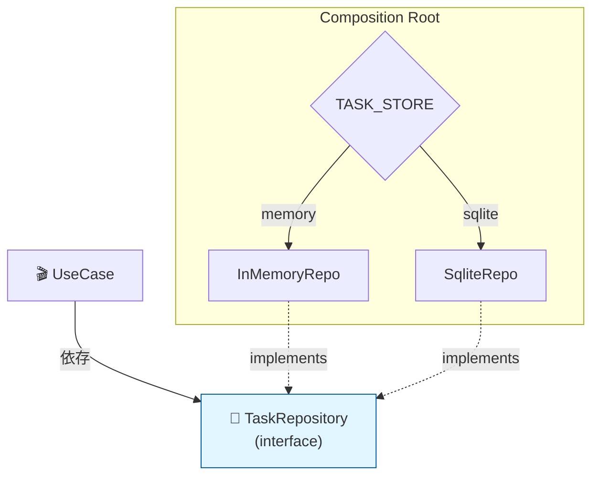

# 第45章：最終チェック：差し替え実演（外側を変えても中心が無傷）🎉🔁

この章は「クリーンアーキって結局なにが嬉しいの？」を、**動くデモ**で完全に腹落ちさせる回だよ〜！🥳✨
やることは超シンプル👇

* ✅ **InMemory Repository** ↔ ✅ **SQLite Repository** を切り替える
* ✅ それでも **Entities / UseCases は1行も変えない**
* ✅ しかも **テストが同じまま通る**（ここ超重要！🧪🔥）

---

## 0) 2026/01/23時点の“土台”だけ確認 🧱✨

* TypeScript の最新安定版は **5.9.3**（npm の latest が 5.9.3）だよ 📌 ([npmjs.com][1])
* Node.js は **v24 が Active LTS**、v25 が Current（最新系）って位置づけだよ 📌 ([Node.js][2])
* SQLite は Node 標準の **`node:sqlite`** が使えて、`DatabaseSync` / `statement.get()` / `statement.all()` などが用意されてるよ 🗃️ ([Node.js][3])
* テストは **Vitest 4** が現行メジャー（4.0 アナウンス済み）🧪 ([vitest.dev][4])

---

## 1) 今日のゴール（これができたら卒業🎓）🎯✨

### ゴールA：差し替えで“中心が無傷”を証明する 🛡️

* ✅ 差し替えるのは **Composition Root（組み立て）だけ**
* ✅ UseCase / Entity / Port は一切変更しない

### ゴールB：テストで“証拠”を残す 🧪📸

* ✅ **同じ UseCase テスト**を

  * InMemory Repo でも
  * SQLite Repo でも
    どっちでも通す✨

---

## 2) 差し替えが成立するための“絶対条件”🚧

差し替えで詰まる原因って、だいたいこれ👇

### ✅ Port（Repository interface）の契約が「DB都合」になってる

たとえばこんなのは危険⚠️

* ❌ `findById(id: number)`（DBの型に寄ってる）
* ❌ `listRawRows()`（SQLの行を内側へ持ち込む）

理想はこう👇

* ✅ “内側の言葉”（Task / TaskId / completed など）で話す
* ✅ “保存・取得”という**能力**だけが見える

---

## 3) 差し替えポイントはここだけ！🎯（Composition Root）

この章の主役は **「組み立て」**だよ🏗️✨
Repository を **どれにするか**をここで決める！

イメージ👇

* `CreateTaskInteractor` は `TaskRepository` しか知らない
* だから `TaskRepository` の実体を

  * `InMemoryTaskRepository` にしても
  * `SqliteTaskRepository` にしても
    **UseCase は何も変わらない**🎉

---

## 4) “切り替えスイッチ”を1つ作る 🎛️✨

環境変数で切り替えるのが分かりやすいよ〜！（デモ向き💡）

### PowerShell で切り替え（例）🪟

* InMemory で起動：`$env:TASK_STORE="memory"`
* SQLite で起動：`$env:TASK_STORE="sqlite"`

---

## 5) Composition Root の最小例（ここだけ変えればOK）🏗️💉

```ts
// compositionRoot.ts
import { CreateTaskInteractor } from "../usecases/createTask/CreateTaskInteractor";
import { CompleteTaskInteractor } from "../usecases/completeTask/CompleteTaskInteractor";
import { ListTasksInteractor } from "../usecases/listTasks/ListTasksInteractor";

import { InMemoryTaskRepository } from "../adapters/outbound/InMemoryTaskRepository";
import { SqliteTaskRepository } from "../adapters/outbound/SqliteTaskRepository";

type StoreKind = "memory" | "sqlite";

function resolveStoreKind(): StoreKind {
  const v = (process.env.TASK_STORE ?? "memory").toLowerCase();
  return v === "sqlite" ? "sqlite" : "memory";
}

export function buildApp() {
  const kind = resolveStoreKind();

  const taskRepo =
    kind === "sqlite"
      ? new SqliteTaskRepository({ dbPath: "./data/tasks.db" })
      : new InMemoryTaskRepository();

  // UseCase は Port しか知らない（ここが最高にクリーン✨）
  const createTask = new CreateTaskInteractor(taskRepo);
  const completeTask = new CompleteTaskInteractor(taskRepo);
  const listTasks = new ListTasksInteractor(taskRepo);

  return { createTask, completeTask, listTasks, kind };
}
```

✅ 重要ポイントはこれだけ👇

* `new InMemoryTaskRepository()` と `new SqliteTaskRepository()` を切り替えてるのは **ここだけ**
* UseCase 側は `taskRepo` が何者か知らない😌✨

---

## 6) SQLite Adapter（node:sqlite を使う最小の雰囲気）🗃️✨

「もう作ってある」前提でもいいんだけど、**差し替えの説得力**が上がるから “雰囲気だけ”載せるね☺️
（Node 標準 `node:sqlite` の `DatabaseSync` / `prepare()` / `run()` / `get()` / `all()` を使う） ([Node.js][3])

```ts
// SqliteTaskRepository.ts（雰囲気の最小例）
import { DatabaseSync } from "node:sqlite";
import { TaskRepository } from "../../ports/TaskRepository";
import { Task } from "../../entities/Task";

export class SqliteTaskRepository implements TaskRepository {
  private db: DatabaseSync;

  constructor(private opts: { dbPath: string }) {
    this.db = new DatabaseSync(opts.dbPath);
    this.db.exec(`
      CREATE TABLE IF NOT EXISTS tasks (
        id TEXT PRIMARY KEY,
        title TEXT NOT NULL,
        completed INTEGER NOT NULL
      ) STRICT;
    `);
  }

  async save(task: Task): Promise<void> {
    const st = this.db.prepare(`
      INSERT INTO tasks (id, title, completed)
      VALUES (?, ?, ?)
      ON CONFLICT(id) DO UPDATE SET
        title = excluded.title,
        completed = excluded.completed;
    `);
    st.run(task.id.value, task.title.value, task.completed ? 1 : 0);
  }

  async findById(id: string): Promise<Task | null> {
    const st = this.db.prepare(`SELECT id, title, completed FROM tasks WHERE id = ?;`);
    const row = st.get(id) as undefined | { id: string; title: string; completed: number };
    if (!row) return null;
    return Task.rebuild({ id: row.id, title: row.title, completed: row.completed === 1 });
  }

  async listAll(): Promise<Task[]> {
    const st = this.db.prepare(`SELECT id, title, completed FROM tasks ORDER BY rowid DESC;`);
    const rows = st.all() as Array<{ id: string; title: string; completed: number }>;
    return rows.map(r => Task.rebuild({ id: r.id, title: r.title, completed: r.completed === 1 }));
  }
}
```

ここでの“勝ち筋”は👇

* ✅ SQL の行（row）を **Mapper 的にここで吸収**
* ✅ 内側へ返すのは **Task（内側のモデル）だけ**

---

## 7) いよいよ本番：差し替えデモ 🎬🎉





### デモ①：InMemory で動かす（起動し直すと消える）🧺💨

1. `$env:TASK_STORE="memory"`
2. 起動
3. Task を Create / List
4. 再起動
5. 👉 **消える**（メモリだから！）

### デモ②：SQLite で動かす（起動し直しても残る）🗃️✨

1. `$env:TASK_STORE="sqlite"`
2. 起動
3. Task を Create / List
4. 再起動
5. 👉 **残る**（ファイルDBだから！）

✅ なのに…
**UseCase も Entity も 1行も変えてない**はず！🎉
これが “中心が無傷” の証明だよ〜！🛡️✨

---

## 8) 最強の証拠：同じ UseCase テストを両方で回す 🧪🔥

ここが一番気持ちいいところ！！🥹✨
Vitest は v4 系が現行メジャーだよ🧪 ([vitest.dev][4])

ポイントは **describe.each** で同じテストを使い回すこと👇

```ts
// createTask.spec.ts
import { describe, it, expect } from "vitest";
import { CreateTaskInteractor } from "../usecases/createTask/CreateTaskInteractor";
import { InMemoryTaskRepository } from "../adapters/outbound/InMemoryTaskRepository";
import { SqliteTaskRepository } from "../adapters/outbound/SqliteTaskRepository";

type Kind = "memory" | "sqlite";

function makeRepo(kind: Kind) {
  if (kind === "sqlite") {
    // テスト用に別ファイルへ（毎回消してもOK）
    return new SqliteTaskRepository({ dbPath: "./data/test.tasks.db" });
  }
  return new InMemoryTaskRepository();
}

describe.each<Kind>(["memory", "sqlite"])("CreateTask (%s)", (kind) => {
  it("creates a task", async () => {
    const repo = makeRepo(kind);
    const uc = new CreateTaskInteractor(repo);

    const res = await uc.execute({ title: "Buy milk" });

    expect(res.ok).toBe(true);
    const list = await repo.listAll();
    expect(list.length).toBe(1);
    expect(list[0].title.value).toBe("Buy milk");
  });
});
```

✅ これが通ったら、あなたはもう勝ち確🎊

* Repository を変えても
* UseCase のテストが
* **同じまま通る**

---

## 9) うまく差し替えできない時の“漏れチェック”🕵️‍♀️⚠️

差し替えで失敗するときの典型👇

### ❌ UseCase が DB の都合を知ってしまってる

* 「SQLite は rowid が〜」みたいな発想が UseCase に出たらアウト😵

### ❌ Port が “巨大化” or “SQL便利メソッド化”

* `findByTitleLike()` とか増やしすぎると、次のDBで死ぬ🪦

### ✅ 正しい修正方針

* **“必要な能力”として Port を設計し直す**
* **変換・最適化は Adapter 側に寄せる**

---

## 10) 今日の提出物（これができたら完了✅）📦✨

* ✅ `TASK_STORE=memory/sqlite` の切り替えで動作が変わる
* ✅ 切り替えで **Entities / UseCases が一切変更なし**
* ✅ UseCase テストが **両方のRepoで通る**🧪

---

## 11) AI相棒に投げると爆速になるプロンプト集 🤖⚡

* 🤖「`TaskRepository` のメソッド、差し替えに弱い匂いがあるかレビューして。改善案も」
* 🤖「`describe.each` で InMemory/SQLite を同じテストで回す構成にして」
* 🤖「UseCase がDB都合を知ってしまってる箇所がないか、依存・命名・戻り値の観点で監査して」
* 🤖「SQLite Adapter の例外を、外側の責務として扱う方針（握りつぶさない）を整理して」

---

## ラスト🎉：この章で“体に入る”こと

クリーンアーキは「図がキレイ」じゃなくて、
**“外側の変更”に対して、中心を守れる**のが本当の価値だよ🛡️✨

差し替えデモ＋両対応テストが通ったら、あなたはもう卒業〜！🎓🌸

[1]: https://www.npmjs.com/package/typescript?activeTab=versions&utm_source=chatgpt.com "typescript"
[2]: https://nodejs.org/en/about/previous-releases?utm_source=chatgpt.com "Node.js Releases"
[3]: https://nodejs.org/api/sqlite.html "SQLite | Node.js v25.4.0 Documentation"
[4]: https://vitest.dev/blog/vitest-4?utm_source=chatgpt.com "Vitest 4.0 is out!"
