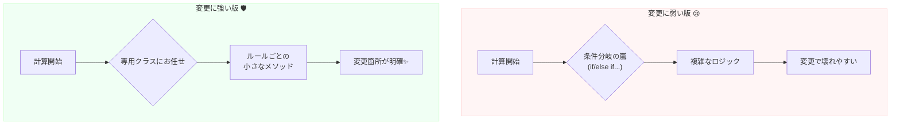

# 第02章：部：【DDDの大きな枠組み】万能ではない「道具」の使い所 (11-20)

### 今日のゴール 🎯

この章を読み終わる頃に、こんな感覚になってたらOKです😊👍

* 「設計って“キレイにする”ことじゃなくて、“変わっても平気にする”ことなんだ！」って腹落ちする💓
* 「どこが変わりそう？」を先に見つけられるようになる🔍
* “最小の設計”で、未来の自分を助けるコツがわかる🧠✨

---

## 1. まず最初に、あるある話🥲📦

たとえば、送料の計算を作りました。

* 5,000円以上は送料無料！🆓
* 沖縄は+1,000円！🏝️
* クール便は+300円！❄️

最初は「よし、できた！✌️」なんだけど……

数日後にこう言われます👇😇

* 「キャンペーンで送料無料ラインが変わります！」
* 「離島判定も必要です！」
* 「温度帯が増えます！」

ここで、**設計があるとラク**で、**ないと地獄**になりがちです🔥

---

## 2. 設計の目的は、たった1つだけ 🧩

**設計の目的 = 変更をラクにすること** 🛠️✨

逆に言うと…

* **変わらないなら、凝った設計はいらない**🙆‍♀️
* **変わりそうなら、そこだけ守る**🛡️

設計は“芸術作品”じゃなくて、**未来の変更に備える保険**みたいなものです💊✨

---

## 3. 「変更」って、具体的に何が変わるの？🔄

変更にはだいたいパターンがあります😊

### よくある変更パターン集 📚✨

* **ルールが変わる**（割引、料金、制限、判定条件）💰
* **種類が増える**（会員ランク、決済方法、配送方法）➕
* **例外が増える**（「ただし北海道は…」みたいなやつ）🧊
* **外部が変わる**（API仕様変更、DB差し替え）🌐
* **画面の見せ方が変わる**（表示順、フィルタ、項目追加）🖥️

この中でも特にヤバいのが…
**「ルール変更」＋「例外追加」**です😵‍💫💥
ここがグチャると、全体がスパゲッティ化しやすいです🍝

---

## 4. じゃあ、何を設計すればいいの？🤔✨

答えはシンプルで…

### ✅「変わりそうな場所」を、1か所に閉じ込める 📦🔒

変更が来たときに、
**触るファイルが1つ**、せいぜい**2つ**なら勝ちです🏆✨

---

## 5. C#ミニ例：送料計算（変更に弱い版）🥲

最初にありがちなやつ👇

```csharp
public static int CalcShippingFee(int totalPrice, string prefecture, bool isCool)
{
    int fee = 800;

    if (totalPrice >= 5000) fee = 0;
    if (prefecture == "Okinawa") fee += 1000;
    if (isCool) fee += 300;

    return fee;
}
```

一見OKだけど…変更が来るとこうなります😇

* 送料無料ラインが「会員ランクで違う」
* 沖縄でも「一定条件は無料」
* 離島は別ルール
* クール便の種類が増える

すると、`if` が増えて、**条件の順番**や**例外の積み重なり**で壊れやすくなります💥



---

## 6. 変更に強い版：「ルール」を別クラスに隔離する🛡️✨

ここでのコツはこれ👇
**“送料計算のルール”を、専用の箱に移す**📦

```csharp
public sealed class ShippingFeeCalculator
{
    public int Calc(int totalPrice, string prefecture, bool isCool)
    {
        int fee = 800;

        fee = ApplyFreeShippingLine(fee, totalPrice);
        fee = ApplyPrefectureSurcharge(fee, prefecture);
        fee = ApplyCoolFee(fee, isCool);

        return fee;
    }

    private static int ApplyFreeShippingLine(int fee, int totalPrice)
        => totalPrice >= 5000 ? 0 : fee;

    private static int ApplyPrefectureSurcharge(int fee, string prefecture)
        => prefecture == "Okinawa" ? fee + 1000 : fee;

    private static int ApplyCoolFee(int fee, bool isCool)
        => isCool ? fee + 300 : fee;
}
```

### 何が嬉しいの？🥰

* 変更が来たら、**このクラスだけ見ればいい**👀✨
* ルールが増えても、**追加場所が明確**🧭
* “どこを直せばいいか”で迷いにくい🫶

これが「設計の目的＝変更のため」の超ミニ版です🌱

---

## 7. さらに強くする：テストを1本だけ付ける🧪✨

変更に強くする最終兵器は、**テスト**です💪
（たくさん要らない！最初は1本でOK🙆‍♀️）

```csharp
using Xunit;

public class ShippingFeeCalculatorTests
{
    [Fact]
    public void TotalPrice_5000_OrMore_IsFree()
    {
        var calc = new ShippingFeeCalculator();

        var fee = calc.Calc(totalPrice: 5000, prefecture: "Tokyo", isCool: false);

        Assert.Equal(0, fee);
    }
}
```

これがあるだけで、仕様変更しても
「壊れてない？」がすぐ分かります😊🔔

---

## 8. “設計するか迷ったとき”の判断ルール🧭✨

迷ったら、これだけでOKです👇😊

### ✅ 次のどれかに当てはまるなら、設計する価値あり💎

* その機能は、今後も育つ予定がある🌱
* ルールが増えそう／例外が増えそう➕
* すでに「変更依頼が来ている」📩
* 自分が1か月後に忘れそう😵‍💫

### ✅ 逆に、設計を薄くしていいケース🧊

* 使い捨てのツール（1回限り）🗑️
* 仕様が固まってない実験段階🧪
* “まず動くものを作る”が最優先🚀

大事なのは、**完璧な設計**じゃなくて
**迷わず進める判断**です😊✨

---

## 9. 【ワーク】変更のための“最小設計”をやってみよう📝🎀

### お題：自分のコードを1つ選ぶ（過去のでもOK）📂

1. 「このコード、どこが変わりそう？」を3つ書く✍️🔍
2. 変わりそうな部分を、**1クラスに集める**📦
3. テストを**1本だけ**作る🧪✨

これだけで、未来の自分がめちゃ助かります🥹💖

---

## 10. AIに手伝ってもらうプロンプト例🤖🪄

コピペで使えるやつ置いときます😊👇

* 「この機能で起きそうな仕様変更パターンを10個出して。例外追加も含めて」
* 「変更が来たときに修正箇所が1か所になるように、責務の分け方を提案して」
* 「このコード、変更に弱いポイントを指摘して。直すなら最小でどこから？」

AIは“コード生成”より、こういう**壁打ち**が超得意です🧠✨

---

## まとめ 🎁✨

* 設計の目的は「キレイにする」じゃなくて **「変更をラクにする」**🛠️
* 変更が来そうな場所を **1か所に閉じ込める**のが最強📦🔒
* 余裕があれば、テスト1本でさらに安心🧪💓

次の章では、「1人開発最大の敵＝記憶の風化」について、もっと具体的に“未来の自分を救う書き方”をやっていきます😊🧠✨
