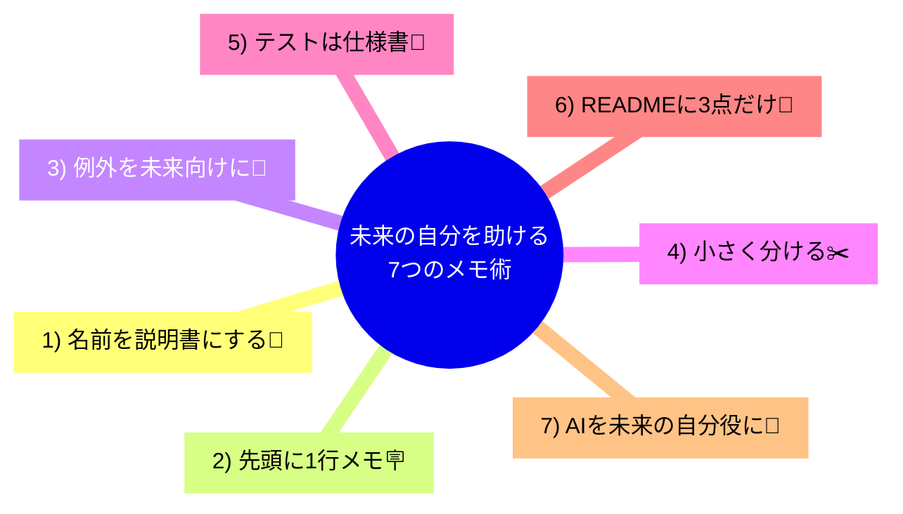

# 第03章：部：【戦略的設計】AIに「このアプリの正解」を教える (21-35)

〜未来の自分を「他人」だと思って書くと、ぜんぶ楽になる〜✨

---

## 1ヶ月後の自分は、だいたい初見の人です😇📦


1人開発って、開発チームがいない代わりに **「未来の自分」** がチームメンバーになります👤✨
でも未来の自分は……

* 「なんでこの処理こうしたの？🤔」
* 「この変数名なに？😵‍💫」
* 「ここ直したらどこ壊れるの？怖い…😱」

ってなる率が高いです。

だからコツはシンプル👇
**未来の自分＝他人（しかも急に引き継いできた人）** だと思って書くこと🫶💡

---

## 記憶が消える“よくある原因”3つ🧊🫠


### ①「前提」が頭の中にしかない🧠🔒

たとえば

* 「この値は必ず正だよね」
* 「ここはログイン済み前提」
* 「この順番で呼ばれるから大丈夫」

こういう“暗黙の前提”は、時間が経つと消えます🥲

### ②「なぜこうしたか」が書いてない📝❌

コードは「何をしてるか」は読めても、
**「なぜそれが必要か」** は読めないことが多いです😵

### ③「関係性」が見えない🕸️🙈

ファイルが増えるほど
「AとBってどう繋がってるんだっけ？」
が起きます。
1人開発の事故原因No.1級です💥

---

## 未来の自分が助かる“7つのメモ術”🧰✨（全部、軽いやつ）



### 1) 名前を“説明書”にする📛🧾


* `data` ❌ → `customerList` ✅
* `flag` ❌ → `isEmailVerified` ✅
* `Do()` ❌ → `CalculateShippingFee()` ✅

**名前だけで8割伝わる** と、未来が救われます🙏✨

---

### 2) 「1ファイル先頭に1行」ルール🪧📄

ファイルの先頭にこれだけ👇

* このクラスは何をする？
* 何をしない？（重要！）

例：

> “注文確定のルールを管理する。DBアクセスはしない。”

これ、めちゃ効きます🫶

---

### 3) 例外メッセージを未来向けにする🚨💬


例外は「今の自分」より「未来の自分」が見る率高めです👀

* “Invalid operation.” ❌
* “注文確定には配送先が必要です” ✅

---

### 4) 「小さく分ける」は最高のメモ✂️✨

長いメソッドは、それだけで記憶にダメージ😵‍💫
**「処理のかたまりごとにメソッド化」**すると、それが目次になります📚

---

### 5) テストは“動く仕様書”になる🧪📘


テストって、未来の自分にとってはこうです👇
**「この機能って何が正解なの？」に答えてくれる紙**✨

特に名前を丁寧に👇

* `Should_fail_when_address_is_missing()`
* `Should_apply_discount_only_for_members()`

読むだけで仕様がわかるのが強いです💪💕

---

### 6) 「READMEに3点だけ」ルール📌📝

長文は続かないので、最低限これだけでOK👇

* このアプリは何？
* 主要な用語（3〜10個）
* よく触る場所（フォルダ/プロジェクト）

これだけで迷子率が激減します🧭✨

---

### 7) AIを“未来の自分役”にする🤖🎭


AIにこう頼むと強いです👇

* 「初見の開発者として、このコードのわかりにくい点を5つ指摘して」🕵️‍♀️
* 「このクラスの責務を1文で言うと？」✍️
* 「命名をもっと分かりやすく10個提案して」💡

AIは“今の自分の脳内”を読めないので、ちょうど良い初見チェックになります✅✨

---

## C#の例：未来の自分が泣くコード → 笑うコード😂➡️😊

### よくある“つらい”例（意図が隠れてる）😵‍💫

```csharp
public int Calc(int a, int b, bool f)
{
    if (f) return a - b;
    return a + b;
}
```

これ、1ヶ月後に見たらこうなりがち👇
「aとbって何？」「fって何？」「なぜ引くの？」😇

---

### 未来の自分が助かる例（名前＋意図）🫶✨

```csharp
public static int CalculatePointChange(int earnedPoints, int usedPoints, bool isUsePoints)
{
    return isUsePoints
        ? earnedPoints - usedPoints
        : earnedPoints + usedPoints;
}
```

さらに一歩だけ進めるともっと安心👇

```csharp
public static int CalculatePointChange(int earnedPoints, int usedPoints, bool isUsePoints)
{
    if (!isUsePoints) return AddPoints(earnedPoints);
    return UsePoints(earnedPoints, usedPoints);
}

private static int AddPoints(int earnedPoints) => earnedPoints;

private static int UsePoints(int earnedPoints, int usedPoints)
{
    if (usedPoints <= 0) throw new ArgumentOutOfRangeException(nameof(usedPoints), "使用ポイントは正の値です");
    if (earnedPoints < usedPoints) throw new InvalidOperationException("所持ポイントが不足しています");
    return earnedPoints - usedPoints;
}
```

ポイント👇

* “意図”がメソッド名に出る📛✨
* “前提”がコードに固定される🔒✅
* 例外が未来向けの文章になる💬🫶

---

## Visual Studioで“記憶の風化”を防ぐ小ワザ🪄🧰

* リネーム（Rename）で命名を後から整える🔁✨
* “Extract Method”で分割して目次化✂️📚
* TODOコメントを置いて、TODO一覧で拾う✅🗂️
* XMLコメント `///` を「重要なところだけ」書く📝🌸

「全部きれいに」は不要です🙆‍♀️
**“迷いやすいところだけ”で効果バツグン**です💥✨

---

## まとめ：未来の自分に優しいコードの合言葉🫶🕰️

✅ 未来の自分は他人
✅ 名前・分割・短いメモが最強
✅ テストは動く仕様書
✅ AIで初見チェックすると事故が減る

---

## 【ワーク】15分でできる！未来の自分を助ける練習⏱️💪✨

### お題🎯

あなたの過去コード（または適当な小さめのクラス）を1つ選んで👇

1. **変数名を3つだけ改善**する📛✨
2. **長い処理を1つだけメソッドに分割**する✂️
3. **先頭に1行メモ**を書く🪧
4. AIにこう聞く🤖

   * 「初見で分かりにくいところを5つ教えて。改善案もお願い！」

### ゴール🏁

“完璧”じゃなくてOK！
**「1ヶ月後の自分が迷いにくい」**が勝ちです🥰🎉

---

次の章に行く前に、もしよければ
あなたが今作ってるアプリの「機能ひとつ」だけ題材にして、上のワークを一緒にやる用の例（命名案・分割案・メモ案）も作れるよ〜😊💖
