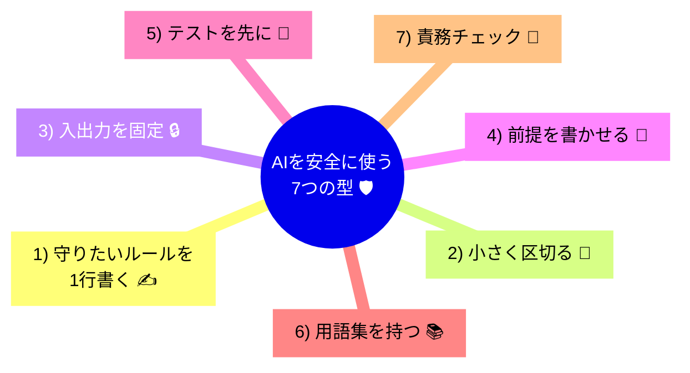

# 第04章：部：【設計の基礎力：戦術】AIを暴走させない「型」の作り方 (36-55)

**AIは「部分」は得意。でも「全体」を壊しやすい**…って話です🧩💥

---

## この章でわかること 📌✨

* AIに「いい感じのコード」を作らせたのに、後で地獄を見る理由 😇➡️😱
* **“部分最適”** が起きるメカニズム 🧠
* AIを安全に使うための **ガードレール**（ルール）✅
* そのまま使える **プロンプト雛形** 📝💡

---

## まず結論：AIに丸投げすると「全体の整合性」が崩れる 🧠🧨


AIはとても優秀です🤖✨
でも得意なのはだいたいこう👇

* 目の前の関数の実装
* よくある設計パターンの当てはめ
* バリデーションや例外処理のテンプレ生成
* リファクタリングの形（見た目）

逆に苦手なのはこう👇

* **アプリ全体で守りたいルール（不変条件）**
* 「この言葉はこの意味」みたいな **用語の統一**
* 変更に強い境界線（どこまでが誰の担当か）
* すでにあるコードの “暗黙の前提” を読むこと

つまり…
AIに「全部いい感じにして！」って頼むと、**局所的には賢いけど、全体の約束を破る**ことがあるんです⚠️😵

---

## 事故あるある：こうやって壊れる 🍝💥

### あるある①：ルールがあちこちに増殖する 🦠🌀

「割引の計算」をAIにお願いしたら、
別の画面用にもう1個、API用にもう1個…って増えていって、
**同じルールが3箇所に散らばる**やつです😇

* 今日はAの計算式
* 明日はBの計算式
* 1ヶ月後「どれが正しいの？」ってなる 😱🌀

---

### あるある②：見た目は綺麗、でも “意味” がズレる 🎀➡️🤯

AIはコードを綺麗にできます✨
でも「このアプリにおける正しさ」までは保証しません。

例：

* 「合計金額」は税抜？税込？送料込み？
* 「会員価格」はどのタイミングで適用？
* 「キャンセル可能」はいつまで？

ここがズレると、**バグというより“仕様事故”**になります🚑💦

---

### あるある③：勝手に依存関係を増やしてくる 🧵😵

AIは親切なので、ついこうしがち👇

* 便利そうなライブラリ追加
* 便利そうな共通化
* 便利そうな抽象化

結果、**ちょっと直したいだけなのに全体が絡まる**やつです🕸️😱

---

## ミニ例：AIがやりがちな「壊し方」🎯

「お金」を `decimal` で扱って、あちこちで計算しているとします。

```csharp
public decimal Add(decimal a, decimal b) => a + b;
```

AIはここに「便利機能」を足してくれるかも👇

```csharp
public decimal Add(decimal a, decimal b)
{
    return Math.Round(a + b, 2);
}
```

一見よさそう？✨
でももしあなたのルールが「通貨によって小数点が違う」「端数処理は最後に一回だけ」だったら…
**ここで丸めた瞬間に全体が壊れます**💥😇

👉 壊れ方が地味なので、あとから発覚して泣きます😭

---

## じゃあどうする？AIを安全に使う「7つの型」✅🧩



### ① まず「守りたいルール」を文章で1行書く ✍️📌

コードより先にこれ！
例：

* 「金額の端数処理は最後に1回だけ」
* 「注文の状態遷移はこの順番のみ」
* 「ポイントはマイナスにならない」

この1行が、AIに渡す**首輪**になります🐶✅（大事！）

---

### ② AIに渡すのは “小さく区切った仕事” だけ 🍰🔪

❌「この機能ぜんぶ作って」
✅「このルールを表す型を作って」「この関数だけ書いて」

AIは**小さい範囲だと天才**です🤖✨
大きい範囲だと、突然ポエムになります🌀

---

### ③ “入力と出力” を固定してから頼む 🔒📦

AIに自由に設計させると、勝手に責務が伸びます😵
だからこう言う👇

* 引数はこれだけ
* 戻り値はこれだけ
* 例外は禁止 / Resultで返す
* DBアクセス禁止
* 現在の命名規則は維持

---

### ④ AIに「前提・仮定」を書かせる 📝🔍

これめっちゃ効きます💡
AIは勝手に前提を作るので、表に出させる！

「実装の前に、あなたが置いた前提を箇条書きして」
って言うだけで、事故率がガクッと下がります✅

---

### ⑤ テストを “先に” 作らせる 🧪✨

AIにコードを書かせる前に、まずテストを書かせると安全です。

* どういう入力で
* どういう出力になるべきか
* どこが境界値か

が固まるので、**全体の約束**が守られやすいです✅

---

### ⑥ “用語集” を短く持つ 📚🐣

同じ意味を違う単語で書くと、AIは混乱します😵‍💫
例：

* User / Customer / Member が混ざる
* Order / Purchase / Transaction が混ざる

小さくでいいので、単語を固定しましょ🧷✨

---

### ⑦ 最後に「責務チェック」をする 🧯✅

生成されたコードを見て、これだけ確認👇

* このクラス、仕事増えすぎてない？😵
* ルールが散らばってない？🌀
* “便利そう” な抽象化が増えてない？🕸️
* 変更するとき、どこ触ればいいか1秒で分かる？⏱️

---

## そのまま使える！AIへの指示テンプレ 📝🤖

### テンプレ①：安全な「関数だけお願い」版 🔧

```text
あなたはC#の実装補助です。
次のルールを絶対に守って、関数のみ実装してください。

【守るルール】
- （例）端数処理は最後に1回だけ
- （例）例外は投げない、Resultで返す
- （例）DBアクセスは禁止

【入力】
- 引数: ...
【出力】
- 戻り値: ...

【期待すること】
- 先に「前提・仮定」を箇条書き
- 次に実装コード
- 最後に簡単なユニットテスト例を3つ
```

### テンプレ②：事故防止「レビュー役」版 🕵️‍♀️

```text
以下のコードをレビューして。
特に次を重点で指摘してほしい。

- ビジネスルールが散らばっていないか
- 責務が増えすぎていないか
- 命名が用語集とズレていないか
- 変更に弱いポイントはどこか

改善案は「最小変更」で3案出して。
```

---

## ミニ演習（今日やるやつ）🎓✨

### 演習A：AIに「壊れ方」を予測させる 🔮💥

1. いまの自分の小さな関数を1つ選ぶ（10〜30行くらい）
2. AIにこう聞く👇

```text
この関数が将来バグるとしたら、どんな変更で壊れる？
「起きそうな仕様変更」を3つ出して、その理由も教えて。
```

👉 これやると、「設計って変更のためなんだ…！」が体感できます😳✨

---

### 演習B：AIに “小さく” 直させる ✂️✅

次にこう頼む👇

```text
さっき挙げた仕様変更のうち1つに対応したい。
ただし「変更箇所は最小」で、責務を増やさない形で直して。
テストも更新して。
```

---

## まとめ 🎀✅

* AIは **部分の実装**が得意🤖✨
* でも **全体の整合性**は勝手に守ってくれない⚠️
* だから人間の仕事は「境界線」と「守るルール」を先に作ること🧩
* コツは「小さく頼む」「前提を出させる」「テストで縛る」🧪🔒

---

次の章（第5章）では、実際に「スパゲッティコード」がどう怖いのか🍝😱
“どこを直すとどこが壊れるか分からない” を、わかりやすく解剖していくよ〜🔪🧠✨
