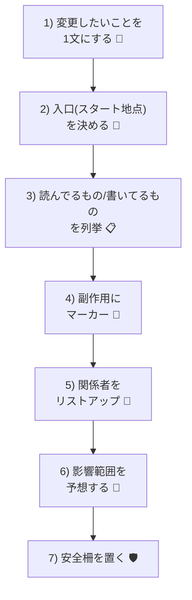

# 第05章：部：【アーキテクチャ】1人のスピードを最大化する構造 (56-75)

〜どこを直すとどこが壊れるか分からない恐怖を、ちゃんと見える化する〜 😱🧩

---

## この章でできるようになること 🎯✨

* 「なんか怖い…」を**言語化**できるようになる 🗣️
* 変更すると壊れそうな場所を、**先にあぶり出す**手順がわかる 🔍
* いきなり大改造せずに、**安全に触るコツ**を持ち帰れる 🛡️

---

## まず、あるあるストーリー 🎬😇

「送料の計算だけ直せばいいよね〜」って思って、ちょっとだけ触ったら…
**なぜかポイント付与が壊れた**、さらに**メール通知が二重送信**、最後に**在庫がマイナス**…
……なにこれ！！！😭😭😭

これが、スパゲッティの恐怖です🍝💥

---

## スパゲッティコードって何？🍝


ひとことで言うと…

> **“どこを触ると何が起きるか、コードから読み取れない状態”** 😵‍💫

パスタみたいに、

* ぐちゃぐちゃ絡まってて
* 1本引っぱったら全部ついてきて
* 切ったらどこが切れたかわからない

そんな状態です🍝🌀

---

## スパゲッティ化してるサイン一覧 🚨👀

当てはまったら要注意！

* 1つのメソッドが長すぎる（スクロール地獄）📜😇
* `if` がネストしまくり（迷路）🌀
* `bool isXxx` フラグで分岐が増殖（スイッチだらけ）🎚️
* いろんな所で同じ変数をいじってる（誰が変えたの？）🫠
* DB/ファイル/メール送信が“ついでに”混ざってる（副作用パーティ）🎉😱
* 変更するとき「祈る」🙏（これ最重要サイン）

---

## 「どこを直すとどこが壊れるか分からない」の正体 🧠💡

ほぼこれです👇

### ① 依存関係がベタベタ 🤝🫠

AがBを呼び、BがCを呼び、CがAを呼び…みたいな循環も起きがち。

### ② 1つの場所が、いろんな役をやってる 🎭

計算も、保存も、通知も、ログも、全部1メソッドでやってると
「どれを変えたらどれが影響受けるの？」が読めなくなる😵‍💫

### ③ 副作用が隠れてる 💣

「計算してるだけに見えて、実は保存してる」みたいなやつ。
これが一番ヤバいです😇

---

## 解剖の基本手順：7ステップ 🧩🔍

「直す」前に「分解して観察」するよ〜！🧑‍🔬✨



### 1) 変更したいことを1文にする 📝

例：

* 「送料を、地域ごとに変えたい」🚚
* 「ポイント付与の条件を変えたい」🎁

**ここがブレると、全部ブレます**😵‍💫

### 2) 入口（スタート地点）を決める 🚪

Windows + Visual Studioなら超ラク👇

* 変更対象っぽいメソッドを右クリック → **“呼び出し階層”**（Call Hierarchy）🔍
* Controller/Handler/Clickイベントなど「外から入る場所」を探す👀

### 3) “読んでるもの/書いてるもの”を列挙する 📋

そのメソッドが触ってるものを、雑でいいから書き出す✍️

* 読む：引数、プロパティ、DB、設定値
* 書く：DB更新、メール送信、ログ、状態変更

**書いてるものが多いほど危険度UP**💣

### 4) 副作用にマーカーを付ける 🧷

見つけたら、コメントでもメモでもOK👇

* DB保存（`SaveChanges` など）🗃️
* 外部API呼び出し 🌐
* メール/通知 ✉️
* ファイルIO 📁

「ここ触ると世界が動く」ポイントです😱

### 5) “関係者”をリストアップする 👥

関わってるクラス・サービス・テーブル・設定値など。
Visual Studioなら

* **“すべての参照を検索”**（Find All References）🔎
  が超強い！

### 6) 影響範囲を予想する（壊れ方を先読み）🔮

「送料を変える」なら

* 合計金額
* クーポン
* ポイント
* メール文面
* 注文確定の条件
  …みたいに波及する可能性がある🌊

この“可能性リスト”があるだけで、恐怖が減ります😌✨

### 7) 安全柵を置く（触る前にガード！）🛡️

いきなり綺麗にしようとしない！まずはこれ👇

* ログを追加して挙動を見る 🧾
* 既存挙動を固定する「ざっくりテスト」を置く ✅
* 変更は小さく、小さく、小さく 🐣

---

## ミニ解剖：スパゲッティ例 🍝（C#）

「送料を直したいだけ」なのに、いろいろ混ざってる例です😇

```csharp
public class OrderService
{
    private readonly AppDbContext _db;
    private readonly EmailSender _email;

    public OrderService(AppDbContext db, EmailSender email)
    {
        _db = db;
        _email = email;
    }

    public decimal Checkout(int userId, int orderId, string region, bool useCoupon)
    {
        var order = _db.Orders.Find(orderId);
        if (order == null) throw new Exception("Order not found");

        if (order.UserId != userId) throw new Exception("Not yours");

        decimal total = 0;
        foreach (var item in _db.OrderItems.Where(x => x.OrderId == orderId))
        {
            total += item.Price * item.Quantity;
        }

        // coupon
        if (useCoupon)
        {
            var coupon = _db.Coupons.FirstOrDefault(x => x.UserId == userId && x.IsUsed == false);
            if (coupon != null)
            {
                total -= 500;
                coupon.IsUsed = true; // ← DB状態変更（副作用）
            }
        }

        // shipping
        if (region == "Tokyo") total += 600;
        else if (region == "Osaka") total += 700;
        else total += 900;

        // points
        if (total >= 3000) order.PointsGiven = 30;
        else order.PointsGiven = 10;

        order.Total = total;
        order.Status = "Paid";

        _db.SaveChanges(); // ← DB保存（副作用）

        _email.Send(order.Email, "Thanks!", $"Total={total}"); // ← 通知（副作用）

        return total;
    }
}
```

### どこが「怖い」の？😱🔍

* 合計計算（純粋な計算）🧮
* クーポン消費（DB状態変更）🗃️
* 送料ルール（条件分岐）🚚
* ポイント付与（別ルール）🎁
* 注文ステータス更新（状態遷移）🔄
* DB保存（副作用）💣
* メール送信（副作用）💥

**1つのメソッドに“世界を動かす処理”が詰まりすぎ**です🍱💦

---

## 解剖メモの付け方（超実用）📝✨

このコードを解剖するなら、メモはこんな感じでOK👇

* 変更したい：送料（shipping）🚚
* 影響しそう：total → points → email文面 → order status 🔗
* 副作用：coupon.IsUsed更新、SaveChanges、Email送信 💣
* 危険：送料変更したらポイント境界（3000円）またぐ可能性あり ⚠️

**これを書けた時点で、もう勝ち**です😌🏆

---

## “安全に触る”ための最小リファクタ3手 🍀🔧

いきなり理想形にしない！まずは怖さを減らす！

### ① 計算だけを外に出す（副作用ゼロにする）🧼

```csharp
private static decimal CalcSubtotal(IEnumerable<OrderItem> items)
    => items.Sum(x => x.Price * x.Quantity);

private static decimal CalcShipping(string region)
    => region switch
    {
        "Tokyo" => 600,
        "Osaka" => 700,
        _ => 900
    };
```

これだけで「送料の変更」が**触りやすく**なります😌✨

### ② 副作用ゾーンを固める（最後にまとめる）🧱

DB保存やメール送信は、できれば最後の方に寄せる📦

### ③ “結果”を一度変数に集める 🧺

「途中で order を書き換えまくる」を減らすと事故率が下がります🚑

---

## Visual Studioでの“迷子防止”セット 🧭💻

* **呼び出し階層（Call Hierarchy）**：入口探しに最強 🔍
* **すべての参照を検索**：関係者リスト作りに最強 👥
* **Find in Files（Ctrl+Shift+F）**：文字列 `"Paid"` とか追うと発見ある😳
* **ブレークポイント & ウォッチ**：変数がどこで変わるか見る👀

---

## AIと一緒に解剖する🧠🤝✨（おすすめプロンプト）

AIは「見落とし発見」が得意です🔍
その代わり、**丸投げはNG**！“解剖メモ”を一緒に作る感じがいいよ😊

### ① 副作用を洗い出す

```text
このC#メソッドの「副作用（外部状態の変更）」を全部列挙して。
DB更新・外部通信・状態変更・ログ出力など、種類ごとに分類して。
```

### ② 変更の波及を予想する

```text
「送料計算のルールを変える」とき、壊れやすいポイントを列挙して。
特に合計金額に依存している処理（ポイント、割引、メール、状態遷移）を疑って。
```

### ③ 最小の安全柵（テスト案）を出してもらう

```text
現状の挙動を壊さないために、まず追加すべき「最小のテストケース」を提案して。
送料の境界値、ポイント境界値、クーポン有無を中心に。
```

---

## ミニワーク（10〜20分）✍️⏰🎀

あなたの（または過去の）コードで、これやってみて！

1. 「変更したいこと」を1文で書く 📝
2. その周辺メソッドの

   * 読んでるもの
   * 書いてるもの
     を箇条書きにする 📋
3. 副作用（DB/通知/外部）に💣マークを付ける
4. 「壊れそうリスト」を3つ書く 😱➡️😌

できたら、そのメモをそのままAIに渡すとめちゃ進みます🤝✨

---

## まとめ 🍝✨

スパゲッティコードは「悪」っていうより、**“見えない”のが怖い**んだよね😇
だからこの章のゴールはこれ👇

* 直す前に、まず **解剖して見える化**する 🔍
* 副作用と依存関係を把握して、**安全に触る**🛡️
* 小さく切り分けて、恐怖を減らす ✂️😌

次の章以降で、さらに「迷わないための型」を手に入れていこうね〜！💪🌸
