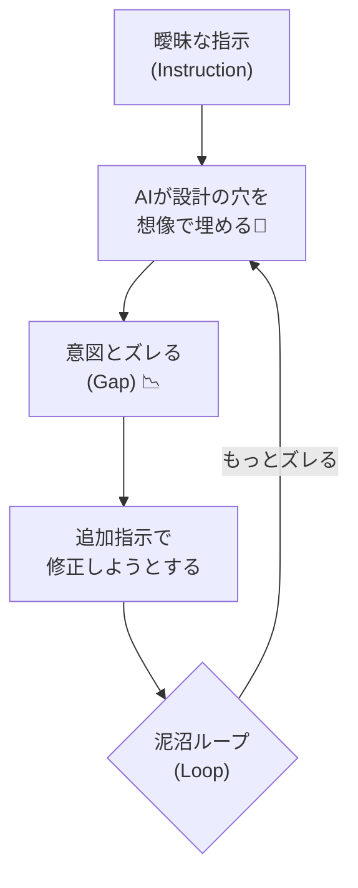

# 第06章：部：【DDD以外の選択肢と割り切り】現実的な設計者へ (76-90)


（プロンプトが長くなるのは、設計がない証拠かも…！）

---

## 0. この章でできるようになること 🎯✨

この章を終えると、こんな状態になります👇

* AIに頼む前に「最低限これだけ決めとこ！」が分かる 🧭
* 長文プロンプト地獄から脱出できる 🏃‍♀️💨
* Copilot/Chatに“迷わない指示”が出せるようになる 🧠🤝
* AIが作ったコードが「何か違う…」になりにくくなる ✅

---

## 1. まず結論：AIは“設計の穴”を埋めようとして暴走しがち 😇➡️😈




AIって、こちらが曖昧だと…

* **それっぽい正解**を自作して埋める
* その結果、**あなたの頭の中の仕様とズレる**
* ズレたから追加指示が増えて、**プロンプトが長文化**
* さらにズレて、また追加指示…（無限ループ）♾️💥

つまり、プロンプトが長いのは「説明が下手」じゃなくて、
**設計（決め事）が未確定**なサインになりやすいんです🙂‍↕️

---

## 2. “プロンプト長文化”あるある症状 😭🧾


次のどれかが起きたら、だいたい設計不足です👇

* 「やっぱこうして」「いや例外は…」「UIは…」が止まらない 🌀
* AIが作るクラス名・責務が毎回ブレる（`UserService` が増殖）🧟‍♂️
* 例外処理やバリデーション方針が毎回変わる 😵
* どこに何を書けばいいか迷って、AIに丸投げしがち 🎲
* 後から読むと「なぜこうした？」が説明できない 📉

---

## 3. AIがブレる“本当の理由”🧠🔍


AIはとても賢いけど、次が苦手です👇

* **あなたのアプリ全体の一貫性を、あなたの代わりに守ること**
* **“境界線”を勝手に判断すること**（どこまでがドメイン？どこからがDB？）

だから、AIに頼む側がまずやるべきは
**「この範囲だけ作って」っていう境界線を作ること**です✍️✨

---

## 4. 迷わないための“最小設計セット”🧰✨（これだけでOK！）


DDDをまだ知らなくても大丈夫👌
AIに渡す前に、最低限これだけ決めるとブレが激減します👇

### ✅ ① ユースケース（やりたいこと）を1行で

例：

* 「ユーザーが商品をカートに入れられる」🛒
* 「予約を確定すると、在庫が減る」📦

### ✅ ② 用語（単語帳）を3〜10個

例：

* ユーザー / 商品 / カート / カート項目 / 数量
  ここがブレると、クラスもDBも全部ブレます😵‍💫

### ✅ ③ ルール（守らなきゃいけないこと）を3つ

例：

* 数量は1以上
* 同じ商品はカート内で1行にまとめる
* 在庫を超えて追加できない

### ✅ ④ 入力と出力（I/O）をざっくり

例：

* 入力：`userId`, `productId`, `qty`
* 出力：成功/失敗、現在のカート合計金額

### ✅ ⑤ 具体例（例を2つ）🧪

例：

* 商品Aを2個 → OK
* 商品Aをさらに1個 → 既存行が3になる

これだけで、AIの暴走率がガクッと下がります📉✨

---

## 5. AIに渡す“設計パケット”📦（コピペで使える）

ここからは超実用✨
AIに頼むとき、毎回これを埋めて貼るだけでOKです！

```text
【目的（1行）】
- 

【用語（単語帳）】
- 

【ルール（3つ）】
1.
2.
3.

【I/O】
- 入力：
- 出力：

【具体例（2つ）】
- 例1：
- 例2：

【今回AIにしてほしいこと】
- （例：ドメイン層のクラス設計だけ / Application層のユースケースだけ / テストだけ）
```

ポイントは最後の
**「今回AIにしてほしいこと」**で範囲を縛ること🔒✨
（ここが無いと、勝手にDBやUIまで作り始めます😂）

---

## 6. “設計なし” vs “設計あり” で頼み方を比べる 🆚😳


題材：カートに商品を追加する

### 😵‍💫 悪い例（設計なし：長文化しやすい）

```text
ECサイトのカート機能を作って。商品追加、削除、合計金額、在庫チェックも。
いい感じの設計で。DDDっぽくして。
```

これ、AIから見ると「情報が足りない」ので

* 用語の定義（カート項目？同一商品は？）
* ルール（在庫チェックのタイミングは？）
* 範囲（UIも？DBも？）
  を**AIが想像で補完**します。ズレます。つらいです😭

---

### 😎 良い例（設計あり：短くても強い）

```text
【目的（1行）】
- ユーザーがカートに商品を追加できる

【用語（単語帳）】
- Cart: ユーザーの買い物カゴ
- CartItem: カート内の1行（商品＋数量）
- Quantity: 数量（1以上）

【ルール（3つ）】
1. Quantityは1以上
2. 同一商品はCartItemを増やさず、数量を加算する
3. 在庫を超える追加は失敗にする（理由付きで）

【I/O】
- 入力：userId, productId, qty
- 出力：成功/失敗、失敗理由（あれば）

【具体例（2つ）】
- 商品Aを2 → OK（A:2）
- 商品Aをさらに1 → OK（A:3）

【今回AIにしてほしいこと】
- Domain層だけで、Cart集約（Cart, CartItem）をC#で設計・実装して
- DBやAPIは書かないで
- 不変条件（ルール）が破られない形にして
```

これならAIは境界線も分かるし、クラスの責務もブレにくいです✨

---

## 7. Visual Studio の Copilot Chat を“設計に使う”コツ 🧠💬

Copilot Chat は Visual Studio のウィンドウから開いて質問できます（例：メニューから開く手順が案内されています）。([Microsoft Learn][1])
Visual Studio 側でも Copilot の体験が統合されてるので、会話とコード提案を行き来しやすいです😊([Visual Studio][2])

### ✅ 使い分け（超重要）✨

* **Chat（会話）**：設計の壁打ち・用語整理・ルール抽出 🗣️
* **Inline Chat（コードの横）**：いま開いてるファイルの修正・リファクタ ✂️
  （MSの説明でも、用途が分かれている感じで書かれています）([Microsoft Learn][1])

---

## 8. “AIに聞く順番”テンプレ（迷ったらこれ）🧭✨

AIにいきなり「コード書いて」じゃなくて、順番を固定すると安定します💡

### Step 1：用語とルールをAIに引き出させる（設計の下ごしらえ）

```text
次の機能について、用語（単語帳）と業務ルール候補を箇条書きで出して。
題材：カートに商品を追加する
前提：同一商品は1行にまとめたい。数量は1以上。在庫超えはNG。
```

### Step 2：あなたが採用するルールだけ残す（捨てる勇気🗑️✨）

```text
今の候補から、この3つを採用する。不要な案は捨てる：
1) ...
2) ...
3) ...
この前提で用語定義を整えて。
```

### Step 3：範囲を絞って実装依頼（Domainだけ等）

```text
この前提でDomain層だけ実装して。DB/API/UIは作らないで。
不変条件が破れないように、公開メソッドを絞って。
```

---

## 9. ちょこっと最新前提メモ（コード書くときの安心感）🧷✨

いまの最新C#は **C# 14**で、**.NET 10**でサポートされています。([Microsoft Learn][3])
（「最新の言語機能で書いていい」状態だと思ってOKです🙆‍♀️）

---

## 10. よくある失敗と、回避ワザ 😭➡️😎

### ❌ 失敗1：AIに“全部”頼む

✅ 回避：**「今回はDomainだけ」**みたいに範囲指定🔒

### ❌ 失敗2：用語がふわふわ（カート項目＝？）

✅ 回避：単語帳を先に作る📗
（たった5語でも効果大！）

### ❌ 失敗3：ルールが後出し

✅ 回避：例を2つ先に書く🧪
例があるとAIは暴走しにくいです！

---

## 11. ミニ演習（15〜30分）📝✨

### 🎯 お題：簡易「予約」機能

* 目的：ユーザーが予約を確定できる
* ルール例：

  1. 予約枠が埋まってたら失敗
  2. 同一ユーザーは同じ枠を二重予約できない
  3. キャンセルすると枠が空く

### ✅ 手順

1. 上の「設計パケット」📦を埋める
2. AIに「用語」「ルール候補」を追加で出させる
3. 採用するルールを3つに絞る
4. 「Domain層だけ」実装依頼

### 💬 最後にAIへこの質問をしてみてね

```text
この設計で、将来変更が入りそうなポイントはどこ？
変更に強くするために、今のうちに境界線として切っておくべきものは何？
（コードは出さなくてOK、議論だけ）
```

これができたら、もう“AIを設計の壁打ち相手”として使えてます👏🥳

---

## 12. この章のまとめ 🎁✨

* プロンプトが長い＝あなたがダメ、じゃない🙅‍♀️
  **未確定な設計が多いサイン**になりやすい
* AIに渡す前に「最小設計セット（目的・単語帳・ルール・I/O・例）」を作る🧰
* **範囲指定（Domainだけ等）**でAIの暴走を止める🔒
* Copilot/Chatは「設計の会話 → 実装」の順が安定🧠➡️💻

---

## 参考（必要なときだけチラ見でOK）📚✨

* C# 14 が最新で .NET 10 でサポート([Microsoft Learn][3])
* Visual Studio の Copilot / Copilot Chat の使い方([Microsoft Learn][1])
* GitHub公式：Copilot Chat はIDE内でも使える([GitHub Docs][4])

---

次に進めるなら、第7章（疎結合・高凝集）に行く前に、今日作った「設計パケット」📦をテンプレとして保存しておくのが超おすすめです😊💾✨

[1]: https://learn.microsoft.com/en-us/visualstudio/ide/visual-studio-github-copilot-chat?view=visualstudio&utm_source=chatgpt.com "About GitHub Copilot Chat in Visual Studio"
[2]: https://visualstudio.microsoft.com/github-copilot/?utm_source=chatgpt.com "Visual Studio With GitHub Copilot - AI Pair Programming"
[3]: https://learn.microsoft.com/en-us/dotnet/csharp/whats-new/csharp-14?utm_source=chatgpt.com "What's new in C# 14"
[4]: https://docs.github.com/ja/copilot/how-tos/chat-with-copilot/chat-in-ide?utm_source=chatgpt.com "IDE で GitHub Copilot に質問する"
