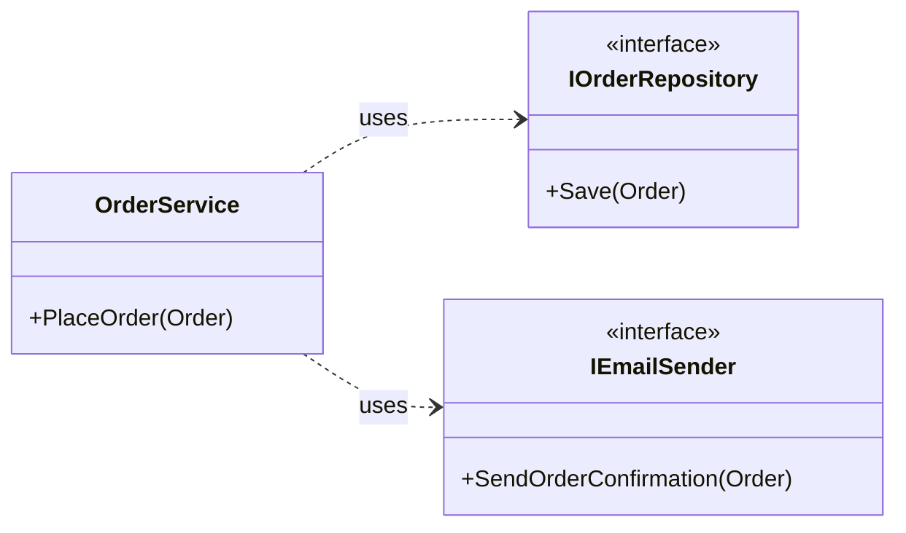

# 第07章：部：【継続と成長】AI時代に生き残る設計者になる (91-100)

設計で迷ったとき、いちばん頼りになる“ものさし”がこれです👇
**疎結合（そけつごう）** と **高凝集（こうぎょうしゅう）** 🧭🧩

この2つが強いほど、コードはだいたい「強い」💪（＝直しやすい＆壊れにくい）です！

---

## 1. まず結論：こう覚えるとラク！🍀

* **疎結合 = つながりがゆるい** 🤝（Aを変えてもBが巻き込まれにくい）
* **高凝集 = まとまりが良い** 🧺（同じ目的のものが同じ場所に集まってる）

イメージはこんな感じ👇

* 疎結合：**LEGO** 🧱（パーツ交換できる）
* 密結合：**瞬間接着剤で固めた模型** 🫠（1個直すと全部壊れる）
* 高凝集：**引き出し整理** 🗂️（文房具は文房具の引き出しに）
* 低凝集：**闇鍋** 🍲（何でも1つの鍋に入ってて探せない）

---


## 2. 疎結合（Loose Coupling）ってなに？🔌✨

### ✅ 疎結合のゴール

**「変更の影響範囲」を小さくすること** 🎯

たとえば…

* メール送信の仕組みを変えたい 📧
* DBをSQLite→SQL Serverに変えたい 🗃️
* ログライブラリを変えたい 🧾

こういう変更が来ても、**関係ないコードまで直す羽目にならない**のが疎結合です😊

### ❌ 密結合あるある（地雷）💣

* `new` があちこちに散らばってる 🧨
* 具体クラスにべったり依存してる 🧱
* `static` な便利関数が増えすぎる 🧟‍♀️
* 1つのクラスが「全部知ってる＆全部やる」👑

---

## 3. 高凝集（High Cohesion）ってなに？🧩✨

### ✅ 高凝集のゴール

**「そのクラスがやるべきこと」がハッキリしてること** 🔍

理想は👇

* **責務（やること）を一言で言える** 🗣️
  例：「注文の合計金額を計算するクラスです」💰

### ❌ 低凝集あるある（混ぜすぎ）🍳

* 「ユーザー管理」クラスなのに、PDFも作り始める 📄
* 画面用の整形とビジネスルールが同居してる 🎭
* DBアクセスと計算ロジックが同じメソッドにいる 🧟

---

## 4. 例でつかむ：密結合×低凝集の“つらいコード”😵‍💫

たとえば「注文してメールを送る」処理が、こうなってたら危険信号です🚨

```csharp
public class OrderService
{
    public void PlaceOrder(int userId, int price)
    {
        // ルール（ドメイン）
        if (price <= 0) throw new Exception("price must be positive");

        // DB（インフラ）
        using var conn = new SqlConnection("...");
        conn.Open();
        // いろいろSQL...

        // メール（インフラ）
        using var smtp = new SmtpClient("smtp.example.com");
        smtp.Send("from@example.com", "to@example.com", "Order", "Thanks!");
    }
}
```

### これの何がつらいの？🥲

* DB変えたらこのクラスを直す 🗃️➡️🧨
* メール送信手段変えてもここを直す 📧➡️🧨
* テストがしにくい（DBとメールが動いちゃう）🧪💥
* 「注文のルール」が見えにくい（ノイズ多すぎ）🌫️

➡️ **密結合（DB/メールにべったり）**
➡️ **低凝集（注文・DB・メールがごちゃ混ぜ）**

---

## 5. 改善：疎結合×高凝集の形にしてみる 🌈✨

ポイントはこれ👇
**「やりたいこと」だけ残して、外部の詳細を外に出す** 🧹



```csharp
public interface IOrderRepository
{
    void Save(Order order);
}

public interface IEmailSender
{
    void SendOrderConfirmation(Order order);
}

public class OrderService
{
    private readonly IOrderRepository _repo;
    private readonly IEmailSender _email;

    public OrderService(IOrderRepository repo, IEmailSender email)
    {
        _repo = repo;
        _email = email;
    }

    public void PlaceOrder(Order order)
    {
        // ルール（ここに集中✨）
        order.Validate();

        _repo.Save(order);
        _email.SendOrderConfirmation(order);
    }
}

public class Order
{
    public int Price { get; }

    public Order(int price) => Price = price;

    public void Validate()
    {
        if (Price <= 0) throw new ArgumentException("Price must be positive");
    }
}
```

### ここが良くなった！🎉

* OrderServiceは「注文する」だけに集中 🧠✨（高凝集）
* DBやメールの詳細が差し替え可能 🔁（疎結合）
* テストが超ラクになる 🧪💖（メール送らない偽物を使える）

---

## 6. “迷ったらこれ”チェックリスト ✅📝

### ✅ 高凝集チェック（まとまり）

* このクラス、**一言で説明できる？** 🗣️
* 変更理由は **1つ** に近い？ 🎯
* メソッド名がバラバラの方向を向いてない？ 🧭

### ✅ 疎結合チェック（つながり）

* 具体クラスに依存しすぎてない？ 🧱
* `new` が業務ロジックの中に大量にない？ 🧨
* 外部（DB/メール/ファイル/HTTP）に触るコードが混ざってない？ 🌐📧🗃️

---

## 7. ちいさな練習（5分）✍️🐣

### 演習A：責務を一言で言ってみよう 🗣️

手元のクラスを1つ選んで、こう言えるか試してみてください👇

* 「このクラスは、◯◯をするクラスです」
  もし言えないなら、**低凝集のサイン**かも😳

### 演習B：外部アクセスを探せ！🔎

次の単語が同じメソッドに混ざってたら黄色信号🚥

* `SqlConnection` / `DbContext` 🗃️
* `HttpClient` 🌐
* `File` / `Directory` 📁
* `SmtpClient` 📧

見つけたら「外に出せないかな？」って考えるだけでOKです🙆‍♀️✨

---

## 8. AIに手伝わせる“魔法の聞き方”🧠🤖✨

コピペで使えるやつ置いときます📌（コードを貼って聞く用）

* 「このクラスの責務を一言で言うと？複数あるなら分割案も出して」🧺
* 「密結合ポイントを列挙して、差し替え可能にする案を出して」🔁
* 「テストしやすくするために依存を外に出す設計に直して」🧪

---

## まとめ 🎀

* **疎結合**＝変更の波を小さくする 🌊➡️🪣
* **高凝集**＝“やること”を一点集中させる 🎯✨
* 迷ったら、**責務を一言**＆**外部アクセス混ざってない？**で判断✅

---

次の章に進む準備も兼ねて質問！💬😊
あなたが今作ってる（または作りたい）機能って、「注文」「予約」「在庫」「ユーザー」みたいに、どんな“題材”ですか？🍞🎮📅
それっぽい例に寄せて、次章以降のサンプルを組み替えていけます✨
