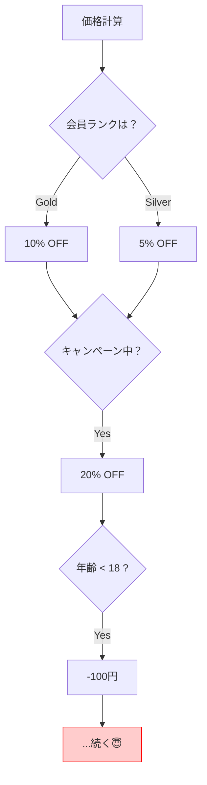

# 第8章：「汚く書いて後で直す」が1人開発で失敗する理由 🧨🧹


「とりあえず動けばOK！あとでキレイにしよ〜😄」って、最初はめっちゃ魅力的に見えるんだよね✨
でも1人開発だと、これが高確率で**“詰みルート”**になります…😵‍💫

---

## 1. まず結論：**“後で直す”はだいたい来ない** ⏰💥


理由はシンプルで、

* 追加機能が来る📈
* バグが来る🐛
* 期限が来る🗓️
* やる気が消える🫠（あるある）

結果、汚いコードの上に新機能を積み上げて…
**「直せない巨大ブロック」**が完成しちゃうの🥲

---

## 2. 失敗する理由①：汚い部分は“増殖”する 🧟‍♀️➕➕➕


汚いコードって、そこだけ汚いまま終わらないのが怖いところ😱

* 「この書き方でいいか」→ 似たコードが増える
* 「ここも同じように」→ コピペが増える
* 「例外処理あとで」→ 例外処理が永遠にない

そして気づくと、どこを直してもどこかが壊れる…💣

---

## 3. 失敗する理由②：未来の自分は“他人”になる 👤📉


1週間後の自分「え…これ何…？」
1ヶ月後の自分「誰が書いたの？（自分）」
3ヶ月後の自分「触りたくない…」🙈

1人開発の最大の敵は、**記憶の風化**🧠💨
「後で直す」って、実は
**“後で思い出しながら直す”**って意味になるから、コストが跳ね上がるの😭

---

## 4. 失敗する理由③：大リファクタは“仕様変更”と同じ 🎭⚠️


汚いコードを後から一気に直そうとすると、こうなる：

* どこが正しい動きか分からない🤷‍♀️
* 変更したら何が壊れたか分からない😵
* テストがないと確認できない🧪❌
* 結局「やめよ…」ってなる🫠

つまり大リファクタって、実質 **“別アプリ作り直し”** に近いのよ…😇

---

## 5. AI時代の落とし穴：汚いコードはAIで“高速増殖”する 🤖💨🧨


AIに「機能追加して！」って頼むと、すぐ追加してくれる✨
でも…**汚い設計のままだと**AIはこうなる：

* 既存の汚さに合わせて拡張する（＝汚さ強化）🧟‍♂️
* その場しのぎの分岐が増える🌿
* “全体の整合性”より“部分の実装”を優先する🧩

だからAI時代ほど、**最初の骨組み（境界線・ルール）**が大事になるよ🧱✨

---

## 6. ミニ例：こうやって“汚さ”は育つ 🌱😵‍💫

たとえば「会員ランクで割引が変わる」みたいな処理。



### 🙅‍♀️ 汚くなりやすい例（分岐が育つ…）

```csharp
decimal CalcPrice(decimal basePrice, string rank, bool isCampaign, int age)
{
    var price = basePrice;

    if (rank == "Gold") price *= 0.9m;
    else if (rank == "Silver") price *= 0.95m;

    if (isCampaign) price *= 0.8m;

    if (age < 18) price -= 100;

    // そのうち「地域」「購入回数」「曜日」…が増える😇
    return price;
}
```

これ、最初は動くし速い👍
でも機能が増えると、`if` がジャングル化して **誰も触れなくなる**🌳😇

---

## 7. じゃあどうする？「完璧」じゃなくて「小さく整える」🧹✨

ポイントはこれ👇

### ✅ ルール1：**“後でまとめて”じゃなく、“今ちょっとだけ”**

* 追加のついでに、近くの汚れを1個だけ掃除🧽
* 1回で全部直さない（破壊の元）💥

### ✅ ルール2：**境界線だけは先に引く**（ざっくりでOK）

たとえば最小でもこう分けるだけで効果大：

* `Domain`：ルール（値・計算・制約）🧠
* `Application`：やりたいこと（ユースケース）🧭
* `Infrastructure`：DBや外部サービス🗄️
* `Web`：画面/API🌐

「汚くしていい場所」を作らないのが大事💡
※最初はフォルダだけでもOKだよ📁✨

### ✅ ルール3：大事なロジックには**超ミニテスト**を置く 🧪🧸


* “価格計算”とか“ルール”だけテストする
* DBや画面は後回しでOK

テストがあると、「直す」が怖くなくなるよ😌✨

---

## 8. 1人開発向け：**「後で直す」を封じるチェックリスト** ✅🧠


新機能を足す前に、30秒だけこれ見る👀✨

* [ ] 変数名が「a」「tmp」になってない？🫣
* [ ] 1つのメソッドが“2つ以上のこと”してない？🎭
* [ ] `if` が増えすぎてない？🌿
* [ ] 同じ処理をコピペしてない？📋
* [ ] “このルール”はDomainに置くべきじゃない？🧠

全部やらなくてOK！
**1個だけ直して進む**のが勝ち🏆✨

---

## 9. AIに頼むときのコツ：いきなり直させない 🤖🧯

AIにお願いするときは、こうすると事故が減るよ👇✨

### 🧾 おすすめプロンプト（テンプレ）

（そのままコピペでOK💖）

```text
このC#コードをリファクタしたいです。
目的：可読性を上げ、変更に強くしたい。
制約：
- 外部から見た振る舞い（仕様）を変えない
- まず「壊れてないことを確認するための最小テスト案」を出す
- 変更は段階的に（1ステップずつ）提案して、各ステップの意図も説明して
- できれば Domain/Application の境界を意識した分割にして
対象コード：
（ここに貼る）
```

ポイントは「まずテスト」「段階的」🧪➡️🧱✨
これだけで事故率がグッと下がるよ〜🙌

---

## 10. ミニ演習：あなたのコードで“後で直す”を卒業 🎓🧹✨

過去の自作コードから、次のどれかを1つ選んでね👇

* `if` が多いメソッド🌿
* 変数名があいまいな場所🫥
* コピペがある場所📋

そしてやることはこれだけ！

1. **その処理の“期待する結果”を3つ書く**📝
   （例：Goldなら10%引き、キャンペーンならさらに20%引き…）
2. AIに「最小テスト案」を出させる🧪
3. 直すのは **1回で1か所だけ**🧹✨

成功したら、あなたはもう
「後で直す」じゃなくて **「進みながら整える」人**だよ💖🎉

---

必要なら、この第8章に合わせて「あなたが作ってるアプリの例」で、**“汚く育つパターン”→“小さく整えるパターン”**を具体的に作って一緒に練習できるよ😊✨
（コード貼ってくれたら、その場で教材化もできる📚💪）
