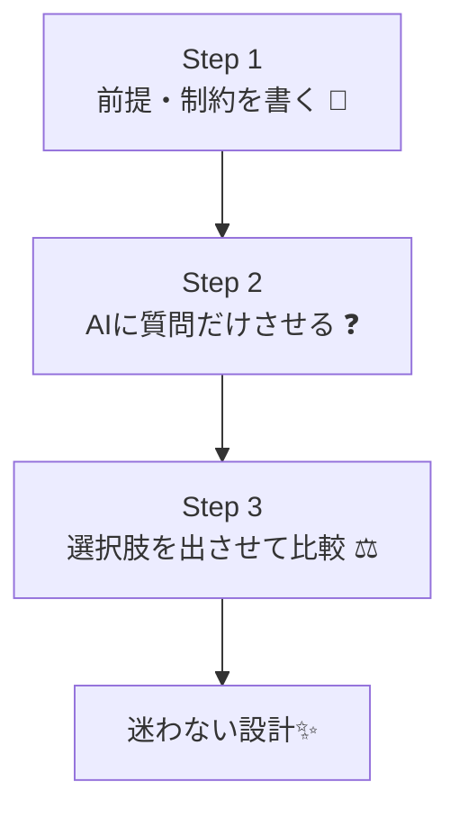

# 第9章：AIを「コードを書く作業員」ではなく「設計の壁打ち相手」にする 🤝🧠✨


AIって、放っておくと「とりあえず動くコード」を秒速で出してくれるんだけど…
それをそのまま採用すると、あとで自分が迷子になりがちです 😵‍💫💦

この章では、AIを **“作業員” じゃなくて “壁打ち相手”** にして、
**迷わない設計**を作る使い方を身につけます 💪📌

---

## 1. 「作業員AI」だと起きる事故あるある 🚑💥


* 仕様があいまいなままコードが増える 📈
* 途中から「これ誰が責任持つの？」状態になる 🤷‍♀️
* ちょっと直したら別の場所が壊れる 🧨
* AIへの指示がどんどん長くなる（＝設計がないサイン）🌀

つまり、AIにやらせたいのは **“コードを書く”** じゃなくて…

✅ **「考える手前の整理」**
✅ **「抜け漏れ探し」**
✅ **「選択肢とトレードオフの比較」**

ここです 🥰📝

---

## 2. 壁打ちAIの役割はこの4つが最強 🎭✨


### ① 仕様の穴を見つける質問係 🕵️‍♀️❓

「それって、いつ？誰が？例外は？」を延々と聞いてくれる子。

### ② 用語をそろえる辞書係 📚🔤

「会員」「ユーザー」「登録者」…同じ意味？違う意味？を整える。

### ③ 設計の選択肢を並べる比較係 ⚖️🧩

「A案は速いけど変更に弱い」「B案は少し重いけど安全」みたいに整理。

### ④ 意地悪レビュアー係 😈🔍

「それ、将来絶対困るよ？」「責務が混ざってない？」って刺してくる。

---

## 3. “迷わない” 壁打ちの基本手順（たった3ステップ）🧭✨




### ステップ①：最初に「前提・制約・やらないこと」を書く 🧱📝

ここがあると、AIが暴走しにくいです 🙆‍♀️

**テンプレ（1分でOK）**👇

* 目的：何を達成したい？🎯
* 入力：何が入ってくる？📥
* 出力：何を返す？📤
* ルール：絶対守る条件は？📏
* 制約：使う技術／使わない技術は？🧰
* やらないこと：今回は対象外！✋

---

### ステップ②：AIに「質問だけ」させる ❓❓❓

いきなりコードを書かせない！ここ大事！🛑

---

### ステップ③：選択肢を2〜3個出させて比較する ⚖️✨

「小さく作る案」と「堅く作る案」みたいに並べると迷いが減ります 😊

---

## 4. コピペで使える「壁打ち用プロンプト」集 🧠📎✨

### 4-1. まずは質問だけしてもらう（超おすすめ）❓


```text
あなたは設計レビュー役です。
次の仕様について、まずは「確認質問」だけを15個出してください。
コード案はまだ出さないでください。

【目的】
（ここに目的）

【仕様】
（ここに仕様）

【制約・やらないこと】
（ここに制約）
```

---

### 4-2. 用語の辞書（ユビキタス言語）を作る 📚✨


```text
次の仕様に登場する用語を一覧化して、
「定義」「別名」「混同しやすい言葉」を整理してください。
最後に、用語の衝突が起きそうな箇所を指摘してください。

【仕様】
（ここに仕様）
```

---

### 4-3. 設計案を2〜3個に分けて比較する ⚖️


```text
この機能の設計案を3つ提案してください。
各案について「メリット」「デメリット」「将来の変更に強いか」を比較してください。
最後に、初心者が実装して事故りにくい案をおすすめしてください。

【仕様】
（ここに仕様）
```

---

### 4-4. 意地悪レビュアー（バグの種を探す）😈

```text
あなたは意地悪なレビュアーです。
次の設計方針の「壊れやすい点」「将来詰む点」「テストしにくい点」を
容赦なく10個指摘してください。改善案もください。

【設計方針】
（ここに方針）
```

---

## 5. ミニ題材でやってみよう：クーポンの割引計算 🎫🛒✨

### よくある “事故る” 実装イメージ 😵‍💫

割引・会員・期限・端数処理…を1つの関数に押し込むと、だいたい未来で泣きます 😭

例（ありがち）👇

```csharp
public static decimal CalcTotal(
    decimal price, int qty,
    string? couponCode,
    bool isMember,
    DateTime purchasedAt)
{
    var total = price * qty;

    if (!string.IsNullOrWhiteSpace(couponCode))
    {
        if (couponCode == "OFF10") total *= 0.9m;
        if (couponCode == "OFF100" && total >= 1000m) total -= 100m;
        // 期限とか併用不可とか増えていく…
    }

    if (isMember) total *= 0.95m;

    // 端数処理
    total = Math.Floor(total);

    return total;
}
```

このコード、いまは動くけど…
「クーポン併用不可になった」
「会員割引がカテゴリ別になった」
「小数点処理が四捨五入に変わった」
みたいな変更で、簡単に爆発します 💣💥

---

## 6. 壁打ちで “迷わない形” に寄せる 🧭✨

### 6-1. まずAIに質問させる（ここが9割）❓

AIにこう聞いてみてね👇

* クーポンは複数使える？🎫🎫
* 会員割引とクーポン、順番は？🔁
* 端数処理はいつやる？最後だけ？🧮
* 返金時はどうなる？返品は？↩️
* 「無効なクーポン」はエラー？無視？⚠️

この質問に答えるだけで、設計の芯ができてきます 🌱✨

---

### 6-2. 次に「役割」を分ける案を出してもらう 🧩

割引計算って、ざっくり分けると👇

* 価格と数量 → 小計を作る 💰
* 割引ルール → 適用する 🎯
* 端数処理 → 最後にまとめてやる ✂️

この「役割の分割」をAIに提案してもらうと、
コードを書く前に勝ちが決まります 😌🏆

---

## 7. Visual Studioでの“壁打ちメモ”の置き場所 🗂️📝✨

おすすめはこれ👇

* ソリューション直下に `docs` フォルダ 📁
* `docs/design-notes.md` に壁打ち結果を残す ✍️
* 「用語集」「決めたこと」「保留」を箇条書きでOK ✅

ポイントは、**AIとの会話の結論だけ残す**こと！
ログ全部は長いので、未来の自分が読める形が正義です 😊📌

---

## 8. チェックリスト：AIを壁打ちにする時のルール ✅🧠✨

* [ ] いきなりコードを書かせない（まず質問）🛑
* [ ] 「やらないこと」を先に宣言する ✋
* [ ] 1回の依頼は1目的（欲張らない）🍰
* [ ] 代替案を必ず2つ以上出させる ⚖️
* [ ] 「その設計の弱点も言って」とセットで聞く 😈
* [ ] 結論をメモに残す（未来の自分用）📝

---

## 9. 【ミニ演習】あなたの機能で壁打ちしてみよう 🎓✨

次のどれか1つでOKだよ〜 🥳

* ログイン機能 🔑
* 予約機能 📅
* ポイント付与 🎁
* 在庫管理 📦

やることはこれだけ👇

1. 目的・入力・出力・ルール・やらないことを書く 📝
2. AIに「質問15個」だけ出させる ❓
3. その質問に答えながら、用語をそろえる 📚
4. 設計案を2〜3案にして比較する ⚖️

ここまでできたら、もう “迷い” が激減します 😌✨

---


