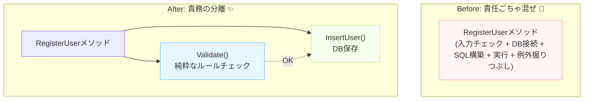

# 第10章【ワーク】AIに「読みづらいコード」を批評してもらおう🧠✨（未来の自分を救う回）


この章は「AIにレビューしてもらう練習」です🙌
ポイントは **“AIに直させる” じゃなくて “読みづらい理由を言語化させる”** ことだよ📝✨

---

## 1. 今日やること（ゴール）🎯

* 自分の過去コード（読みにくいやつ）を1つ選ぶ📦
* AIに「どこが読みにくいか」を **具体的に** 指摘してもらう👀
* その中から **自分が直すポイントを3つ** 決める✅
* 最後に **ちょっとだけリファクタ** する🔧✨

---

## 2. まず「素材」を選ぼう🍳（コードの選び方）

おすすめはこんなコード👇（選びやすい順）

* 1つのメソッドが長い（50行以上）📜💦
* `if` が多い、ネストが深い🌲
* DB / API / バリデーション / 計算が全部混ざってる🍲
* 変数名が `tmp` / `data` / `flag` だらけ😵
* 同じ処理がコピペされてる📄📄📄

**コツ**：最初は「1ファイル」じゃなくて「1メソッド」だけでOKだよ🙆‍♀️✨
（AIに投げる量が多いと、話が散りやすいの🥺）

---

## 3. AIに貼る前の“安全チェック”🔐

これだけはやろう〜！🧯

* APIキー・接続文字列・パスワードは消す（`"*****"` に置換）🔒
* 実名や個人情報も消す🫥
* 長すぎるなら、関係ない部分を削る✂️

---

## 4. AIへの頼み方テンプレ（コピペOK）📨✨

### テンプレA：まずは「何が起きてるコードか」説明させる🧩

AIに **現状把握** させると、レビューが当たりやすいよ🎯

```text
次のC#コードが「何をしているか」を日本語で要約して。
その後、読みづらい点を「理由つき」で10個あげて。
改善は“いきなり全部書き換え”ではなく、段階的な案にして。

【コード】
（ここに貼る）
```

---

### テンプレB：「読みづらさ」をカテゴリ別に殴ってもらう🥊✨

```text
次のコードをレビューして。
指摘はカテゴリ別に出してほしい：

1) 命名（変数/メソッド/クラス）
2) 責務（やってることが混ざってない？）
3) 条件分岐（ネスト、ガード節）
4) 依存（DB/HTTP/時間/乱数などの外部要素）
5) 例外・エラー処理
6) テストしやすさ

それぞれ「なぜ問題か」「どう直すか」を短く書いて。

【コード】
（ここに貼る）
```

---

### テンプレC：「最小の改善だけ」提案させる（暴走防止）🧯

```text
このコードを改善したい。
ただし条件がある：

- まずはリファクタ1回目として「変更量を最小」にしたい
- 振る舞い（結果）は変えない
- 1コミットで終わる範囲にする

具体的な変更点を3〜5個に絞って提案して。

【コード】
（ここに貼る）
```

---

## 5. ワークの進め方（おすすめ手順）🧭✨

### Step1：AIレビューをもらう🤖💬

テンプレA → B → C の順がやりやすいよ🙌

### Step2：指摘を「自分の言葉」で3つに絞る✍️

AIの指摘が正しくても、全部は直さない！🙅‍♀️
まずはこれだけ選ぶ👇

* 直すと効果が大きい💥
* 自分が理解できる🙂
* すぐ直せる（1コミット）✅

### Step3：小さく直す🔧

「関数分割」「命名」「ガード節」だけでも十分勝ち✨

### Step4：もう一回AIに見せて点数つけてもらう📈

```text
改善後のコードです。
改善前と比べて、読みやすさを10点満点で採点して。
良くなった点と、次に直すならどこかも教えて。

【コード（改善後）】
（ここに貼る）
```

---

## 6. ミニ実演（サンプル）📌（こういうのが“読みにくい”例）

※あなたのコードじゃなく、例だよ〜！😆



### Before（混ざりすぎコード）🍲💦

```csharp
public int RegisterUser(string name, string email, string password, int age, string memo, string connStr)
{
    if (name == null || name.Trim() == "" || name.Length > 50) return -1;
    if (email == null || !email.Contains("@")) return -2;
    if (password == null || password.Length < 8) return -3;
    if (age < 0 || age > 120) return -4;

    using var con = new SqlConnection(connStr);
    con.Open();

    var sql = "INSERT INTO Users(Name,Email,Password,Age,Memo,CreatedAt) VALUES('" 
        + name + "','" + email + "','" + password + "'," + age + ",'" + memo + "',GETDATE()); SELECT SCOPE_IDENTITY();";

    using var cmd = new SqlCommand(sql, con);

    try
    {
        var id = Convert.ToInt32(cmd.ExecuteScalar());
        return id;
    }
    catch
    {
        return -999;
    }
}
```

AIがよく言いそうな指摘（例）👇👀

* 命名：`RegisterUser` が「検証」「DB保存」「例外処理」までやってる🌀
* 責務：バリデーションとDBが同じ場所にある🍲
* 条件分岐：エラーコードがマジックナンバー化してる🎲
* 依存：DB接続文字列を引数で受けて責務が混線🧵
* 例外：`catch` が握りつぶしで原因が消える🫠
* 重大：SQL文字列連結は危険（しかもパスワード平文）🚨

### After（最小改善の例）✨

「振る舞いを変えず」「変更量を小さく」だと、まずはこれくらいが現実的🙆‍♀️

```csharp
public int RegisterUser(string name, string email, string password, int age, string memo, string connStr)
{
    var validationResult = Validate(name, email, password, age);
    if (validationResult != 0) return validationResult;

    try
    {
        return InsertUser(name.Trim(), email, password, age, memo ?? "", connStr);
    }
    catch
    {
        return -999;
    }
}

private static int Validate(string name, string email, string password, int age)
{
    if (string.IsNullOrWhiteSpace(name) || name.Length > 50) return -1;
    if (string.IsNullOrWhiteSpace(email) || !email.Contains("@")) return -2;
    if (string.IsNullOrWhiteSpace(password) || password.Length < 8) return -3;
    if (age < 0 || age > 120) return -4;
    return 0;
}

private static int InsertUser(string name, string email, string password, int age, string memo, string connStr)
{
    using var con = new SqlConnection(connStr);
    con.Open();

    const string sql = """
        INSERT INTO Users(Name, Email, Password, Age, Memo, CreatedAt)
        VALUES (@Name, @Email, @Password, @Age, @Memo, GETDATE());
        SELECT SCOPE_IDENTITY();
        """;

    using var cmd = new SqlCommand(sql, con);
    cmd.Parameters.AddWithValue("@Name", name);
    cmd.Parameters.AddWithValue("@Email", email);
    cmd.Parameters.AddWithValue("@Password", password);
    cmd.Parameters.AddWithValue("@Age", age);
    cmd.Parameters.AddWithValue("@Memo", memo);

    return Convert.ToInt32(cmd.ExecuteScalar());
}
```

この時点での勝ちポイント🏆✨

* 役割が分かれた（Validate / Insert）🧩
* SQLが見やすくなった（生文字列）📜
* 連結やめてパラメータ化できた🔒
* 本体メソッドが読みやすい（上から読める）📖

（本格的な改善はこの先の章でやっていく感じだよ〜！💪😊）

---

## 7. 提出物（自分用メモでOK）📒✨

この4つを書いたら、学びが爆伸びする🔥

1. AIの指摘10個（コピペでOK）🤖
2. 自分が直すと決めた3つ✅✅✅
3. 直したコード（差分）🔧
4. 学びメモ（例：「責務が混ざると読む気が失せる」）💡

---

## 8. おまけ：AIレビューがブレるときの魔法の一言🪄

AIが「大改造案」を出してきたら、こう言うと戻ってくるよ😆

```text
今回は学習目的なので、変更量は最小で。
まず“読みやすさ”だけ改善して。設計変更は次回。
```

---

もしよければ、あなたの「読みにくいコード」（1メソッドでOK！）を貼ってくれたら、ここで私が **テンプレの形に整えて** AIに投げる用プロンプトまで作るよ〜😊✨（秘密情報は消してね🔐）
