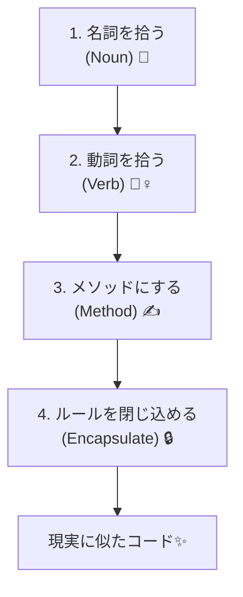

# 第11章：DDDの正体 🧠✨


**プログラムを「現実の仕事」に似せること**🏫🍰📦

---

## 1. DDDって、いきなり何をするもの？🤔💭

DDD（ドメイン駆動設計）は、ざっくり言うと…

✅ **「現実のルールや言葉」を、そのままコードの形にしていく考え方**です✨

たとえば現実世界では、こんな言い方しますよね👇

* 「注文する」🍔
* 「支払う」💳
* 「キャンセルする」🙅‍♀️
* 「期限を過ぎた」⏰
* 「在庫が足りない」📉

DDDでは、こういう**現実の言葉**をコードの中でも同じように扱います😊💡

---

## 2. なんで「現実に似せる」と嬉しいの？🥰🎁

### ✅ 理由①：コードを読んだだけで意味がわかる📖✨

DDDっぽくすると、コードが「業務の説明書」みたいになります📚💕

* 「これ、何の処理だっけ…😵‍💫」が減る
* 自分が未来で見ても迷いにくい🧭✨

### ✅ 理由②：ルール変更に強くなる🛡️🔧

現実のルール（例：キャンセルは支払い前だけOK）って変わりますよね😇
DDDは「ルールをコードで表現する」から、変更ポイントが見つけやすいです✨

### ✅ 理由③：AIに説明しやすい🤖🗣️

AIにお願いするときも、

* 「Order を Pay したら Status が Paid になる」
  みたいに **現実の言葉で指示**できるので、ブレが減ります😊✨

---

## 3. “DDDじゃないコード”の典型 😇💥（ありがち）

たとえば「学食の注文」アプリを考えます🍛💕

こういうコード、見たことありません？👇

```csharp
public class OrderEntity
{
    public int Id { get; set; }
    public int Status { get; set; } // 0=New, 1=Paid, 2=Cancelled みたいなやつ😇
    public decimal TotalPrice { get; set; }
}

public class OrderService
{
    public void Pay(OrderEntity order)
    {
        if (order.Status != 0) throw new Exception("支払いできません");
        order.Status = 1;
    }
}
```

### これのツラいところ😭

* `Status = 1` が何か、コードだけだとわかりにくい😵
* ルールが増えるほど `if` 地獄🔥
* 「注文のルール」があちこちに散らばる🌀

---

## 4. “DDDっぽいコード”の空気感 🌿✨（現実の言葉に寄せる）

DDDの雰囲気はこんな感じです👇
（ここでは“完成形”じゃなくて、「方向性」をつかむのが目的です😊）

```csharp
public enum OrderStatus
{
    New,
    Paid,
    Cancelled
}

public class Order
{
    public int Id { get; }
    public OrderStatus Status { get; private set; }
    public decimal TotalPrice { get; }

    public Order(int id, decimal totalPrice)
    {
        Id = id;
        TotalPrice = totalPrice;
        Status = OrderStatus.New;
    }

    public void Pay()
    {
        if (Status != OrderStatus.New)
            throw new InvalidOperationException("支払いできません😢");

        Status = OrderStatus.Paid;
    }

    public void Cancel()
    {
        if (Status == OrderStatus.Paid)
            throw new InvalidOperationException("支払い後はキャンセルできません😢");

        Status = OrderStatus.Cancelled;
    }
}
```

### 何が良くなった？🥳🎉

* `Pay()` / `Cancel()` が **現実の動詞そのもの** 🗣️✨
* ルールが `Order` の中にまとまってる📦
* `OrderStatus.Paid` で意味が一目でわかる👀💡

DDDはこの「**コードを現実の文章に近づける**」感覚が核です🌟

---

## 5. DDDのキーワード3つだけ覚えよう 🧩✨

### ① ドメイン（Domain）🌍

**アプリが扱う“現実の世界”**のことです😊
例：注文、会計、予約、在庫、ポイント…など🍱💳📅

### ② モデル（Model）🧠

ドメインを、**わかりやすい形に整理したもの**です✨
（クラスやメソッドは、その表現の1つ）

### ③ 言葉（ユビキタス言語）📖🗣️

「注文」「支払い」「キャンセル」みたいな、**共通で使う単語**です😊
DDDでは、この言葉がブレると設計がブレます⚠️

---

## 6. “現実に似せる”って、具体的にどうやるの？🧠➡️💻

コツはこれだけです👇✨



### ✅ (1) まず「名詞」を拾う 🧺

現実の会話に出てくる名詞を集めます🍀
例：注文(Order)、商品(MenuItem)、金額(Money)、支払い(Payment)…

### ✅ (2) 次に「動詞」を拾う 🏃‍♀️

何ができる？何が起きる？
例：注文する、支払う、キャンセルする、期限切れになる…

### ✅ (3) 「動詞」をメソッド名にする ✍️

`Pay()` `Cancel()` みたいに、自然な名前にします😊✨

### ✅ (4) 「ルール」を“その場所”に閉じ込める🔒

「注文のルール」なら `Order` の中へ📦
ルールが散らばると迷子になります🐣💦

---

## 7. ミニワーク：あなたのアプリをDDDの言葉にする📝💕（10分）

### ステップ1：作りたいものを1つ決める🎯

例：

* 予約アプリ📅
* 家計簿💰
* ToDo✅
* ゲームのステータス計算🎮

### ステップ2：名詞と動詞を20個書く✍️✨

* 名詞：ユーザー、予約、枠、料金、期限…
* 動詞：予約する、支払う、変更する、キャンセルする…

### ステップ3：AIにこう聞く🤖💬

（そのままコピペOKです🙆‍♀️）

```text
あなたはこのアプリのドメインエキスパートです。
以下の「名詞」と「動詞」から、DDDっぽいクラス案とメソッド案を作ってください。
さらに、仕様として矛盾しそうな点もツッコミを入れてください。

名詞：……
動詞：……
```

🌟ポイント：AIに「詳しい人の役」をやってもらうと、言葉が整いやすいです😊✨

---

## 8. まとめ 🎀✨

* DDDの正体は **「現実の仕事の言葉とルール」をコードに写すこと**🪄
* `Status = 1` より `OrderStatus.Paid` 🥰
* `OrderService.Pay(order)` より `order.Pay()` が自然💗
* 最初は「名詞・動詞・ルール」を拾うだけでOK🙆‍♀️🌸

---

次の章（第12章）では、「DDDが合う分野・合わない分野」みたいな話に入っていきますよ〜😊📚✨
