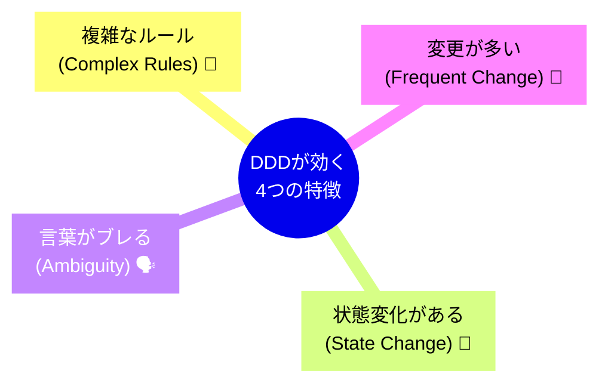

# 第12章：DDDがマッチする分野 🎯✨


**〜「複雑なルール」がある世界で、迷子にならないために〜 🧭💖**

DDD（ドメイン駆動設計）が強いのは、ひとことで言うと👇
**「ただのデータ」じゃなくて、「ややこしい決まりごと（ルール）」が主役のアプリ**です😌📘

---

## 1. まず「DDDが必要な複雑さ」って何？🤔💭

「複雑」って、画面が多いとか、DBが大きいとかだけじゃないです🙅‍♀️💦
DDDが効く“複雑さ”は、だいたいこういうやつ👇

### ✅ ルールが多い・例外が多い 🧩

* 「通常はこうだけど、〇〇の場合だけ例外」
* 「この条件が揃うと、別の計算になる」
* 「締め日をまたぐと扱いが変わる」
* 「キャンセル料が日数で変わる」

### ✅ 状態がある（しかも遷移がある）🚦

* 申請中 → 承認 → 発送 → 受領 → 返金 …みたいな流れ
* “今どの状態か”で、できる操作が変わる😵‍💫

### ✅ 同じ言葉なのに意味が変わる 🗣️💥

たとえば「ユーザー」って言っても、

* 予約する人のユーザー
* 管理画面を触るスタッフ
* 決済の名義人
  ぜんぶ違う“ユーザー”だったりします😇

こういうとき、DDDの出番です🎉

---

## 2. DDDがハマる代表例３つ 🥇🥈🥉✨

ここからは超具体例でいきます😊🌸
「どういうルールがあるからDDD向きなの？」が分かるようにします🎀

---

# A) 会計・決済・料金計算 💰🧾✨

会計系がDDD向きなのは、ルールが「地雷原」だからです💣😇
ちょっとのミスで信用が吹き飛びます🫠

### よくある複雑ルール例 📌

* 税率が期間で変わる（軽減税率とか）🧾
* 端数処理が決まってる（四捨五入？切り捨て？）🔢
* 割引の優先順位がある（クーポン→会員割→キャンペーン…）🎫
* 返金ルールが状態で変わる（出荷前/後、利用済み等）↩️

### 「DDDっぽい」考え方 🍀

「金額」を `decimal` で雑に扱うと、ルールが散らばります😵
DDDでは **“お金”を主役にして、ルールをそこへ集める**イメージです💡

例：雰囲気コード（イメージ重視）👇

```csharp
public readonly record struct Money(decimal Amount, string Currency)
{
    public static Money Yen(decimal amount) => new(amount, "JPY");

    public Money Add(Money other)
    {
        if (Currency != other.Currency) throw new InvalidOperationException("通貨が違うよ💦");
        return this with { Amount = Amount + other.Amount };
    }

    public Money ApplyDiscountRate(decimal rate)
        => this with { Amount = decimal.Round(Amount * (1 - rate), 0) }; // 端数処理ルールがここに集まる✨
}
```

「端数処理ルール、どこだっけ？」が消えていきます🧹✨

---

# B) ゲームの計算（ダメージ、スキル、ドロップ率）🎮⚔️✨

ゲームは「計算ルールのかたまり」です😆
しかも仕様変更が来やすい！🌀

### よくある複雑ルール例 📌

* バフ/デバフが重なる（加算？乗算？上限？）🧪
* クリティカルや属性相性🔥❄️⚡
* PvEとPvPで式が違う👥
* 状態異常の優先順位（麻痺→睡眠→凍結…）😵‍💫
* 「このボスだけ例外」👹

DDDがあると、**計算を“それっぽい言葉”で分解**できます🧩✨
（「DamageCalculator」だけに全部詰めると地獄です👻）

イメージ👇

```csharp
public sealed class DamageService
{
    public int Calculate(Attack atk, Defense def, BattleContext ctx)
    {
        var baseDamage = atk.Power - def.Armor;
        var elemental = ctx.ElementalMultiplier(atk.Element, def.Element);
        var critical = ctx.IsCritical ? 1.5 : 1.0;

        return (int)Math.Max(1, baseDamage * elemental * critical);
    }
}
```

ポイントは、**“文脈（BattleContext）”にルールが集まる**ことです🧠✨
「クリティカルってどこで決めてる？」が追いやすくなります🔍💖

---

# C) 予約システム（ホテル、病院、美容室、席）📅🏨💇‍♀️✨

予約は、見た目はシンプルでも、ルールが増えがちです😇

### よくある複雑ルール例 📌

* 「同時に取れる数」に制限がある（枠/人/部屋/席）🪑
* 営業時間・定休日・臨時休業がある🕒
* 直前キャンセル料（48時間前まで無料、以降◯%）💸
* 同じ時間帯に“同じスタッフ”は予約できない👩‍🔧
* コース時間が伸びる（施術＋片付け時間）⏱️

ここでDDDが効く理由は👇
**「予約できる/できない」の判定ロジックが、散ると一生バグる**からです🫠

イメージ👇

```csharp
public sealed class ReservationRules
{
    public bool CanReserve(TimeSlot slot, Capacity capacity, ExistingReservations existing)
    {
        if (!slot.IsBusinessHour) return false;
        if (existing.CountIn(slot) >= capacity.Value) return false;
        return true;
    }
}
```

“予約できる条件”を、ひとつの場所に集約すると強いです💪✨

---

## 3. じゃあ自分のアプリはDDD向き？簡単チェック ✅📝✨



当てはまるほどDDD向きです🎯💕

* ✅ 「ルール説明」が文章で10行以上ある📄
* ✅ 例外が多い（“ただし〜”が多い）⚠️
* ✅ 状態がある（申請中/確定/取消など）🚦
* ✅ 変更が月1回以上起きそう🔁
* ✅ “正しさ”が大事（お金・在庫・権限など）💰🔐
* ✅ 仕様を聞く相手（または未来の自分）が混乱しやすい🫧

**3個以上**なら、DDDでラクになる可能性が高いです😊✨
**5個以上**なら、DDDの恩恵かなり大きいです🚀💖

---

## 4. 1人開発でのコツ：DDDは「全部盛り」しない 🍱❌➡️🍙⭕

DDDって聞くと「重装備」なイメージがあるけど、最初はこれでOKです🌱✨

* 🌸 ルールを“言葉”で書き出す（箇条書きでOK）
* 🌸 一番ややこしい計算・判定だけを「ドメイン側」に寄せる
* 🌸 名前をちゃんと付ける（予約枠、キャンセル料、会員ランク…）
* 🌸 テストしやすい形にする（副作用を減らす）

これだけで、迷いがかなり減ります🧭✨

---

## 5. 【ワーク】あなたの題材でDDD向き度を判定しよう 🧠📝💖

### STEP1：作りたいアプリを1つ決める 🎯

（例：家計簿、予約管理、ゲームの計算ツール、会員制サービスなど）

### STEP2：ルールを10個書く ✍️✨

「〜の場合は〜する」を10個！

例（予約なら）👇

* 当日キャンセルは100%
* 営業時間外は予約不可
* 同じ人は同時に2つ予約できない
  …みたいなやつ😊

### STEP3：チェックリストに当てはめる ✅

当てはまる数を数えて、DDD向き度を判定🎯✨

### STEP4：AIに“ルールの抜け”をいじわるチェックさせる 😈🔍

コピペ用プロンプト（そのまま使ってOK）👇

```text
あなたは意地悪な仕様レビュアーです。
以下のルール一覧を読んで、矛盾・抜け・例外パターンをできるだけ多く指摘してください。
さらに、追加で確認すべき質問も10個出してください。

【ルール一覧】
- ...
- ...
```

これ、1人開発の最強ムーブです😎✨（未来の自分も助かる💖）

---

## まとめ 🎁✨

DDDがマッチするのはこんな世界でした👇

* 💰 会計・料金・決済：正しさ＆例外＆変更が多い
* 🎮 ゲーム計算：ルールの塊＆仕様変更が多い
* 📅 予約：状態・制約・例外が増殖する

「ルールが主役」になった瞬間、DDDはめちゃくちゃ頼れます🧭💖

次の章（13章）に進むと、逆に「DDDがいらない世界」もスッキリ見えてきますよ〜😊🌸
