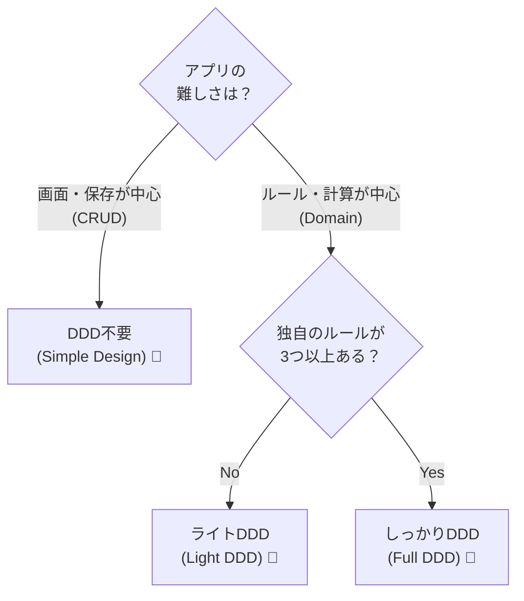

# 第13章：DDDがマッチしない分野 🤔🧩


### 〜「ただの記録帳」タイプには、DDDを“あえて”使わない勇気〜 🏃‍♀️💨

DDD（ドメイン駆動設計）って、ハマるとめちゃ強いんだけど…
**なんでもDDDにすると、逆にしんどくなる**分野があるよ〜！😵‍💫💦
この章では「DDDを使わない方が速い＆安全」なケースを見分けられるようになるのがゴールだよ🎯✨

---

## 1. 「ただの記録帳」ってなに？📒✍️

一言でいうと👇
**“データを保存して表示するだけ”がメインのアプリ**のことだよ😊

たとえばこんな感じ👇✨

* 掲示板 🗨️（投稿して一覧で見れる）
* シンプルなブログ 📝（記事を書いて公開）
* お問い合わせフォーム 📩（入力してDBに保存）
* 管理画面CRUD 🧑‍💻（登録・編集・削除・検索）
* データ移行ツール 🔁（CSV→DBに入れる、みたいなやつ）

「ルール」より「入出力」が主役の世界だね📥📤

---

## 2. こういう症状があるとDDDは重くなりがち 🏋️‍♀️💦

DDDが“合わない”記録帳系で、よく起きる事故あるある👇😇

### ✅ 事故あるある①：クラスが増えすぎる 🌲🌲🌲

「投稿」だけなのに…
`Post` / `PostId` / `PostTitle` / `PostBody` / `PostFactory` / `PostRepository` …
みたいに増えて、**やってることがCRUDなのに構造が巨大化**しがち😵‍💫

### ✅ 事故あるある②：ビジネスルールが薄いのに“ドメイン層”を作ってしまう 🫠

「タイトルは200文字まで」くらいしかルールがないのに、
立派な集約とか作ると、**得られるメリットが少ない**んだよね…😢

### ✅ 事故あるある③：変更が来ない or 来ても単純 🔧

記録帳系は、変更が入るとしても
「検索条件を1個追加」とか「項目を増やす」とかが多め。
DDDの強み（複雑な変更に耐える）が活きにくいの🥺

---

## 3. 「DDDいらないかも？」判定チェックリスト ✅🧠



YESが多いほど、DDDは“重装備”になりやすいよ🚲→🚜みたいな…！

* [ ] 画面はほぼ一覧・詳細・編集・削除だけ 👀
* [ ] ルールはバリデーション中心（文字数、必須など）📏
* [ ] 「状態遷移」や「複雑な計算」がほぼない 🔄（承認フローとか）
* [ ] 1回の操作で触るデータが単純（1テーブル中心）🗃️
* [ ] 重要なのはUI/検索/表示の使いやすさ 🎨
* [ ] “このアプリ独自の難しいルール”が説明できない 😅

✅ 4個以上当てはまるなら、**DDDは薄め or 不採用**が自然だよ🙆‍♀️✨

---

## 4. じゃあ何を使うの？おすすめの“軽い設計”🍃🛠️

DDDの代わりに、記録帳系はこれが強いよ👇✨

### A) 「CRUD中心」のシンプル構造 🧼

* 画面（API/Controller）
* アプリ層（サービス）
* DBアクセス（EF Coreなど）

これで十分なことが多いよ😊
**“迷わない”が正義**✨

### B) トランザクションスクリプト（手順で書く）📜

「ユーザー登録」なら

1. 入力チェック
2. DBに保存
3. 完了通知
   みたいに、上から順に書くやつ👍
   記録帳はこれで爆速💨

### C) “DDDの良いとこだけつまむ”🍰

DDDを完全導入しなくても、これだけは便利なことあるよ👇💖

* **値オブジェクト**（Emailとか）📧
* **Resultパターン**（エラーを例外じゃなく戻り値で）🧯
* **不変（immutable）**で安全にする 🔒

「全部DDD」じゃなくて、**美味しいとこだけ**でOK😋✨

---

## 5. 具体例：掲示板にDDDを入れるとどうなる？🗨️😇

### 🟦 掲示板（記録帳タイプ）の現実

必要なのはだいたい👇

* 投稿する
* 一覧で見る
* 編集する
* 削除する
* 検索する

ルールが「禁止ワード」「文字数」「画像サイズ」くらいなら
**DDDの“ドメインモデル”を育てる余地が少ない**んだよね🌱

👉 この場合は
**DB中心 + サービスで手順を書く**方が、速くて読みやすいことが多いよ💨✨

---

## 6. 例外：記録帳っぽいのにDDDが効く瞬間 ⚡🧠

「一見CRUD」でも、こうなるとDDDが急に活きるよ👇👀

* 投稿が「審査→公開→凍結」みたいに状態遷移する 🔄✅
* 料金計算・ポイント・割引など“計算ルール地獄”がある 💰📉
* 「同じ言葉でも意味が違う」領域が混ざる（例：ユーザー＝顧客/管理者/投稿者）🧩
* 変更が頻繁で、しかも複雑（仕様が伸びる予感）📈🔥

つまり…
**“ただ保存するだけ”から外れた瞬間にDDD候補**になるよ✨

---

## 7. ミニ演習：あなたのアプリを仕分けしよう 🧪📌

次の質問に答えてみてね😊✨

### Q1️⃣ そのアプリの「一番むずかしい部分」はなに？🧠

* A. 入力フォームや画面づくり 🎨
* B. 検索や一覧表示 🔎
* C. ビジネスルール（計算・判定・状態遷移）⚙️

👉 A/Bなら「記録帳寄り」になりやすいよ📒
👉 CならDDDが効く可能性UP🔥

### Q2️⃣ 「このアプリ独自のルール」を3つ言える？🗣️

言えない / バリデーションしかない → DDD薄めが吉🍃
3つ以上ある＆複雑 → DDD向きかも✨

---

## 8. AIに相談する用プロンプト（コピペOK）🤖📝

（ここ、めっちゃ便利！✨）

```txt
あなたはソフトウェア設計者です。
次のアプリ案が「DDD向き」か「CRUD向き」かを判定してください。

- アプリ概要：
- 主な機能（箇条書き）：
- 一番大事なルール：
- 変更が入りそうな点：

出力してほしいもの：
1) CRUD向き/DDD向き の判定
2) そう判断した理由（3つ）
3) おすすめの最小構成（フォルダ/層のイメージ）
4) もし将来DDDへ移行するなら、最初に守るべき境界線
```

---

## まとめ 🎀✨

* **記録帳タイプ（CRUD中心）**は、DDDが重くなりやすいよ📒💦
* ルールが薄いなら、**軽い設計（サービス＋DB）**で速さ優先が正解になりがち🏃‍♀️💨
* でも「状態遷移」「計算ルール」「複雑な言葉の衝突」が出てきたらDDD候補🔥
* **“全部DDD”じゃなくて、つまみ食い**でも十分おいしい😋🍰

次の章（14章）で「1人開発×DDDの相性」へ進むと、ここがスッとつながるよ〜！🔗✨
