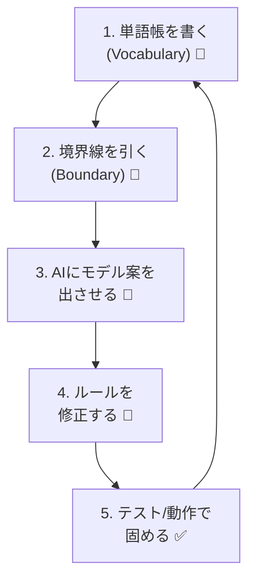

# 第14章：「1人開発×DDD」の相性：コミュニケーション相手はAIと「未来の自分」🤖🧠⏳


1人開発って、自由で最高…なんだけど✨
一番つらいのは「相談相手がいないこと」なんだよね🥺💭

でも今は、相手がいる！

* 🤖 **AI**（壁打ち・設計レビュー・コード生成）
* ⏳ **未来の自分**（数週間後に「え、これ何…？」ってなる人）

DDDは、この2人と“迷わず会話するための共通言語”になるよ📚💬

---

## 1人開発がハマりやすい「あるある」😵‍💫

### あるある①：頭の中に仕様がある（でも書いてない）🧠🔒

「この場合は例外ね」「たぶんこう動くよね」
…みたいな暗黙ルールが増えると、後から自分でも追えなくなる😇

### あるある②：言葉がブレる（同じものを別名で呼ぶ）🌀

例：

* ユーザー / 会員 / アカウント
* 注文 / オーダー / 購入

言葉がブレると、AIも混乱するし、自分も迷う😵‍💫🤖

### あるある③：AIが“それっぽい”コードを出す（でも世界観が違う）🎭

AIは賢いけど、**アプリの境界線**が伝わってないと
「たぶんこうだよね」で進めちゃうことがある🫠

---

## ここでDDDの出番！DDDは「会話の設計」だよ🗣️🏗️

DDDって、いきなり難しい理論じゃなくて
**“迷わないために、言葉と境界線を整える”**のが超重要🌟

つまり…

* 🤖AIに対して：「このアプリの正解はこれね！この言葉で話そう！」
* ⏳未来の自分に対して：「ここはこういう意図で、こう分けてるよ！」

を**コードと構造で残す**のがDDDの強み💪📦

---

## 🤖 AIと仲良くなるコツ：AIに「単語帳」と「境界線」を渡す📘🧱

AIにお願いするとき、これだけ渡すと一気に成功率が上がるよ✨

### ✅ 1) 単語帳（ユビキタス言語ミニ版）📒

例（超ミニ）：

| 用語              | 意味      | 例           |
| --------------- | ------- | ----------- |
| 注文(Order)       | 店に出す依頼  | 注文はキャンセルできる |
| 注文明細(OrderLine) | 注文の中の1行 | 商品×数量       |
| 支払い(Payment)    | 決済そのもの  | 注文と別タイミング   |

これをAIに貼るだけで、変な命名が激減するよ🥹✨

### ✅ 2) 境界線（今どこを作ってるか）🧭

例：

* 「今は“注文”の世界だけ。支払いは後で。DBやAPIはまだ考えない」

これ、めちゃ大事！AIは“全部入り”にしがちだからね🍱💥

---

## 🤖 AIへの「神プロンプト」テンプレ（コピペOK）🪄

下のテンプレ、かなり使えるよ✨（そのまま貼ってOK）

```text
あなたはDDDに詳しいシニアエンジニアです。
以下の単語帳（ユビキタス言語）に従って、命名を統一してください。

【単語帳】
- Order = 注文（キャンセル可能）
- OrderLine = 注文明細（商品と数量）
- Money = 金額（通貨を含む）

【境界線】
- 今回は「注文」コンテキストのみ
- DB/HTTP/画面は考えない（ドメインモデルだけ）
- ルールは「注文は合計金額が0円以下は禁止」

【お願い】
- Aggregate案を1つ出して、ルートと不変条件を説明して
- その後、C#で最小コード例（recordや例外/ResultはどちらでもOK）を出して
```

ポイントは「単語帳」「境界線」「ルール」を先に渡すことだよ🤝✨

---

## ⏳ 未来の自分と仲良くなるコツ：説明は“文章”じゃなく“形”にする📦🧩

未来の自分って、マジで他人😇
だから“やさしく説明”じゃなくて、**見れば分かる形**にするのが強いよ！

### ✅ 1) フォルダ名で意味を固定する📁

例：

* `Domain/Orders/`
* `Domain/Payments/`
* `Application/Orders/PlaceOrder/`

「どこに何があるか」が、探索せず分かる🧭✨

### ✅ 2) “ルールはコードで見える”に寄せる👀

たとえば「0円以下禁止」なら、作る瞬間に止める。

```csharp
public readonly record struct Money(decimal Amount, string Currency)
{
    public static Money Of(decimal amount, string currency)
    {
        if (amount <= 0) throw new ArgumentException("金額は0より大きくしてね！");
        if (string.IsNullOrWhiteSpace(currency)) throw new ArgumentException("通貨が必要だよ！");
        return new Money(amount, currency);
    }
}
```

これがあるだけで、未来の自分は救われる🙏✨
「どこで保証してるの？」って悩まなくて済む！

### ✅ 3) 「3行メモ」をリポジトリに置く📝

長文ドキュメントは読まれない率高め😂
だからこれくらいが最強！

例：`Domain/Orders/README.md` に…

* このフォルダは「注文」だけ（支払いは別）
* 注文のルール：合計0円以下は禁止
* 外部（DB/API）のことはここに持ち込まない

これで未来の自分が泣いて喜ぶ😭💖

---

## 1人開発のおすすめループ（迷わない最短コース）🔁🚀



### 🕒 15分ループ（これだけでOK）

1. 📘 単語帳を1〜5個書く
2. 🧱 境界線を1文で書く
3. 🤖 AIに「モデル案」を出させる
4. 🧩 自分で“ルールが守れる形”に直す
5. ✅ テスト or 最小動作で固める

このループを回すと、1人でも設計が育つよ🌱✨

---

## 落とし穴（ここだけ注意！）⚠️🕳️

* 🤖 AIに「全部おまかせ」は危険（境界線が壊れる）
* 🧠 ルールを“後で考える”と迷いが爆増する
* 📦 集約を最初からデカくしすぎると動けない（小さく始めよ！）

DDDは「完璧にやるもの」じゃなくて
**迷いを減らす方向にちょっとずつ使うもの**だよ😊✨

---

## 【ワーク】AIと未来の自分に優しい「単語帳」づくり📘💪✨

次のどれかでOK👇（自分の作りたいアプリで！）

1. 単語を **5個** 書く（日本語でもOK）📝
2. それぞれに「意味」を1行つける💡
3. 「今回はどこまで作る？」を1文で書く🧭
4. それをAIに貼って、モデル案を出させる🤖✨

できたら、その単語帳ここに貼ってくれたら、こっちで「ブレない表現」に整えるよ✂️📘💕
