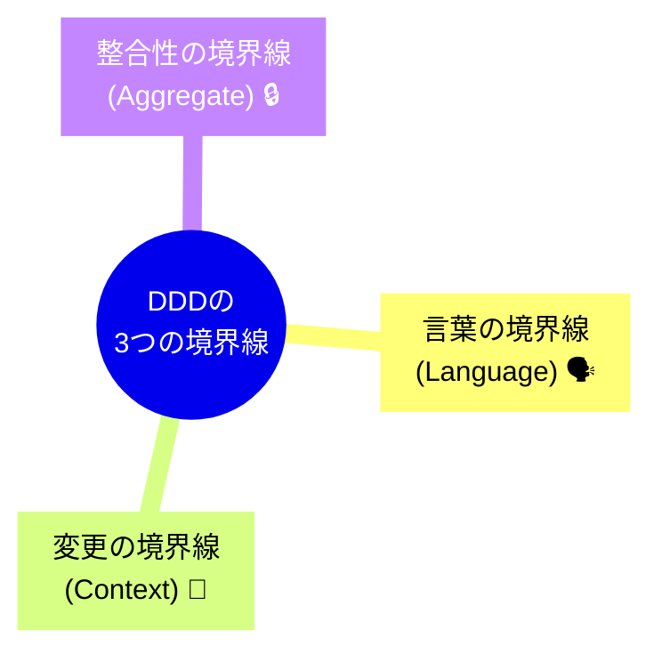

# 第15章：「AI使用前提」のDDD 💡🤖


**定型コードはAIに、人間は「境界線」を引くことに集中する！✂️🧠**

---

### 1) まず結論：AIは“手”、あなたは“設計者”🦾👩‍💻✨


AIって、コードを書くスピードが本当に速いですよね🚀
でもDDDでいちばん大事なのは「キレイなコード」よりも **“境界線（ここからここまで）”** をちゃんと引くことです✂️📦

* ✅ **AIが得意**：同じ形のコード量産（DTO、CRUD、Mapper、テスト雛形…）📄📄📄
* ✅ **人間が得意**：何をどこに置くか決める（境界・責務・言葉の定義）🧭

つまり…
**「AIに迷わせないために、先に境界線を置く」** が勝ちパターンです🏆🤖✨

---

### 2) “境界線”ってなに？どれを引けばいいの？🧱🧩




DDDでいう境界線は、ざっくり言うとこの3つが超重要です📌✨

#### A. 言葉の境界線（ユビキタス言語）📚🗣️


同じ単語でも意味が違うと事故ります💥
例：

* 「ユーザー」＝購入者？管理者？配達員？😵‍💫
  → **コンテキストごとに言葉を固定**するのがDDDっぽさです✨

#### B. 変更の境界線（境界づけられたコンテキスト）🧩✂️

「この変更はどこに閉じる？」を考えます🔧
変更が起きたとき、1か所だけ直せると最強💪✨

#### C. 整合性の境界線（集約・トランザクション）🧷🔒

「一度の操作で、絶対に崩れちゃダメなルール」を守る範囲です🛡️
ここが曖昧だと、AIが勝手に複数のものを同時更新して大混乱になりがち😇💥

---

### 3) AIに任せてOKな“定型”ってどれ？🤖🧰


任せていいのは「判断が少ない」「形が決まってる」ものです✅

* DTO / Request / Response の作成📦
* Controller / Endpoint の雛形🧱
* EF Core の設定（EntityTypeConfiguration）🗃️
* Repository のI/F雛形📦
* テスト雛形（Arrange-Act-Assert）🧪
* バリデーションの枠（中身のルールは人間が決める）🧯

逆に、ここは任せすぎ注意⚠️

* 「この機能はどのコンテキスト？」
* 「このルールはどこで守る？」
* 「集約はどれ？更新の入口はどこ？」
  ここをAIに丸投げすると、だいたい境界が溶けます🫠

---

### 4) 実践ミニ：カフェ予約アプリで“境界線”を先に置く☕📅✨

例として「カフェ予約アプリ」を想像してみます🍰

#### まず人間が決める（ここが一番大事）🧠✍️


**コンテキスト案**（例）

* **予約**：席を予約する、変更する、キャンセルする📅
* **会員**：会員情報、退会、メール変更👤
* **決済**：支払い、返金💳

この時点で、あなたはAIにこう言えます👇
「予約コンテキストの中でだけ完結するコードを作ってね」って🧭✨

---

### 5) AIに投げる“良い指示”テンプレ（コピペOK）📋🤖✨

AIは指示がフワッとしてると、境界を跨いだコードを平気で作ります😇
なので、最初に **“柵（しきい）”** を置きましょう✂️🧱

#### テンプレ①：境界線づくり（AIに壁打ちさせる）🧠🤝

```text
あなたはDDDの設計コーチです。
次のアプリ案について、境界づけられたコンテキスト案を3〜5個出してください。
それぞれに「責務」「持つデータ」「絶対守るルール（不変条件）」「他コンテキストとのやりとり（入力/出力）」を箇条書きで。

アプリ案：
- カフェ予約：予約作成/変更/キャンセル
- 会員登録、ログイン
- 事前決済（将来的に入れるかも）
```

#### テンプレ②：定型コード生成（予約コンテキストだけ作らせる）🏗️🤖

```text
「予約」コンテキストのみ実装してください。他コンテキスト（会員/決済）には依存しないでください。

条件：
- .NET 10 / C# 14
- Domain層：エンティティ、値オブジェクト、ドメインルール（不変条件）だけ
- Infrastructure層のDBやEF Core属性はDomain層に持ち込まない
- 予約の不変条件：
  1) 人数は1〜8
  2) 予約時間は現在より未来のみ
  3) 同一顧客が同じ日時に重複予約できない（チェックはApplication側でもOK）

出力：
- Domain層のクラス設計（Reservation, ReservationId, CustomerId, PartySize など）
- Application層のユースケース（CreateReservation）
- できれば簡単なテスト雛形
```

#### テンプレ③：境界線レビュー（AIに“意地悪チェック”させる）😈🔍

```text
次のコードをレビューして、DDDの境界線が破られていないか指摘してください。
特に以下を重点：
- Domain層がEF CoreやHTTP、DBに依存していないか
- 予約の不変条件が「どこで」守られているか
- 「会員」や「決済」の概念が予約コンテキストに混入していないか
問題があれば、修正案も出してください。
```

---

### 6) C#の“最新土台”はこれでOK（Windows / Visual Studio）🪟🧰

2025年の最新前提なら、**.NET 10（LTS）＋ C# 14** が基準でOKです✅

* **.NET 10 は 2025-11-11 リリースのLTS** ([Microsoft][1])
* **C# 14 は .NET 10 上でサポートされる最新リリース** ([Microsoft Learn][2])
* **Visual Studio 2026 は .NET 10 と一緒に提供＆C# 14をフルサポート** ([Microsoft for Developers][3])

#### Visual Studioでの最小構成イメージ🧩

* Solution

  * `MyApp.Domain`（Class Library）📦
  * `MyApp.Application`（Class Library）🧠
  * `MyApp.Infrastructure`（Class Library）🗃️
  * `MyApp.Web`（ASP.NET Core）🌐

**ポイント**：参照方向は内側へ⬅️（Domainが一番内側）🧅✨
Domainが外（DBやWeb）を知らない形にすると、AIが生成しても崩れにくいです👍

---

### 7) “AIに迷わせない”チェックリスト✅🤖🧭


AIが作ったコードを受け取ったら、ここだけ見ればOKです✨

* ✅ Domainに `Entity Framework` の属性が入ってない？（`[Key]` とか）🧨
* ✅ Domainに `HttpContext` とか `Controller` とか出てきてない？🚫
* ✅ 「予約」の中に「決済」の型が混ざってない？💳🫠
* ✅ ルール（人数1〜8など）が、どこかで必ず守られてる？🛡️
* ✅ 更新の入口が散ってない？（いろんな場所で勝手に更新してない？）🧷

ここを守るだけで、AI時代のDDDが一気に安定します🎉✨

---

### 8) ちいさな演習（15分）⏱️📝✨

あなたが作りたいアプリで、これだけやってみてください😊

1. **アプリの機能を3つだけ書く** 📝
2. **登場人物（用語）を10個だけ書く** 📚
3. **「変更が閉じる単位」を2〜4個に分ける** ✂️📦
4. テンプレ①をAIに投げる🤖
5. 返ってきた境界線を、あなたが“人間の感覚”で微調整🧠✨

終わりです🎊
この「境界線づくり」を毎回やるだけで、AIにコードを大量生産させても迷子になりにくくなります🧭🤖💕

---

必要なら、この章の流れのまま「あなたの作りたいアプリ案」を材料にして、**境界線案（コンテキスト案）を一緒に作る**ところまで一気にやれますよ☕✨

[1]: https://dotnet.microsoft.com/ja-jp/platform/support/policy/dotnet-core?utm_source=chatgpt.com ".NET および .NET Core の公式サポート ポリシー"
[2]: https://learn.microsoft.com/en-us/dotnet/csharp/whats-new/csharp-14?utm_source=chatgpt.com "What's new in C# 14"
[3]: https://devblogs.microsoft.com/dotnet/dotnet-conf-2025-recap/?utm_source=chatgpt.com "Celebrating .NET 10, Visual Studio 2026, AI, Community, & ..."
