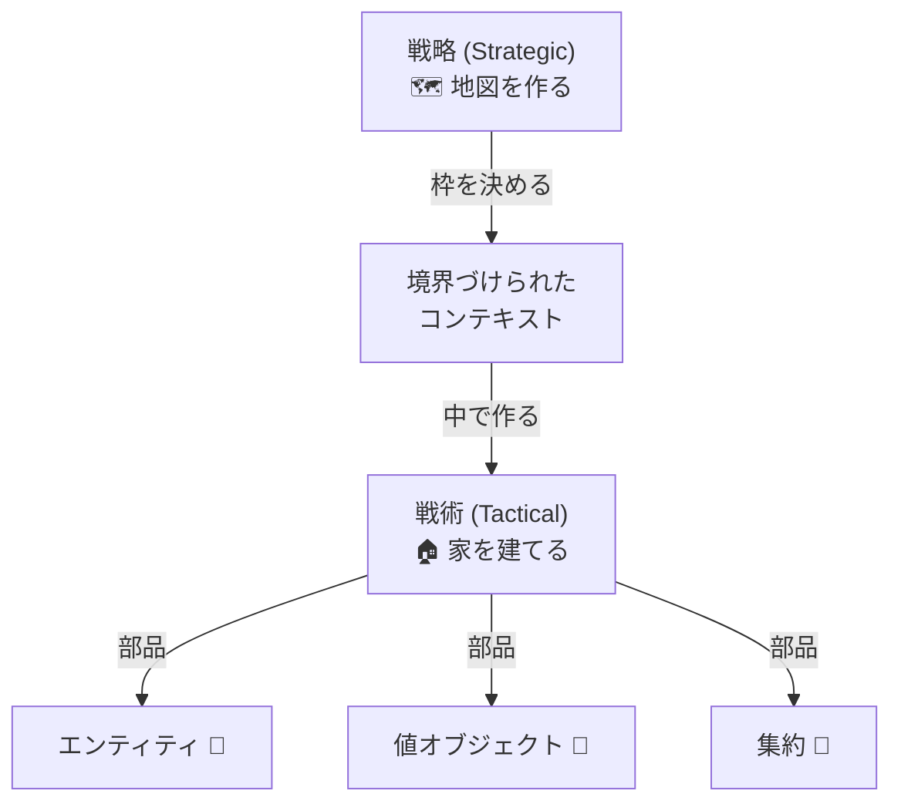

# 第16章：DDDの2つの顔 🐣✨


### 〜戦略（どう分けるか）と戦術（どう書くか）〜 🧠🛠️

DDDって、ひとことで言うと **「現実の仕事のルールを、迷わない形でコードにする」** 考え方だよね😊
で、そのDDDには **2つの顔** があるの👇

* **戦略（Strategic Design）**：アプリ全体をどう“分ける”か 🗺️✂️
* **戦術（Tactical Design）**：分けた中身をどう“書く”か 🧩🧱

この2つを混ぜちゃうと、DDDが急にむずかしく見えるので…今日はここをスッキリさせよ〜！😆🌸

---

## 1. まずはたとえ話で理解しよっ 🍱🏙️

### 戦略＝「街づくり」🏙️🗺️


どこに何の建物を置く？
ショッピング街、住宅街、工業地帯…みたいに **役割でエリアを分ける** 感じ！

* どこまでを「注文」の世界にする？🛒
* どこからが「配送」の世界？🚚
* 「会員」って、注文と配送で同じ意味？👤❓

### 戦術＝「家の設計」🏠🧱

街（分けたエリア）の中に、**どんな家（クラス）をどう建てる？** って話！

* 値は `string` のままでいい？（メールアドレスとか）📧
* IDって何型にする？（Guid？int？専用型？）🆔
* まとめる単位（集約）はどこ？🧺

✅ **戦略＝境界線**
✅ **戦術＝部品の作り方**
って覚えると超ラクだよ〜！🥳✨

---

## 2. 戦略（どう分けるか）って何するの？🗺️✨

戦略は「アプリ全体の地図」を作る感じだよ📌
代表的にはこんなこと👇

### ① 境界づけられたコンテキスト（Bounded Context）を作る 🧱🧭


同じ“言葉”でも、場所が違うと意味が変わることってあるよね😳

例：

* 「ユーザー」👤

  * 注文の世界：買う人（配送先を持つ）🛒
  * 管理の世界：操作する人（権限を持つ）🔐

この **意味がブレない範囲** を区切って “小さな独立国” にするのがコンテキストだよ🏰✨

### ② ユビキタス言語（共通言語）を決める 🗣️📘

「注文」「購入」「オーダー」…全部同じ？違う？🤔
ここが曖昧だと、コードがすぐ迷子になる〜😭

**言葉を決める＝設計の半分** くらい強い💪✨

### ③ サブドメインの仕分け（コア/支援/汎用）📦

* **コア**：ここが勝負！差別化ポイント🔥
* **支援**：必要だけど勝負じゃない🧩
* **汎用**：外部サービスに任せたい（認証とか）🔧

✅ 戦略のゴールはこれ：
**「変更が起きても、影響が広がらない分け方」** 🌿✨

---

## 3. 戦術（どう書くか）って何するの？🛠️✨


戦術は「各エリアの中身を、壊れにくい部品で作る」話だよ😊
よく出る主役たち👇

* **値オブジェクト（Value Object）**：値の意味を型にする💎
* **エンティティ（Entity）**：同一性（ID）で区別する👤
* **集約（Aggregate）**：ルールを守る“ひとまとまり”🧺
* **リポジトリ（Repository）**：保存/復元を隠す📦
* **ドメインサービス**：どのオブジェクトにも属しにくい計算🧮
* **ドメインイベント**：起きたことを通知する📣

✅ 戦術のゴールはこれ：
**「ルールがコードの形で自然に守られる」** 🔒✨

---

## 4. 2つの顔はどう繋がるの？🔗😊

ここ超大事！🌟
**戦略が決まると、戦術の置き場所が迷わなくなる** んだよ〜！

たとえば「注文コンテキスト」と「配送コンテキスト」を分けたら：

* 注文の世界の `Order` は、配送の都合を知らなくていい🛒✨
* 配送の世界の `Shipment` は、注文の細かい割引ロジックを知らなくていい🚚✨

つまり…

### 戦略：壁を作る 🧱

### 戦術：壁の内側を整える 🧹

この順番でやると、AIにコード生成頼むときもブレにくいよ🤖💕
（「このコンテキストの責務だけ書いて」って言える✨）



---

## 5. ミニ題材でイメージしよう：カフェ注文アプリ ☕🍰


### 戦略（どう分ける？）🗺️

例としてこんな分け方が自然かも👇

* **注文コンテキスト**：注文、合計金額、割引、注文状態🛒
* **在庫コンテキスト**：材料、在庫数、在庫引当🍓
* **会計コンテキスト**：支払い、レシート、決済手段💳

ポイント：
「注文」と「在庫」を同じモデルにしない！⚠️
在庫は在庫の都合があるし、注文は注文の都合があるのだ…！😤✨

### 戦術（どう書く？）🛠️

注文コンテキストの中では例えば：

* `Money`（値オブジェクト）💰
* `OrderId`（IDを専用型に）🆔
* `Order`（集約ルート）🧺
* `OrderLine`（明細）🧾

---

## 6. 超ミニ実装：戦術の手触りだけ体験しよ 💅✨


「注文コンテキスト」の中だけの例だよ〜☕🛒

```csharp
public readonly record struct OrderId(Guid Value)
{
    public static OrderId New() => new(Guid.NewGuid());
    public override string ToString() => Value.ToString();
}

public readonly record struct Money(decimal Amount, string Currency)
{
    public Money(decimal amount, string currency)
    {
        if (amount < 0) throw new ArgumentOutOfRangeException(nameof(amount), "マイナスはだめだよ🥲");
        if (string.IsNullOrWhiteSpace(currency)) throw new ArgumentException("通貨が必要だよ💱", nameof(currency));
        Amount = amount;
        Currency = currency;
    }

    public static Money operator +(Money a, Money b)
    {
        if (a.Currency != b.Currency) throw new InvalidOperationException("通貨が違うよ😵");
        return new Money(a.Amount + b.Amount, a.Currency);
    }
}

public sealed class Order
{
    private readonly List<OrderLine> _lines = new();

    public OrderId Id { get; }
    public IReadOnlyList<OrderLine> Lines => _lines;

    private Order(OrderId id) => Id = id;

    public static Order Create() => new(OrderId.New());

    public void AddItem(string productName, Money unitPrice, int quantity)
    {
        if (string.IsNullOrWhiteSpace(productName)) throw new ArgumentException("商品名が必要だよ🍰");
        if (quantity <= 0) throw new ArgumentOutOfRangeException(nameof(quantity), "数量は1以上だよ🧁");

        _lines.Add(new OrderLine(productName, unitPrice, quantity));
    }

    public Money Total()
    {
        var total = new Money(0, "JPY");
        foreach (var line in _lines)
        {
            total += line.Subtotal();
        }
        return total;
    }
}

public sealed record OrderLine(string ProductName, Money UnitPrice, int Quantity)
{
    public Money Subtotal() => new Money(UnitPrice.Amount * Quantity, UnitPrice.Currency);
}
```

このコードで大事なのは雰囲気👇😊

* 金額は `decimal` 直置きじゃなくて `Money` にして意味を閉じ込める💎
* `Order` の中で注文ルールを守る（変な値を入れない）🔒
* 外から勝手に `_lines` をいじれないようにする🧺✨

---

## 7. ありがちな混乱ポイント（ここだけ注意！）⚠️😵

### ❌ 戦術だけ頑張って、戦略がない

値オブジェクトや集約を作り込んだのに、
「そもそもどこまでが同じ世界？」が決まってないと、結局ぐちゃる😭

### ❌ 戦略だけで満足して、戦術がスカスカ

境界線はきれいなのに、中のコードが `string` と `if` だらけでルールが漏れる😢

✅ なのでおすすめは：


**まずざっくり戦略 → すぐ小さく戦術 → また戦略見直し** 🔁✨
この往復がいちばん自然だよ〜🌸

---

## 8. 今日のミニワーク（15分）📝⏰✨

### ワーク①：戦略（分ける）🗺️

あなたが作りたいアプリを1つ思い浮かべて…
**「境界を2つ」だけ** 作ってみてね😊

例：

* 予約アプリ →「予約」「決済」
* ゲーム →「バトル計算」「アイテム管理」
* 家計簿 →「入力」「分析」

そして各コンテキストで、同じ単語が違う意味になりそうなものを1個見つける👀✨

### ワーク②：戦術（書く）🛠️

そのうち1つのコンテキストで

* 値オブジェクトを1つ（例：Money、Email、UserName）💎
* エンティティを1つ（例：Order、User）👤
  作るイメージだけでOK！

---

## 9. AIに頼むときの“いい感じ”の聞き方 🤖💬✨

戦略があると、AIへの指示がめちゃ楽になるよ！

例（注文コンテキストだけ作りたい時）👇

```text
あなたはDDDの設計者です。
「注文コンテキスト」だけを対象に、値オブジェクト(Money, OrderId)と
集約ルート(Order)をC#で実装してください。

制約：
- 他コンテキスト（在庫、決済）の概念は入れない
- ドメインルール（数量は1以上、金額はマイナス不可）をコンストラクタ/メソッドで守る
- 外部ライブラリなし
```

この「他コンテキスト入れない」って一言が、めっちゃ効くの😆🧱✨

---

## まとめ 🎀✨

* **戦略（どう分けるか）**：アプリの地図、境界線、言葉を揃える🗺️🧱
* **戦術（どう書くか）**：境界の中を、壊れにくい部品で作る🛠️💎
* どっちも大事で、**戦略があると戦術が迷子にならない** 🥰

次の章では「なぜDBから作ってはいけないのか」みたいな話に繋がっていくよ〜！🧠🔒✨
