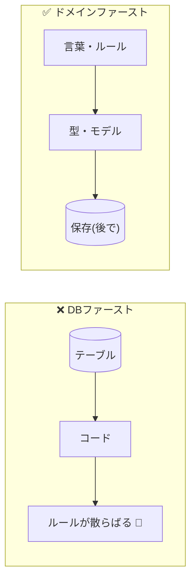

# 第17章：なぜ「DBから作ってはいけない」のか 🗄️➡️🧠💥


〜テーブル構造に“脳がハック”されるのを防ごう〜💪✨

---

## まず結論から！📌

**DDDで一番やりたいのは「現実のルール」をコードに写すこと**です。
でも最初にDB（テーブル）から作ると、頭の中がこうなりがち👇

* 「現実」ではなく **テーブル都合**で考え始める😵‍💫
* “それっぽい”けど **ルールが死んだコード**になる🥲
* 変更が入るたびに **全部が連鎖して壊れる**😇

だからDDDでは、基本は **ドメイン（ルール）→ その後にDB** の順が強いです💡✨

---

## DBから作ると何が起きるの？🤯（脳ハックの正体）

DBは便利だけど、最初に触ると “思考の型” がこう固定されます👇

### ① 「列」と「外部キー」で世界を見るようになる👀🔗

例えば「注文」って本当は…

* 注文はキャンセルできる？いつまで？
* 支払い済みならキャンセル不可？
* 明細は増減できる？締めたら固定？

みたいな**ルールの塊**なのに、DBから入ると👇

* `Order.Status = 3`（←3って何…？）
* `OrderItems` は外部キーでつながってるからOK（←ルールは？）

って感じで、**意味より構造**が先に立っちゃう😵



---

### ② 「とりあえずCRUD」の発想になる🧼🪣

DBファーストだと、だいたいこうなります👇

* 画面を作る
* テーブルを作る
* Entityを自動生成
* 画面からそのまま保存

これ、気持ちいいんだけど…
**“ルールをどこに置くか” が行方不明**になりやすいです🫠

---

### ③ “ルールが薄いモデル”になりやすい🫥（＝貧血モデル）

よくある地獄パターン👇

```csharp
public class Order
{
    public int Id { get; set; }
    public int Status { get; set; }      // 1=New,2=Paid,3=Shipped...みたいなやつ
    public decimal Total { get; set; }   // 合計金額
}
```

ここに**ビジネス的な安心**がないです😢

* `Total` を勝手に書き換えられる
* `Status=999` でも入る
* 「支払い済みならキャンセル不可」みたいなルールが守れない

結果：**ルールがUIやサービスに散らばって地獄**になります🔥🔥🔥

---

## DDDの正しい順番（おすすめ）🧭✨

### ✅ 先に作るのは「テーブル」じゃなくて「言葉」と「ルール」📚🧠

順番はこう👇

1. **ユースケース**（ユーザーが何したい？）を書く📝
2. **登場人物（概念）**を言葉で出す（注文、明細、金額、状態…）🗣️
3. **ルールを持つ型**を作る（値オブジェクト/エンティティ）🧱
4. **保存は“後で”**。まずは `Repository` の“口”だけ決める📦
5. 最後に **DBにマッピング**（EF Core）🛠️

---

## ちっちゃい例で体感しよ！🌸「注文はキャンセルできる？」

### ドメインから作るとこうなる（ルールが中心）✅

```csharp
public enum OrderStatus
{
    New,
    Paid,
    Shipped,
    Canceled
}

public sealed class Order
{
    public Guid Id { get; }
    public OrderStatus Status { get; private set; }

    public Order(Guid id)
    {
        Id = id;
        Status = OrderStatus.New;
    }

    public void MarkAsPaid()
    {
        if (Status != OrderStatus.New)
            throw new InvalidOperationException("新規注文のみ支払いできます😢");

        Status = OrderStatus.Paid;
    }

    public void Cancel()
    {
        if (Status == OrderStatus.Shipped)
            throw new InvalidOperationException("発送後はキャンセルできません📦💦");

        if (Status == OrderStatus.Canceled)
            return; // 二重キャンセルは無視でもOK👌

        Status = OrderStatus.Canceled;
    }
}
```

ポイント🎯

* **状態の遷移**が `Order` の中にある💪
* ルールが “散らからない” 🧹✨
* 仕様変更（例：Paidもキャンセル不可にする）も1箇所で済む🔧

---

## 「でもDB作らないと進まなくない？」問題🫣

進みます🙆‍♀️✨ こう考えるとラクです👇

### DBは「保存の都合」🗃️

ドメインは「仕事の都合」💼
**都合が違う**から、最初に混ぜると事故るんです🚑💥

---

## EF Coreとはどう付き合うの？🤝🛠️（ざっくり指針）

DDD的にはこういうイメージが安心です👇

* ドメイン層：**ルールと型**（Orderが責任者）👑
* Infrastructure層：**EF Coreの設定・マッピング**🧩
* DB：**永続化の仕組み**🗄️

そして、DB設計は **最後に寄せる**。
寄せるのは「現実」じゃなくて「保存」なので、ここで頑張る💪✨

---

## DBファーストが“悪”じゃないケースもあるよ⚖️🙂

全部が全部ダメではないです！こういうときはDB先でもOK寄り👇

* ルールがほぼ無い「記録帳」📒（ログ、単純な一覧）
* 既存DBが絶対で、変えられない案件🔒
* データ移行・集計中心📊

でも今回のテーマは「DDD学習」なので、基本は **ドメイン先**でいきましょ🌟

---

## AI時代のコツ🤖✨（ここ重要）

DBから始めるとAIへの指示がこうなりがち👇

* 「このテーブルからエンティティ作って」→ “DB都合のモデル”が量産される😇

おすすめは逆！👇

* 先に **ドメインモデル（言葉とルール）** を作る
* AIには **マッピングや周辺コード** をお願いする

例プロンプト（そのまま使ってOK）💬✨

* 「この `Order` を壊さずにEF Coreで永続化したい。Infrastructure側の設定例を出して」
* 「ドメイン層にSQLやDbContextが漏れない構成にして」
* 「マイグレーション前提で、最小のテーブル設計案を出して」

---

## ミニまとめ🍀

DBから作ると、**世界が“テーブルの形”に見えてしまう**👀🗄️
DDDではそれを避けるために、まず👇

* **言葉**🗣️
* **ルール**📏
* **型**🧱

を先に作って、DBはあとから合わせる✨

---

## 【ちいさなワーク】🎓💡（15分）

次の仕様で、**DBを見ずに**ドメインモデルを作ってみてね🧁💕

### お題：「ポイント(Point)」🎁

* ポイントは **0以上**
* 加算はできる
* 使用（減算）もできる
* でも **残高を超えて使用できない**

やること👇

1. `Point` を値オブジェクトっぽく作る（不正値は作れない）✨
2. `Add()` と `Use()` をメソッドで表現する💪
3. そのあと「このPointをDBに保存するとしたら？」を考える🗄️（ここで初めてDB！）

---

次の第18章に進む前に、もしよければ
あなたの作りたいアプリを1つ題材にして「DBから作ると事故りそうポイント」を一緒に洗い出して、ドメイン先の形に整えることもできるよ😊✨
