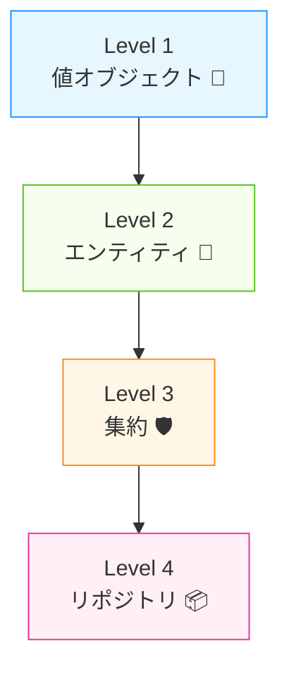

# 第18章：人数規模の議論 💡 1人なら「戦術」からつまみ食いで十分効く！🍰✨


DDDって聞くと、なんだか **大人数チームの大げさな儀式**みたいに見えることがありますよね…😵‍💫
でもね、1人開発こそ **DDDの“おいしいところだけ”先に食べる**のがめちゃくちゃ効きます🍴😋

この章では、

* 「DDDって結局、人数が多いときの話でしょ？」🤔
* 「1人だと、どこまでやればいいの？」🥺
* 「やりすぎて迷子になりたくない！」🧭💦

を、**超わかりやすく**整理します🎀

---

## 1. まず結論：1人なら“戦略”より“戦術”が先でOK ✅✨

DDDには大きく2つがあります👇

* **戦略（どう分けるか）**：境界づけられたコンテキスト、コンテキストマップ…など🗺️
* **戦術（どう書くか）**：値オブジェクト、エンティティ、集約、リポジトリ…など🧩

大人数だと「みんなで共通認識を揃える」必要があるので、**戦略が超重要**になります👥🧠
でも1人だと、まず大事なのは…

> **バグらない・迷わない“型”を、最小で作ること** 🧱✨

なので **戦術からつまみ食い**が最短で効果出ます🍣💕

---

## 2. 「DDDは大人数向け」と言われがちな理由 👥💬

大人数チームだと起きやすい問題👇😵

* Aさん「ユーザーって購入者のことだよね？」
* Bさん「いや、管理画面の担当者のことだよ」
* Cさん「DBのUsersテーブルのことじゃないの？」
* 結果：設計も会話もぐちゃぐちゃ🌀🌀

だから大人数は、まず **言葉と境界を揃える（戦略）** が必要になります🗂️✨

でも1人開発だと…👤

* 会話相手は「未来の自分」🕰️
* そして「AI」🤖✨

つまり、**最初から“会話が壊れない型”を作る（戦術）**のが最優先になりやすいんです💪😊

---

## 3. 1人開発で効く「戦術つまみ食いメニュー」🍱✨

まずはこの順番が超おすすめです👇（迷わない！🧭✨）



### 🍡 レベル1：値オブジェクト（最優先！）

* 「金額」「メール」「ID」などを、ただの文字列や数値のままにしない🙅‍♀️
* **不正な値を“生まれないようにする”** 👶🚫

### 🍙 レベル2：エンティティ（同一性）

* 名前が変わっても同じ人、みたいな「同一人物」を表現する🪪✨

### 🍜 レベル3：集約（ルールの守り方）

* “勝手に中身をいじれない”ようにして、ルール破りを防ぐ🛡️✨

### 🍩 レベル4：リポジトリ（保存を隠す）

* DBの都合をドメインに持ち込まない📦✨
* テストもしやすくなる🧪💕

この4つだけでも、1人開発の生産性が一気に上がります🚀🌈

---

## 4. 「やりすぎDDD」になってない？チェックリスト 🧯😇

1人開発でありがちな罠👇💦

* プロジェクトが増えすぎて、移動だけで疲れる😵‍💫
* DTOだらけで、変換だらけで、何してるかわからない🌀
* 便利そうで作った共通仕組みが、逆に変更を遅くする🐢
* 1画面追加したいだけなのに、10ファイル増える📄📄📄

✅ 目安はこれ！

> **「機能追加が早くなるためのDDD」になってるか？** 🏎️✨
> **「DDDをやるための作業」になってないか？** 🧟‍♀️💦

---

## 5. 最小DDDの“ちょうどいい形”🏠✨（1人向け）

「分ける」のは大事だけど、最初から完璧に分けなくてOKです🙆‍♀️💕

### ✅ まずは “フォルダ分け” からで十分

* Domain（ルールの中心）💎
* Application（ユースケース）🎮
* Infrastructure（DBとか外部）🔌
* Web（API/画面）🌐

将来しんどくなったら、あとからプロジェクト分割しても間に合います✂️✨

---

## 6. ミニ例：値オブジェクトから始めるDDD 🍰💖

「ただのdecimal」だと、マイナス金額とか平気で入っちゃう…😱
だから **“金額”は金額として生まれる**ようにします💰✨

```csharp
using System;

namespace Domain;

public readonly record struct Money
{
    public decimal Amount { get; }

    public Money(decimal amount)
    {
        if (amount < 0) throw new ArgumentOutOfRangeException(nameof(amount), "金額は0以上だよ💦");
        Amount = amount;
    }

    public static Money operator +(Money a, Money b) => new(a.Amount + b.Amount);
    public override string ToString() => $"{Amount:N0}円";
}
```

これで、

* マイナス金額が“誕生”しない👶🚫
* 金額の足し算が自然に書ける➕✨
* ルールが型に閉じ込められる🧊💎

って感じで、**迷いが減ります**🧭💕

---

## 7. 1人開発 × AI：戦術DDDが相性いい理由 🤖💞

AIって、コード生成は得意だけど、油断するとこうなりがち👇😵‍💫

* いろんな場所で金額チェックがバラバラ
* 同じ意味の変数名が乱立
* いつの間にかルールが破られる

でも値オブジェクトや集約があると、AIにこう言えるんです👇✨

* 「金額はMoney型だけで扱ってね💰」
* 「注文の変更はOrderのメソッド経由だけね🛡️」

するとAIの暴走が止まります🚦😌💕

---

## 8. 【演習】つまみ食い戦術DDD、やってみよ〜！🧪🌸

次のどれか1つを **値オブジェクト化**してみてください🎯✨

* メールアドレス📧
* ユーザーID🪪
* 割引率（0〜100）🎫
* 日付範囲（開始 <= 終了）📅

### 🎀 ルール

* 不正な値は“作れない”ようにする👶🚫
* 変換・表示はToStringで自然にする🪄
* 可能ならUnit Testも1本だけ書く🧪✨

---

## まとめ 🎉✨

* 大人数DDDは **戦略が超重要**👥🗺️
* でも1人開発はまず **戦術のつまみ食い**でOK👤🍣
* 特におすすめは

  * 値オブジェクト💎
  * エンティティ🪪
  * 集約🛡️
  * リポジトリ📦
* 「DDDをやるための作業」になったら、やりすぎサイン🚨😇

---

次の章（第19章）は、**DDDの学習コストが“ある日爆速になる”話**です🚀✨
「最初ちょい遅いけど、途中から取り返す」あの感じ、ちゃんと仕組みがありますよ〜😋💖
