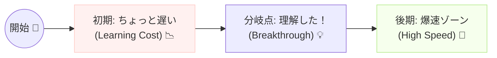

# 第19章：DDDの学習コスト 💰📚 〜最初は遅いけど、ある日いきなり爆速になる話〜🚀✨


DDDってね、最初だけ「え、なんでこんな回り道してるの…？🥲」って感じになりやすいです。
でも、ある地点を超えると **「え、今までの苦労なに！？😳」** ってくらい、追加開発と変更が速くなります💨✨

この章では、その「遅くなる理由」と「爆速になる瞬間」の正体を、やさしくほどいていきます😊🌸

---

## 1) まず結論：DDDの学習曲線は「Jカーブ」📉➡️📈

最初は **ちょっと沈む**（遅くなる）けど、途中から **グワッと伸びる**やつです🌀✨



イメージ👇（気持ちだけ伝わればOK😂）

* 最初：効果が見えない 😵‍💫
* 中盤：理解がつながる 🔗🙂
* 後半：変更が簡単すぎて笑う 🤭🚀

---

## 2) 最初に遅くなる理由（ここで心が折れがち🥺💦）

DDDが遅く感じるのは、あなたの能力が低いからじゃないです🙅‍♀️❌
**「最初に払うコスト」がちゃんとある**からです💰

### 遅くなる主な原因はこのへん👇😵

#### ✅ (A) “言葉”に時間を使うから 🗣️📖

DDDは **名前が命**です✨
「これって“ユーザー”じゃなくて“会員”だよね？」みたいな、地味だけど大事な悩みが増えます😇

#### ✅ (B) “境界線”を考えるから 🧱✂️

「これはどのグループの責任？」って考えるクセを作るので、最初は手が止まります🛑

#### ✅ (C) “DBから作らない”ので不安になるから 🗄️😖

先にテーブルを決めないの、慣れてないと怖いです…！
でもこれ、**あとで自由度が爆上がり**します🔥

#### ✅ (D) “型”を増やすから増えた気がする 🧩📦

Value ObjectとかRepositoryとか、部品が増えるので
「なんか大げさじゃない？」って思いやすいです😂

---

## 3) でも途中から爆速になる理由（ここが本番💥🚀）

DDDの真価は、「変更」が入った瞬間に発動します⚡

### 爆速になるポイントはこれ👇✨

#### ✅ (1) 変更の影響範囲が小さくなる 🎯

「ここを変えると、ここだけ直せばOK」になりやすいです😊
スパゲッティだと「え、どこ壊れるかわからん😱」ってなりますよね…。

#### ✅ (2) 実装が“型”として再利用できる 🏗️✨

一回DDDっぽい流れ（作り方）を覚えると、次から似た機能は同じ手順で作れます🔁💨

#### ✅ (3) 仕様がコードに“住む”から、忘れない 🧠🏠

未来の自分が見ても
「なるほど、こういうルールね！」って読み取れるようになります📖✨

#### ✅ (4) AIに指示しやすくなる 🤖🧠✨

DDDの構造があると、AIに
「この変更はこの層のここにだけ入れて」
って言えるので、暴走しにくくなります🚗💨（逆走しにくい！）

---

## 4) 「爆速ゾーン」に入る“合図”🚦✨

次のどれかを感じたら、あなたはもう入口にいます🚪💡

* 「この変更はここだけだな🙂」って予測できる
* 新機能追加が“作業手順”になってきた
* 名前を見ただけで役割がわかる
* テスト（または検証）が気軽になってきた
* 「DBが変わっても怖くない」感覚が出てきた 😳✨

---

## 5) 爆速ゾーンに早く入るコツ（1人開発向け）🧭🌸

DDDを全部いきなりやると重いです😂
だから、**爆速に直結する部分から**つまみ食いしましょ🍰✨

### コツ①：まず「言葉」を固定する📘🖊️

* このアプリの主役は何？（例：注文、予約、課金…）
* “ユーザー”って何？（ログイン者？購入者？管理者？）

**言葉が決まると、コードが速くなります**💨✨

### コツ②：ルールのある値から“型”にする🔒✨

たとえば「金額」「メール」「商品コード」みたいなやつです。

例：メールアドレスを “ただのstring” にしない📧❌

```csharp
public readonly record struct Email(string Value)
{
    public Email(string value) : this(value)
    {
        if (string.IsNullOrWhiteSpace(value))
            throw new ArgumentException("メールアドレスが空です😵", nameof(value));

        if (!value.Contains('@'))
            throw new ArgumentException("メールアドレスの形式が変です😵", nameof(value));
    }

    public override string ToString() => Value;
}
```

これだけで
「どこでチェックするんだっけ？😇」が消えます✨

### コツ③：集約（チーム）を1個だけ決める👯‍♀️🏉

最初からアプリ全部をDDDにしない！🙅‍♀️
まずは主役の1つだけでOKです👍✨

---

## 6) “最初の遅さ”でやりがちな罠 😵‍💫🕳️

### ❌ 罠1：全部正しくやろうとして停止する

DDDは宗教じゃないです🙏😂
最初は荒くてOK。後で整えられます✨

### ❌ 罠2：フォルダ構成で燃え尽きる

フォルダは手段！目的じゃない！📁🔥
「置き場所がわからない」なら、まずはシンプルでOKです😊

### ❌ 罠3：AIにいきなり“全部”作らせる

最初はAIがそれっぽく大量生産しますが、
**境界があいまいだと一気に崩れます**🧱💥
（AIは“部分最適”が得意なので…！）

---

## 7) AIに聞くと爆速になる質問テンプレ 🤖✨

迷ったら、この質問が効きます💉✨

* 「この仕様変更は、どの概念（言葉）に属する？🗂️」
* 「このルールは、どこに置くのが自然？（値？エンティティ？サービス？）🏠」
* 「変更が入ったとき、影響範囲を最小にする分け方は？✂️」
* 「“いまの自分”じゃなく“3ヶ月後の自分”が読んでもわかる命名にして🙂」

---

## 8) 【ミニ演習】“爆速の芽”を作ろう🌱🚀

次のうち、どれか1つだけやればOKです（10〜20分）⏱️✨

1. いま作ってるアプリの「用語」を5個書く📝
2. その中で、**ルールがありそうなものを1個選ぶ**（例：金額、期間、メール）
3. それを “型” にする（record / record struct でOK）🔒✨
4. その型を使う場所を1箇所だけ置き換える🔁

終わったら、体感が変わります😊🌸
「おっ、守られてる感ある…！」ってなります💪✨

---

## まとめ 🎀✨

DDDは、最初にちょっと遅くなります🥲
でもそれは、あとで爆速になるための **“前払い”** です💰➡️🚀

* 最初：言葉・境界・型づくりで遅い
* 途中：理解がつながって気持ちよくなる
* 後半：変更が怖くなくなって爆速になる

次章以降で、**その“爆速エンジン”の部品**をどんどん作っていきますよ〜🚗💨✨
