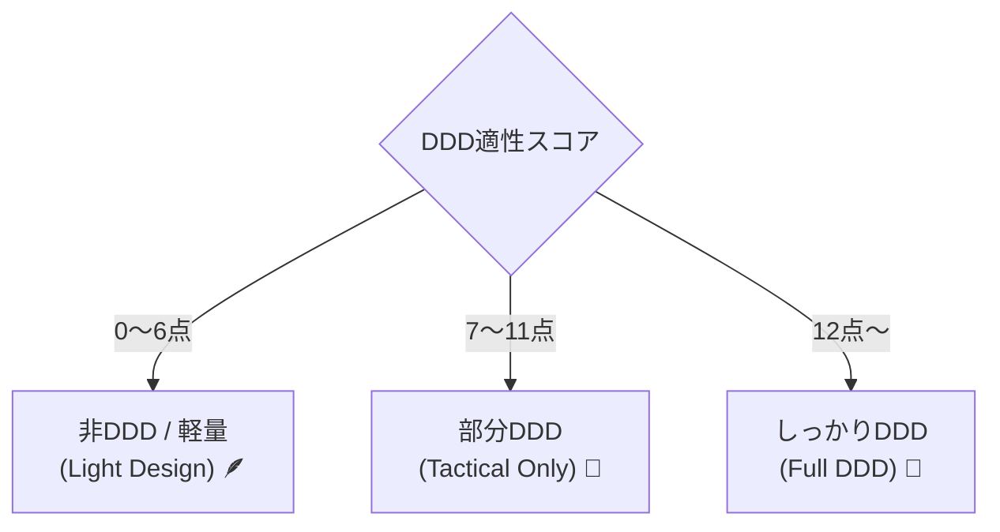

# 第20章【ワーク】作りたいアプリがDDDに向いているかAIと判定する🧭✨


この章のゴールはシンプルです👇
**「DDDを本気でやるべき？」それとも「やりすぎ注意？」を、AIと一緒にスパッと決める**こと🧠💡
（DDDは万能薬じゃないので、最初に“向き不向き”を見ます😊）

---

## 0. まず結論：DDDは「複雑さのための道具」🧰🎯

DDDが効くのはこんな時👇

* 仕様がちょいちょい変わる🔁
* ルールが多くて、例外も多い⚠️
* 「ただ保存」じゃなく「判断・計算・制約」がある🧮
* どこを直すとどこが壊れるか怖い😱

逆に、こういうのはDDDが重くなりがち👇

* ただの記録帳📒（投稿するだけ、一覧出すだけ）
* ルールが薄い📌（「タイトル必須」くらい）
* 短期で捨てる予定のツール🗑️

ここをAIに判定してもらいます🤝✨

---

## 1. ワークの準備：AIに渡す「素材」を作ろう📝🍰

AIは材料が良いほど当たります🎯
まず、次の4つをメモしてください（5〜10分）⏱️😊

### (A) アプリ説明（5行）

* 誰が使う？👤
* 何をする？✅
* 何が嬉しい？🎉
* 何が困るとダメ？😵
* いつ・どこで使う？📍

### (B) ルール（10個くらい）

例：

* 予約は同じ時間帯に被れない📅
* クーポンは合計金額が○円以上のときだけ💴
* キャンセルは前日まで、当日は不可🙅‍♀️
  …みたいに「判断が必要な文章」を集めます✨

### (C) 変更が起きそうなところ（3つ）

* 料金計算が変わりそう💸
* 権限が増えそう🔐
* プラン種類が増えそう📦
  などなど。

### (D) “ただのCRUD”じゃない部分（もしあれば）

* 計算🧮 / 制約🚧 / 状態遷移🔁 / 承認フロー🧾
  このへんがあるとDDD向きになりやすいです😊

---

## 2. 判定の「ものさし」：DDD適性スコア📏✨

次の8項目を、あなた（とAI）で点数化します💯
各項目を **0 / 1 / 2点** でつけてOKです👍



1. ルールが多い（例外もある）📚
2. 状態が変化する（例：下書き→承認→公開）🔁
3. 重要な整合性がある（破ると事故る）🚨
4. 計算・判定が中心（ただ保存じゃない）🧮
5. 用語が大事（言葉のズレで破綻しそう）🗣️
6. 外部連携がある（決済・配送・予約など）🔌
7. 仕様変更が多そう🔧
8. 長く育てる予定🌱

**合計の目安**👇

* **0〜6点：DDDは重いかも** → 軽い設計で十分🪶🙂
* **7〜11点：ライトDDDがおいしい** → 値オブジェクト等から🍙✨
* **12〜16点：DDDが効きそう** → しっかり境界線を引く💪🔥

---

## 3. AIに判定させるプロンプト（コピペOK）🤖📎

### プロンプト①：まずは診断してもらう🩺✨

```text
あなたは「DDDの家庭教師」です。
これから作りたいアプリがDDDに向いているか判定してください。

## アプリ概要（5行）
（ここにAを貼る）

## 重要ルール（できれば10個）
（ここにBを貼る）

## 変更が起きそうな点（3つ）
（ここにCを貼る）

## CRUD以外の要素
（ここにDを貼る）

--- 
要件：
1) DDD適性を0〜100点で評価
2) 理由を「効く理由」「重くなる理由」に分けて説明
3) すすめる方針を3択で提案
   - フルDDD
   - ライトDDD（値オブジェクト/集約だけ等）
   - 非DDD（トランザクションスクリプト寄り）
4) 最初に作るべき最小の設計（3点）も教えて
```

### プロンプト②：AIに“質問攻め”してもらう（精度アップ）🔍💬

```text
あなたはドメインエキスパート役です。
このアプリの仕様を固めるために、重要な質問を12個してください。
質問は「答えると設計が楽になる順」にしてください。
```

### プロンプト③：どこが“複雑さの中心”かを特定する🎯🧠

```text
このアプリで「複雑さが集中する場所（コア）」を1つ選び、
なぜそこがコアなのかを説明してください。
また、コア以外は「単純に作って良い部分（支援/汎用）」として分けてください。
```

---

## 4. 例：AI判定がどう分かれるか（イメージ）🌈✨

### 例1：シンプルなブログ📝

* ルール：投稿・編集・削除、タグ程度
  → **DDDは重くなりがち**😅
  → おすすめ：**非DDD or 超ライト**（フォルダ分けだけでもOK）🪶

### 例2：予約・在庫・キャンセルありの予約システム📅

* 被り禁止、キャンセル規定、料金変動、権限…
  → **DDDが効きやすい**🔥
  → おすすめ：**ライト〜フルDDD**（値オブジェクト・集約が特に効く）💪✨

---

## 5. 最終成果物：この1枚を作れば勝ち🏁📄

最後に、次の「判定メモ」を作って保存してください📌😊
（次の章以降で、AIに見せる“設計の土台”になります）

**DDD判定メモ（テンプレ）**

* アプリ名：
* DDD適性スコア：○点（0〜16） / AI判定：○点（0〜100）
* すすめる方針：フル / ライト / 非DDD
* 複雑さの中心（コア）：
* 絶対に守るルール（3つ）：
* 変更が起きそう（3つ）：
* 最初に作る最小設計（3つ）：

---

## 6. よくある落とし穴（ここだけ注意）⚠️😇

* **「DDDっぽい形」を作るのが目的になっちゃう**🏗️
  → 目的は、未来の変更で迷わないこと🧭✨
* **全部をDDDにしようとする**🍱
  → “コアだけDDD”でも十分おいしいです🍙😊
* **判断がつかないときは、まずライトDDD**🌱
  → 値オブジェクト・集約だけでも世界が変わります🌟

---

次の章（第21章）からは、いよいよ **「このアプリで一番大事な場所（ドメイン）ってどこ？」**を見つけていきます🗺️✨
第20章で作った「DDD判定メモ」は、そのまま使いますよ〜😊📌
