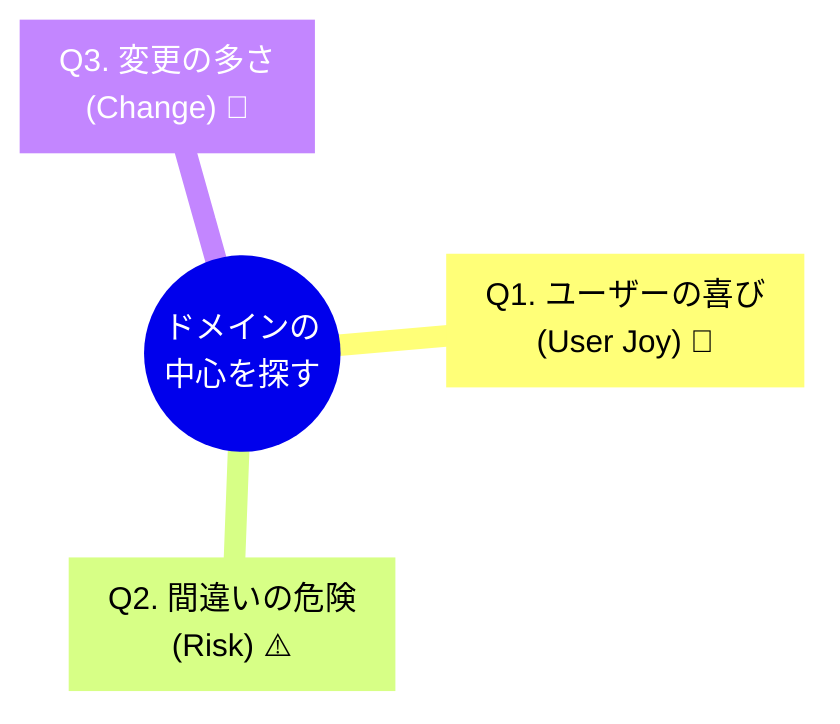

# 第21章：ドメイン（領域）を定義する ✨


## このアプリで一番「大事な場所」はどこ？🧭💖

DDDの最初の関門って、実は「難しい技術」じゃなくて——
**“このアプリの主役は何？”を決めること**なんだよね😊🌸

ここが決まると、設計もAIへの指示も一気にラクになります🤖🫶
逆にここが曖昧だと、ずっと迷子になります…🥺🌀

---

## 1. そもそも「ドメイン」ってなに？🤔📚

超ざっくり言うと、ドメインはこれ👇

✅ **そのアプリが解決したい「現実の問題」そのもの**
✅ **ユーザーが本当に欲しい価値（＝ビジネスの核）**
✅ **ルールがあって、変更されやすいところ**

たとえば「予約アプリ」なら、ドメインっぽいのは👇

* 予約できる条件（いつ、誰が、どこを、何時間まで）🗓️
* 予約の重複はダメ🙅‍♀️
* キャンセルの締切🕒
* 遅刻ペナルティ😵‍💫
* 料金やポイント💰

逆にドメインじゃない（ことが多い）のは👇

* DBのテーブル設計 🗄️
* ログ出力 📄
* 画面のボタン配置 🎛️
* 認証（ログイン）🔐（※大事だけど“主役”とは限らない）

---

## 2. 「一番大事な場所」を探すコツ 🔍💡

ドメインを見つける質問はこれが強いです👇✨

### 💖質問A：このアプリ、ユーザーは何が嬉しいの？

* “使ってよかった！”って言われるのはどこ？🥰
* どんな困りごとが解決されるの？🧹

### 💥質問B：間違えるとヤバいのはどこ？

* バグったら怒られるところは？😱
* お金・在庫・予約・権利・期限…このへんは危険度高い⚠️

### 🔁質問C：仕様変更が起きやすいのはどこ？

* 「ルールが増えがち」な部分は？📈
* “運用しながら育つ”部分は？🌱

この3つで浮かび上がる場所が、だいたい**ドメインの中心**です🫶✨



---

## 3. 例：自習室予約アプリで考えてみよう🏫📅

大学っぽい例でいきます😉💕

### 🎯アプリの目的

「空いてる自習室を予約できるようにしたい！」

### ここで迷子になりがちポイント🌀

つい「まずDB！」「画面作ろ！」って始めると、こうなる👇

* 予約ルールが後から出てくる
* 予約が重複した😇
* キャンセルの扱いがぐちゃぐちゃ😇
* “とりあえずif地獄”になってAIも混乱😵‍💫

### ✅ドメイン（主役）はここ！

**「予約」そのもの**🎟️✨

* 予約できる条件
* 同時予約の禁止
* 予約時間の単位
* キャンセル規則
* 予約状態（仮予約/確定/キャンセル）など

### 🌿周辺（主役じゃないけど必要）

* DB保存 🗄️
* 通知メール📩
* 画面 🖥️
* ログイン 🔐

「主役＝予約」って決めるだけで、設計の軸がブレなくなるよ〜😊🧭

---

## 4. ドメインを“文章”で定義してみよう📝✨

まずはコードじゃなくてOK！
**1〜2行で言い切れると強い**です💪💕

### ✅テンプレ

* このアプリは、**誰**が、**何を**、**どんなルールで**できるようにするアプリ。

### ✅自習室予約アプリなら

* このアプリは、学生が自習室を、重複や時間制限などのルールに従って予約・キャンセルできるようにする。

これが **ドメインの“中心の宣言”**になります📌✨
AIに説明するときも、これがあるとめちゃ便利🤖💖

---

## 5. “ドメインっぽい言葉”を集めよう📖🌟（次章への準備）

ドメインを定義したら、次にやると強いのがこれ👇

✅ アプリの主役に関する「単語」を集めること🧺✨

例（自習室予約）：

* 予約（Reservation）🎟️
* 予約枠（Slot）🧩
* 利用者（Student）👩‍🎓
* キャンセル（Cancel）❌
* 利用時間（Duration）⏳
* ルール（Rule）📏

この“単語集”が、後で**ユビキタス言語**につながっていきます📚💕

---

## 6. ちょいだけC#で「主役だけ」置いてみる（超ミニ）🧩👀

この章では実装が目的じゃないけど、
「主役をコードにするとこうなるよ」って雰囲気だけ🌸

```csharp
public record ReservationId(Guid Value);

public class Reservation
{
    public ReservationId Id { get; }
    public string RoomName { get; }
    public DateTime StartAt { get; }
    public TimeSpan Duration { get; }

    public Reservation(ReservationId id, string roomName, DateTime startAt, TimeSpan duration)
    {
        Id = id;
        RoomName = roomName;
        StartAt = startAt;
        Duration = duration;
    }
}
```

ポイントはこれ👇✨
「DBの都合」じゃなくて、**予約という現実のルールの主役**から形にしてるところ😊🫶

---

## 7. 【ワーク】あなたの作りたいアプリでドメインを定義しよう🎯💖

紙でもメモ帳でもOK！Windowsなら付箋アプリでも最高🗒️✨
以下を埋めてみてね😊

### ✅ワーク1：1行ドメイン定義📝

* このアプリは、（誰）が、（何）を、（どんなルールで）できるようにする。

### ✅ワーク2：「主役」と「周辺」を分ける⚖️

* 主役（ドメイン）：
* 周辺（DB/画面/通知/ログイン等）：

### ✅ワーク3：ドメイン単語を10個集める📚✨

* 例：注文、支払い、予約枠、在庫、期限、ポイント、ステータス…など
* とにかく“主役周辺の言葉”を集める🧺💕

---

## 8. AIに手伝ってもらうプロンプト例🤖💬✨

「ドメイン定義」って、AIとの相性めっちゃ良いです😊🫶
（コード生成より先に、ここで使うのがコツ！）

### ✅プロンプト例1：主役を見つける

* 「このアプリ案の“中心ドメイン”を1つ選び、理由も教えて。主役以外の周辺要素も分類して。」

### ✅プロンプト例2：ルール候補を洗い出す

* 「このドメインでよくある業務ルールを10個、初心者向けに例つきで出して。」

### ✅プロンプト例3：1行定義を磨く

* 「この1行定義を、より曖昧さが減るように書き直して。前提が足りないなら質問して。」

---

## まとめ🎀✨

* ドメインは「アプリの主役」💖
* 見つけるコツは

  * ユーザーが嬉しい場所🥰
  * 間違えるとヤバい場所⚠️
  * 変更が多い場所🔁
* まずは1〜2行で言い切る📝
* 主役の単語を集めると、次がラク📚✨

次の第22章では、いよいよ
**「境界づけられたコンテキスト（小さな独立国）」**を作っていくよ〜🏰🌈
