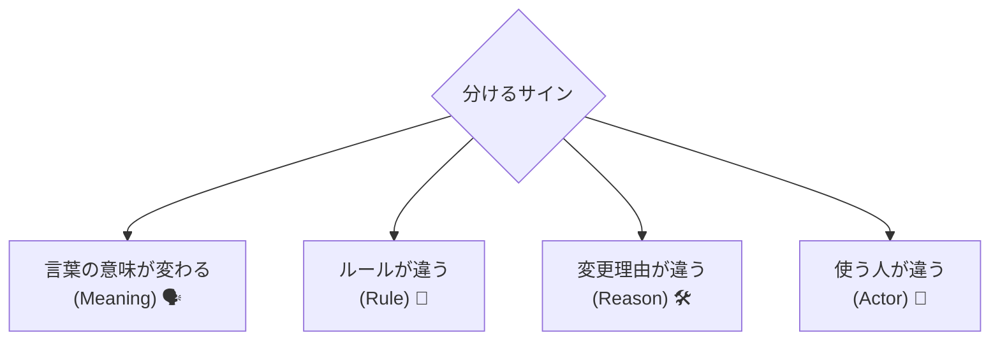
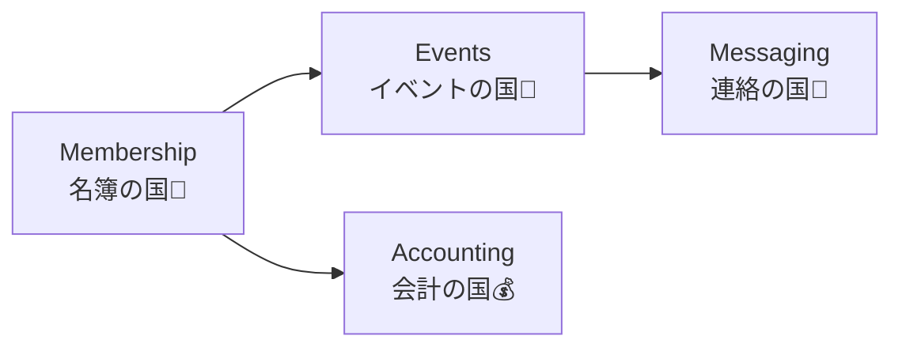

# 第22章：境界づけられたコンテキスト🗺️🏰


〜1つのアプリの中に「小さな独立国」を作る話〜✨

---

## 今日のゴール🎯

この章が終わると…

* 「同じ言葉なのに意味が違う…😵」を**設計で防ぐ**考え方がわかる
* 1つのアプリの中に、**役割が違う“国”を分けて考える**感覚が身につく
* AIに頼るときも、**どの国の話かブレない**ようにできる🤖💡

---

## まずは超たとえ話🍙🏫


あなたの大学にこんな2つの場所があるとするね👇

* **学食**： “注文”＝「ごはんを頼む」
* **図書館**： “注文”＝「本を取り寄せる」

同じ「注文」でも意味が全然違うよね？📚🍛
もし大学のルールブックが1冊で、両方ごちゃ混ぜだったら…混乱するはず😇

DDDの「境界づけられたコンテキスト（Bounded Context）」は、まさにこれを防ぐ仕組みだよ🚧✨

---

## 「コンテキスト」ってなに？🤔


ざっくり言うと…

> **ある言葉やルールが“同じ意味”で通じる範囲**📦

たとえば「ユーザー」って言葉も、場所によって意味が変わることがあるよね👇

* ログインの「ユーザー」＝アカウント情報が大事🔐
* 販売の「ユーザー」＝購入履歴や住所が大事📦
* 運営の「ユーザー」＝問い合わせや通報が大事🛠️

全部を1つの「User」クラスに背負わせると…だいたい地獄が始まるよ😇🔥

---

## 境界づけられたコンテキスト（Bounded Context）とは？🏰


ひとことで言うと…

> **アプリ内にある“意味が統一される範囲”を、境界で区切って別世界にすること**🚧

境界の内側は「この国の法律（ルール）」が通る
境界の外側に行くと「別の国の法律」が通る
だから、**国境を越えるときはパスポート（変換・翻訳）が必要**✈️🛂

---

## どうして分けるの？（1人開発でも超重要）🧠✨

1人だと「全部わかってるし、分けなくてもいいじゃん😎」って思いがちなんだけど…

* 数週間後の自分は**記憶が抜けた別人**👤💭
* AIは部分最適しがちで、言葉の意味が混ざると**盛大にズレる**🤖💥
* 「Userが何者か」がブレると、修正が芋づる式になる🍠😵

だから最初に「この国ではこの意味ね！」を決めると強い💪✨

---

## 境界を見つける“4つのサイン”🔍🚦


次のどれかが出たら、コンテキスト分割の候補だよ👇

1. **同じ言葉が、場面で意味が変わる**（例：ユーザー、注文、ステータス）🌀
2. **ルールが違う**（割引の条件、承認フロー、計算式など）📏
3. **変更の理由が違う**（片方は法務、片方はUI都合…みたいな）🛠️
4. **関係者が違う**（管理者、顧客、倉庫担当…）👥



---

## 具体例：サークル管理アプリで分けてみよう🎺📅💰

「サークル管理アプリ」を想像してみてね😊
よくある機能を並べると…

* 入部・退部、プロフィール管理（名簿）👤
* イベント作成、出欠管理📅
* 部費管理、会計💰
* 連絡、通知📩

これ、ぜんぶ「サークルアプリ」だけど、**意味の世界は4つに分けられる**かも👇

* **Membership（名簿の国）**：会員・役職・在籍
* **Events（イベントの国）**：日程・出欠・定員
* **Accounting（会計の国）**：部費・支払い・未納
* **Messaging（連絡の国）**：通知・送信履歴

### ざっくり図にするとこんな感じ🗺️




ポイントはこれ👇
**「会員（Member）」の意味は名簿の国が一番えらい**👑
イベントの国は「会員の詳細」を全部知らなくてもよくて、必要な情報だけ持てばOK✨

---

## 「同じクラス名」があってもいいの？→ いいよ🙆‍♀️✨

境界づけられたコンテキストでは、むしろ…

* それぞれの国に、それぞれの“正しいモデル”があってOK✅

たとえば「User」って名前が被るなら、国ごとに分けよう👇

```csharp
namespace Membership.Users
{
    public class User
    {
        public required string UserId { get; init; }
        public required string DisplayName { get; init; }
        public bool IsActive { get; init; }
    }
}

namespace Accounting.Users
{
    public class User
    {
        public required string UserId { get; init; }
        public required string BillingName { get; init; }
        public bool IsDelinquent { get; init; } // 未納フラグ
    }
}
```

同じ「User」でも、国が違えば正義が違うのだ🏰✨
（ここで無理に共通化すると、カオスになりやすいよ😇）

---

## 国境を越えるときは「翻訳」する🛂✨


コンテキスト間でデータを渡すときは、**そのまま相手のモデルを使わない**のが基本だよ🙅‍♀️

たとえば名簿の国 → イベントの国へ「参加者情報」を渡すなら、イベント側が欲しい形にする👇

```csharp
public record ParticipantInfo(string MemberId, string DisplayName);
```

* 名簿の国：Memberの詳細を持つ（学部、学年、連絡先…）
* イベントの国：出欠に必要な最低限だけ（IDと表示名）

こうすると、名簿の仕様が変わってもイベントが巻き込まれにくい👍✨

---

## AIに強くなる「境界づけ」プロンプト例🤖🧠

AIに頼むときは、「どの国の話か」を最初に固定するとブレにくいよ✨
コピペで使える感じにしておくね👇

```text
あなたはDDDの設計者です。
対象アプリ：サークル管理アプリ
今は「Events（イベントの国）」の話だけをします。

- Eventsの責務（この国が持つルール）を箇条書きで
- Membershipに依存しないために、Eventsが持つべきデータだけを定義して
- Events内で使う用語集（ユビキタス言語）を10個出して
```

さらに「国境越え」も頼める👇

```text
Membership（名簿）→ Events（イベント）へ渡すデータの契約を作りたい。
Events側が必要な情報だけを持つDTO/recordを提案して。
将来、Membershipの項目が増減してもEventsに影響が出ない形にして。
```

---

## ミニ演習✍️✨（ここが一番大事！）

あなたが作りたいアプリで、次をやってみてね😊💕

### 演習1：言葉の衝突探し💥

「同じ言葉だけど意味が違いそう」な単語を5個書こう👇
例：ユーザー、注文、ステータス、承認、公開…

### 演習2：国を3つに分ける🏰🏰🏰

機能を眺めて、「変更理由が違うもの」を分けてみよう✨
（最初は雑でOK！🌱）

### 演習3：国の“憲法”を書く📜

各国についてこれを1行ずつ👇

* この国が守るルールは？
* この国の中心データは？
* 他国から勝手に入られたくないものは？🚧

---

## まとめ🌟

* コンテキスト＝**言葉とルールの意味が統一される範囲**📦
* 境界づけられたコンテキスト＝アプリ内の**小さな独立国**🏰
* 国境を越えるときは、**翻訳（DTO/record）で渡す**🛂
* AI活用でも「今どの国の話か」を固定すると強い🤖✨

---

次の第23章では、この「国境」を実際の開発でどう置くか（フォルダ？プロジェクト？）を、めちゃ現実的に決めていくよ〜🚧📁✨
