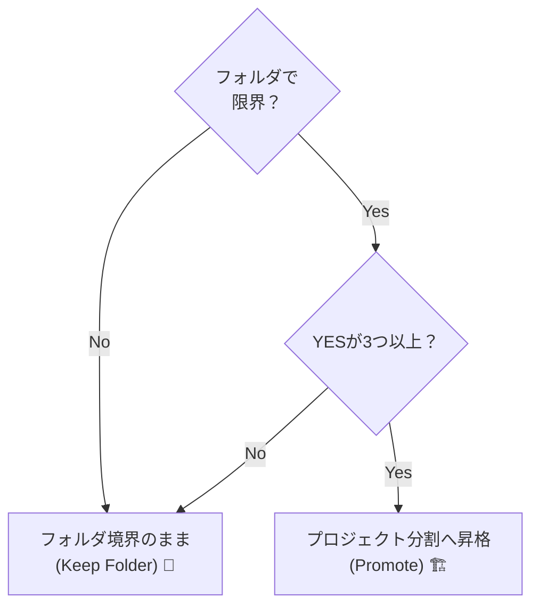

# 第23章：1人開発での境界線✨ フォルダ分け？プロジェクト分け？実践的な基準📦🧩


## 今日のゴール🎯

* 「境界線（Bounded Context）」を、1人でも迷わず引けるようになる🗺️
* 「まずフォルダ」「必要ならプロジェクト」の判断ができるようになる✅
* AIに“境界線の案”を出させて、あなたは“最終決定”だけする流れを作る🤝🤖

---

## 1) 境界線ってなに？超ざっくり🍙

境界線は「この中は同じルール・同じ言葉で話すエリアだよ〜」っていう区切りです🏝️
DDDでいう **境界づけられたコンテキスト** は、アプリ内の“小さな独立国”みたいなイメージ🇯🇵🇺🇸🇫🇷

* 国が違うと、法律（ルール）も言葉（用語）も違うよね？🗣️
* だから、**ごちゃ混ぜにすると**「変更するとどこが壊れるか分からない🥲」が起きる
* 逆に、境界線があると **変更が“その国の中”で止まりやすい**✨

---

## 2) まず結論💡：1人開発は「フォルダ境界」からでOK🙆‍♀️📁

最初からプロジェクトを分けすぎると…

* 参照設定が増えて、作業が重くなる😵‍💫
* “設計の勉強”より“配線作業”が増える🔌
* AIに頼む時も、ファイルの場所が増えて迷子になりやすい🌀

なので基本はこれ👇

### ✅ 最初はフォルダで境界線を引く

### ✅ しんどくなってきたらプロジェクトに昇格させる

---

## 3) フォルダ分けが向いてるケース📁💕

こんな時はフォルダで十分です👍

* まだ仕様が固まってなくて、形が変わりまくる🧪
* 1つのアプリとして同時に変更することが多い🔁
* チーム開発じゃない（＝強制力が弱くても運用で守れる）🧍‍♂️
* “境界線の練習”段階で、まず形を覚えたい📚

**ポイント**：フォルダ境界は「見た目の交通整理🚦」
守れるかどうかは、あなたのルール運用 + AIレビューでカバーしやすいです🤖✨

---

## 4) プロジェクト分けが効くケース🏗️✨（ここが判断ポイント！）

プロジェクト分けの強みは **コンパイルで“越境”を止められる**ことです🧱
「間違って参照しちゃった」が物理的に起きにくい🙅‍♀️

### ✅ プロジェクトに分けると強い場面

* 境界をまたぐ参照が増えて、ぐちゃぐちゃになってきた🧶
* 「ここは絶対に触らせたくない」核（コア）がある💎
* DB/外部API/メール送信など、外部事情を隔離したい🌐
* 将来、別アプリや別UI（Web/バッチ等）から再利用したい♻️
* テストで差し替えたい（インフラだけ偽物にしたい）🧪

C# 14 と .NET 10 の世界だと、最新SDK/IDEでこのへんの分割もやりやすいです✨ ([Microsoft Learn][1])

---

## 5) 迷ったらコレ✅：「昇格チェックリスト」📝

フォルダ境界で始めて、次の質問で **YESが3つ以上**ならプロジェクト分割を考える、くらいがちょうどいいです🙌✨

1. 境界Aの変更で、境界Bも一緒に直すことが多い？🔁
2. 「同じ言葉なのに意味が違う」が出てきた？（例：User）🧩
3. 境界をまたぐ参照が日常化してる？（フォルダ覗き見👀）
4. 外部APIやDB都合がドメインに侵入してきた？🦠
5. “コア”を守りたい気持ちが強い？💎
6. テストで差し替えたい依存がある？🧪
7. ビルドや実行の起動点（Web/Batch）が増えた？🚀
8. コンテキストごとにリリース頻度が違いそう？📦
9. 将来、別アプリに切り出しそう？✂️
10. AIが「参照関係が複雑で理解できない」って言い出した？🤖💦



---

## 6) 具体例でイメージ🍰：学園祭チケットアプリ🎫🎉

たとえばこんな機能があるとします👇

* チケット販売🎫
* 決済💳
* 入場チェック（QR）📱
* メール通知📧
* ユーザー登録👤

境界線の例はこんな感じが自然です👇

* **Ticketing（チケット）**：販売、在庫、購入ルール
* **Payment（決済）**：支払い状態、決済プロバイダ連携（外部寄り）
* **Entry（入場）**：QR照合、入場記録
* **Notification（通知）**：メール/Push（外部寄り）
* **Identity（ユーザー）**：ログイン、ユーザー管理

**コツ💡**：境界線は「データ」じゃなくて「ルール」で切ると強いです💪
（例：決済は“状態遷移ルール”が独立しがち）

---

## 7) 実践テンプレ①：まずはフォルダで境界線📁🧸

こんな置き方が分かりやすいです👇（“小さな独立国”を並べる感じ🏝️）

```text
src/
  FestivalApp/
    Contexts/
      Ticketing/
        Domain/
        Application/
        Infrastructure/
        Web/   (必要なら)
      Payment/
        Domain/
        Application/
        Infrastructure/
      Entry/
        Domain/
        Application/
    Shared/   (本当に共通だけ！増やしすぎ注意⚠️)
```

### ルール（超重要）🚦

* Ticketingの中から Payment の **Domain直参照は禁止**🙅‍♀️
* どうしても必要なら、**Application層同士**を「薄く」つなぐ（DTOとか）📨
* “Shared”は最後の手段。便利だけど麻薬です😇💦

---

## 8) 実践テンプレ②：必要になったらプロジェクトに昇格🏗️👑

フォルダ境界で辛くなったら、こう分けると守りやすいです🧱

```text
FestivalApp.sln
  src/
    FestivalApp.Ticketing.Domain
    FestivalApp.Ticketing.Application
    FestivalApp.Payment.Domain
    FestivalApp.Payment.Application
    FestivalApp.Web   (UI/エンドポイント)
```

### 参照の基本ルール🔗

* Web → Application → Domain（外側から内側へ）🧅
* Ticketing と Payment は、基本 **Domain同士を参照しない**🙅‍♀️
* 連携は「Application経由」「イベント」「公開された契約（DTO/IF）」で✨

（この“参照で縛る”のが、プロジェクト分割の最大のご褒美です🎁）

---

## 9) AIにやらせると爆速🤖⚡（おすすめプロンプト付き）

### ① 境界線案を出してもらう🗺️

Copilot Chat / Codex系にこれ👇

```text
あなたはDDDの設計者です。
私のアプリは「学園祭チケットアプリ」です。
機能は「チケット販売、決済、入場QR、通知、ユーザー登録」です。
境界づけられたコンテキスト案を3パターン出して、
各コンテキストの責務、持つべき用語（ユビキタス言語の候補）、
越境しやすいポイント（注意点）も書いてください。
```

### ② フォルダ構成を自動で提案させる📁

```text
上のコンテキスト案のうち「最も1人開発向き」なものを選び、
C#のプロジェクト構成（フォルダ境界版）をツリーで提案して。
Sharedを作るなら、そこに入れて良いもの/ダメなものも具体例で。
```

### ③ “越境してないか”を監査させる👀

```text
このリポジトリ構成で、TicketingがPaymentの内部に依存していないか
チェック観点を10個挙げて。違反例もC#コードで短く示して。
```

---

## 10) ミニワーク🧩✍️（30分でできる！）

1. 作りたいアプリの機能を5〜10個書く📝
2. AIに境界線を3案出させる🤖
3. 自分で「一番“変更が閉じる”案」を1つ選ぶ✅
4. まずフォルダで `Contexts/◯◯/` を作って空の箱を置く📦
5. 1週間作ってみて、越境が増えたら“プロジェクト昇格”を検討👑

---

## まとめ🌸

* 境界線は「独立国」🏝️：言葉とルールが揃う範囲を作る
* 1人開発はまず **フォルダ境界** が軽くて強い📁✨
* “守れなくなったら” **プロジェクトに昇格**（参照で縛れる🧱）
* AIは「案出し」「構成提案」「越境監査」で最強の相棒🤝🤖

次の章（第24章）は、境界線を引いたあとに超効く **ユビキタス言語（単語帳）** を作って、AIとの会話精度を一気に上げます📚✨

[1]: https://learn.microsoft.com/en-us/dotnet/core/whats-new/dotnet-10/overview?utm_source=chatgpt.com "What's new in .NET 10"
