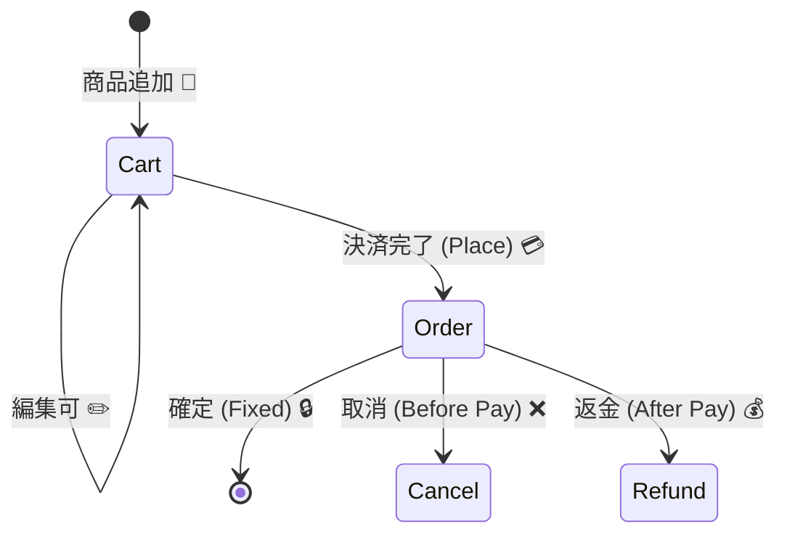

# 第24章：ユビキタス言語（共通言語）🗣️📘


〜AIと会話するときの「単語帳」を作る〜✨

DDDって「むずかしい設計ルール」って思われがちなんだけど、実は最初の一歩はめちゃ地味で…めちゃ強いです💪
それが **ユビキタス言語（共通言語）** だよ😊💕

---

## 1. ユビキタス言語ってなに？🤔


超ざっくり言うと、

**アプリの中で使う“言葉”を、全員（未来の自分＋AI）で同じ意味に揃えること** 📌

* 「ユーザー」って言ったとき、
  “会員”なの？ “ログインしてない人も含む”の？😵
* 「注文」って言ったとき、
  “カート確定”なの？ “決済完了”なの？😵‍💫

ここがズレると、AIに頼んでもコードがブレるし、後から自分も混乱します🌀

---

## 2. なんでAI時代にこれが必須なの？🤖💬

AIは、あなたが使う「言葉」を頼りにコードを作るよね？
でも言葉がふわふわだと…

* AIが「それっぽい」実装を量産する😇
* 途中で仕様がねじれて破綻する😇
* 修正指示がどんどん長文化する😇

逆に、単語帳があると…

* プロンプトが短くなる✂️✨
* 命名が揃う🧠✨
* 仕様の矛盾をAIが見つけやすい🔍✨

---

## 3. 単語帳（ユビキタス言語）を作るコツ📓✨

ポイントは **「短い定義」と「禁止ルール」** です⚠️

### ✅ コツ1：1単語＝1意味に固定する🔒


同じ言葉を、場面で意味変えない！
もし意味が変わるなら **別の単語に分ける** 👍

例：

* 「ユーザー」だと広い →

  * 「来訪者（Visitor）」
  * 「会員（Member）」
  * 「管理者（Admin）」
    みたいに分ける✨

---

### ✅ コツ2：同じ意味の別名（同義語）を禁止する🚫


これ、めちゃ効くやつです🔥

例：

* 「注文」と「オーダー」と「購入」
  → **どれを正式名称にする？** を決める
  → ほかは「使わない」って書く✍️

---

### ✅ コツ3：定義は“短く”、でも“境界は強く”✂️🧱

定義が長いと読まれない😂
でも「どこまでがその言葉か」はハッキリさせる！

---

## 4. まず作るのはこのフォーマットでOK📋✨


リポジトリに `docs/ubiquitous-language.md` みたいな感じで置くのがおすすめ📁
（AIに読ませやすいし、あなたも探しやすい😊）

テンプレ👇

```md
# ユビキタス言語（単語帳）

## 用語
| 用語 | 意味（1文で） | 例 | 非例（それは違う） | 別名禁止/注意 |
|---|---|---|---|---|
| 会員(Member) | 登録済みでログインできる人 | メール登録済み | 未登録の閲覧者 | 「ユーザー」と呼ばない |
| 注文(Order) | 決済が完了した購入記録 | 決済済みの購入 | カートに入れただけ | 「購入」「オーダー」禁止 |
| カート(Cart) | 注文前の一時的な商品集合 | 追加/削除できる | 決済後の注文 | 注文とは別物 |
```

この表、**AIにそのまま貼れる**のが強いよ〜🤖📎✨

---

## 5. 例：ミニドメインでやってみよう（ネットショップ）🛒✨

ここからは「言葉がズレると事故る」定番のやつで例を作るね😊

### よくある事故💥

* 「注文(Order)」を作ったつもりが、実は「カート(Cart)」だった
* 「キャンセル」が

  * 決済前キャンセル
  * 決済後返金
    で意味が違うのに同じ言葉にして地獄😇

### だからこうする💡


* **カート**：注文前（編集できる）
* **注文**：決済完了（編集できない）
* **取消**：決済前にやめる
* **返金**：決済後にお金を戻す

この時点で、コードの命名もAIの出力も一気に揃うよ✨



---

## 6. 「コードの名前」へ落とすとこうなる🧩✨


ユビキタス言語は、命名の親です👶➡️📛

たとえば「注文(Order)」を正式名称にしたなら…

```csharp
public class Order
{
    public OrderId Id { get; }
    public MemberId BuyerId { get; }
    public Money TotalAmount { get; }

    // Cart から Order になる瞬間を「Place」と呼ぶ、と決めたなら…
    public static Order PlaceFromCart(Cart cart) { /* ... */ }
}
```

ここで大事なのは「実装の正しさ」よりも、
**言葉が一致してること** だよ😊✨
（詳細な実装は後の章でガッツリやろう💪）

---

## 7. AI（Copilot / Codex）に“単語帳を守らせる”プロンプト🧠🤖

AIって、最初にルール渡すとめっちゃ従ってくれるタイプです👍✨
まずこれを貼るだけで変わるよ！

```text
あなたはこのプロジェクトの設計補助AIです。
以下の「ユビキタス言語（単語帳）」に厳密に従ってください。

ルール：
- 用語は表の正式名称を必ず使う（別名禁止を守る）
- 意味が曖昧な言葉（ユーザー、データ、情報など）を避ける
- 新しい用語が必要なら、先に「単語帳への追加案」を提示してから実装する

（ここに単語帳の表を貼る）
```

さらに強くするなら👇

```text
出力するコード内のクラス名・メソッド名・DTO名・変数名は、
単語帳の用語を優先して命名してください。
```

---

## 8. よくあるつまずきポイント（先に潰す）🧯🙂

### ❌ つまずき1：「ユーザー」で全部済ませる

→ 後で必ず混乱するよ〜😂
**役割ごとに分ける**のが正解✨

### ❌ つまずき2：用語の定義が“文章で長い”

→ 読まれない＆更新されない😇
**1文で言い切る**のが最強！

### ❌ つまずき3：DBのテーブル名に引きずられる

→ テーブルが真実じゃないこと、普通にあるよ😅
**アプリの言葉が真実**にしよう✨

---

## 9. 【演習】あなたのアプリで単語帳を作ろう✍️💕

やることはシンプル！

### ステップA：まず10個だけ作る🔟✨

次の3カテゴリで、合計10個出してみてね😊

* 名詞（モノ）：会員、注文、カート、予約…
* 動詞（操作）：登録する、確定する、取消する…
* 状態（ステータス）：下書き、確定、キャンセル済み…

### ステップB：各用語にこれを埋める🧩

* 意味（1文）
* 例
* 非例
* 別名禁止

### ステップC：AIにチェックさせる🔍🤖

このプロンプトでOK！

```text
以下はこのアプリのユビキタス言語（単語帳）案です。
矛盾・曖昧さ・同義語の混在・境界の弱さを指摘して、
修正案を表形式で出してください。

（あなたの表を貼る）
```

---

## 10. 今日のまとめ🎀✨

* ユビキタス言語は **DDDの最初の武器** 🗡️✨
* AI時代は特に、**言葉が設計図そのもの** になる📐🤖
* まずは **10単語の単語帳** からでOK！小さく始めよ😊🌱

---

次の章（第25章）では、この単語帳を使って **AIにドメインエキスパート役をやらせて**、仕様の矛盾を見つけさせるよ〜😆🔍✨
