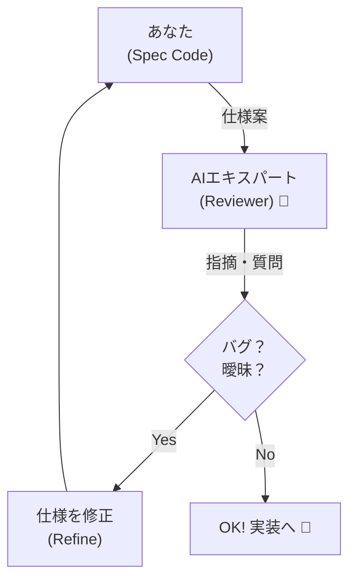

# 第25章：AIにドメインエキスパートを演じさせる 🤖🧑‍💼✨


〜仕様の「矛盾」と「抜け」をAIに意地悪チェックさせよう〜🔍💥

この章では、AIに **“その業務のプロ（ドメインエキスパート）”** を演じてもらって、あなたの仕様の **矛盾・あいまいさ・抜け漏れ** を先に見つけちゃいます😊📝
コードを書き始める前にここをやると、あとで泣かないです…！😭➡️😆

---

## 1. なんで「AIドメインエキスパートごっこ」が効くの？🎯

仕様って、だいたいこうなりがち👇

* 言葉の定義がふわふわ（「当日」「会員」「キャンセル」って何？）😵‍💫
* 例外が抜ける（病欠、返金、重複割引…）🌀
* ルールがぶつかる（AはOK、BはNG、でもA∧Bは？）💥

人間だけだと見落とすけど、AIに **“業務担当の視点”** を持たせると、すごい勢いでツッコミが入ります😂👍



---

## 2. 今日やるゴール ✅✨

この章の成果物はこれです👇📝

* 🧾 **矛盾リスト**（どこが衝突してる？）
* ❓ **質問リスト**（決めないと作れないところ）
* 🧠 **言葉の定義の修正**（単語帳のアップデート）
* 🧪 **具体例（OK/NG例）**（テストにもなる！）

---

## 3. まずは「わざと短い仕様」をAIに投げる 🧨


例として、チケット予約アプリを想像してみます🎫✨
あなたが書いた仕様（ラフ）👇

* 学割は **常に20%OFF** 🎓
* 早割は **30%OFF** ⏰
* 学割と早割は **併用不可** ❌
* **当日券には学割が使えない** 🚫
* キャンセルは **3日前まで全額返金** 💰
* ただし **支払い後はキャンセル不可** 🔒

…はい、もう匂いがしますよね😂💦
この「匂い」をAIに嗅がせます🐶🔍

---

## 4. AIに演じさせるコツは「役」と「禁止事項」🎭⚠️


AIは放っておくと、いい感じの嘘を作ります😇（怖い）
なので、最初にこう縛ります👇

* 役：その業務の担当者（現場の人）
* 目的：矛盾・抜け・あいまいさを見つける
* 禁止：勝手に仕様を補完しない（質問として返す）

---

## 5. コピペで使える “ドメインエキスパート化” プロンプト 🧠✨

```text
あなたは「イベント運営会社の予約・返金ルールに詳しい業務担当者」です。
以下の仕様案を読んで、実装前に事故りそうな点を洗い出してください。

【やってほしいこと】
1) 矛盾している/衝突しているルールを列挙（なぜ矛盾かも）
2) あいまいで決めないと実装できない点を質問として列挙
3) 抜けていそうな例外ケースを列挙（現場で起きがちなやつ）
4) 最後に「決めれば単語帳に追加すべき用語」を提案

【重要ルール】
- 仕様を勝手に補完しない。必要なら質問する。
- 出力は Markdown の見出しで整理する。
- 可能なら、OK例/NG例も1つずつ添える。

【仕様案】
（ここに仕様を貼る）
```

💡ポイント：**「勝手に補完しない」を明記**すると精度が上がります😊

---

## 6. AIが出してくれるツッコミ例（イメージ）😂📝

AIはだいたいこう返してきます👇

### 💥矛盾候補


* 「3日前まで全額返金」なのに「支払い後はキャンセル不可」
  → どっちが優先？支払い後でも3日前ならOK？🤔

### ❓要確認（実装不能ポイント）

* 「当日券」って何？

  * イベント当日に買ったら当日券？
  * 前日までに買って当日に入場するのは？😵‍💫

### 🌀抜けがちな例外

* 天災で中止のとき返金は？🌪️
* 学割の確認方法（学生証？有効期限？）🎓
* 早割の期限は「何時まで」？（23:59？）⏰

### 🧠単語帳に追加すべき用語

* 当日券 / キャンセル / 返金 / 支払い後 / 学割の条件 など

こういうのが早めに出ると、**実装がスムーズ**になります🚀✨

---

## 7. さらに強くする：AIに「ケースで責めさせる」🧪🔥


矛盾は、文章だけだと見逃しがち。
だから **ケース（具体例）で殴る** のが最強です👊😂

```text
次の仕様について、矛盾や抜けを見つけるために
「現実に起きそうなユーザー行動シナリオ」を10個作ってください。

各シナリオに対して、
- 期待結果（どうなるべき？）
- 必要な追加仕様（決めないと詰む点）
をセットで出してください。

※仕様の補完はせず「質問」として出すこと。
```

これ、テストケースの種にもなって一石二鳥です🧪✅✨

---

## 8. IDE内での使い方（めちゃ実用）🧑‍💻🤖


実装を始める前に、プロジェクトの `docs/` とかに👇を置くのがおすすめです📁✨

* `glossary.md`（単語帳）📚
* `rules.md`（ビジネスルール箇条書き）📏
* `qa.md`（AIが出した質問と、あなたの回答ログ）📝
* `examples.md`（OK/NG例、境界値）🧪

そしてAIには「この4つを前提に、矛盾チェックして」と頼むと、ブレが減ります😊👍

---

## 9. よくある失敗と回避法 🚧😇

* **AIの提案をそのまま仕様に採用しちゃう**
  → ✅「それは提案？既存仕様の解釈？」って毎回確認する

* **質問が多すぎて疲れる**
  → ✅ “今リリースで必要な質問” だけ優先度をつけさせる（高/中/低）

* **言葉が増えて混乱**
  → ✅ 単語帳に「同義語」「禁止ワード」も書く（例：当日券＝当日購入チケット）

---

## 10. 【ワーク】あなたの題材でやってみよう 💪😊✨

あなたが作りたい機能を1つ選んで、次を作ってください👇

1. 仕様を **5〜10行** で書く（短くてOK）📝
2. 上のプロンプトをAIに投げる 🤖
3. AIの質問に **あなたが答える**（決める）✅
4. 単語帳（glossary）を更新 📚✨
5. もう一回AIに投げて、矛盾が減ったか確認 🔁🎉

最後に、AIにこれを言うと締まります👇😆

```text
今の仕様で「実装者が勘違いしそうな点」を5つ挙げて。
それぞれに「誤解しない書き方」に言い換えて。
```

---

